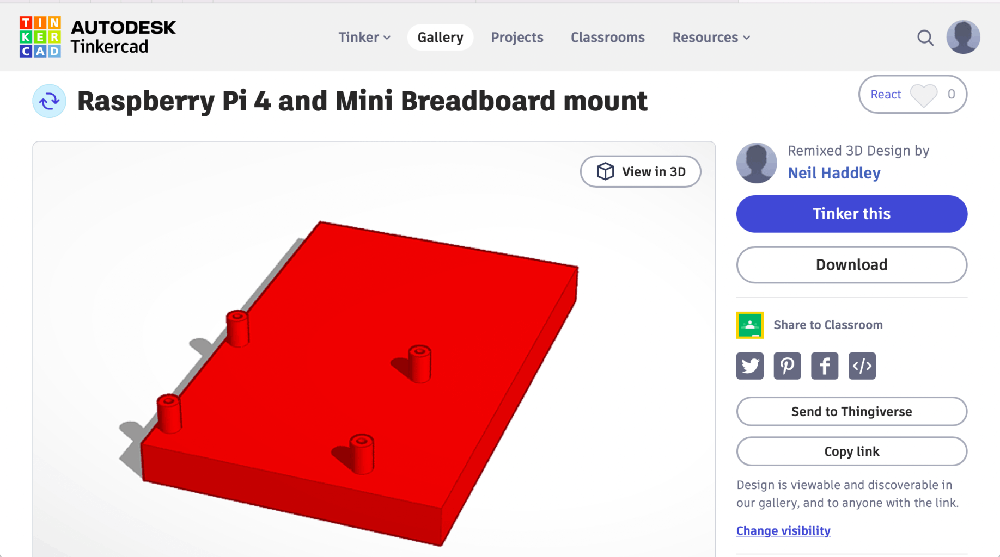
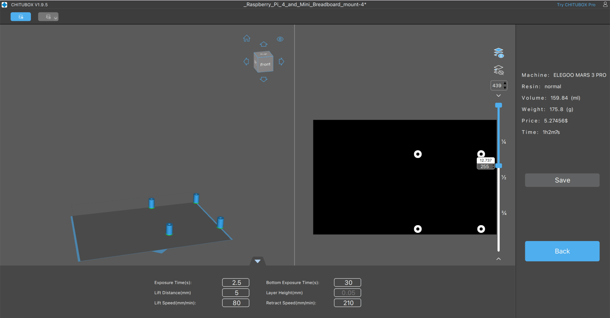
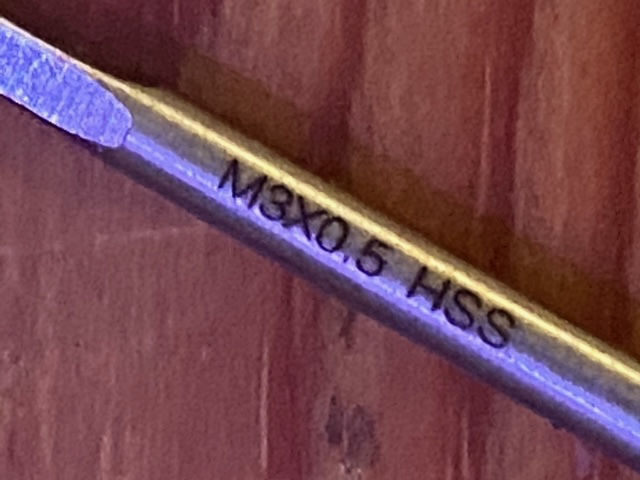
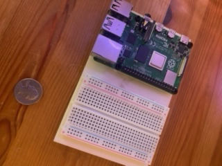

## Tinkercad

I updated an existing Tinkercad design to create a part to securely hold a Raspberry Pi 4 and small breadboard.

**Original design**
[https://www.tinkercad.com/things/8k21OQvUnlh](https://www.tinkercad.com/things/8k21OQvUnlh)

**Updated design**
[https://www.tinkercad.com/things/fQPX9bFkoC3-raspberry-pi-4-and-mini-breadboard-mount](https://www.tinkercad.com/things/fQPX9bFkoC3-raspberry-pi-4-and-mini-breadboard-mount)

*I updated the design in Tinkercad*

*I sliced the part*

*I used an M3 tap drill*

*I assembled the finished part*