Andrej Karpathy published a concept for building a personal knowledge base using LLMs — a "wiki" where you ingest raw source documents (PDFs, emails, notes) and have Claude synthesise structured wiki pages from them. Each page follows a consistent YAML frontmatter schema with type, sources, confidence level, and related pages. A master index tracks everything and an activity log records every ingest. The power is in the cross-referencing: once your documents are in the wiki, you can ask Claude to compare cases, find patterns, or draft documents grounded entirely in your own ingested material.

I applied this to a personal project — building a knowledge base around a dog attack case — and was immediately struck by how useful it became. Within an afternoon I had ingested correspondence, legal precedents, council records, and court filing templates, and could query across all of them with Claude Code.

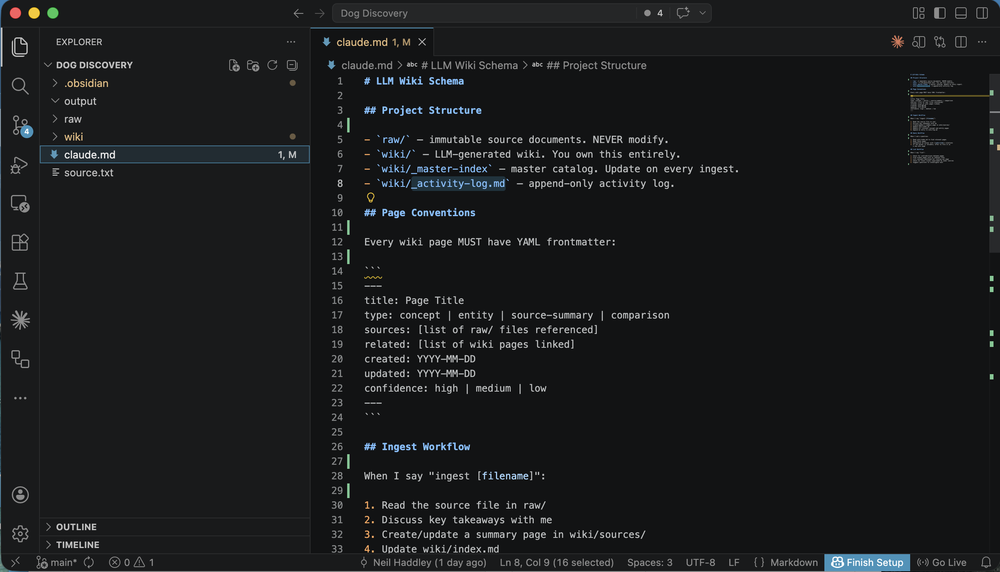
*I set up the CLAUDE.md file defining the wiki schema — project structure, YAML frontmatter conventions, and the ingest workflow*

## claude.md

````markdown
# LLM Wiki Schema

## Project Structure
- `raw/` — immutable source documents. NEVER modify.
- `wiki/` — LLM-generated wiki. You own this entirely.
- `wiki/index.md` — master catalog. Update on every ingest.
- `wiki/log.md` — append-only activity log.

## Page Conventions
Every wiki page MUST have YAML frontmatter:
```
---
title: Page Title
type: concept | entity | source-summary | comparison
sources: [list of raw/ files referenced]
related: [list of wiki pages linked]
created: YYYY-MM-DD
updated: YYYY-MM-DD
confidence: high | medium | low
---
```

## Ingest Workflow
When I say "ingest [filename]":
1. Read the source file in raw/
2. Discuss key takeaways with me
3. Create/update a summary page in wiki/sources/
4. Update wiki/index.md
5. Update all relevant concept and entity pages
6. Append an entry to wiki/log.md

## Query Workflow
When I ask a question:
1. Read wiki/index.md to find relevant pages
2. Read those pages
3. Synthesize an answer with [[wiki-link]] citations
4. If the answer is valuable, offer to file it as
   a new wiki page

## Lint Workflow
When I say "lint":
1. Check for contradictions between pages
2. Find orphan pages with no inbound links
3. List concepts mentioned but lacking own page
4. Check for stale claims superseded by newer sources
5. Suggest questions to investigate next
````

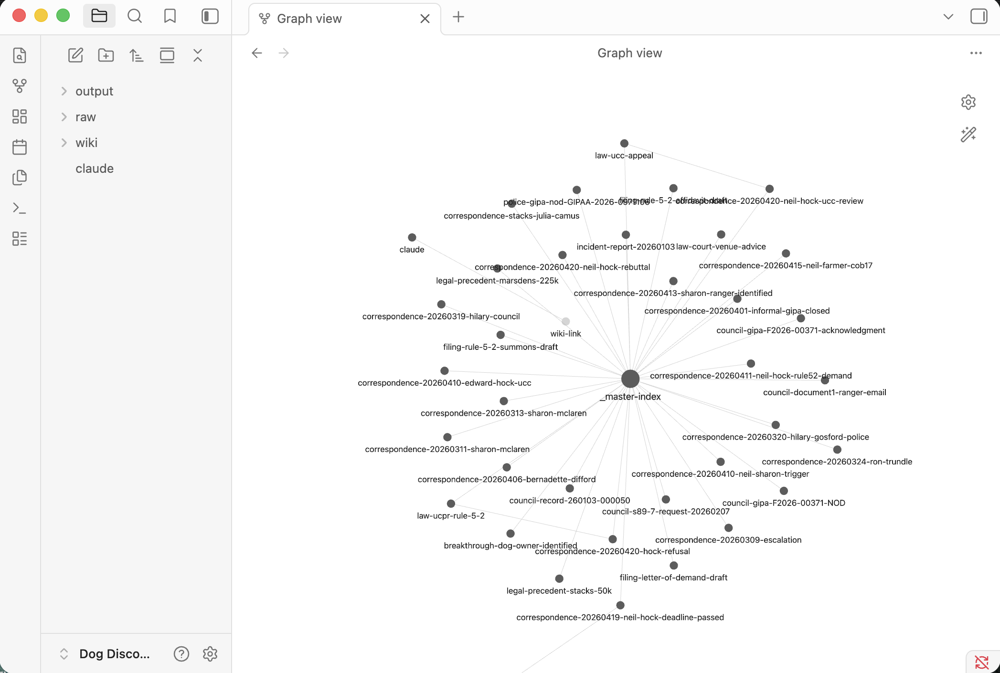
*I opened the Obsidian graph view showing the knowledge base with all the interconnected wiki pages and source documents*

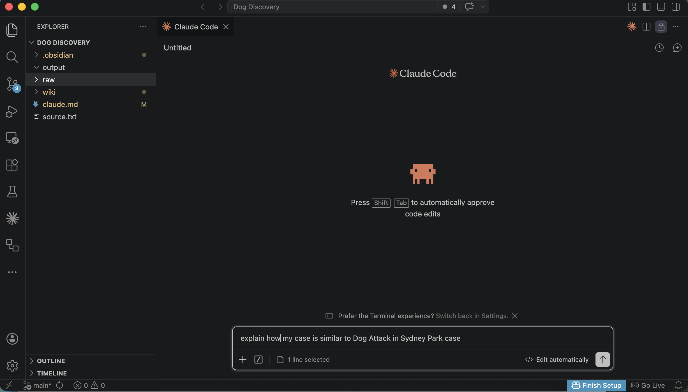
*I asked Claude Code to compare my case to a similar Dog Attack case I had ingested into the wiki*

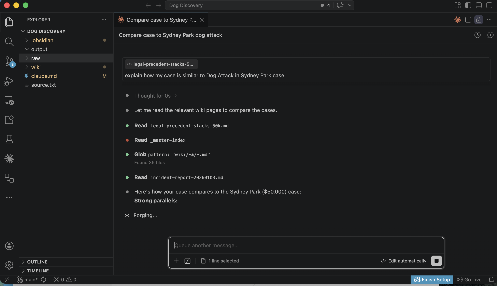
*Claude Code read the relevant wiki pages and began building the comparison*

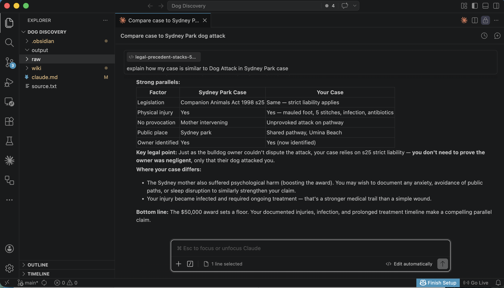
*Claude Code produced a detailed side-by-side comparison table highlighting the strong parallels between the two cases*

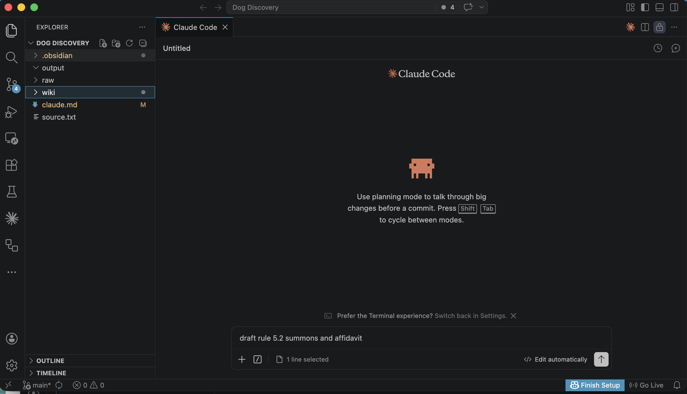
*I asked Claude Code to draft a Rule 5.2 summons and affidavit using the ingested legal precedents and case details*

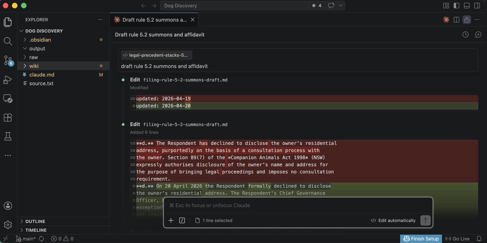
*Claude Code edited the draft, updating dates and inserting the relevant Companion Animals Act provisions*

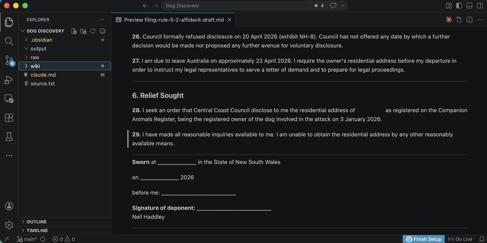
*I previewed the affidavit — the Relief Sought section asked the council to disclose the dog owner's registered residential address*

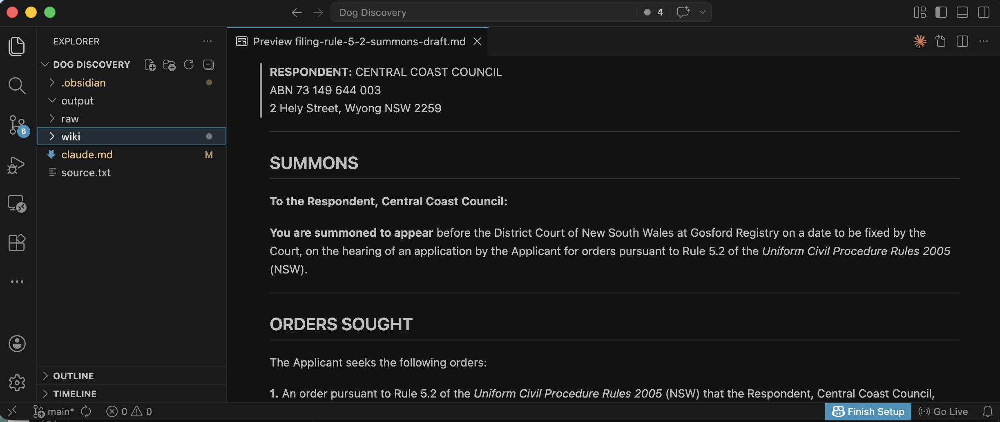
*The completed summons addressed to Central Coast Council, citing Rule 5.2 of the Uniform Civil Procedure Rules 2005*

```PROMPT
I just added a new article to raw/[2024] NSWDC 602.docx Please ingest it.
```

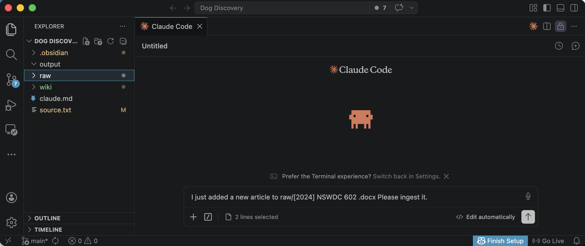
*I typed the ingest prompt into Claude Code, asking it to process the newly added NSWDC 602 article*

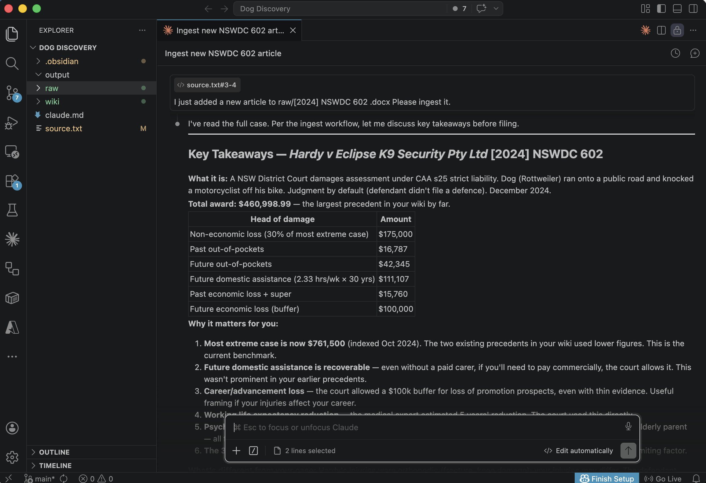
*Claude Code read the full case and presented the key takeaways — including a $460,998.99 total award, the highest precedent in my wiki*

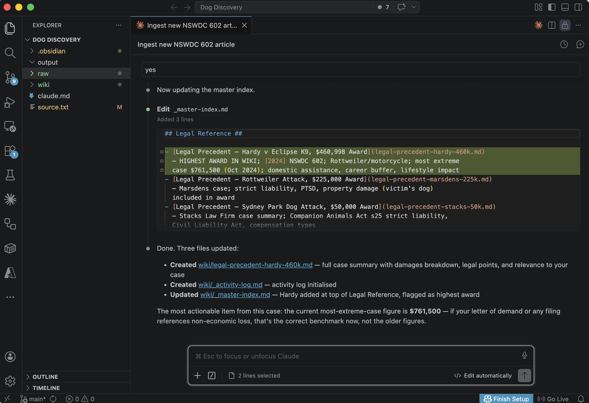
*Claude Code updated the master index, created a full case summary page, and flagged Hardy v Eclipse K9 as the highest-award precedent at $761,500 indexed*

## References

- [A pattern for building personal knowledge bases using LLMs](https://gist.github.com/karpathy/442a6bf555914893e9891c11519de94f)
- [Karpathy's LLM Wiki: The Complete Guide to His Idea File](https://antigravity.codes/blog/karpathy-llm-wiki-idea-file)
- [Every Claude Code Memory System Compared (So You Don't Have To)](https://www.youtube.com/watch?v=UHVFcUzAGlM&t=1807s)
