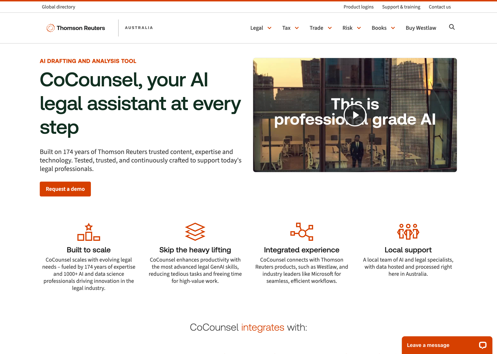

This post holds material pulled out of the public [Agentic AI for Professionals](/posts/agenticaiforprofessionals1/) series — the parts of that series that compared `nsw-legal-research-assistant` against Thomson Reuters CoCounsel Legal and Westlaw by name, or claimed a design decision was "validated" by a specific Thomson Reuters product announcement. That comparison rests on press-release-sourced research, and it is no longer clear how integrated CoCounsel Legal and Westlaw actually are in practice as of today — traditionally Westlaw ran its own separate legal-research tooling (Westlaw Precision and its predecessors), and how much the newer Westlaw Brief Builder feature actually changes that is still an open question, not something this research has independently confirmed. Until that is resolved, this stays hidden rather than live on the public series.

Everything in the app itself — NSW Caselaw as the grounding data source, Jade as a scraping source, the RAG/MCP/UI engineering — is real, verified, and still documented in full in the public series. What is uncertain is only the comparison to a specific competitor's product, which is what this post is about.

## Researching Thomson Reuters CoCounsel, one pass at a time

The research started narrow — Materia, a tax/audit/accounting AI startup Thomson Reuters acquired in October 2024 — and grew across nine separate research passes over official product pages, press releases, and five YouTube transcripts. Research is naturally iterative like this: each pass works from whatever is in front of it, and the picture sharpens as more sources come in.

A [Tech Series interview with Thomson Reuters' CTO Joel Hron](https://www.youtube.com/watch?v=RM6EmiAGSeg), hosted by Marcelo Santis, and a hands-on CoCounsel Legal demo with a former Casetext VP were the two sources that filled the picture out properly. From the Hron interview: he founded ThoughtTrace, and the acquisition itself is confirmed against [Thomson Reuters' own Legal Current announcement](https://www.legalcurrent.com/thomson-reuters-acquires-thoughttrace/): agreement announced March 2022, deal confirmed April 14, 2022, financial terms not disclosed. From his position as CTO after that deal, Joel went on to architect a roughly $3.2B acquisition strategy spanning ThoughtTrace, Casetext, Materia, and several others. **CoCounsel was originally created by Casetext**, founded 2013 and acquired by Thomson Reuters for $650M in 2023, over a year before Materia. Materia's 2024 acquisition extended an *already-existing* CoCounsel platform into tax and accounting rather than creating the brand itself.

*Thomson Reuters' own CoCounsel product page for the Australian market*

## What CoCounsel Legal's architecture looks like, per the research

The richest architectural detail came from that hands-on demo transcript and a later bar-association CLE webinar. A few things stood out as genuinely deliberate design choices, not incidental implementation detail:

**RAG grounding is the core trust mechanism, not a feature.** Every answer has to be grounded in specified or uploaded data, with a hyperlink and an excerpt from the source document backing every claim — "showing its work" serves two purposes at once: the model cannot just free-associate, and the professional using it can verify a claim without redoing the underlying research themselves. This is the single most repeated design principle across every CoCounsel source found in the whole research effort.

**A "Trust Team" of licensed lawyers writes the test suites.** Described in one source as "law school type exams for a machine" — domain experts working directly alongside the ML engineers, as a genuine hiring line and career path, not a QA afterthought. Accuracy benchmarks were deliberately never published; trust gets built through the citation/verification UX instead.

**A fixed, tested catalog of eight skills — not an open chat box.** CoCounsel Core is the platform name, not one of the eight skills it hosts, which ships exactly eight named skills — Prepare for a Deposition, Draft Correspondence, Search a Database, Review Documents, Summarize a Document, Extract Contract Data, Contract Policy Compliance, and Timeline. Crucially, it is restricted to only performing tasks inside that catalog. Some customers complain "we don't let CoCounsel do enough" — the design philosophy prioritizes not generating unguarded, untested output over maximizing perceived capability.

**"Search a Database" is just a user-curated document set — not a web-scale index.** One demo used a 200-contract database the presenter had assembled herself; databases are strictly scoped to whatever has been uploaded, never the open web.

Underneath all of it: Thomson Reuters runs a private, dedicated GPT-4 instance under a zero-retention relationship with OpenAI — uploaded content never trains the model and never persists at OpenAI's end.

## Beat-by-beat: running the app against a specific CoCounsel demo

Thomson Reuters' Valerie McConnell walked Legal IT Insider through CoCounsel's "Search a Database" skill in a filmed interview. The plan was to run `nsw-legal-research-assistant` through the same six beats — grounded answers, pinpoint citations, trend analysis across a whole matter, skill-chaining into a draft — and compare, with real output rather than illustrative text.

**Beat 1 — Grounded Q&A, scoped to a database.** McConnell's demo queried named, scoped databases — a 200-contract set, a 1,200-contract set — rather than one undifferentiated pile. Asking a question with nothing selected in this app searches every uploaded document; scoping to one named database searches only what is filed under it. Real output, this run: a moratorium question against a rental-eviction database returned a grounded answer with fifteen inline citation markers across two documents.

**Beat 2 — Pinpoint citations, and the state where they can't be trusted blindly.** Clicking a citation opens the source document scrolled to the exact page — the same "show its work" pattern McConnell described as CoCounsel's core trust mechanism. This app's second trust state — a warning-flagged, unverified-provenance citation — is a deliberate addition for demonstrating the mechanism, not something CoCounsel's demo itself showed.

**Beat 3 — The "not found" bridge.** Asking something the uploaded documents do not cover: "I couldn't find anything relevant to this question in the uploaded documents," followed by clearly-labeled, deliberately unverified general-knowledge suggestions — a human-in-the-loop bridge, not a bot that goes and fetches the answer itself.

**Beat 4 — Review: one row per document, not top-k across the pool.** McConnell's demo used "Search a Database" for trend and risk analysis across a whole repository — 38,000 SEC filings, a 1,200-contract set. This app's Review skill asks every document individually instead, closer to what that demo showed at much smaller scale.

**Beat 5 — Skill-chaining: draft from an answer, no re-supply.** McConnell's most complex demoed move: approve a database answer, then say "draft a letter from that," with no re-upload and no re-running the search. The same move, deliberately stateless — the frontend re-sends what it already has, forbidden from introducing new facts or citations.

**Beat 6 — Beyond the original demo: MCP from Claude Code.** Not part of McConnell's original demo at all — MCP was not a documented concept yet at the time of that interview.

## Honest comparison to the original demo

| | McConnell's CoCounsel demo | This app, run live |
|---|---|---|
| Scale | 38,000 SEC filings / 1,200-contract set | 5 documents in the original run, up to 50 in databases added since |
| Named, scoped databases | Yes | Yes |
| Grounded, citation-linked Q&A | Yes | Yes |
| Trend/risk analysis | Yes, within "Search a Database" itself | Yes, as a separate Review skill |
| Conceptual/synonym-aware search | Yes ("pandemic" matches "epidemic") | Embedding similarity only — related, not identical |
| Skill-chaining (Q&A → drafting) | Yes ("draft a letter from that") | Yes — stateless, client-driven |
| Domain-expert evaluation | Licensed lawyers writing test suites | Manually-verified questions, solo-developer scale |
| MCP/external integration | Not part of the demo (predates the concept) | Shipped, demoed as a bonus |

## Westlaw Brief Builder, combinable source layers, and CoCounsel Core's IA

Later in the build, a new combinable source-layer axis — "primary law" versus "practical guidance," scoping retrieval by source type — shipped in this app. The same day it shipped, Thomson Reuters put out a GA press release for a next-generation CoCounsel Legal, headlined by a new feature called Westlaw Brief Builder, described as sold via access to a combination of exactly those two layers, primary law plus practical guidance. That was read, at the time, as confirmation that combinable source layers was not a made-up framing.

That reading needs to be held more loosely than it was. A GA press release is a marketing claim about a product, not independent confirmation of how deeply Westlaw and CoCounsel Legal are actually integrated day-to-day, or of what Brief Builder's real relationship to Westlaw's own separate research tooling (Westlaw Precision and its lineage) actually is in practice. Traditionally, Westlaw's legal-research features and Thomson Reuters' CoCounsel assistant have been fairly separate products. Whether Brief Builder meaningfully changes that — or is a thinner integration than the press release framing implies — is genuinely unclear pending a closer look at a specific "Demo: Brief Builder" session referenced but not yet sourced.

Also pulled from that same build session: the app's own UI redesign (dark navy icon rail, skill-tile landing view, split-pane PDF preview) was built with reference to what CoCounsel Core's own demo transcript showed on screen, and the "Matter" to "Database" naming change was justified at the time by CoCounsel's own broader "Database" concept (scoped by case, client, or industry) found in the wiki research. Both are real design choices the app benefits from either way — but framing them as *matching* a specific competitor's confirmed product decision assumes a level of confidence in that research that the Westlaw-integration question above now puts in doubt.

## What would resolve this

The open item is narrow: independent, hands-on confirmation (not just press-release language) of how integrated Westlaw's content/research tooling actually is with CoCounsel Legal today, and specifically what Brief Builder's real mechanism is — ideally from the "Demo: Brief Builder" session referenced in passing but not yet tracked down, or an equivalent hands-on account. Until that exists, the comparison in this post stays here rather than on the public series, and the public posts describe `nsw-legal-research-assistant` on its own terms.
