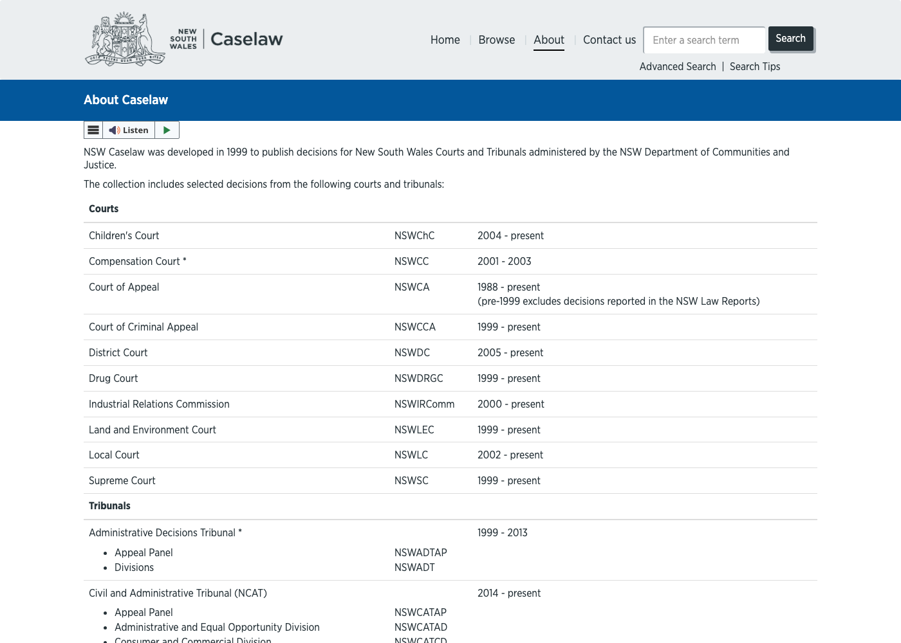

This `agentic-ai-for-professionals` project includes a research wiki, `llmwiki/`, that Claude Code maintains itself, with its own schema and its own workflow, sitting alongside `apps/` where the application code lives. 

Instead of opening Claude Code and asking it to build something, I spent the first several sessions asking it to *research* the Thomson Reuters' CoCounsel products. 

This first post is about "NSW Legal Research Assistant" an app inspired by Thomson Reuters' CoCounsel Legal.

## Researching Thomson Reuters CoCounsel, one pass at a time

The research started narrow and grew across nine separate research passes over official product pages, press releases, and five YouTube transcripts. Research is naturally iterative like this: each pass works from whatever is in front of it, and the picture sharpens as more sources come in.

A [Tech Series interview with Thomson Reuters' CTO Joel Hron](https://www.youtube.com/watch?v=RM6EmiAGSeg), hosted by Marcelo Santis, and a hands-on CoCounsel Legal demo with Valerie McConnell, Senior Director of Customer Success, Thomson Reuters (previously VP of Success at Casetext) were the two sources that filled the picture out properly. From the Hron interview I learned that he founded ThoughtTrace, and I confirmed the acquisition itself against [Thomson Reuters' own Legal Current announcement](https://www.legalcurrent.com/thomson-reuters-acquires-thoughttrace/): agreement announced March 2022, deal confirmed April 14, 2022, financial terms not disclosed. From his position as CTO after that deal, Joel went on to architect a roughly $3.2B acquisition strategy spanning ThoughtTrace, Casetext, Materia, and several others. **CoCounsel was originally created by Casetext**, founded 2013 and acquired by Thomson Reuters for $650M in 2023. Materia's 2024 acquisition extended the CoCounsel platform into tax and accounting.

## What is CoCounsel Legal?

*Thomson Reuters' own CoCounsel product page*

The richest detail came from that [same hands-on demo transcript](https://www.youtube.com/watch?v=VTOiMbOTLaE) and a later [bar-association CLE webinar](https://www.youtube.com/watch?v=6IbckYMUVCs). A few things stood out as genuinely deliberate design choices, not incidental implementation detail:

**[RAG](/posts/contextinjection/) grounding is the core trust mechanism.** Every answer has to be grounded in specified or uploaded data, with a hyperlink and an excerpt from the source document backing every claim — "showing its work" serves two purposes at once: the model can't just free-associate, and the professional using it can verify a claim without redoing the underlying research themselves. This is the single most repeated design principle across every CoCounsel source found in the whole research effort. It's also the same pattern I've built hands-on before, from an early [LangChain RAG app](/posts/langchain/) through to a more recent [Azure AI Foundry agent](/posts/azurefoundryagent/) backed by vector search.

CoCounsel includes skills — Prepare for a Deposition, Draft Correspondence, Search a Database, Review Documents, Summarize a Document, Extract Contract Data, Contract Policy Compliance, and Timeline. It is restricted to only performing tasks inside that catalog. Some customers complain "we don't let CoCounsel do enough" — the design philosophy prioritises not generating unguarded, untested output over maximising perceived capability.

## From research to plan: grounding a simplified version on NSW Caselaw

*NSW Caselaw's own About page — the free, government-run case-law platform this app is grounded on*

Thomson Reuters does serve the Australian market, through a CoCounsel product grounded in Westlaw Advantage Australia and Practical Law Australia, with Westlaw Precision Australia carrying both AI-assisted research and a "Keycite Cited With" citator feature — so this isn't a jurisdiction they've left completely unserved. The sharpest direct rival there is actually LexisNexis's Lexis+ with Protégé — the same incumbent-content-plus-AI-agent playbook, run by the other major legal publisher, right down to both companies renaming their AI products within months of each other in 2026.

There's also a free, open alternative already in this market: [JADE.io](https://jade.io/), run by BarNet, the NSW Bar Association's own technology arm — Australia's structural equivalent of CourtListener. It has a citator genuinely comparable in depth to Westlaw's KeyCite, comprehensive coverage of NSW's tribunals going back decades, and a direct PDF download on every case page — which makes it a genuinely useful *source* for this app's own manual-upload workflow, not just a competitor to think about abstractly. What it doesn't have, confirmed three separate ways — marketing pages, live screenshots, and a full read of its own help documentation, with zero mentions of AI or chatbot features anywhere across roughly 159,000 characters of it — is any AI layer at all. That's a real, confirmed instance of the same free-content/no-AI-layer gap CourtListener occupies in the US, not an assumption carried over from that comparison.

I asked Claude Code to pull [NSW Caselaw's](https://www.caselaw.nsw.gov.au/about) own About page directly rather than assume anything about it, and the actual picture is genuinely mixed. It's free, public, run by the NSW Department of Communities and Justice, covering 10 courts and 6 tribunal systems from 1986 to present using Medium Neutral Citation — but there's no API and no bulk-download mechanism. A follow-up pass over its actual reuse policy resolved the bigger worry: judicial decisions carry their own dedicated authorisation, and commercial reuse isn't prohibited, subject to attribution, accuracy, and non-official-status conditions. But that policy also requires reuse to "exclude external robots from indexing decisions" — a real constraint on any product that wants to crawl and index NSW Caselaw at web scale, with no confirmed API alternative in sight.

That looked like a hard blocker for a while, until it connected back to the CoCounsel architecture finding above: **"Search a Database" was never a web index to begin with.** `nsw-legal-research-assistant`, built the same way — manually finding and downloading specific decisions through NSW Caselaw's own search, uploading them into a small curated knowledge base, then running one RAG-grounded Q&A skill on top — never triggers the robots-exclusion clause at all. It's individual, manual, non-automated retrieval, squarely inside what the policy already permits. The blocker only becomes real if this ever grows into a general product indexing NSW Caselaw broadly for many users — which isn't this first version's problem to solve.

## Turning the plan into an architecture

I wanted this build to line up with Thomson Reuters' current engineering choices. That reframed the architecture decision away from "the leanest possible personal project" toward deliberately mirroring Thomson Reuters' confirmed stack wherever the research had actually established what that stack was:

| Layer | Decision | Why |
|---|---|---|
| Backend | Python + FastAPI | Matches Thomson Reuters' confirmed choice for Materia/CoCounsel Tax |
| Frontend | React + TypeScript | Matches their confirmed choice for the CoCounsel Applications team |
| Retrieval | Postgres + pgvector, containerized | Real RAG rather than context-stuffing, justified by a realistic 50–200 document corpus; matches their Postgres-centric data layer |
| LLM orchestration | Provider-agnostic wrapper — Anthropic, OpenAI, DeepSeek, **and Ollama** | Mirrors their own confirmed multi-model principle; Ollama is a deliberate *addition* beyond their stack (they're cloud-API-only at their scale) — a demonstration of broader range, not an attempt to match them exactly |
| Local development | Docker Compose | Runs the whole stack — Postgres, backend, frontend — on my own 32GB M4 MacBook Air, no cloud dependency to get started, using the same [Docker](https://haddley.github.io/posts/docker/) fundamentals I've relied on before |
| Deployment target | AWS, specifically EKS | Matches their confirmed infrastructure, and I've actually run an EKS cluster before ([haddley.github.io/posts/amazoneks](https://haddley.github.io/posts/amazoneks/)) |
| MCP | A server exposing the Q&A skill, in v0 scope, not deferred | Directly mirrors the external integration strategy (MCP/A2A) Thomson Reuters is confirmed to be building right now — the single most literal skill-match available |

The local-vs-cloud split matters for how this series will unfold: everything runs locally first — [Docker](/posts/docker/) Compose on the M4 MacBook Air, Ollama for models that need no API key and no cloud dependency at all — and only gets deployed to AWS once it's provably working end to end. That's not a cost-saving afterthought; it's the explicit build order, and it's also just a more honest way to develop something before paying to run it.

## The build plan, and what's done so far

Once the architecture was settled, I asked Claude Code to turn it into a sequenced, checklist-style build plan rather than trying to hold the whole thing in conversation:

- **Phase 0** — repo scaffolding: FastAPI backend, React/TypeScript frontend, `docker-compose.yml` wiring backend/frontend/Postgres+pgvector together, `.env.example` documenting every provider's variables up front.
- **Phase 1** — curated document ingestion: manual PDF upload, page-safe chunking, embeddings.
- **Phase 2** — the provider-agnostic LLM layer (Anthropic/OpenAI/DeepSeek/Ollama behind one interface).
- **Phase 3** — the one core skill: RAG-grounded, citation-linked Q&A, with an explicit no-answer-without-grounding guardrail.
- **Phase 4** — the React/TypeScript frontend: upload view, chat view with pinpoint citations.
- **Phase 5** — an MCP server exposing the same skill to Claude Code or any other MCP client.
- **Phase 6** — local validation and hardening, expanding the corpus toward the full 50–200 document range.
- **Phase 7** — AWS/EKS deployment, mirroring my own known `eksctl`/`kubectl` workflow.

Phase 0 is done — I asked Claude Code to go ahead, and once Docker was actually installed on this machine, `docker compose up --build` pulled the `pgvector/pgvector:pg16` image, built both custom images, and started all three containers cleanly. `curl http://localhost:8000/health` came back `{"status":"ok","database":"ok","llm_provider":"anthropic"}` — a real round-trip through Postgres, not just a liveness ping — and the frontend served on `localhost:5173`.

[Part 2](/posts/agenticaiforprofessionals2/) covers Phases 1 through 3 — the actual RAG core, running entirely on the M4 with Docker and Ollama, including a similarity-threshold bug that only showed up once I asked the system a question its documents genuinely couldn't answer.
