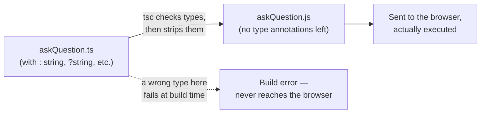
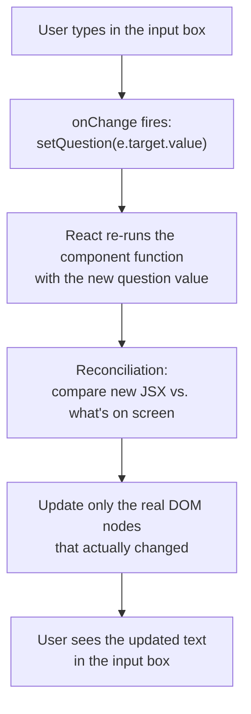

[Part 9](/posts/agenticaiforprofessionals9/) closed out this series' tour of the Python backend. This post crosses to the other side of the network boundary: the React and TypeScript frontend that turns the JSON responses Parts 6 through 9 traced into the page a person actually reads and clicks through. Before tracing the real UI in [Part 11](/posts/agenticaiforprofessionals11/), this post covers the language and framework fundamentals needed to read every line of it, assuming no prior JavaScript, TypeScript, or React experience.

## JavaScript versus TypeScript, plainly

**JavaScript** is the programming language every web browser actually runs — no browser executes anything else client-side. **TypeScript** is not a different language a browser understands; it is JavaScript with an additional layer of **type annotations** (`: string`, `: number`, and so on) that a separate tool, the TypeScript compiler, checks *before* the code ever runs, then strips out entirely, producing plain JavaScript as its actual output. A file ending in `.tsx` (this app's frontend is written entirely in `.ts`/`.tsx` files) is never sent to a browser as-is — `tsc` (via Vite, covered later in this post) compiles it into ordinary `.js` first.

The entire value of TypeScript is catching a category of mistake — passing the wrong shape of data into a function, forgetting a field an object requires — at the moment you write the code, in your editor, rather than discovering it only when that exact line happens to run in a user's browser months later. `function askQuestion(question: string, collectionId?: string)` (traced fully in Part 11) is enforced by the TypeScript compiler while writing and building the app; the actual JavaScript that ends up running in the browser has no memory of those type annotations at all — they exist purely as a development-time safety net, not a runtime one.



A type error is caught at the left-hand box, before a browser is ever involved; a *logic* error (the code type-checks fine but does the wrong thing) is invisible to this diagram entirely — TypeScript only ever catches shape mistakes, never intent mistakes.

## Syntax that recurs throughout this app's frontend

**Arrow functions.** `(x) => x + 1` is a compact way to write a function — equivalent to `function(x) { return x + 1; }`. `() => setLoading(true)` takes no arguments and runs one statement. When an arrow function's body is a single expression with no curly braces, that expression's value is automatically returned — no `return` keyword needed.

**`const` and `let`.** Both declare a variable; `const` means it is never reassigned after its first value (the *contents* of an array or object stored in a `const` can still change — only the variable itself cannot be pointed at a different value); `let` means it can be reassigned later.

**Template literals.** Backtick-quoted strings, `` `${API_BASE_URL}/qa` ``, work like Python f-strings ([Part 6](/posts/agenticaiforprofessionals6/)) — anything inside `${...}` is evaluated as a JavaScript expression and inserted into the text.

**Destructuring and spread.** `const [value, setValue] = useState("")` pulls the first and second items out of an array into two separate names in one line — **array destructuring**. `{ question, answer }` as a shorthand inside an object literal means "a property named `question` with the value of the variable `question`." `[...prev, newItem]` — three dots before an array — is the **spread operator**: it copies every item out of `prev` into a brand-new array, then adds `newItem` at the end, rather than modifying `prev` itself. React relies on this: state is always replaced with a new array or object, never mutated in place.

**Promises, `.then()`, and `async`/`await`.** A `fetch(...)` call does not return the response directly — it returns a **Promise**, an object representing "a value that will exist later, once this operation finishes." `.then(callback)` says "once the promise resolves, run this function with the result." `async function handleAsk() { ... await someFetch(...) ... }` is an alternative way to work with the same promises — `await` pauses that function (without freezing the rest of the page) until the promise resolves, and the code after it reads top-to-bottom as if it were synchronous. Both styles appear in this codebase — `api.ts`'s functions use `.then()` chaining, while component code uses `async`/`await` to call those same functions.

**TypeScript types, interfaces, and generics.** `function askQuestion(question: string, collectionId?: string): Promise<QAResponse>` reads as "a function taking a required string and an optional string (the `?` marks it optional), returning a Promise that will eventually contain a `QAResponse`." `Promise<QAResponse>` is a **generic** — `Promise` is a general container type, and `<QAResponse>` fills in *what kind* of value it will eventually contain, the same way Python's `list[Citation]` (Part 6) filled in what a list contains.

**JSX.** `<button onClick={handleAsk}>Ask</button>` looks like HTML embedded directly in JavaScript/TypeScript code — that is JSX, and it compiles down to ordinary function calls that build up a description of what the page should look like. Curly braces `{...}` inside JSX switch back into plain JavaScript — `{layer}` inserts a variable's value, `{(e) => setLayer(e.target.value)}` attaches a function to run when an event fires.

**Optional chaining and nullish coalescing.** `onPreview?.(citation)` calls `onPreview` only if it is not `null`/`undefined` — the `?.` short-circuits safely rather than crashing. `x ?? y` uses `x` unless it is `null`/`undefined`, in which case it uses `y` — similar to `||` but only falls back on a genuinely missing value, not on any falsy value like an empty string.

## How React actually works

Before the abstract explanation, here is a complete, real React component — every line that exists, nothing elided:

```tsx
import { useState } from "react";

function Counter() {
  const [count, setCount] = useState(0);
  return (
    <div>
      <p>You clicked {count} times</p>
      <button onClick={() => setCount(count + 1)}>Click me</button>
    </div>
  );
}
```

Dropped into a real Vite/React project, this renders a paragraph and a button; clicking the button increases the number shown, one click at a time. Nothing here is different in kind from `ChatPanel.tsx` in [Part 11](/posts/agenticaiforprofessionals11/) — `useState(0)` instead of `useState("")`, `setCount(count + 1)` instead of `setQuestion(e.target.value)`, one `<button>` instead of a whole chat interface. Every concept below is this same six-line shape, just applied to a real question-and-answer flow instead of a click counter.

A React **component** is just a JavaScript function that returns JSX describing what should appear on screen. `useState("")` is a **hook** — a special function, only callable directly inside a component, that gives that component a piece of memory that survives between calls. `const [question, setQuestion] = useState("")` creates one piece of state, starting at `""`, and a function `setQuestion` that is the *only* correct way to change it.



Calling `setQuestion("what is a major failure...")` does two things: it updates the stored value, and it tells React "this component's output may now be different — call the component function again." React then runs the component function again, compares the newly returned JSX against what is currently on screen (a process called **reconciliation**, often described as diffing a "virtual DOM"), and updates only the real, on-screen HTML elements that actually changed — never the whole page, and never by any code in this app manually finding and editing an element itself. No code anywhere in this app ever writes `document.getElementById(...)` — every visible change is a consequence of some piece of state changing and React re-rendering in response.

A **prop** is data (or a function) a parent component passes down to a child component as an argument — the only way data flows *down* the component tree. A child can never directly modify a parent's state; it can only call a function the parent handed it as a prop, which is how data effectively flows back *up*.

## Vite: the build tool underneath all of this

`npm run dev` (this app's actual dev command — [Part 12](/posts/agenticaiforprofessionals12/) covers the exact Dockerfile) starts **Vite**, a development server and build tool. In development, Vite serves `.tsx` files to the browser with just-in-time compilation and **hot module reloading** — the page updates in the browser the instant a source file is saved, without a full page reload. `npm run build` (`tsc -b && vite build`) instead type-checks everything with the TypeScript compiler, then bundles and minifies the whole app into plain, static HTML/CSS/JS files fit for production hosting.

## Check your understanding

1. In the toy `Counter` component, if you changed `setCount(count + 1)` to just `count + 1` (removing `setCount` entirely), would clicking the button do anything visible? Why does React need to be told about the change explicitly, rather than noticing that `count` changed on its own?
2. The JS-vs-TS diagram shows a wrong type failing "at build time." If `askQuestion(question: string, ...)` were called with a number instead of a string somewhere in the code, at what point would that mistake actually be caught — while typing in an editor, when running `npm run build`, or when a user clicks a button in their browser? Could it be more than one of these?
3. A prop flows *down* from parent to child; a child can only affect a parent by calling a function the parent gave it. If `ChatPanel` needs to tell its parent "a new chat session was just created," could `ChatPanel` do that by directly modifying a variable in the parent component? What has to happen instead?
4. `npm run dev` and `npm run build` both start from the same `.tsx` source files. Name two concrete differences in what each one actually produces.

## What is next

This post covered the language and framework fundamentals with no reference to this specific app's own code yet. [Part 11](/posts/agenticaiforprofessionals11/) applies every one of these concepts directly to the real code that renders the real, live grounded answer this series has traced from Postgres through DeepSeek — with real screenshots of the actual running app.
