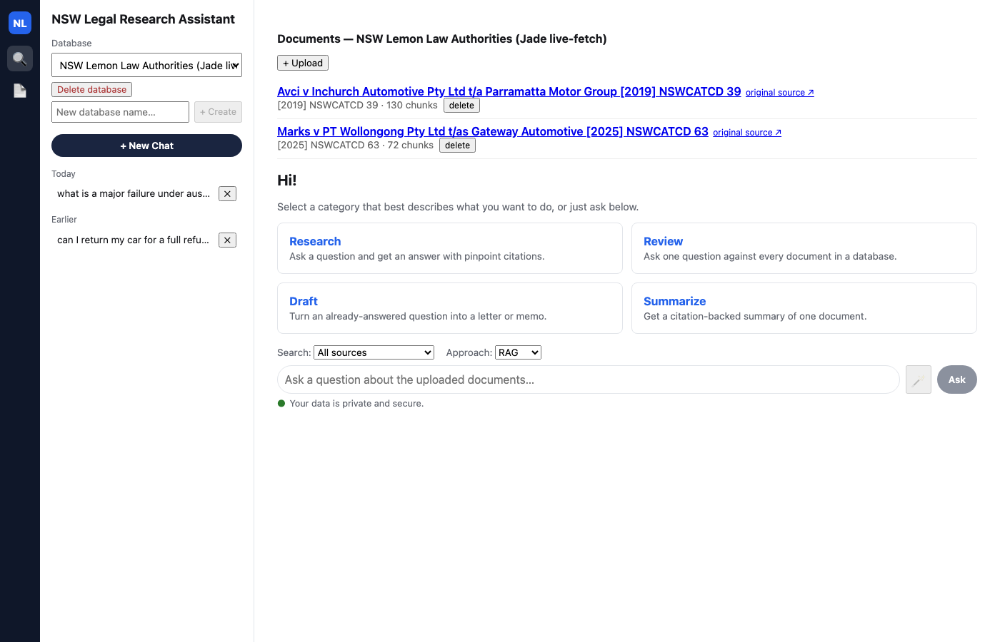
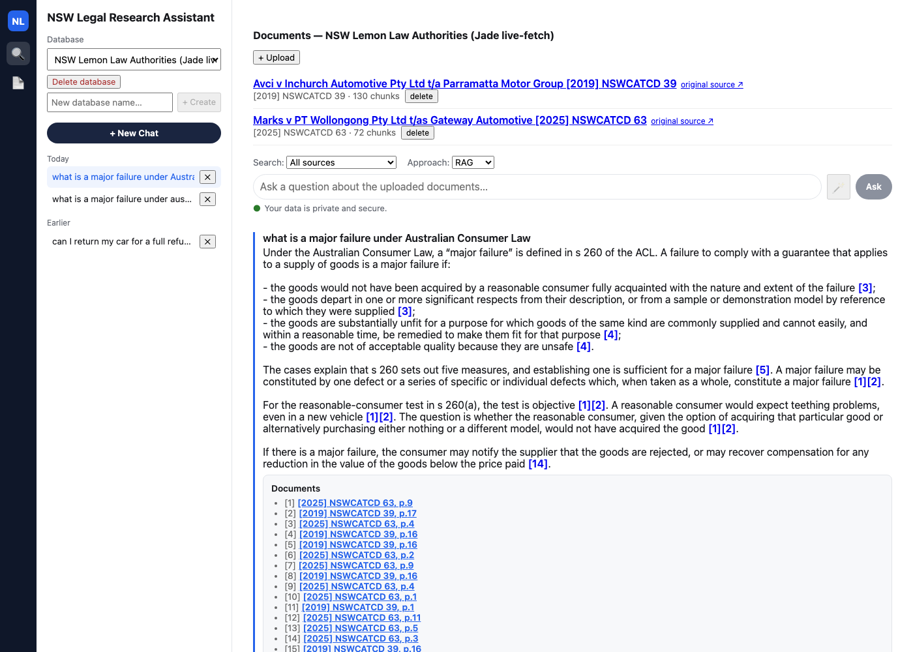
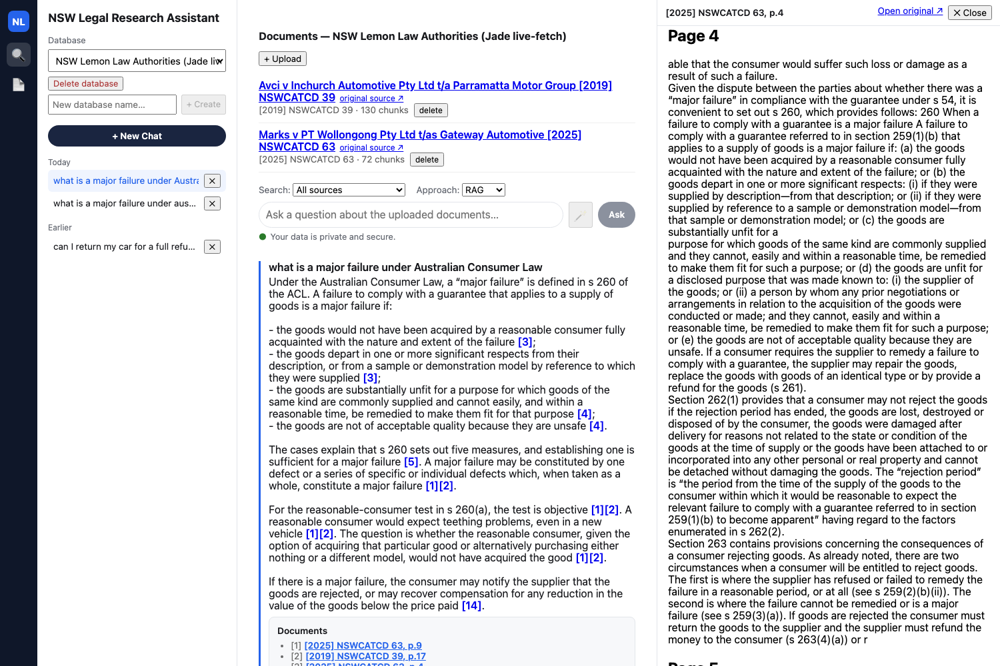
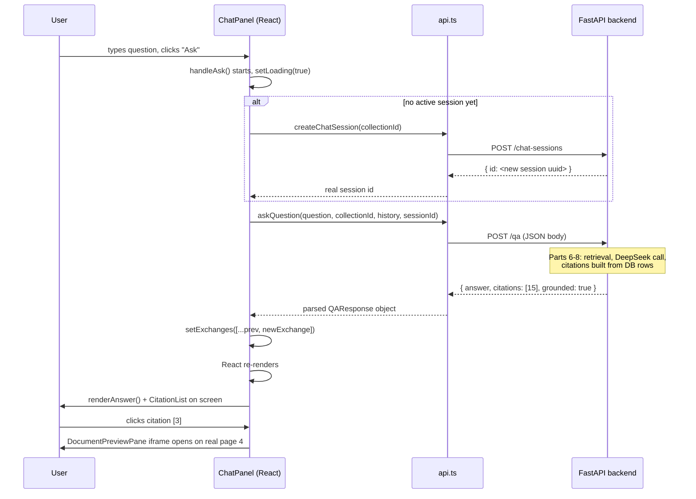

[Part 10](/posts/agenticaiforprofessionals10/) covered the React and TypeScript fundamentals needed to read this app's frontend. This post applies them directly, tracing the real major-failure question — the same one Parts 6 through 9 traced through the Python backend — from the moment its JSON response lands in the browser to the fifteen clickable citation links a person actually sees. Every screenshot below is genuine: captured live, directly from the same running app this whole series has been tracing against, moments before this post was written.

## The real, live app

```bash
# select "NSW Lemon Law Authorities (Jade live-fetch)" in the Database dropdown
```


*The real, live document list for the exact collection this series has traced throughout — 130 chunks for `Avci`, 72 for `Marks`, both real numbers confirmed independently against Postgres in Part 7*

## From JSON payload to clickable answer

`askQuestion()` is the one function every chat turn goes through:

```typescript
// frontend/src/api.ts
export const API_BASE_URL = import.meta.env.VITE_API_BASE_URL ?? "http://localhost:8000";

async function unwrap<T>(res: Response): Promise<T> {
  if (!res.ok) {
    const body = await res.text();
    throw new Error(`${res.status} ${res.statusText}: ${body}`);
  }
  return res.json() as Promise<T>;
}

export function askQuestion(
  question: string, collectionId?: string, history?: HistoryTurn[],
  layer?: string, sessionId?: string, mode: QueryMode = "rag",
): Promise<QAResponse> {
  return fetch(`${API_BASE_URL}${QUERY_MODE_ENDPOINT[mode]}`, {
    method: "POST",
    headers: { "Content-Type": "application/json" },
    body: JSON.stringify({ question, collection_id: collectionId || undefined, history, layer, session_id: sessionId }),
  }).then(unwrap<QAResponse>);
}
```

`import.meta.env.VITE_API_BASE_URL ?? "http://localhost:8000"` uses nullish coalescing (Part 10) to read an environment variable Vite bakes in at build/dev-server start, falling back to `localhost:8000`. `fetch(url, {...})` is the browser's built-in function for making an HTTP request — `JSON.stringify(...)` converts a JavaScript object into JSON text (the mirror image of Python's `json.loads`), sent as the request body exactly as [Part 6](/posts/agenticaiforprofessionals6/) traced arriving at `POST /qa`. `unwrap` is itself `async`: `res.ok` is `true` for any successful HTTP status; on failure, it `throw`s a real JavaScript `Error`; on success, `res.json()` parses the response body from JSON text into a plain object — this is the exact moment the 15-citation answer, bytes on a network connection a moment earlier, becomes a real object this app's code can read fields off of.

## Asking the real question: `handleAsk`

```typescript
// frontend/src/components/ChatPanel.tsx
async function handleAsk() {
  const q = question.trim();
  if (!q || loading) return;
  setLoading(true);
  setError(null);
  try {
    const history = exchanges.slice(-4).map((ex) => ({ question: ex.question, answer: ex.result.answer }));

    let activeSessionId = sessionId;
    if (!activeSessionId) {
      const created = await createChatSession(collectionId);
      activeSessionId = created.id;
      onSessionCreated(activeSessionId);
    }

    const result = await askQuestion(q, collectionId ?? undefined, history, layer || undefined, activeSessionId, mode);
    setExchanges((prev) => [...prev, { id: crypto.randomUUID(), question: q, result, mode }]);
    setQuestion("");
  } catch (err) {
    setError(String(err));
  } finally {
    setLoading(false);
  }
}
```

For the real question, typed as the first message of a new chat: `try { ... } catch (err) { ... } finally { ... }` is JavaScript's exception-handling structure — `try` runs normally; if anything inside throws (including `unwrap`'s `throw new Error(...)` from a failed request), execution jumps to `catch`; `finally` always runs last, guaranteeing `setLoading(false)` fires either way, so the UI never gets stuck showing a permanent loading state.

`let activeSessionId = sessionId; if (!activeSessionId) { ... }` — for a genuinely new chat, this branch runs: `await createChatSession(collectionId)` makes a real, separate `POST /chat-sessions` request *before* the question is even asked, and waits for it to finish; this is exactly why a real `ChatSession` row already exists in Postgres by the time the actual question is sent, and why the sidebar shows a "Today" entry immediately. `onSessionCreated(activeSessionId)` is a **prop** — a function passed down from a parent component, called here to let that parent update its own state with the new session id, since a child component can never directly modify a parent's state.

`setExchanges((prev) => [...prev, { id: crypto.randomUUID(), question: q, result, mode }])` is React's **functional state update** form: passing a function to a setter guarantees `prev` is the actual current state at the moment the update runs, correct regardless of timing, rather than a possibly-stale copy. `crypto.randomUUID()` is a browser built-in generating a random unique id, used purely as a React list key, unrelated to any database id.

## A toy example: what `.split()` with a regex actually does

```javascript
const MARKER_RE = /(\[\d+\])/g;
const text = "The sky is blue [1] and grass is green [2].";
console.log(text.split(MARKER_RE));
// ["The sky is blue ", "[1]", " and grass is green ", "[2]", "."]
```

Run this in any browser console or Node.js and it prints exactly that array — five pieces, alternating plain text and markers, because the regex's capturing parentheses tell `.split()` to keep the matched delimiters instead of discarding them (a plain `.split(", ")` with no parentheses would keep only the plain-text pieces and throw the markers away). The real answer text below produces the identical shape, just with 15 markers instead of 2 and real legal text instead of "the sky is blue."

## The real answer, rendered

```typescript
// frontend/src/citations.tsx
const MARKER_RE = /(\[\d+\])/g;

export function renderAnswer(answer: string, citations: Citation[], onPreview?: (citation: Citation) => void) {
  const byMarker = new Map(citations.map((c) => [c.marker, c]));
  return answer.split(MARKER_RE).map((part, i) => {
    const citation = byMarker.get(part);
    if (!citation) return <span key={i}>{part}</span>;
    return (
      <a key={i} href={citationHref(citation)} title={citationTitle(citation)}
         onClick={(e) => { e.preventDefault(); onPreview?.(citation); }}>
        {part}
      </a>
    );
  });
}
```

`/(\[\d+\])/g` is a **regular expression** — `\[` and `\]` match a literal square bracket, `\d+` matches one or more digits, the parentheses mean "keep this matched part," and the `g` flag means "find every match, not just the first." `answer.split(MARKER_RE)` splits the answer text at every `[n]` marker, and because the pattern has capturing parentheses, JavaScript's `.split()` keeps the markers themselves in the result, interleaved with the plain text between them. `new Map(citations.map((c) => [c.marker, c]))` builds a lookup table so `byMarker.get("[3]")` instantly finds the right citation object. `.map((part, i) => {...})` walks every piece and returns either a plain `<span>` or a clickable `<a>` — `onPreview?.(citation)` uses optional chaining (Part 10) so this never crashes when no preview handler exists.

Here is the real result, for the real answer, from the real, currently-running app:


*The genuine, live-rendered answer — every `[n]` marker a real clickable link, the "Documents" panel underneath listing all 15 real citations, exactly matching the JSON structure Part 8 traced*

## Clicking a citation: the split-pane preview

Clicking `[3]` — the s 260(a) statutory-language citation this series has traced since Part 7 — opens `DocumentPreviewPane`, a plain HTML `iframe` pointed at the real stored PDF:

```typescript
// frontend/src/components/DocumentPreviewPane.tsx
<iframe src={url} title={title} style={{ flex: 1, border: "none" }} />
```

The frontend never re-derives which page a citation points to — it asks the backend for the URL (`documentFileUrl(citation.document_id, citation.page_number)`) and puts it directly in an `iframe`. The real result:


*The real page 4 of the real `Marks v PT Wollongong` judgment, opened by clicking citation `[3]` — the actual statutory text of s 260, quoted verbatim, confirming the citation resolves to genuine content rather than a broken reference*

The right-hand pane's text — "it is convenient to set out s 260, which provides as follows: 260 When a failure to comply with a guarantee is a major failure..." — is the real source the answer's `[3][4]` markers point to. Nothing in the frontend generated this text; it is the actual judgment PDF, served by the backend, rendered by the browser's own PDF-handling inside an `iframe`.

## The full round trip, end to end



## Check your understanding

1. In the toy `.split()` example, what would `text.split(/\[\d+\]/g)` (the same pattern, but *without* the capturing parentheses) print instead? Why does that difference matter for `renderAnswer()`?
2. `handleAsk` calls `createChatSession()` and `await`s it *before* calling `askQuestion()`. If those two calls were fired at the same time instead (without waiting for the first to finish), what real problem would that cause for `_persist_if_session()` on the backend (Part 6)?
3. `renderAnswer()` builds a `Map` from `citations` before mapping over the split pieces. Could the same lookup be done without a `Map` — say, with `citations.find(c => c.marker === part)` inside the `.map()` callback instead? What would be different about performance if the answer had 200 markers instead of 15?
4. Clicking citation `[3]` opens an `iframe` pointed at a URL built from `citation.document_id` and `citation.page_number`. If the backend's `/documents/{id}/file` endpoint were down, what would the user actually see happen when they clicked `[3]` — and which of the two real screenshots in this post would still render correctly regardless?

## What is next

This post traced the complete round trip for a real question, ending with a real citation resolving to real, verifiable source text. [Part 12](/posts/agenticaiforprofessionals12/) covers the drafting UI's client-side half, how the frontend is actually hosted, and what a genuine end-to-end test for this exact flow would need to assert to prove the whole stack — database through browser — actually works together.
