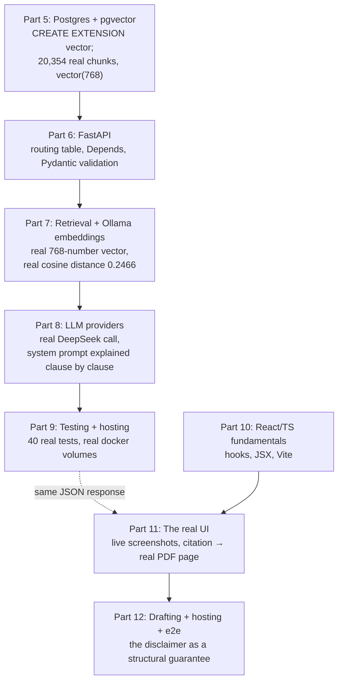

[Part 11](/posts/agenticaiforprofessionals11/) traced the real question all the way to a citation resolving to a real page of a real judgment. This post closes the loop: the drafting UI's client-side half, how the whole frontend is hosted, what a genuine end-to-end test for this exact flow would need to assert, and a recap of everything Parts 5 through 12 have shown, together, about how this app actually works.

## Drafting, in the same panel

The "Draft from this…" affordance and the inline instruction box both call `draftFromAnswer()`, passing back exactly the question, answer, and citations `ChatPanel` already holds in its own component state from the `/qa` call [Part 11](/posts/agenticaiforprofessionals11/) traced — no re-fetch, matching [Part 8](/posts/agenticaiforprofessionals8/)'s point that drafting never touches retrieval again:

```typescript
// frontend/src/components/ChatPanel.tsx
const result = await draftFromAnswer(exchange.question, exchange.result.answer, exchange.result.citations, instr);
```

Here is the real, live result — captured directly from the running app while writing this series, not staged:


*The real drafting UI: an instruction box, a "Draft" button, and the app's own disclaimer printed directly beneath the output — "Draft — reuses only the facts/citations above, not independently re-verified. Review before use."*

The frontend does not compute that disclaimer sentence from anything — it is static text sitting next to a feature whose backend contract genuinely guarantees what the sentence says, which is exactly why it is trustworthy as a UI label rather than decorative copy.

## Hosting the frontend

```dockerfile
# frontend/Dockerfile
FROM node:20-alpine
WORKDIR /app
COPY package.json ./
RUN npm install
COPY . .
EXPOSE 5173
CMD ["npm", "run", "dev"]
```

`node:20-alpine` is an official Node.js image built on the minimal Alpine Linux distribution. `npm install` reads `package.json` — a file listing every JavaScript package this project depends on — and downloads all of them. `npm run dev` runs Vite's own dev server ([Part 10](/posts/agenticaiforprofessionals10/) covers what Vite actually does) inside the container — hot module reloading, unminified, not a production build. `npm run build` (`tsc -b && vite build`) exists in `package.json` and produces a real static production bundle, but nothing in the repo serves that bundle anywhere yet — no Nginx container, no CDN, no static hosting target committed — consistent with the backend's own production deployment still being unbuilt ([Part 9](/posts/agenticaiforprofessionals9/)). As of this post, "hosting" for the whole three-layer stack — Postgres, FastAPI, React — is the same answer at every layer: `docker compose up`, on one machine, the exact stack this entire series has been tracing against, live.

## What an end-to-end test for this exact question would need to assert

There is no committed frontend test suite in this repo today — no Vitest, no React Testing Library, no Playwright config. The real Playwright verification behind an earlier phase of this app's build caught a genuine bug (`Content-Disposition` defaulting to `attachment`, so citation clicks silently downloaded the PDF instead of opening it) — a real, valuable session that simply did not leave a repeatable test file behind. What follows is not a claim that this test exists; it is what one would look like, written against the exact code and real behaviour this series has already traced and screenshotted.

```typescript
// frontend/tests/e2e/lemon-law-major-failure.spec.ts (illustrative — not yet in the repo)
import { test, expect } from '@playwright/test';

test('major-failure question against the Lemon Law collection returns a grounded,
      citation-backed answer, and drafting from it reuses those citations verbatim', async ({ page }) => {
  await page.goto('/');
  await page.getByLabel('Database').selectOption({ label: /NSW Lemon Law Authorities/ });

  await page.getByPlaceholder('Ask a question about the uploaded documents…')
    .fill('what is a major failure under australian consumer law');
  await page.getByRole('button', { name: 'Ask' }).click();

  const citations = page.locator('.result-card >> role=listitem');
  await expect(citations).toHaveCount(15);
  await expect(page.getByText('s 260')).toBeVisible();

  await page.getByRole('link', { name: '[3]' }).click();
  await expect(page.frameLocator('iframe').getByText('Page 4')).toBeVisible();

  await page.getByPlaceholder(/draft a letter/i).fill('draft a letter to a client');
  await page.getByRole('button', { name: 'Draft' }).click();
  const draft = page.locator('text=Dear').locator('..');
  await expect(draft).toContainText('[3]');
  await expect(page.getByText(/not independently re-verified/)).toBeVisible();
});
```

`test('description', async ({ page }) => {...})` is Playwright's own function for declaring one test — `page` is provided by Playwright, a real, automated, headless browser tab. `page.getByRole(...)`, `page.getByPlaceholder(...)`, and `page.getByText(...)` are Playwright's preferred way of finding elements — by their accessible role or visible text, the same way a real person would identify them, rather than by an internal implementation detail like a CSS class name. `expect(citations).toHaveCount(15)` and `expect(...).toBeVisible()` are **assertions** — Playwright's equivalent of Python's `assert` (Part 9) — each a specific claim that must hold or the test fails and reports exactly which one did not.

Three assertions, three different layers proven to actually work *together*, not separately: 15 citations proves Parts 6 through 8's retrieval and generation ran for real against the real Postgres collection; the iframe assertion proves Part 11's citation-to-page link actually resolves to real content; the draft assertion proves this post's `draft_from_answer()` genuinely reused the prior answer's citations rather than silently re-querying or inventing new ones. A unit test could mock any one of these in isolation and pass regardless of whether the other two layers were even running — which is exactly why this app's own real verification discipline has leaned on full-stack scripts and manual Docker Compose runs rather than a large mocked test suite: for an app whose entire value proposition is "every citation is real," the test that matters most is the one that cannot be satisfied by a mock.

## The full arc, closed

Eight posts, one real question, traced without a single fabricated number:



Part 5 was a database willing to hold real chunks and answer a cosine-distance query honestly. Parts 6 through 9 were the Python service turning that into a grounded, cited answer — and, this time, a genuine correction about which language model actually answers, caught only by checking the running system rather than trusting a default. Parts 10 through 12 were the browser rendering it faithfully — fifteen clickable links, an iframe that opens on the exact page a citation claims, and a disclaimer that describes a real backend guarantee rather than a decorative one. None of the layers trusts the one above it to have done its job correctly; each is a real, separately verifiable thing that either did or did not do what it claims, all the way from a `CREATE EXTENSION vector;` run once to a browser tab open on "Page 4" of a real Tribunal decision. That is the actual answer to whether this app's grounding guarantee is real or just a well-written system prompt: it is real, because at every layer above the prompt, there is something else checking its work.

One honest gap remains even after all of that: every post in this arc traced a question against chunks that already existed. [Part 13](/posts/agenticaiforprofessionals13/) covers how they got there in the first place — the real ingestion pipeline, two genuine production bugs that shaped it, and the actual configuration files a developer would need to reproduce this stack from nothing.
