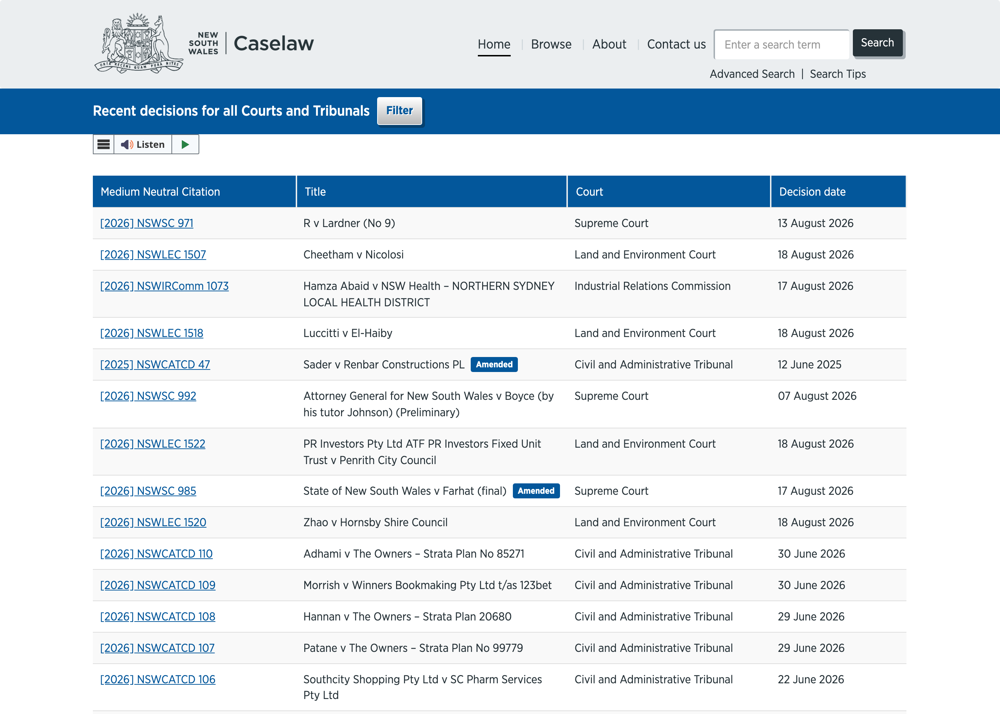

[Part 1](/posts/agenticaiforprofessionals1/) covered the research — how a structured LLM-wiki process traced Thomson Reuters CoCounsel's real architecture, and how that turned into a plan for a simplified version grounded on [NSW Caselaw](https://www.caselaw.nsw.gov.au/) instead of a commercial database. This post is the actual build: Phases 1 through 3 of that plan, all of it running locally on my 32GB M4 MacBook Air through Docker Compose, with [Ollama](https://ollama.com/) serving both the chat model and the embeddings — no cloud API required to get a working system end to end.


*NSW Caselaw's own "recent decisions" list — and there's "Sader v Renbar Constructions PL", one of the two real cases I actually loaded into the app below*

## The data model: documents and chunks

Two tables, deliberately small. A `Document` row holds whatever metadata I can extract from a case — filename, title, medium-neutral citation, court, decision date. A `Chunk` row holds one piece of extracted text, its page number, and its embedding vector:

```python
# backend/app/models.py
EMBEDDING_DIM = settings.ollama_embed_dimensions   # 768 for nomic-embed-text

class Document(Base):
    __tablename__ = "documents"
    id: Mapped[uuid.UUID] = mapped_column(UUID(as_uuid=True), primary_key=True, default=uuid.uuid4)
    filename: Mapped[str] = mapped_column(String, nullable=False)
    title: Mapped[str | None] = mapped_column(String, nullable=True)
    citation: Mapped[str | None] = mapped_column(String, nullable=True)
    court: Mapped[str | None] = mapped_column(String, nullable=True)
    chunks: Mapped[list["Chunk"]] = relationship(back_populates="document", cascade="all, delete-orphan")

class Chunk(Base):
    __tablename__ = "chunks"
    document_id: Mapped[uuid.UUID] = mapped_column(UUID(as_uuid=True), ForeignKey("documents.id", ondelete="CASCADE"))
    page_number: Mapped[int] = mapped_column(Integer, nullable=False)
    text: Mapped[str] = mapped_column(Text, nullable=False)
    embedding: Mapped[list[float]] = mapped_column(Vector(EMBEDDING_DIM), nullable=False)
```

The `EMBEDDING_DIM` constant matters more than it looks: it's fixed at table-creation time, and it has to match whichever provider actually generated the vectors. Switching embedding providers later isn't a config flip — it means migrating this column, since a 768-dimension Ollama vector and a 1536-dimension OpenAI vector aren't interchangeable or even comparable to each other.

## Ingestion: chunking that never crosses a page boundary

A locally-downloaded NSW Caselaw PDF goes in through `POST /documents`, gets text-extracted page by page via `pypdf`, and then chunked into roughly 800-character pieces — sentence-grouped, simple on purpose for a v0. The one rule that isn't negotiable: a chunk can never span two pages.

```python
# backend/app/pipeline/chunking.py
def chunk_pages(pages: list[PageText]) -> list[ChunkDraft]:
    """Chunk within each page only -- never across a page boundary.

    Every chunk must map unambiguously to exactly one source page number, because
    that page number is what gets shown to the user as the citation. Chunking
    across pages would blur that and undermine the whole trust mechanism.
    """
    drafts: list[ChunkDraft] = []
    index = 0
    for page in pages:
        for piece in _split_into_chunks(page.text, TARGET_CHUNK_CHARS):
            drafts.append(ChunkDraft(chunk_index=index, page_number=page.page_number, text=piece))
            index += 1
    return drafts
```

That one constraint is doing real work: it's the reason a citation later in this post can point at an exact page rather than "somewhere in this 40-page judgment." I tested it end-to-end against two real fixture judgments — *Huang v Nazaran* [2026] NSWDC 298 and *Sader v Renbar Constructions PL* [2025] NSWCATCD 47 — and confirmed every chunk carried a correct, contiguous page number all the way through ingestion.

## A provider-agnostic LLM layer, with Ollama as the default

Every LLM provider sits behind one abstract interface, so the RAG skill itself never has to know or care which one is actually answering:

```python
# backend/app/llm/base.py
class LLMProvider(ABC):
    @abstractmethod
    def generate(self, prompt: str, context: str | None = None) -> str: ...
```

```python
# backend/app/llm/__init__.py
def get_llm_provider() -> LLMProvider:
    if settings.llm_provider == "anthropic":
        return AnthropicProvider(settings.anthropic_api_key, settings.anthropic_model)
    if settings.llm_provider == "openai":
        return OpenAICompatibleProvider(settings.openai_api_key, settings.openai_model)
    if settings.llm_provider == "deepseek":
        return OpenAICompatibleProvider(settings.deepseek_api_key, settings.deepseek_model, base_url=settings.deepseek_base_url)
    if settings.llm_provider == "ollama":
        return OllamaProvider(settings.ollama_base_url, settings.ollama_chat_model)
    raise ValueError(f"Unsupported llm_provider: {settings.llm_provider!r}")
```

One env var, `LLM_PROVIDER`, picks which one loads. For local development on the M4 that's `ollama`, pointed at `host.docker.internal:11434` so the backend container can reach Ollama running on the host machine rather than needing its own copy inside Docker. Two models actually live on this laptop right now:

```
$ ollama list
NAME                       ID              SIZE      MODIFIED
llama3.1:8b                46e0c10c039e    4.9 GB    55 minutes ago
nomic-embed-text:latest    0a109f422b47    274 MB    About an hour ago
```

`llama3.1:8b` handles chat generation — it answers in 2–3 seconds with plenty of headroom on 32GB of unified memory. `nomic-embed-text` handles embeddings, at 768 dimensions, which is what `EMBEDDING_DIM` above is actually reading. Neither needs an API key, a network connection past the first `ollama pull`, or a cent of cloud spend — which is exactly the point of building this layer as swappable rather than hard-coding a single provider: the same code that runs free on my own machine today can point at Anthropic's API with one environment variable change once this is worth paying for, without touching a line of the RAG logic itself.

## The one skill: retrieval, generation, and citations that can't be hallucinated

This is the only skill in v0 — deliberately, mirroring CoCounsel's fixed-catalog philosophy from [Part 1](/posts/agenticaiforprofessionals1/) rather than building an open-ended agent. Retrieval embeds the question with the same provider used at ingest time and pulls the nearest chunks by cosine distance, dropping anything below a similarity threshold:

```python
# backend/app/rag/retrieval.py
def retrieve_relevant_chunks(session: Session, question: str) -> list[RetrievedChunk]:
    provider = get_embedding_provider()
    [query_vector] = provider.embed([question])
    distance = Chunk.embedding.cosine_distance(query_vector)
    rows = session.execute(
        select(Chunk, Document, distance.label("distance"))
        .join(Document, Chunk.document_id == Document.id)
        .order_by(distance)
        .limit(settings.rag_top_k)
    ).all()

    results = []
    for chunk, document, dist in rows:
        similarity = 1 - dist
        if similarity < settings.rag_similarity_threshold:
            continue
        results.append(RetrievedChunk(..., similarity=similarity))
    return results
```

Generation then builds a numbered context block from whatever survived that filter and instructs the model to answer *only* from it:

```python
# backend/app/rag/qa.py
SYSTEM_PROMPT_TEMPLATE = """You are a legal research assistant. Answer the question using ONLY the numbered \
source excerpts below -- do not use any outside knowledge, even if you know the \
answer. Cite every factual claim inline using the excerpt's bracket marker, e.g. \
[1]. If the excerpts do not contain enough information to answer, say so \
explicitly instead of guessing.

{context_block}"""
```

The detail I think matters most here: citation *metadata* — case name, medium-neutral citation, page number — is read straight off the retrieved database rows, never generated by the model. The LLM only chooses which numbered excerpt to reference inline; it can never invent a citation that doesn't correspond to a real, retrieved chunk, because the citation objects returned by `/qa` are built in Python from the query results, not parsed out of the model's own text. That's the same "show its work, and make the showing un-fakeable" pattern CoCounsel uses, implemented as a structural guarantee rather than a prompt instruction I'm just hoping the model follows.

## The bug: a threshold that looked fine until a genuinely unrelated question exposed it

With two real judgments loaded — the District Court costs case and the home-building tribunal dispute mentioned above — in-domain questions worked cleanly from the start. Live, right now, against the actual running stack:

```
$ curl -s localhost:8000/qa -d '{"question": "In Huang v Nazaran, what power did the court use to correct the costs order?"}'
{
  "answer": "According to excerpt [4], the court used its \"express power under Part 36.16\" and its \"implied power within its statutory power\" to amend its records and judgment relying on costs determinations.",
  "grounded": true,
  "citations": [{"citation": "[2026] NSWDC 298", "court": "District Court", "page_number": 3}, ...]
}
```

The real test came from asking something the loaded documents plainly don't cover — I tried "What does the Copyright Act 1968 say about fair dealing for research purposes?", nowhere near either a District Court costs dispute or a home-building tribunal case. At the first threshold I picked, `0.5`, that question didn't get refused — it got an answer, "grounded": true, with five citations pointing at chunks about construction defects. The LLM itself had the sense not to actually answer from them, but the retrieval layer's guardrail — the one thing that's supposed to catch this before the model even sees the question — wasn't doing its job.

The fix wasn't guessing a bigger number; it was querying `pgvector` directly and looking at what similarity scores real questions actually produced against this corpus:

- **Genuinely relevant chunks**: 0.70–0.79 similarity
- **Same-domain, wrong-case chunks** (legal text that shares vocabulary and structure with the right answer, but isn't it): 0.58–0.61
- **A control question with nothing in common with either document**: 0.36–0.39

`0.5` sat in the middle of nothing — closer to the wrong cluster than the right one. `0.65` sits cleanly in the actual gap between "same domain, wrong document" and "genuinely relevant." With that raised threshold, the same out-of-domain question now behaves correctly:

```
$ curl -s localhost:8000/qa -d '{"question": "What does the Copyright Act 1968 say about fair dealing for research purposes?"}'
{
  "answer": "I couldn't find anything relevant to this question in the uploaded documents. Try rephrasing, or upload a document that covers this topic.",
  "grounded": false,
  "citations": []
}
```

The lesson I took from this: a similarity threshold isn't a universal constant you can pick once from general knowledge about embedding models. It's specific to the embedding model, has to be calibrated against real same-domain-but-wrong-document negatives, and a naive test like "ask it about the capital of France" would have completely missed the actual failure mode — that question alone scored 0.36, nowhere near the danger zone that a plausible-sounding wrong-case question landed in.

## What's still ahead

Phases 1 through 3 are done and validated against a live stack — data layer, LLM orchestration, and the one core RAG skill. What's still checkbox-unticked in the build plan is the part a screenshot would actually show: Phase 4's React/TypeScript upload-and-chat interface, and Phase 5's MCP server exposing this same skill to Claude Code directly. Those become their own post once they exist — I'd rather document what's actually built than write ahead of the code.
