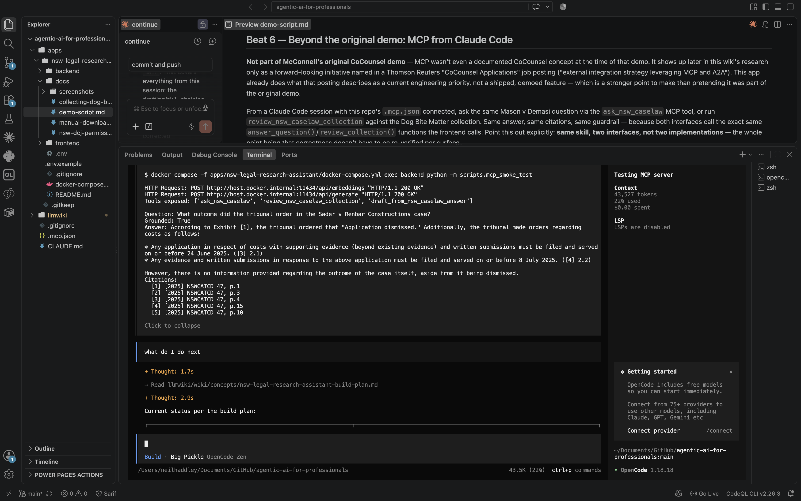
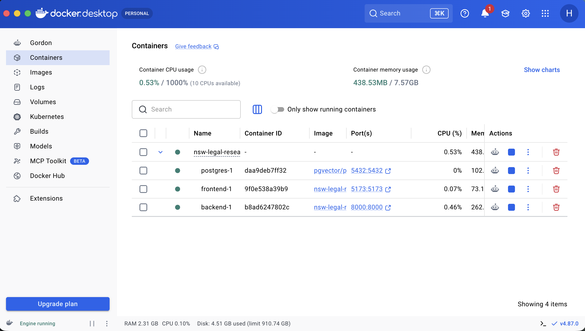

[Part 1](/posts/agenticaiforprofessionals1/) covered the research and the plan; [Part 2](/posts/agenticaiforprofessionals2/) covered the RAG core — retrieval, generation, and citations that can't be hallucinated, all running locally on the M4 MacBook Air. This post is Phases 4 through 6: giving `nsw-legal-research-assistant` an actual interface, exposing the same skill to Claude Code over MCP, and then running it live against a demo script modeled directly on the interview where Thomson Reuters' Valerie McConnell walked Legal IT Insider through CoCounsel's "Search a Database" skill — the [McConnell interview](https://www.youtube.com/watch?v=VTOiMbOTLaE) documented back in Part 1's research. Same idea — grounded answers, pinpoint citations, trend analysis across a whole matter, skill-chaining into a draft — run against this app, with real output, not illustrative text.


*The app with a named database selected*

## Beat 1 — Grounded Q&A, scoped to a database

McConnell's demo queried named, scoped databases — a 200-contract set, a 1,200-contract set — rather than one undifferentiated pile. That's the direct reason this app has a database selector at all: asking a question with nothing selected searches every uploaded document; scoping to one named database (**Rental Eviction Case Law (Jade)**) searches only what's filed under it.

> **During the COVID-19 pandemic, was there a moratorium on evicting tenants for rent arrears in NSW, and how did the court treat it in this case?**

Real output, this run:

> A moratorium on evicting tenants for rent arrears existed during the COVID-19 pandemic in NSW. From [2], we see that the Residential Tenancies Regulation 2019 (NSW) was amended to include a new Part 6A "Response to COVID-19 pandemic," which provided for a "moratorium period" of six months (reg 41A). The moratorium did not apply in this specific case because the tenant was not an "impacted tenant" — there was no evidence to allow a finding that Mr Herbert was an "impacted tenant," and therefore the protections given by the regulation were not engaged.


*Grounded answer with fifteen inline citation markers across two documents, each linking to a specific page of a specific document*

Every claim carries a bracket marker. That's the whole trust mechanism in one screen — click one.

## Beat 2 — Pinpoint citations, and the state where they can't be trusted blindly

Click `[1]` and the PDF opens in a new tab, scrolled to the exact page the figure came from — the same "show its work" pattern McConnell described as CoCounsel's core trust mechanism, a hyperlink plus an excerpt backing every claim so a professional can verify without redoing the research. The citation metadata — case name, page number — is read directly off the retrieved database row, never generated by the model, so *which* excerpt gets cited is the LLM's call, but the citation itself can't be hallucinated.

Every citation in the run above is a **verified** source: a human found, downloaded, and uploaded the document, so its provenance is known — which is why those markers render as plain bold text with no warning. The trust mechanism has a second state — a deliberately isolated, clearly labeled bulk-import collection of unverified-provenance documents, kept apart from any real matter specifically so a scoped question can never silently draw on it. That second state renders as an orange warning icon, a dashed underline, and a link to the unverified source instead of a locally-stored PDF — not pictured in this post's screenshots, since every database shown here is a verified one, but real and exercised by the bulk-import collections this series has since added.

## Beat 3 — Review: one row per document

The Review skill asks a series of questions to every document individually.


*Three questions queued against the Rental Eviction Case Law (Jade) database — 50 documents × 3 questions*


*The finished grid — three questions (rent arrears as a termination ground, unlawful/retaliatory eviction, the COVID-19 moratorium) answered independently against every document in the database*

## Beat 4 — Skill-chaining: draft from an answer, no re-supply

McConnell's most complex demoed move: approve a database answer, then say "draft a letter from that," with no re-upload and no re-running the search. Same move here — click **Draft from this…** underneath the Beat 1 answer:

> **draft a letter to the client summarizing this outcome**

Real output:

> Dear Client,
>
> Re: COVID-19 Moratorium on Evictions in NSW
>
> As you may recall, we were discussing the application of the COVID-19 moratorium on evicting tenants for rent arrears in NSW. In light of our previous research and findings [1], I am writing to inform you that a moratorium did exist during the pandemic period.
>
> During this time, a new Part 6A "Response to COVID-19 pandemic" was added to the Residential Tenancies Regulation 2019 (NSW), which included a moratorium period of six months [2]. However, in our specific case, the court found that the protections given by this regulation were not engaged because you were not an "impacted tenant," as there was no evidence to support this designation [6].
>
> In particular, the court noted that the tenant (you) was not a member of a household impacted by the pandemic, and therefore the moratorium did not apply in our specific case. As such, the court allowed the eviction proceedings to continue.


*The drafted letter, reusing only the figures and facts already on screen, with a review-before-use disclaimer*

No new retrieval happens here — the exact answer and citations already on screen get passed straight back to a second LLM call, explicitly forbidden from introducing new facts or citations. It's deliberately stateless: the frontend, not the server, holds the "conversation" by re-sending what it already has, rather than a session table on the backend. That statelessness is also why the guardrail is worth testing honestly rather than cherry-picked: asking it to draft from an answer that hadn't actually established an outcome produced a correct *refusal* instead of a fabricated finding — a clean refusal on ungrounded ground is a stronger trust signal than a draft that always complies.

## Beat 5 — Beyond the original demo: MCP from Claude Code

Not part of McConnell's  demo at all — MCP wasn't discussed at all in that interview. `ask_nsw_caselaw`, introduced above, is the MCP tool matching Beat 1's Q&A skill. This same build shipped two more, mirroring the two skills it added: `review_nsw_caselaw_collection` for Beat 3, and `draft_from_nsw_caselaw_answer` for Beat 4. All three are thin wrappers calling the exact same functions the REST API and the frontend call — same skill, multiple interfaces, not separate implementations to keep in sync.

A real MCP client/server round trip — spawning `app/mcp_server.py` as an actual subprocess over stdio, the same transport Claude Code uses, not a direct Python call — against the live stack:

```
Tools exposed: ['ask_nsw_caselaw', 'review_nsw_caselaw_collection', 'draft_from_nsw_caselaw_answer']

--- review_nsw_caselaw_collection ---
Question: What caused the plaintiff's injuries in this case?
  - Your Right to Compensation for Dog Bites — RMB Lawyers: grounded=False
    I couldn't find anything relevant to this question in the uploaded documents...
  - A User's Guide to Civil Liability in Australia 2026 (NSW) — Colin Biggers & Paisley: grounded=True
    Unfortunately, I am unable to answer this question as it relies on an unverified source: [20]...
  - [2012] NSWCA 210: grounded=True
    Unfortunately, I am unable to find any information on what caused the plaintiff's injuries...

--- draft_from_nsw_caselaw_answer ---
Instruction: Draft a short memo to a colleague summarizing what the research above establishes.
Draft: To: Colleague

Regarding: Mason v Demasi dog bite claim judgment

As per my previous research, I found that in Mason v Demasi, the court set aside an earlier
judgment and ordered a new trial limited to damages [1] ([2012] NSWCA 210, p.4)...
```


*What caused the plaintiff's injuries in this case?*

Same shape as the browser — the same mix of grounded and not-found rows across the five documents, the same reused-figures-only drafting behavior — because both interfaces are calling `review_collection()` and `draft_from_answer()` directly, not a second reimplementation of them. The exact wording differs from Beats 3 and 4's screenshots, same as it does between any two runs of this app; the guarantee is architectural, not word-for-word reproducibility.

## Where this actually runs

Every beat above ran against the full stack live on a [Docker](/posts/docker/) Compose setup on the M4 MacBook Air from [Part 2](/posts/agenticaiforprofessionals2/) — Postgres/pgvector, the FastAPI backend, and the React frontend, all local, no cloud dependency for any of it:


*Four containers, all healthy: postgres, backend, frontend, and the compose project itself — 438.53MB RAM, 0.53% CPU at idle*

## Honest comparison to the original demo

| | McConnell's CoCounsel demo | This app, run live |
|---|---|---|
| Scale | 38,000 SEC filings / 1,200-contract set | 5 documents in this post's original database, up to 50 in databases added since |
| Named, scoped databases | Yes | Yes |
| Grounded, citation-linked Q&A | Yes | Yes |
| Trend/risk analysis | Yes, within "Search a Database" itself | Yes, as a separate Review skill |
| Conceptual/synonym-aware search | Yes ("pandemic" matches "epidemic") | Embedding similarity only — related, not identical |
| Skill-chaining (Q&A → drafting) | Yes ("draft a letter from that") | Yes — stateless: client passes back the prior answer/citations, no new facts allowed |
| Domain-expert evaluation | Licensed lawyers writing test suites | Manually-verified questions, plus [`isaacus/open-australian-legal-qa`](https://huggingface.co/datasets/isaacus/open-australian-legal-qa) identified as a spot-check benchmark (not yet wired into an automated run) — solo-developer scale |
| MCP/external integration | Not part of the demo (predates the concept) | Shipped, demoed here as a bonus |

What this app isn't trying to be: a reproduction of CoCounsel at enterprise scale. What it is: the same architectural pattern — curated, scoped [RAG](/posts/contextinjection/) with a non-negotiable citation-grounding trust mechanism — proven against a real matter, with the actual gaps between "toy demo" and "useful tool" identified, closed where reasonable, and reported honestly where not.
