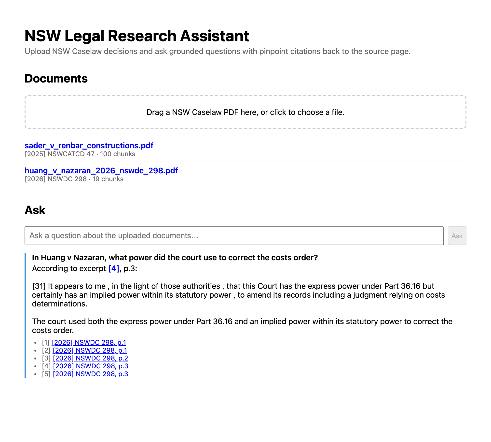

[Part 1](/posts/agenticaiforprofessionals1/) covered the research and the plan; [Part 2](/posts/agenticaiforprofessionals2/) covered the RAG core — retrieval, generation, and citations that can't be hallucinated, all running locally on the M4 MacBook Air. This post is Phases 4 through 6: giving `nsw-legal-research-assistant` an actual interface, exposing the same skill to Claude Code over MCP, and three bugs that only surfaced once something other than `curl` was doing the testing.


*The actual app, live: two uploaded judgments, a real question, a grounded answer with a clickable pinpoint citation*

## A frontend that renders citations as clickable links

The React frontend is deliberately plain — an upload view, a document list, a chat panel — and the one piece of real design work is turning `[1]`, `[2]` markers in the answer text into links that jump straight to the cited page:

```typescript
// frontend/src/components/ChatPanel.tsx
const MARKER_RE = /(\[\d+\])/g;

function renderAnswer(answer: string, citations: Citation[]) {
  const byMarker = new Map(citations.map((c) => [c.marker, c]));
  return answer.split(MARKER_RE).map((part, i) => {
    const citation = byMarker.get(part);
    if (!citation) return <span key={i}>{part}</span>;
    return (
      <a key={i} href={documentFileUrl(citation.document_id, citation.page_number)} target="_blank" rel="noreferrer"
         title={`${citation.citation ?? citation.document_title ?? "source"}, p.${citation.page_number}`}>
        {part}
      </a>
    );
  });
}
```

That link needs somewhere real to point, which meant a new backend endpoint the earlier phases hadn't needed — Phase 1 only ever persisted *extracted text*, not the original PDF bytes:

```python
# backend/app/main.py
@app.get("/documents/{document_id}/file")
def get_document_file(document_id: uuid.UUID, session: Session = Depends(get_session)) -> FileResponse:
    """Serves the original uploaded PDF so the frontend can link a citation
    straight to its source page via the #page=N fragment browsers honor for
    embedded PDF viewers -- this is what makes a citation actually pinpoint,
    not just a page-number label."""
```

## The bug curl couldn't have caught

That endpoint worked perfectly by every check I could run from the command line — `curl -I` returned `200 OK` with the right content type, every time. But the point of a pinpoint citation is that clicking it *opens* the PDF at the right page, and in a real browser it didn't — it silently downloaded the file instead.

```python
# content_disposition_type="inline" is load-bearing: FileResponse defaults to
# "attachment" whenever filename= is set, which makes the browser download the
# PDF instead of rendering it -- silently breaking the #page=N pinpoint-citation
# link the whole point of this endpoint is to support. Caught by browser-driven
# testing (Playwright), not by curl -- a download and a 200 response look
# identical from the command line.
return FileResponse(
    path, media_type="application/pdf", filename=document.filename, content_disposition_type="inline"
)
```

FastAPI's `FileResponse` quietly defaults `Content-Disposition` to `attachment` the moment you supply a `filename` — a completely reasonable default for a general-purpose file download endpoint, and exactly wrong for this one. Nothing about the HTTP status code or headers a spec-level check would think to assert on gives that away; it only shows up as broken *behavior*, in an actual browser, on an actual click. The fix was to catch that this app's own validation had switched from `curl` to a real headless browser via Playwright — driving the app, uploading a fixture PDF, asking a real question, and clicking the resulting citation — specifically because a bug like this is invisible from the command line.

## Exposing the same skill to Claude Code, not a second implementation

Per the decision from [Part 1](/posts/agenticaiforprofessionals1/), MCP was in scope for this build from the start, not deferred. The tool is a thin wrapper that calls the exact same function the REST API calls:

```python
# backend/app/mcp_server.py
"""This module calls answer_question() directly, the same function app/main.py's
POST /qa endpoint calls -- same skill, two interfaces, not two
implementations, per the build plan. There's deliberately no HTTP hop to the
FastAPI server: both interfaces are equally "real" callers of the one
retrieval+generation function, so behavior is guaranteed identical by
construction rather than by keeping two implementations in sync."""

server = MCPServer("nsw-legal-research-assistant")

@server.tool()
def ask_nsw_caselaw(question: str, document_id: str | None = None) -> dict:
    """Ask a grounded, citation-linked question against the NSW Caselaw
    decisions uploaded to this tool. Answers ONLY from retrieved excerpts,
    never from general knowledge, and every claim is backed by a citation
    read straight from the retrieved chunk -- never generated by the model."""
    ...
```

That "no HTTP hop" line is the whole design in one sentence: rather than the MCP server calling `POST /qa` over the network like any other client, it imports and calls `answer_question()` directly — the REST endpoint and the MCP tool are two thin callers of one function, so there's no second code path that could quietly drift out of sync with the first.

## Two gotchas that only show up when something else is actually calling the tool

Verifying an MCP tool properly means a real MCP client talking to a real server over the actual protocol — spawning `app/mcp_server.py` as a genuine subprocess over stdio, the same transport Claude Code itself uses, rather than just importing and calling the Python function directly:

```
$ docker compose exec -T backend python -m scripts.mcp_smoke_test
Tools exposed: ['ask_nsw_caselaw']

Question: What outcome did the tribunal order in the Sader v Renbar Constructions case?
Grounded: True
Answer: According to [1], the tribunal ordered that "Application dismissed." [1] Additionally, it made an order regarding costs...
Citations:
  [1] [2025] NSWCATCD 47, p.1
  [2] [2025] NSWCATCD 47, p.3
  [3] [2025] NSWCATCD 47, p.4
  ...
```

That's the real output, live, from this app right now. Getting there caught two gotchas neither a docs page nor the Phase 3 REST validation would have surfaced:

**A subprocess doesn't inherit its parent's environment by default.** `StdioServerParameters` spawns the MCP server as a genuinely fresh OS process — a deliberate MCP security default — which means it silently fell back to the config's default LLM provider with no API key configured, surfacing as an opaque provider auth error with no obvious link back to the real cause:

```python
# env=os.environ is required, not optional: StdioServerParameters spawns the
# server as a fresh subprocess that does NOT inherit the parent's environment
# by default. Without this, the server silently falls back to config.py's
# default provider with no API key set -- discovered exactly this way during
# Phase 5 verification. Any real MCP client config needs the same "env" block.
params = StdioServerParameters(command="python", args=["-m", "app.mcp_server"], env=dict(os.environ))
```

**A fast-moving SDK's actual installed behavior can outrun its own documentation.** This MCP SDK version renamed the quickstart `FastMCP` class to `MCPServer`, and a tool that returns a plain `dict` comes back through `CallToolResult.content[0].text` as a JSON string rather than a `structured_content` field — neither obvious from the class name, both only found by inspecting the installed package directly rather than trusting what a tutorial says it should look like.

The deployed configuration side-steps the first gotcha entirely — `docker compose exec` inherits the container's own environment automatically, unlike a bare subprocess spawn — but it's exactly the kind of thing worth knowing before it costs you an hour staring at an unrelated-looking error. The tool is registered as a project-scoped MCP server so Claude Code itself can call it:

```json
{
  "mcpServers": {
    "nsw-legal-research-assistant": {
      "command": "docker",
      "args": ["compose", "-f", "apps/nsw-legal-research-assistant/docker-compose.yml", "exec", "-T", "backend", "python", "-m", "app.mcp_server"]
    }
  }
}
```

## A Docker Compose gotcha from testing a clean checkout

Part of Phase 6 is confirming the whole stack boots from a genuinely clean checkout, not just "works on my machine where I've been fiddling with it for days." That test — `git clone` into a scratch directory, follow only the README's documented steps, `docker compose up --build` — caught something real: the fresh checkout came up already containing the *other* checkout's uploaded documents.

The cause is ordinary [Docker](/posts/docker/) Compose behavior, not a bug in this app specifically: Compose derives its project name, and therefore its volume names, from the directory's basename by default. Two checkouts both named `nsw-legal-research-assistant` on the same machine silently share the same `pg_data` and `pdf_storage` volumes rather than actually being isolated from each other. Nothing to fix here — the app only ever runs as one checkout in practice — but it's exactly the kind of thing worth writing down in the README rather than rediscovering the hard way later, and it only ever shows up if you specifically go looking for it by testing a clean checkout rather than trusting the one you've already got working.

## What's left

Phases 4 through 6 are done — the frontend, the MCP server, and local hardening — which brings the running total to Phases 0 through 6 complete: state, connectivity to two LLM backends, the RAG skill, a working UI, and an MCP server Claude Code can call directly. What's left is Phase 7: deploying all of it to AWS EKS, and, once real API keys are in the mix, actually comparing Anthropic against Ollama rather than taking the local-first path on faith. That becomes its own post once it exists — same as before, I'd rather document what's actually built than write ahead of the code.
