[Part 1](/posts/agenticaiforprofessionals1/) covered the research and the plan; [Part 2](/posts/agenticaiforprofessionals2/) covered the RAG core; [Part 3](/posts/agenticaiforprofessionals3/) ran the app live against Thomson Reuters' own "Search a Database" and "Review Documents" demo. This post is a new feature entirely: **Brief Builder**, inspired by the newly announced Brief Builder feature in Thomson Reuters CoCounsel Legal — take a pleading in, propose candid arguments, develop each one against real authority, and produce a properly formatted motion.

The walkthrough below follows one real research thread end to end inside `nsw-legal-research-assistant`, deliberately typed the way a non-specialist actually would: search NSW Caselaw with a plain-English description, not the case's own name; read the case that turns up closely enough to follow what it cites; and watch one argument stay honestly ungrounded even after two real authorities are sitting in the database, because neither one actually bears on it. Along the way, a newer feature gets its first real workout: when a develop call comes back ungrounded, the app now offers one-click leads pulled straight out of an already-fetched judgment's own citation list.

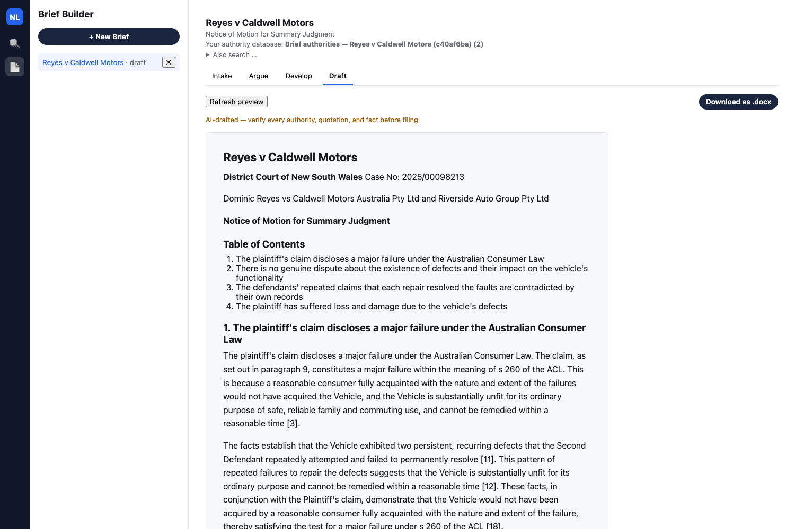
*Draft tab: the finished motion, four arguments deep, the state the walkthrough below ends up at*

## The case

Dominic Reyes bought a new Caldwell Trailmaster GX SUV for $58,240. It went back to the dealer thirteen times in sixteen months for the same two recurring faults — an instrument cluster fault and a front suspension noise — neither of which the dealer ever permanently fixed. The plaintiff's motion seeks summary judgment under UCPR r 13.1 on the theory that the defendants' own, undisputed service records already establish a major failure under the Australian Consumer Law as a matter of law. The case is fictional — a real decision's fact pattern with every identifying detail changed — built the same way as the fixture pair used in [Part 3](/posts/agenticaiforprofessionals3/).

## Beat 1 — Intake: upload, case theory, and a generated summary

Uploading the statement of claim directly produces a rename-suggestion box, then a real generated Intake Summary. The caption, parties, key facts, and attorney notes are all pulled from the uploaded pleading.

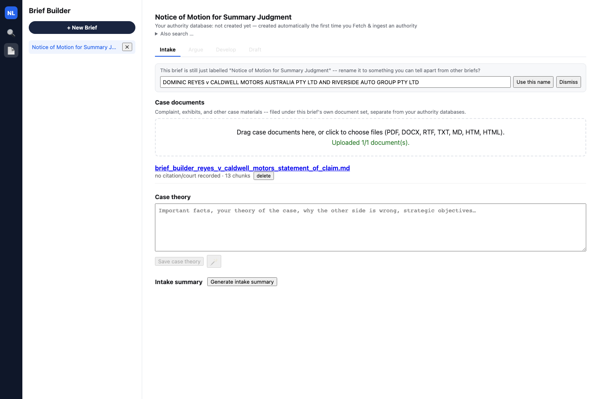
*The rename-suggestion box right after upload*

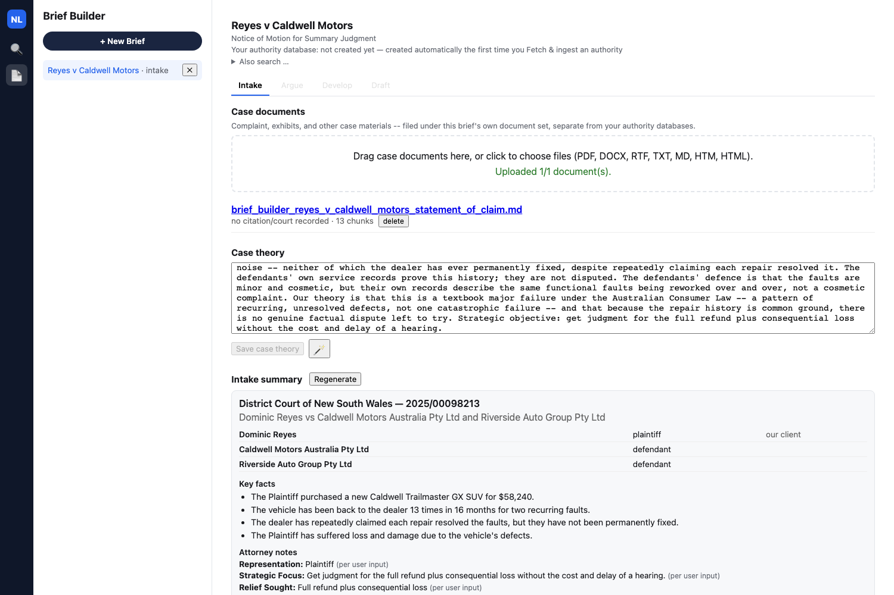
*Full generated Intake Summary — caption, parties table, key facts, attorney notes*

## CASE THEORY

``` text
We act for the plaintiff, Dominic Reyes. He bought a new Caldwell Trailmaster GX SUV for $58,240 and it has been back to the dealer 13 times in 16 months for the same two recurring faults -- an instrument cluster fault and a front suspension noise -- neither of which the dealer has ever permanently fixed, despite repeatedly claiming each repair resolved it. The defendants' own service records prove this history; they are not disputed. The defendants' defence is that the faults are minor and cosmetic, but their own records describe the same functional faults being reworked over and over, not a cosmetic complaint. Our theory is that this is a textbook major failure under the Australian Consumer Law -- a pattern of recurring, unresolved defects, not one catastrophic failure -- and that because the repair history is common ground, there is no genuine factual dispute left to try. 

Strategic objective: get judgment for the full refund plus consequential loss without the cost and delay of a hearing.
```

Every key fact is verified as an exact substring of the uploaded document before it is ever shown. A fact that can't be matched gets dropped rather than displayed — the same non-negotiable citation-grounding rule from [Part 2](/posts/agenticaiforprofessionals2/) applied to a pleading instead of a case database.

## Beat 2 — Argue: candid, ranked arguments

From the case theory, the app proposes five arguments and ranks them, with three selected:

1. The plaintiff's claim discloses a major failure under the Australian Consumer Law — *selected*
2. There is no genuine dispute about the existence of defects and their impact on the vehicle's functionality — *selected*
3. The defendants' repeated claims that each repair resolved the faults are contradicted by their own records — *selected*
4. The plaintiff has suffered loss and damage due to the vehicle's defects
5. The defendants have breached their statutory warranty obligations under the Australian Consumer Law

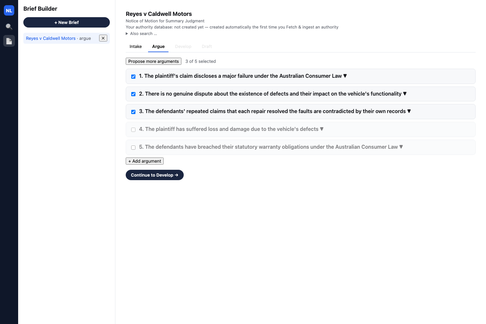
*Argue tab: three of five arguments selected*

No manual rewriting this run — arguments 1 through 3 go into Develop exactly as the LLM proposed them, wording and all.

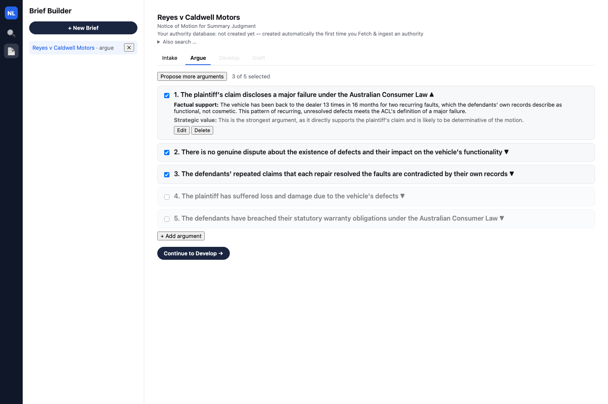
*Argument 1 expanded, showing its real factual support and strategic value*

## Beat 3 — Develop argument 1: search NSW Caselaw the way a non-specialist would

The Develop tab starts honestly empty for a fresh brief.

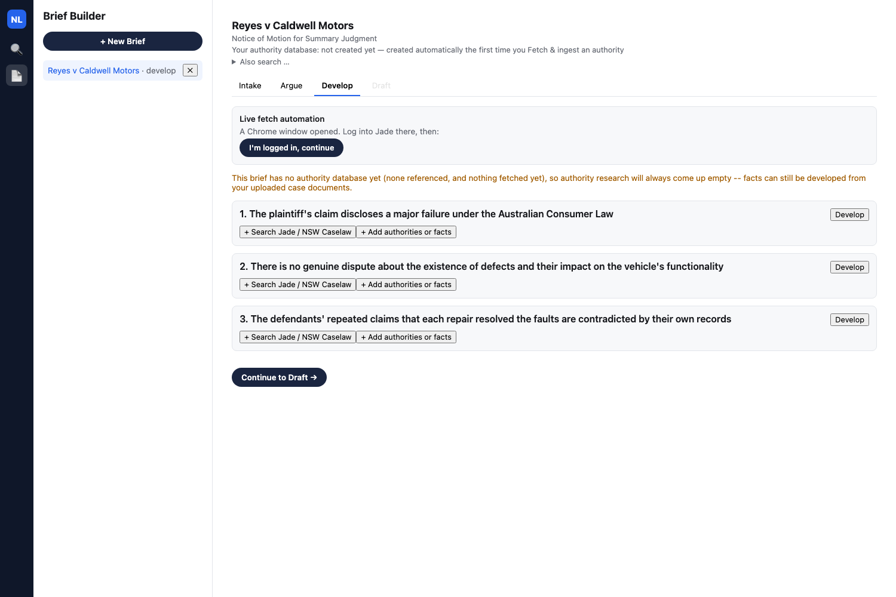
*Develop tab before any authority has been fetched — three argument cards, no authority database yet*

Searching NSW Caselaw for the target case deliberately avoids two traps a real non-specialist would actually hit: typing the case's own name, which nobody would know in advance, and the colloquial American term "lemon law," which NSW Caselaw's live keyword search handles badly — a separately-verified search for "NSW car lemon laws" turns up *Regina v Lemon* [2000] NSWCCA 232, a defendant literally surnamed Lemon, and nothing on point. Typing the plain-English `defective motor vehicle` instead returns a real, on-topic result set with the target case as the **second** hit:

> Ismail v Nissan Motor Co (Australia) Pty Limited & anor [2014] NSWCATCD 189
>
> **McNally v Central Coast Automotive Pty Ltd t/as Gosford Nissan [2025] NSWCATCD 111**
>
> Morissi v Syed [2022] NSWCATAP 162

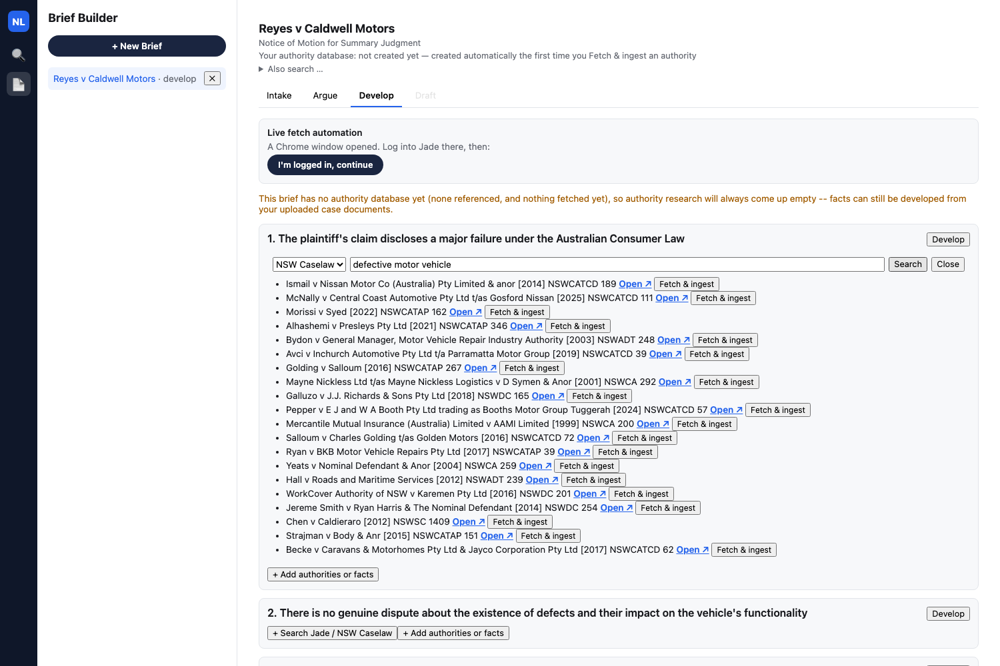
*NSW Caselaw search results for "defective motor vehicle" — McNally as the second hit, every other result genuinely on-topic too*

Clicking **Fetch & ingest** pulls the live judgment into this brief's own authority database, lazily creating it on the spot, and re-runs Develop on argument 1 automatically. The top-of-page banner tracks the database's real, running count from here on: "Brief authorities — Reyes v Caldwell Motors (c40af6ba) (1)" — the `(c40af6ba)` suffix is real collection-name disambiguation, not a bug, kicking in whenever another collection already claims the same name.

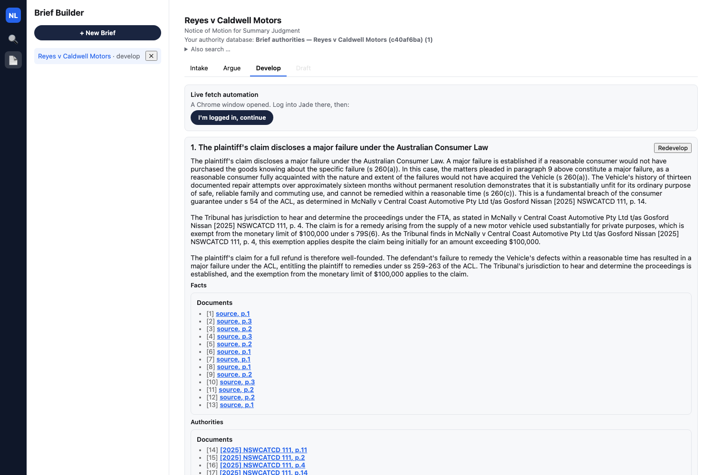
*Develop tab: authority database now shows (1), argument 1 auto-developed*

Redeveloping argument 1 once the authority database has settled produces its full, real grounded reasoning, citing McNally directly for the test the Appeal Panel actually applied:

> The plaintiff's claim discloses a major failure under the Australian Consumer Law... The principles established in McNally v Central Coast Automotive Pty Ltd t/as Gosford Nissan [2025] NSWCATCD 111 provide further guidance on the test for a major failure. The Appeal Panel in that case held that a major failure may be constituted by one defect or a series of specific or individual defects which, when taken as a whole, constitute a major failure...

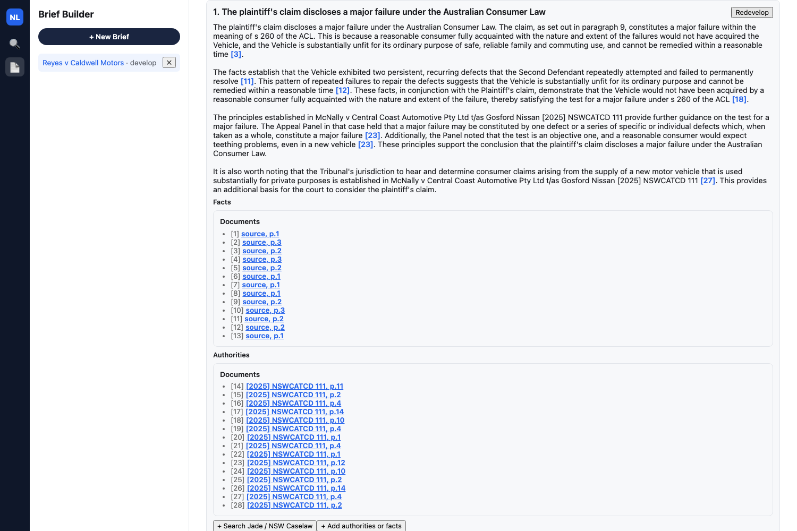
*Argument 1's full grounded reasoning*

## Beat 4 — Develop argument 2: also grounds on McNally alone

Clicking **Develop** on argument 2 grounds again — McNally's judgment is long and substantive enough to bear on more than one argument in this brief:

> The Defendant's assertion that there is a genuine dispute about the existence of defects and their impact on the Vehicle's functionality is without merit... The Tribunal's decision in McNally v Central Coast Automotive Pty Ltd t/as Gosford Nissan [2025] NSWCATCD 111 supports this conclusion. While the Tribunal ultimately found that the applicant had failed to establish that the consumer guarantee under s 54 of the ACL had been breached, the fact that the Tribunal noted the existence of faults with the vehicle and the applicant's reasonable attempts to have it repaired underscores the complexity of the dispute...

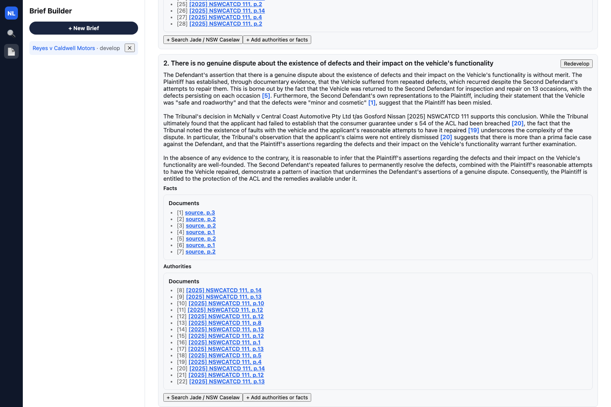
*Argument 2's full grounded reasoning*

That candidly includes an unfavourable detail about McNally — the Tribunal there actually found *against* the applicant on the substantive point. Nothing is filtered for favourability before it goes into the reasoning.

## Beat 5 — Develop argument 3: ungrounded, and a new kind of help

Argument 3 is really about the evidentiary weight of the defendants' own service records, not the ACL's substantive "major failure" test McNally's text is actually about, so developing it comes back honest:

> No supporting authority found in your authority database for this argument.

Right below that, a feature new to this build: a second section pulls related cases and legislation straight out of the citation graph of documents already sitting in the authority database — no search, nobody typed anything:

> Related cases/legislation found via the citation graph of documents already in your authority database:
>
> Khan v Kang · Prendergast v Western Murray Irrigation Ltd · Collins v Urban · Resource Pacific Pty Ltd v Wilkinson · P v Child Support Registrar · Cary Boyd v Agrison Pty Ltd · Australian Rong Hua Fu Pty Ltd v Ateco Automotive · Stephens v Chevron Motor Court Ltd — each with its own **Open ↗** and **Fetch & ingest**

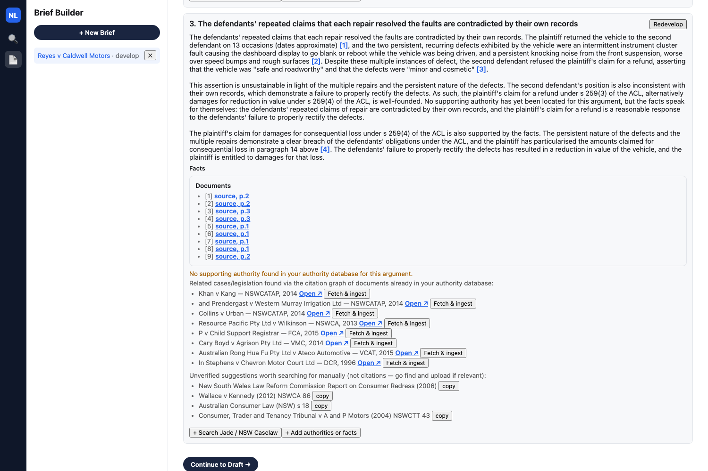
*Argument 3, ungrounded: the new citation-graph leads panel alongside the older manual-search suggestions*

Nobody searched for any of these — the app regex-extracts every case-name-and-citation pair McNally's own judgment text mentions, and whenever a develop call comes back ungrounded, offers whichever of those aren't already ingested anywhere in the app as one-click leads. The older "search terms worth trying manually" suggestions still appear underneath, unchanged — generic LLM-guessed terms, not real citations, clearly a different tier of trust from the citation-graph leads sitting above them.

## Beat 6 — Follow the citation the long way: from McNally to Safi

None of the eight leads above is squarely the case McNally's own reasoning leans on most. Following that one down by hand — reading the source, then searching for it by name — shows the leads panel is a shortcut for real legal research, not a replacement for it.

Clicking McNally's citation marker in argument 1's Authorities list opens an in-app split-pane preview: the pane loads the real judgment text, synthesized from the extracted chunk text since McNally has no locally stored file, scrolled straight to the cited page, with an **Open original ↗** link to the real `caselaw.nsw.gov.au` page.

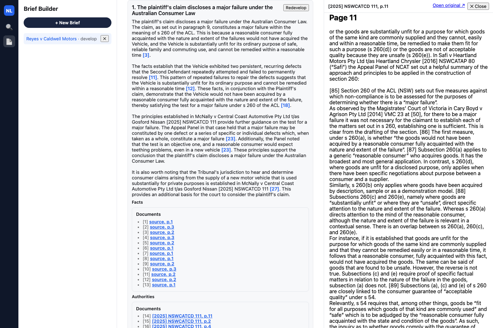
*In-app split-pane preview for a live-fetched authority citation, with "Open original ↗"*

Opening the original confirms the lead independently — the real page's own "Cases Cited" metadata block lists it directly:

> Cases Cited:
> Crooks v Hyundai Motor Company Australia Pty Ltd [2023] NSWCATCD 29
> Edwards v Caravan v RV Central Pty Ltd [2022] NSWCATD 26
> Safi v Heartland Motors Pty Ltd t/as Heartland Chrysler [2016] NSWCATAP 80

Reading the judgment text itself turns up the same case named directly at McNally's own paragraph 42:

> In *Safi v Heartland Motors Pty Ltd t/as Heartland Chrysler* [2016] NSWCATAP 80 ("Safi") the Appeal Panel of NCAT set out a helpful summary of the approach and principles to be applied in the construction of section 260.

...and, further down at paragraph 43, quoting Safi's own paragraph 101:

> [101] 1. A major failure may be constituted by one defect or a series of specific or individual defects which, when taken as a whole, constitute a major failure.

Searching NSW Caselaw for Safi by name — no longer specialist knowledge at this point, just a name read off a real page two steps ago — returns it as the real top hit, and **Fetch & ingest** adds it to the brief's authority database too.

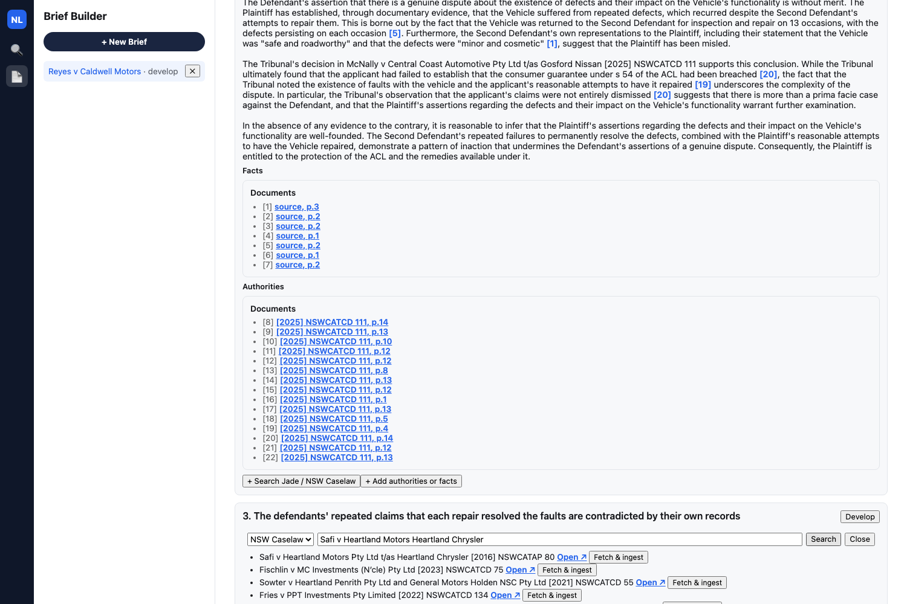
*NSW Caselaw search results for Safi*

Redeveloping argument 3 once more, now that both McNally and Safi are in the database, still comes back honestly ungrounded — not a bug. Neither judgment discusses the evidentiary weight of a defendant's own service records; both are about the substantive ACL tests, a different legal question from what this argument's own heading actually asks. Having more authorities sitting in the database doesn't manufacture relevance where there isn't any. Re-opening the search panel and searching "McNally" again shows **✓ Already ingested** in place of a live "Fetch & ingest" button.

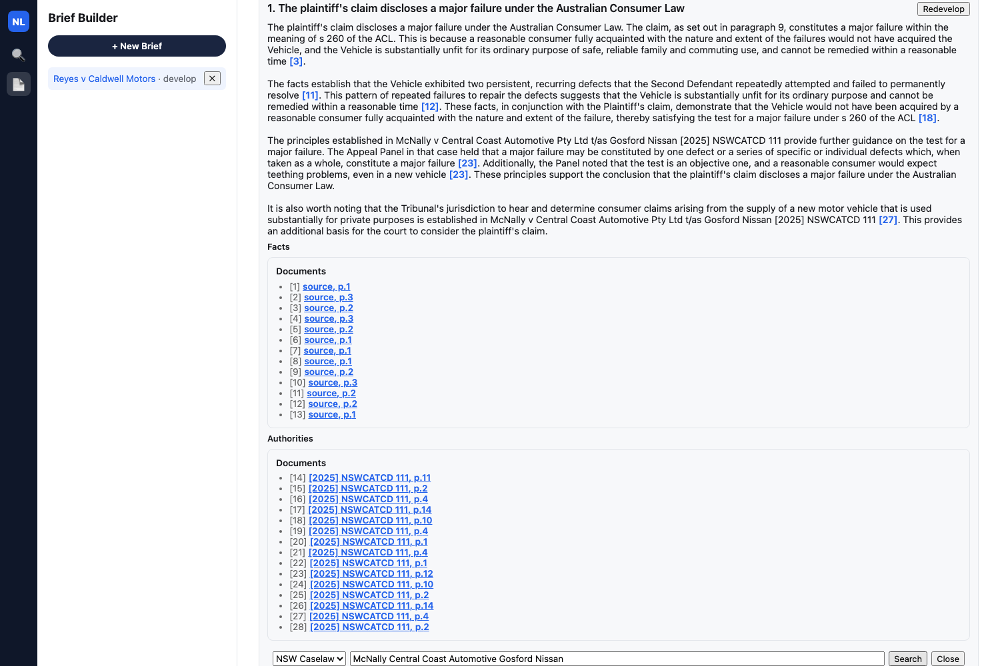
*Argument 1's grounded reasoning again, and a search panel showing "✓ Already ingested" for a lead already in this brief's authority database*

## Beat 7 — A fourth argument, grounded on both authorities together

Back in Argue, re-selecting argument 4 ("The plaintiff has suffered loss and damage due to the vehicle's defects") brings a fourth card into Develop, alongside the three already developed.

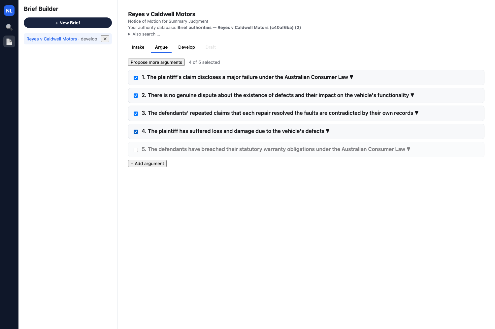
*Argue tab: a fourth argument re-selected*

Developing it grounds immediately, on both authorities at once — this heading squarely matches what McNally and Safi each actually hold, and both were already sitting in the shared authority database from Beats 3 and 6, with no fetch done specifically for this argument:

> The Plaintiff's loss and damage due to the vehicle's defects give rise to a legitimate claim against the First and Second Defendants under the Australian Consumer Law (ACL)... as set out in Safi v Heartland Motors Pty Ltd t/as Heartland Chrysler [2016] NSWCATAP 80, where the Tribunal concluded that losses will only be recoverable if there is a causal connection between the breach and the loss which is reasonably foreseeable... The Plaintiff's claim is not subject to the monetary limit of $100,000... as stated in McNally v Central Coast Automotive Pty Ltd t/as Gosford Nissan [2025] NSWCATCD 111... In Safi v Heartland Motors Pty Ltd t/as Heartland Chrysler [2016] NSWCATAP 80, the Tribunal found that the applicant's losses were not recoverable because they were costs that resulted from choices the applicants freely made, but that is not the case here, as the Plaintiff's losses were directly caused by the vehicle's defects.

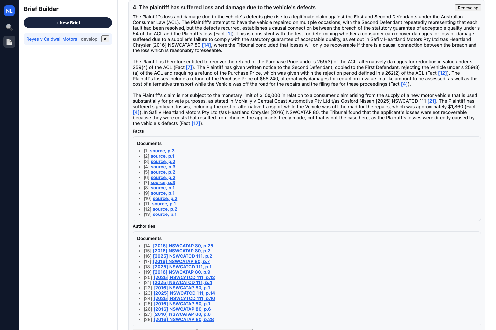
*Argument 4's full grounded reasoning, citing both McNally and Safi, including an unfavourable Safi holding distinguished on its facts*

Note again what candour looks like here: an unfavourable Safi holding — losses from the applicant's own free choices weren't recoverable there — is cited and distinguished on its facts, not quietly left out.

## Beat 8 — Draft: the final motion

The generated draft includes the caption, a Table of Contents covering all four selected arguments, all four arguments' reasoning in full — three grounded with real citations, one an honest "no supporting authority," the app gating drafting only on every selected argument having *some* reasoning, not on every argument being grounded — and a Table of Authorities built from the same two real citations:

```
## Table of Authorities

[2016] NSWCATAP 80
[2025] NSWCATCD 111
```


*Draft tab: full rendered motion, Table of Authorities*

Both of those citations are cases this walkthrough found live — one by a plain-English search anyone could type, the other by actually reading what the first one cited.

## The complete arc

Search NSW Caselaw the way someone with no specialist vocabulary actually would, fetch the case that turns up, let two more arguments ground on it before anyone goes looking further, then read that judgment's own reasoning closely enough to follow what it leans on into a second case — with a shortcut now sitting right there in the ungrounded state offering the same leads a careful reader would eventually find by hand, and a fourth argument added afterward that grounds immediately because the authority pool it needs was already built. Every step above is real output from the live app, not staged copy. The behavior worth naming is the same one from every prior beat in this series: the app never fabricates a citation to fill a gap, whether that gap is a single argument with nothing to say or a citation-graph lead that only points *near* the case actually worth following. When the research is not there, it says so; when it is, it hands back exactly what a person would have found doing the work themselves — just faster.
