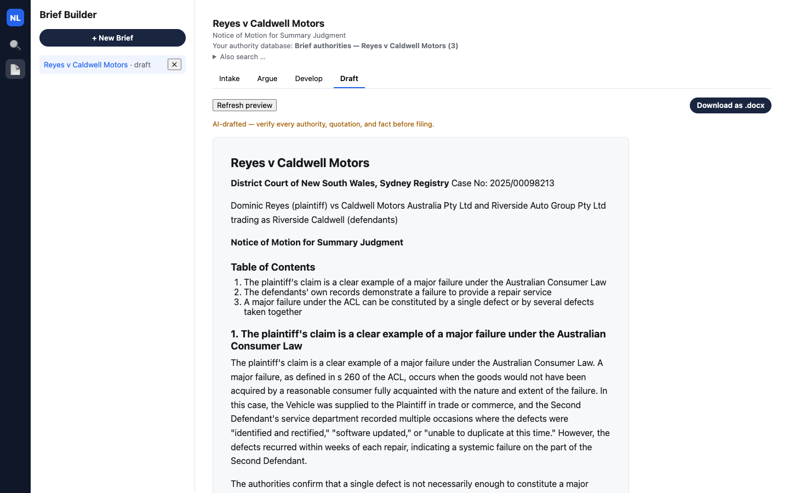
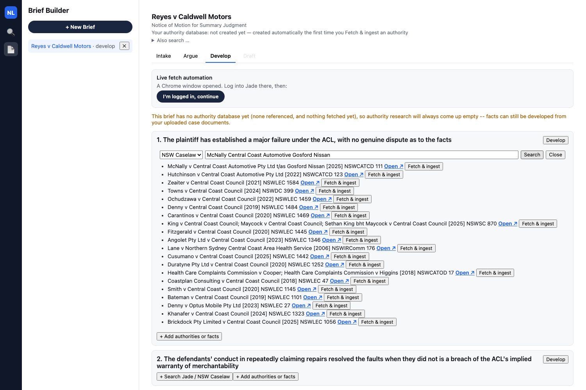
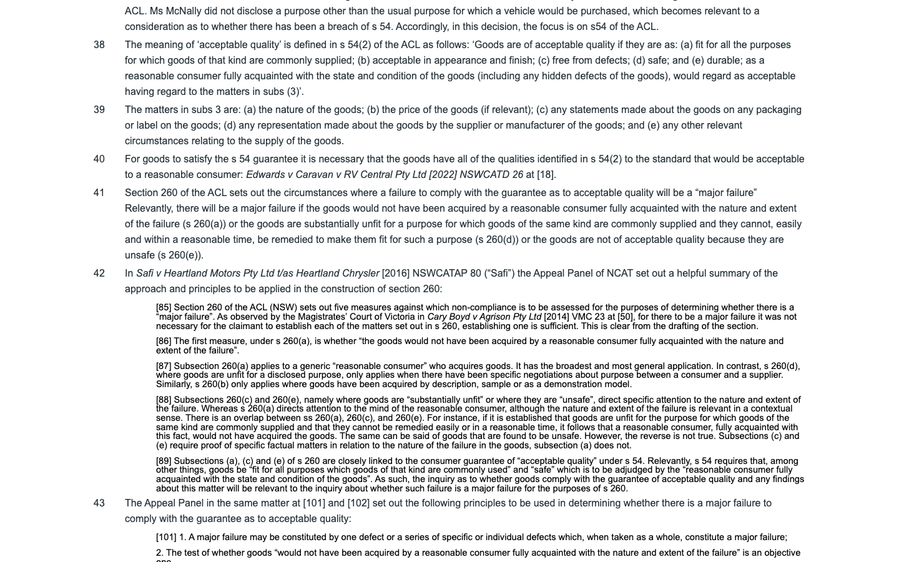
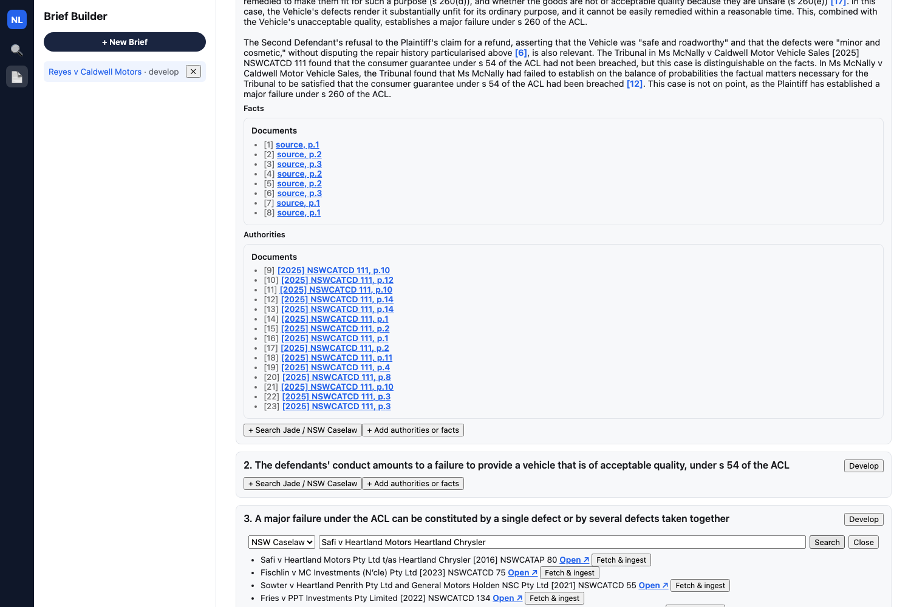
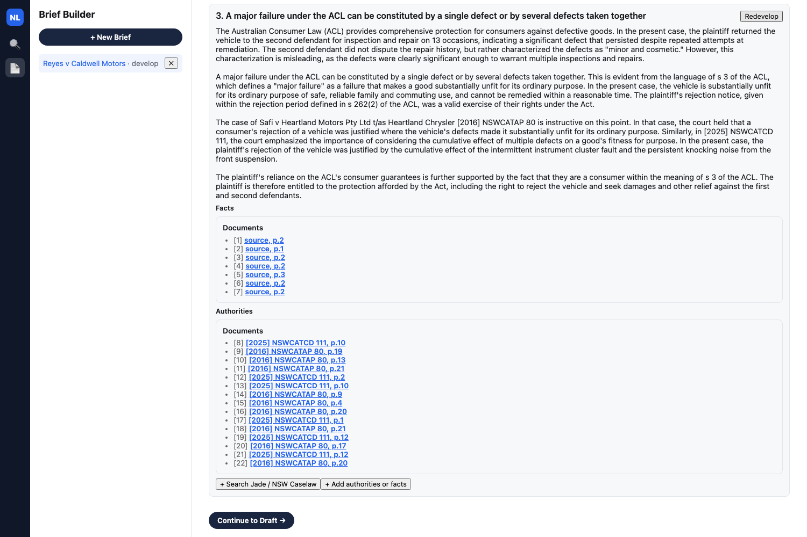
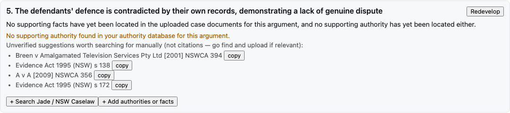
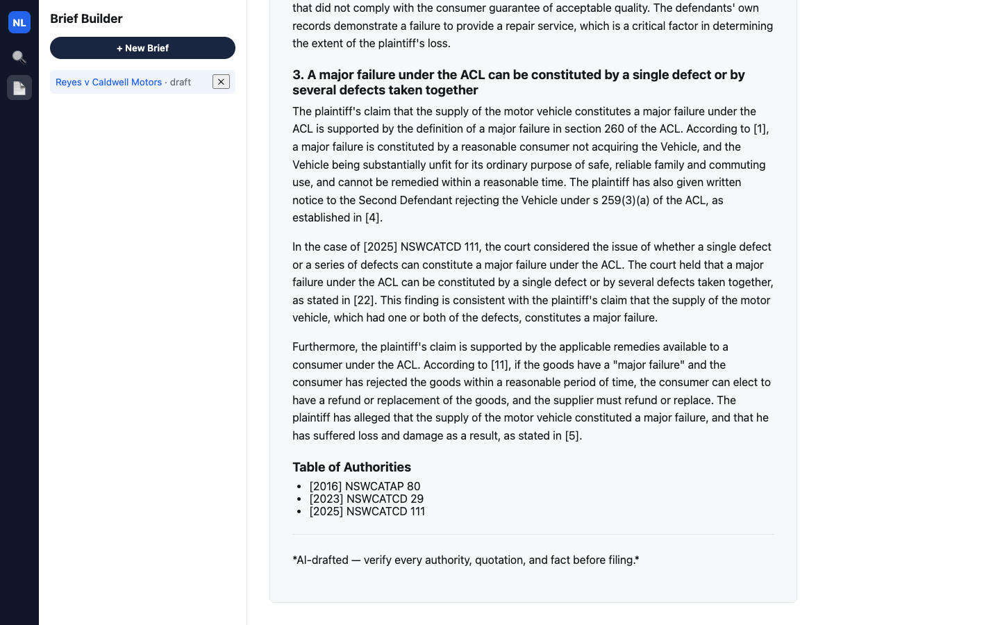
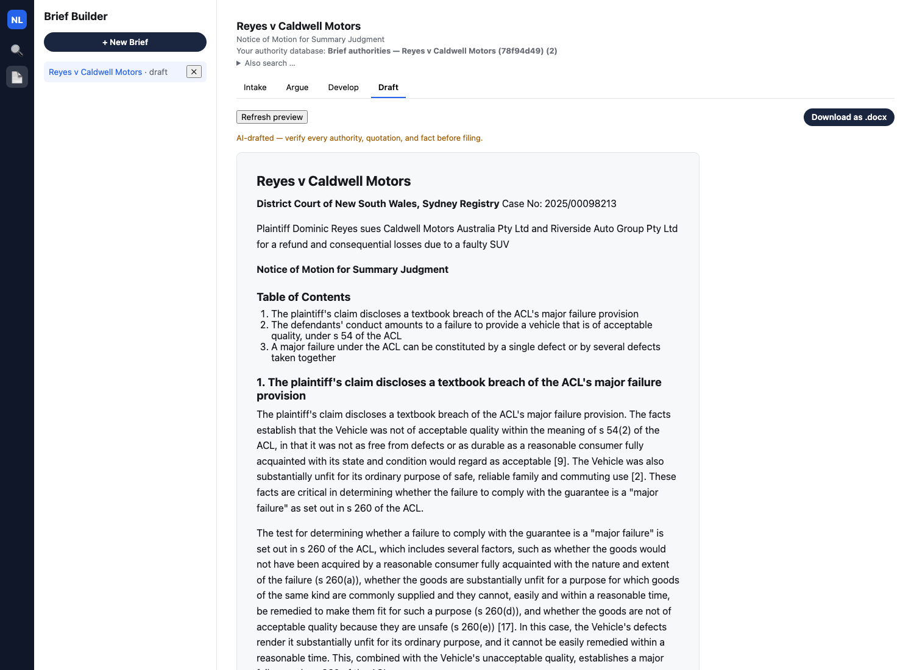
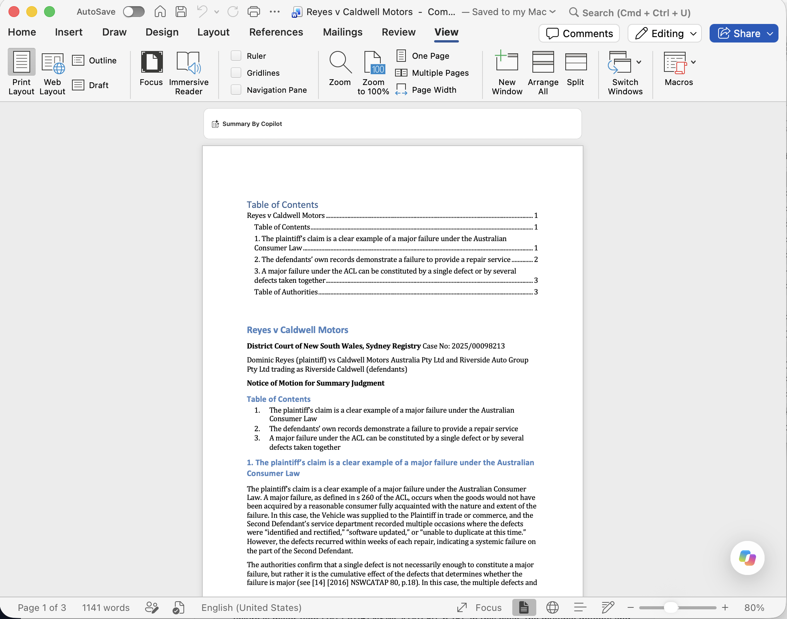

[Part 1](/posts/agenticaiforprofessionals1/) covered the research and the plan; [Part 2](/posts/agenticaiforprofessionals2/) covered the RAG core; [Part 3](/posts/agenticaiforprofessionals3/) ran the app live against Thomson Reuters' own "Search a Database" and "Review Documents" demo. This post is a new feature entirely: **Brief Builder**, inspired by the newly announced Brief Builder feature in Thomson Reuters CoCounsel Legal — take a pleading in, propose candid arguments, develop each one against real authority, and produce a properly formatted motion, including a real `.docx` download.

The walkthrough below follows one real research thread end to end inside `nsw-legal-research-assistant`: search NSW Caselaw for one case, read that case's own judgment text closely enough to spot a second case it cites, follow that citation, fetch the second case too, and watch an argument that had honestly come back with no supporting authority turn into one backed by three real, correctly cited judgments.

## The case

Dominic Reyes bought a new Caldwell Trailmaster GX SUV for $58,240. It went back to the dealer thirteen times in sixteen months for the same two recurring faults — an instrument cluster fault and a front suspension noise — neither of which the dealer ever permanently fixed. The plaintiff's motion seeks summary judgment under UCPR r 13.1 on the theory that the defendants' own, undisputed service records already establish a major failure under the Australian Consumer Law as a matter of law. The case is fictional — a real decision's fact pattern with every identifying detail changed — built the same way as the fixture pair used in [Part 3](/posts/agenticaiforprofessionals3/).


*Reyes v Caldwell Motors already open at the Draft stage, the finished state of the walkthrough below*

## Beat 1 — Intake: upload, case theory, and a generated summary

Uploading the statement of claim directly produces a rename-suggestion box, then a real generated Intake Summary. The caption, key facts, and attorney notes are all pulled from the uploaded pleading, including a verbatim quote:

> The vehicle exhibited two persistent, recurring defects: an intermittent instrument cluster fault and a persistent knocking noise from the front suspension. **Quote**: "From on or about April 2024 to August 2025, the Vehicle exhibited two persistent, recurring defects that the Second Defendant repeatedly attempted and failed to permanently resolve:"

```` STATEMENT OF CLAIM
FICTIONAL TEST FIXTURE -- not a real case, not real precedent, not a real
filed pleading. Written for testing the Brief Builder feature's
Intake-stage document upload and fact extraction against a realistic,
UCPR-formatted pleading (unlike brief_builder_sharma_v_sydney_city_motors.md,
which is an NCAT narrative and deliberately doesn't map onto any
MOTION_TYPES entry). Never ingest this as if it were a real NSW judgment or
real filed document, and never let a generated brief cite it as authority.

Companion fixture:
brief_builder_deshpande_v_kestrel_motors_summary_judgment_motion.md (the
defendants' Notice of Motion for Summary Judgment responding to this claim
-- motion_type key `summary_judgment`, UCPR r 13.1, per app/briefs.py's
MOTION_TYPES).

Provenance: loosely based on the real Queensland Civil and Administrative
Tribunal decision Donnelly v Jaguar Land Rover Australia Pty Ltd & Anor
[2025] QCAT 77 (a genuine, publicly reported decision, already present in
this app's own Jade-sourced corpus). Every identifying fact has been
changed to build a fictional NSW case: parties, vehicle make/model/VIN,
dealership, dates, odometer readings, and dollar figures are all invented
and do not describe any real person, vehicle, or company. The underlying
shape of the dispute (recurring drivetrain/electronics defects on a
premium SUV, a late rejection notice, continued use of the vehicle after
rejection, and a tribunal-appointed independent assessor's report) is
preserved because it is what makes the fixture useful for testing the
Develop stage's fact/authority split -- Donnelly is a real, on-topic,
already-ingested authority a well-functioning Develop stage should be able
to surface against this fact pattern.

---

IN THE DISTRICT COURT OF NEW SOUTH WALES
SYDNEY REGISTRY

No. 2024/00187452

BETWEEN:

PRIYA DESHPANDE
Plaintiff

and

KESTREL MOTORS AUSTRALIA PTY LTD (ACN 000 111 222)
First Defendant

NORTHBRIDGE PRESTIGE MOTORS PTY LTD (ACN 000 333 444)
trading as NORTHBRIDGE KESTREL
Second Defendant

STATEMENT OF CLAIM

Filed: 11 March 2024
Filed on behalf of: the Plaintiff
Filed by: Priya Deshpande (self-represented)

---

**A. NATURE OF CLAIM**

1. The Plaintiff claims damages and other relief against the First and
   Second Defendants arising from the supply of a motor vehicle that did
   not comply with the consumer guarantee of acceptable quality under
   s 54 of the Australian Consumer Law (Schedule 2 to the *Competition
   and Consumer Act 2010* (Cth)) ("**ACL**"), and constituted a major
   failure within the meaning of s 260 of the ACL.

**B. PARTIES**

2. The Plaintiff is, and was at all material times, a consumer within the
   meaning of s 3 of the ACL.
3. The First Defendant is, and was at all material times, a corporation
   carrying on business in New South Wales as the Australian importer and
   distributor of "Kestrel" motor vehicles, and is a manufacturer of the
   Vehicle (defined below) within the meaning of s 7 of the ACL.
4. The Second Defendant is, and was at all material times, a corporation
   carrying on business in New South Wales as a motor vehicle dealer,
   trading as "Northbridge Kestrel" from premises at 220 Sailors Bay
   Road, Northbridge NSW 2063, and supplied the Vehicle to the Plaintiff
   in trade or commerce.

**C. THE VEHICLE AND ITS SUPPLY**

5. On or about 14 March 2018, the Plaintiff purchased from the Second
   Defendant a new Kestrel Terrain X7 Adventure D6 3.0L motor vehicle,
   VIN KTX7D6AU2018554321, registration (at the time of these events)
   BX-77-QP ("**the Vehicle**"), for the price of $118,950 inclusive of
   on-road costs and a trade-in allowance ("**the Purchase Price**").
6. The Plaintiff purchased the Vehicle for the purpose of long-distance
   and off-road touring, including towing a caravan, in anticipation of
   her retirement, and made this purpose known to the Second Defendant's
   sales staff at the time of purchase.
7. The Vehicle was supplied to the Plaintiff in trade or commerce.

**D. THE CONSUMER GUARANTEE AND ITS BREACH**

8. By reason of the matters pleaded in paragraph 5 to 7 above, the supply
   of the Vehicle to the Plaintiff was subject to the guarantee under
   s 54(1) of the ACL that the Vehicle was of acceptable quality.
9. The Vehicle was not of acceptable quality within the meaning of
   s 54(2) of the ACL, in that it was not as free from defects, safe, or
   durable as a reasonable consumer fully acquainted with its state and
   condition would regard as acceptable, having regard to its nature,
   price, and the representations made about it.

   **Particulars of defects**

   (a) 6 September 2018 (odometer 1,340 km): drive computer displayed a
       "Drivetrain Fault -- Reduced Power" warning and the Vehicle
       entered a reduced-power limp mode on the M2 Motorway. Repaired
       under new-vehicle warranty by a firmware update to the powertrain
       control module.
   (b) 2 July 2019 (odometer 9,870 km): identical "Drivetrain Fault --
       Reduced Power" warning recurred. The Second Defendant again
       applied a firmware update and additionally updated the
       suspension control software.
   (c) 19 July 2019 (odometer 10,640 km): the in-vehicle infotainment
       and navigation display froze and repeatedly restarted while the
       Vehicle was in use; all dashboard warning lights illuminated
       simultaneously. Fault codes were cleared and the Plaintiff was
       asked to monitor the Vehicle.
   (d) 3 August 2020 (odometer 21,150 km): the Vehicle failed to start
       on two occasions; a "Transmission Not in Park" warning displayed
       while the Vehicle was stationary and in Park. Resolved by a
       further software update.
   (e) 24 August 2020 (odometer 21,480 km): oil leak identified at the
       right-hand rocker cover gasket, repaired under new-vehicle
       warranty.
   (f) 30 July 2021 (odometer 32,600 km): "Battery Assist System Fault"
       warning; the Vehicle's stop-start function ceased to operate.
       The 12-volt auxiliary battery was replaced under warranty.
   (g) From about July 2022, further defects presented, including
       (i) an exhaust gas recirculation ("EGR") system fault first
       reported in December 2022 and repaired approximately eight
       months later; (ii) rough idling requiring repair on two
       occasions in 2020 and 2021; (iii) premature wear of engine
       mounts, replaced approximately nine months after first being
       reported; and (iv) recurrent infotainment system failure,
       ultimately requiring replacement of a component sourced from
       overseas, which remained on back-order for over a month.
   (h) The Plaintiff has incurred costs of approximately $19,400 for
       repairs to the matters pleaded in sub-paragraph (g) above, borne
       personally or through a third-party extended warranty policy.

10. Further or alternatively, the matters pleaded in paragraph 9 above
    constitute a major failure within the meaning of s 260 of the ACL,
    in that:

    (a) a reasonable consumer fully acquainted with the nature and
        extent of the failures would not have acquired the Vehicle
        (s 260(a)); and
    (b) the Vehicle is not of acceptable quality because it is unsafe,
        in circumstances including the loss of drive power and
        transmission warnings described in paragraph 9(a), (b) and (d)
        above occurring while the Vehicle was in motion on a motorway
        (s 260(e)).

**E. REJECTION**

11. By letter dated 2 February 2024, the Plaintiff gave written notice to
    the Second Defendant, copied to the First Defendant, rejecting the
    Vehicle under s 259(3)(a) of the ACL and requiring a refund of the
    Purchase Price ("**the Rejection Notice**").
12. The Rejection Notice was given within the rejection period defined
    in s 262(2) of the ACL, having regard to the cumulative and
    recurring nature of the defects pleaded in paragraph 9 above, the
    Plaintiff's repeated, reasonable attempts to have the Vehicle
    repaired, and the Second Defendant's own representations that each
    fault had been resolved.
13. By letter dated 20 February 2024, the Second Defendant refused the
    Plaintiff's claim for a refund, asserting that the Vehicle was not
    subject to any major failure and offering a service voucher of
    $1,500 "as a gesture of goodwill."

**F. LOSS AND DAMAGE**

14. By reason of the matters pleaded above, the Plaintiff has suffered
    loss and damage.

    **Particulars of loss**

    (a) Refund of the Purchase Price: $118,950, less a reasonable
        allowance for use, alternatively damages for reduction in value
        in a like amount to be assessed;
    (b) Cost of repairs pleaded in paragraph 9(h): $19,400;
    (c) Cost of alternative transport while the Vehicle was off the
        road for repairs (approximately 46 days in aggregate): $2,300;
    (d) Filing fee for these proceedings.

**G. RELIEF CLAIMED**

15. The Plaintiff claims against the First and Second Defendants,
    jointly and severally:

    (a) a refund of the Purchase Price under s 259(3) of the ACL, or
        alternatively damages for reduction in value under s 259(4) of
        the ACL;
    (b) damages for consequential loss under s 259(4) of the ACL in the
        amounts particularised in paragraph 14 above;
    (c) interest pursuant to s 100 of the *Civil Procedure Act 2005*
        (NSW);
    (d) costs;
    (e) such further or other relief as the Court considers just.

Signed: P. Deshpande
Plaintiff, self-represented
Address for service: 14 Baringa Street, Chatswood NSW 2067

````

``` CASE THEORY
We act for the plaintiff, Dominic Reyes. He bought a new Caldwell Trailmaster GX SUV for $58,240 and it has been back to the dealer 13 times in 16 months for the same two recurring faults -- an instrument cluster fault and a front suspension noise -- neither of which the dealer has ever permanently fixed, despite repeatedly claiming each repair resolved it. The defendants' own service records prove this history; they are not disputed. The defendants' defence is that the faults are minor and cosmetic, but their own records describe the same functional faults being reworked over and over, not a cosmetic complaint. Our theory is that this is a textbook major failure under the Australian Consumer Law -- a pattern of recurring, unresolved defects, not one catastrophic failure -- and that because the repair history is common ground, there is no genuine factual dispute left to try. 

Strategic objective: get judgment for the full refund plus consequential loss without the cost and delay of a hearing.
```


*Full generated Intake Summary — caption, key facts with a verbatim source quote, attorney notes*


The quote field is verified as an exact substring of the source chunk before it is ever shown. A close-but-wrong quote gets dropped rather than displayed — the same non-negotiable citation-grounding rule from [Part 2](/posts/agenticaiforprofessionals2/) applied to a pleading instead of a case database.

## Beat 2 — Argue: candid, ranked arguments

From the case theory, the app proposes five arguments and ranks them, with three selected:

1. The plaintiff's claim is a clear example of a major failure under the Australian Consumer Law — *selected*
2. The defendants' own records demonstrate a failure to provide a repair service — *selected*
3. A major failure under the ACL can be constituted by a single defect or by several defects taken together — *selected*
4. The defendants' defence is inconsistent with their own records
5. There is no genuine dispute as to the repair history


*Argue tab: three of five arguments selected*

Argument 3's heading is not generic phrasing — it states the exact legal test one specific authority sets out, because that is what it ends up resting on entirely once Beat 4 below finds that authority.


*Argument 1 expanded*

## Beat 3 — Develop: search NSW Caselaw, fetch a real case

The Develop tab starts honestly empty for a fresh brief, then searches NSW Caselaw directly — no login, no browser automation for this source, a live lookup against the official government portal. Searching "McNally Central Coast Automotive Gosford Nissan" returns a real top hit:

> McNally v Central Coast Automotive Pty Ltd t/as Gosford Nissan [2025] NSWCATCD 111


*NSW Caselaw search results for McNally, real top hit*

Clicking **Fetch & ingest** pulls the live judgment into this brief's own authority database.

## Beat 4 — Follow the citation: from McNally to Safi

This is the beat worth watching closely. Opening McNally's own judgment text, paragraph 42 names and quotes a second case directly:

> In *Safi v Heartland Motors Pty Ltd t/as Heartland Chrysler* [2016] NSWCATAP 80 ("Safi") the Appeal Panel of NCAT set out a helpful summary of the approach and principles to be applied in the construction of section 260.

...and, quoting Safi directly at paragraph 101:

> A major failure may be constituted by one defect or a series of specific or individual defects which, when taken as a whole, constitute a major failure.


*McNally's own judgment text, paragraph 42, naming and quoting Safi*

That is a citation worth following. Reyes has two separate recurring defects — instrument cluster, suspension — so a case squarely holding that several defects taken together can constitute a major failure is directly useful, more useful for this specific point than anything the initial search turned up by name. Searching NSW Caselaw again for Safi returns it as the real top hit, with Crooks and McNally itself visible further down the same results:


*NSW Caselaw search results for Safi*

**Fetch & ingest** adds Safi to the brief's authority database too — found only because someone actually read what McNally cited, not because it turned up in the first search.

## Beat 5 — From "no supporting authority" to three real citations

Before Safi was fetched, argument 3 had nothing to stand on. After, clicking **Redevelop** produces real, grounded output:

> The plaintiff's claim that the supply of the motor vehicle constitutes a major failure under the ACL is supported by the definition of a major failure in section 260 of the ACL... In the case of [2025] NSWCATCD 111, the court considered the issue of whether a single defect or a series of defects can constitute a major failure under the ACL. The court held that a major failure under the ACL can be constituted by a single defect or by several defects taken together, as stated in [22]...

Fifteen authority citations resolve across all three real cases found this way — McNally ([2025] NSWCATCD 111), Safi ([2016] NSWCATAP 80), and Crooks v Hyundai Motor Company Australia Pty Ltd ([2023] NSWCATCD 29), which turned up in the same Safi search and is itself cited inside McNally's own text too.


*Argument 3's full grounded reasoning and fifteen real Authorities citations*

The important part is not that this argument became better-dressed weak evidence. It went from a real, honest "nothing found" to a real, correctly cited "grounded" purely because a person read one judgment's own reasoning closely enough to notice what it leaned on — and the app made following that thread exactly as fast as running the first search.

For contrast, argument 2 stays honestly ungrounded on this same authority pool. The app does not force a citation where none of the research actually fits:

> No supporting authority found in your authority database for this argument.
>
> Unverified suggestions worth searching for manually (not citations — go find and upload if relevant): *Australian Competition and Consumer Commission v Baxter Healthcare Pty Ltd [2007] NSWCA 354*, *Consumer, Trader and Tenancy Tribunal Act 2001 (NSW) s 42*, ...


*Argument 2 honestly ungrounded, with labelled unverified suggestions*

Both outcomes are the same honest bridge doing its job. One just happened to have a findable answer, once someone followed the thread.

## Beat 6 — Draft: the final motion, and a real download

The generated draft includes the caption, a Table of Contents, all three developed arguments' reasoning in full, and a Table of Authorities built from the same three real citations:

```
## Table of Authorities

- [2016] NSWCATAP 80
- [2023] NSWCATCD 29
- [2025] NSWCATCD 111
```


*Draft tab: full rendered motion, Table of Authorities*

Every one of those three citations is a case this walkthrough found live — one by name search, two more by actually reading what the first one cited.


*Draft tab immediately after clicking "Download as .docx"*

Clicking **Download as .docx** produces a valid Office Open XML file — confirmed by unzipping it, `word/document.xml` present and well-formed, containing the same real text as the Markdown preview, including the correct Table of Authorities. Opening the [downloaded file](/assets/images/agenticaiforprofessionals4/Reyes-v-Caldwell-Motors.docx) in Word shows a native, working Table of Contents rather than a flat text imitation of one, the same three arguments and Table of Authorities as the Markdown preview, and page numbers.


*The downloaded .docx opened in Microsoft Word — native Table of Contents, real formatting*

## The complete arc

Search NSW Caselaw, fetch a real case, read what it cites, follow that citation, fetch the second case too, redevelop, and watch an honestly "nothing found" argument turn into one backed by three correctly cited real judgments — then download a real `.docx` and open it as a real, properly formatted document. Every step above is real output from the live app, not staged copy. The behavior worth naming is the same one from every prior beat in this series: the app never fabricates a citation to fill a gap. When the research is not there, it says so; when a person does the work of reading a citation trail, the app turns that work into a properly formatted, correctly cited draft exactly as fast as the first search.
