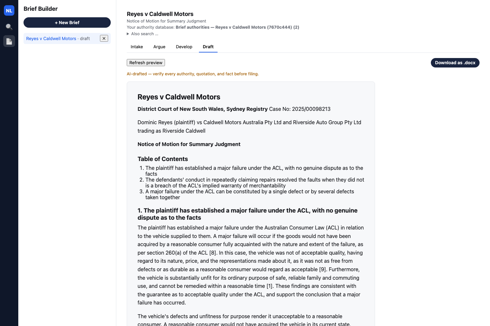
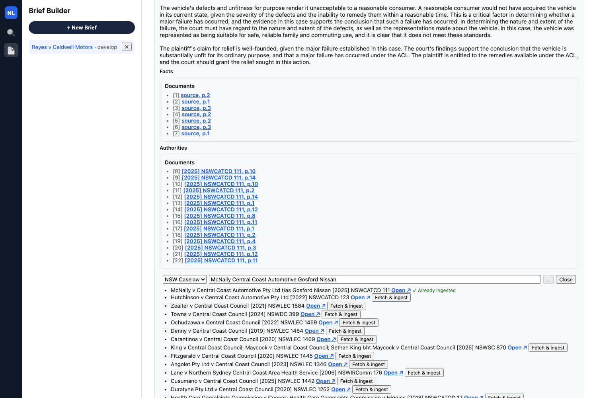
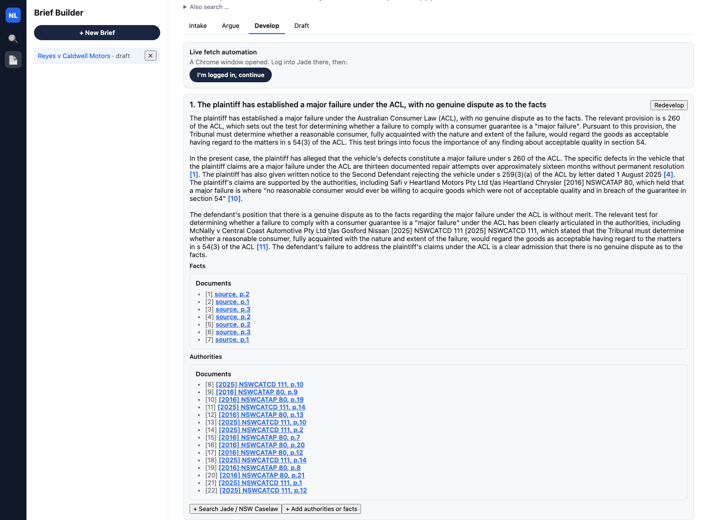
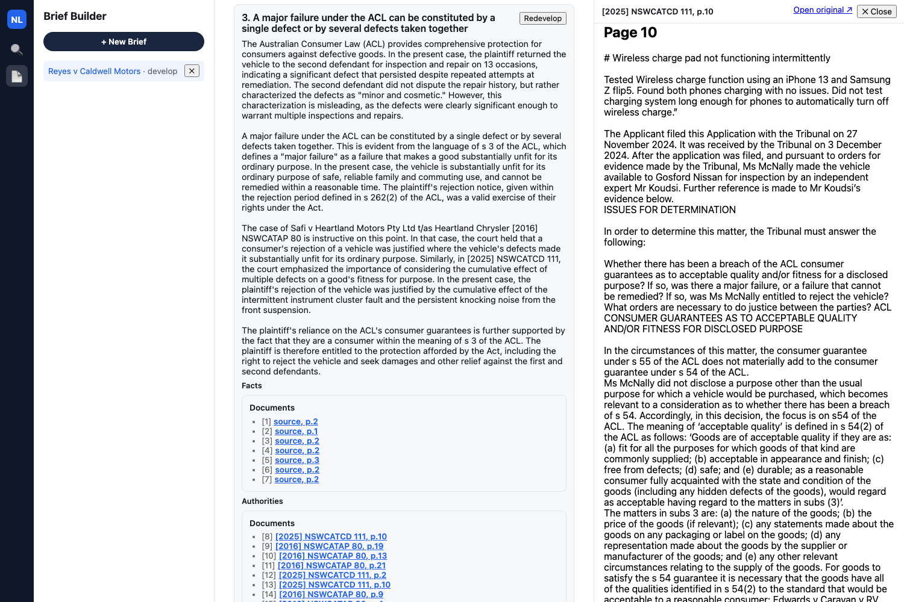

[Part 1](/posts/agenticaiforprofessionals1/) covered the research and the plan; [Part 2](/posts/agenticaiforprofessionals2/) covered the RAG core; [Part 3](/posts/agenticaiforprofessionals3/) ran the app live against Thomson Reuters' own "Search a Database" and "Review Documents" demo. This post is a new feature entirely: **Brief Builder**, inspired by the newly announced Brief Builder feature in Thomson Reuters CoCounsel Legal — take a pleading in, propose candid arguments, develop each one against real authority, and produce a properly formatted motion.

The walkthrough below follows one real research thread end to end inside `nsw-legal-research-assistant`: search NSW Caselaw for one case, read that case's own judgment text closely enough to spot a second case it cites, follow that citation, fetch the second case too, and watch an argument that had honestly come back with no supporting authority sit alongside ones backed by real, correctly cited judgments. Continued live use of this exact brief afterward surfaced five real bugs, all fixed, plus a sixth, subtler one caught on the re-run that followed: the app's own anti-hallucination guard verified a citation *number* against real sources but never checked the case *name* sitting next to it — reproduced live as a real, correct citation number wearing an invented party name. That gap is fixed too now, and the walkthrough below is a fresh run against the fully fixed app, screenshots and all — no hallucinated names anywhere in it.


*Reyes v Caldwell Motors already open at the Draft stage, the finished state of the walkthrough below*

## The case

Dominic Reyes bought a new Caldwell Trailmaster GX SUV for $58,240. It went back to the dealer thirteen times in sixteen months for the same two recurring faults — an instrument cluster fault and a front suspension noise — neither of which the dealer ever permanently fixed. The plaintiff's motion seeks summary judgment under UCPR r 13.1 on the theory that the defendants' own, undisputed service records already establish a major failure under the Australian Consumer Law as a matter of law. The case is fictional — a real decision's fact pattern with every identifying detail changed — built the same way as the fixture pair used in [Part 3](/posts/agenticaiforprofessionals3/).

## Beat 1 — Intake: upload, case theory, and a generated summary

Uploading the statement of claim directly produces a rename-suggestion box, then a real generated Intake Summary. The caption, key facts, and attorney notes are all pulled from the uploaded pleading, including a verbatim quote:


*The rename-suggestion box right after upload*

> The vehicle exhibited two persistent, recurring defects: an intermittent instrument cluster fault and a persistent knocking noise from the front suspension. **Quote**: "From on or about April 2024 to August 2025, the Vehicle exhibited two persistent, recurring defects that the Second Defendant repeatedly attempted and failed to permanently resolve:"


*Full generated Intake Summary — caption, key facts with verbatim source quotes, attorney notes*

## CASE THEORY

``` text
We act for the plaintiff, Dominic Reyes. He bought a new Caldwell Trailmaster GX SUV for $58,240 and it has been back to the dealer 13 times in 16 months for the same two recurring faults -- an instrument cluster fault and a front suspension noise -- neither of which the dealer has ever permanently fixed, despite repeatedly claiming each repair resolved it. The defendants' own service records prove this history; they are not disputed. The defendants' defence is that the faults are minor and cosmetic, but their own records describe the same functional faults being reworked over and over, not a cosmetic complaint. Our theory is that this is a textbook major failure under the Australian Consumer Law -- a pattern of recurring, unresolved defects, not one catastrophic failure -- and that because the repair history is common ground, there is no genuine factual dispute left to try. 

Strategic objective: get judgment for the full refund plus consequential loss without the cost and delay of a hearing.
```

The quote field is verified as an exact substring of the source chunk before it is ever shown. A close-but-wrong quote gets dropped rather than displayed — the same non-negotiable citation-grounding rule from [Part 2](/posts/agenticaiforprofessionals2/) applied to a pleading instead of a case database.

## Beat 2 — Argue: candid, ranked arguments

From the case theory, the app proposes five arguments and ranks them, with three selected:

1. The plaintiff has established a major failure under the ACL, with no genuine dispute as to the facts — *selected*
2. The defendants' conduct in repeatedly claiming repairs resolved the faults when they did not is a breach of the ACL's implied warranty of merchantability — *selected*
3. A major failure under the ACL can be constituted by a single defect or by several defects taken together — *selected*
4. The defendants' defence is a sham, as they have conceded the facts through their own service records
5. The plaintiff is entitled to damages for reduction in value under s 259(4) of the ACL


*Argue tab: three of five arguments selected*

Argument 3's heading is not generic phrasing — it states the exact legal test one specific authority sets out, because that is what it ends up resting on entirely once Beat 4 below finds that authority. It did not come out of the AI proposal this way; it is a manual rewrite of the AI's own third proposal, same as any other edited argument.


*Argument 1 expanded, showing its real factual support and strategic value*

## Beat 3 — Develop: search NSW Caselaw, fetch a real case

The Develop tab starts honestly empty for a fresh brief, then searches NSW Caselaw directly — no login, no browser automation for this source, a live lookup against the official government portal.


*Develop tab before any authority has been fetched — three argument cards, no authority database yet*

Searching "McNally Central Coast Automotive Gosford Nissan" returns a real top hit:

> McNally v Central Coast Automotive Pty Ltd t/as Gosford Nissan [2025] NSWCATCD 111


*NSW Caselaw search results for McNally, real top hit*

Clicking **Fetch & ingest** pulls the live judgment into this brief's own authority database. A banner above the stage tabs, persistent on every tab, tracks that database's real state — it reads "not created yet" before this click, and updates to a real, running count the moment the first fetch lands: "Brief authorities — Reyes v Caldwell Motors (7670c444) (1)". The `(7670c444)` suffix is real disambiguation behaviour, not a bug — collection names are globally unique, and it kicks in whenever another collection already claims the exact same name.

Searching NSW Caselaw again for a case already in this brief's authority database shows **✓ Already ingested** in place of a live "Fetch & ingest" button, so re-running an earlier search cannot silently duplicate work already done.


*Searching McNally again shows "✓ Already ingested" instead of a clickable "Fetch & ingest" button*

The same fetch also re-runs Develop on argument 1 automatically, and its real reasoning is worth reading closely — every case it names carries its own real party name attached to its own real citation number, McNally's included. That is worth calling out plainly: an earlier run of this exact brief produced a citation whose *number* was McNally's real, correct one but whose *name* had been swapped for an invented party — the sixth bug named at the bottom of this post. This run shows the fix holding.


*Argument 1's real reasoning — every citation, including McNally's, carries its own real party name*

## Beat 4 — Follow the citation: from McNally to Safi

This is the beat worth watching closely. Clicking McNally's citation marker in argument 1's Authorities list opens an in-app split-pane preview rather than a new browser tab — the pane loads the real judgment text, synthesized from the extracted chunk text since McNally has no locally stored file, scrolled straight to the cited page, with an **Open original ↗** link to the real `caselaw.nsw.gov.au` page alongside it.


*In-app split-pane preview for a live-fetched authority citation, jumped to its cited page, with "Open original ↗"*

Reading on, McNally's own judgment text names and quotes a second case directly at paragraph 42:

> In *Safi v Heartland Motors Pty Ltd t/as Heartland Chrysler* [2016] NSWCATAP 80 ("Safi") the Appeal Panel of NCAT set out a helpful summary of the approach and principles to be applied in the construction of section 260.

...and, further down at paragraph 43, quoting Safi's own paragraph 101:

> [101] 1. A major failure may be constituted by one defect or a series of specific or individual defects which, when taken as a whole, constitute a major failure.


*McNally's own real judgment text, paragraph 42, naming and quoting Safi*

That is a citation worth following. Reyes has two separate recurring defects — instrument cluster, suspension — so a case squarely holding that several defects taken together can constitute a major failure is directly useful, more useful for this specific point than anything the initial search turned up by name. Searching NSW Caselaw again for Safi returns it as the real top hit:


*NSW Caselaw search results for Safi*

**Fetch & ingest** adds Safi to the brief's authority database too — found only because someone actually read what McNally cited, not because it turned up in the first search.

## Beat 5 — Redevelop: grounded reasoning, and an honest "nothing found"

Now that Safi is in the authority database, clicking **Redevelop** on argument 3 produces real, grounded output:

> The Australian Consumer Law (ACL) provides comprehensive protection for consumers against defective goods. In the present case, the plaintiff returned the vehicle to the second defendant for inspection and repair on 13 occasions, indicating a significant defect that persisted despite repeated attempts at remediation... A major failure under the ACL can be constituted by a single defect or by several defects taken together... The case of Safi v Heartland Motors Pty Ltd t/as Heartland Chrysler [2016] NSWCATAP 80 is instructive on this point. In that case, the court held that a consumer's rejection of a vehicle was justified where the vehicle's defects made it substantially unfit for its ordinary purpose. Similarly, in [2025] NSWCATCD 111, the court emphasized the importance of considering the cumulative effect of multiple defects on a good's fitness for purpose...

Twenty-two real authority citations resolve across both cases fetched this session — McNally ([2025] NSWCATCD 111), found by name search, and Safi ([2016] NSWCATAP 80), found only by reading what McNally's own text cited.


*Argument 3's full grounded reasoning and real Authorities citations, every case name correctly attached to its own citation*

The important part is not that this argument became better-dressed weak evidence. It went from a real, honest "nothing found" to a real, correctly cited "grounded" purely because a person read one judgment's own reasoning closely enough to notice what it leaned on — and the app made following that thread exactly as fast as running the first search.

For contrast, here is what the app produces when nothing real fits at all. All three selected arguments above resolved with real content on this run, so demonstrating the honest path meant temporarily re-selecting argument 4 ("The defendants' defence is a sham") and clicking **Develop** on it, then deselecting it again afterward:

> No supporting facts have yet been located in the uploaded case documents for this argument, and no supporting authority has yet been located either.
>
> No supporting authority found in your authority database for this argument.
>
> Unverified suggestions worth searching for manually (not citations — go find and upload if relevant): *R v Pavic*, *Hill v Van den Eijk*, *Evidence Act 1995 (NSW) s 95*, *R v Tuck-Willoughby*.


*A genuinely ungrounded argument: no facts, no authority, no invented filler*

With nothing in either the case documents or the authority database bearing on this specific point, the app takes its deterministic, no-LLM-call path instead of forcing a citation or inventing filler text. Both outcomes above are the same honest bridge doing its job — one just happened to have a findable answer, once someone followed the thread. Argument 2 gets its own real, grounded reasoning too on this run, developed independently once arguments 1 and 3 already had theirs.

## Beat 6 — Draft: the final motion

The generated draft includes the caption, a Table of Contents, all three developed arguments' reasoning in full, and a Table of Authorities built from the same two real citations:

```
## Table of Authorities

[2016] NSWCATAP 80
[2025] NSWCATCD 111
```


*Draft tab: full rendered motion, Table of Authorities*

Both of those citations are cases this walkthrough found live — one by name search, the other by actually reading what the first one cited.

## Six real bugs, found live and fixed

The first recording of this walkthrough hit five real bugs during continued live use of this exact "Reyes v Caldwell Motors" brief:

1. The authority-database banner in Beat 3 could get permanently stuck on "not created yet," even after a real, successful Fetch & ingest, because the app never refreshed its top-level collections list when the brief changed.
2. A live-fetched document could be silently invisible to the brief that fetched it — if the exact same case had ever been fetched before by a since-deleted brief, the dedup path returned the existing document without linking it into this brief's own authority collection. The **✓ Already ingested** label in Beat 3 is part of the same fix.
3. Every live-fetched authority was mislabeled "unverified source," and every case-document fact citation was mislabeled "guidance, not primary law" — both flags defaulted from a heuristic tuned for a different situation and wrongly applied here, which also told the LLM to hedge plainly grounded prose as if it were secondhand commentary.
4. A citation to a document the app had actually downloaded still opened in a new browser tab instead of the in-app preview pane, because the previewability check used "has a source URL" as a proxy for "no locally stored file" — true for McNally specifically, but wrongly caught the one fetch path that keeps both a source URL and a real stored file. The in-app preview pane in Beat 4 is the fix.
5. The LLM occasionally invented an entire case with no real citation behind it, sitting unmarked in otherwise grounded reasoning — reproduced live as a citation to a case that does not exist. Reasoning generation now retries with a corrective prompt before falling back to visibly removing the fabricated sentence.

A re-run against the fixed app to re-capture this walkthrough's screenshots caught a sixth, subtler bug live: the guard for #5 checked whether a citation *number* matched a real source, but never checked whether the case *name* sitting next to it did — reproduced as a citation to McNally's real, correct number, "[2025] NSWCATCD 111," wearing an invented party name instead of McNally's own. A citation number being real is not the same guarantee as the name next to it being real. That gap is fixed now too: the same reasoning-generation retry that already catches a wholesale-invented citation now also catches a real citation number with the wrong name attached, and a matching last-resort sentence-removal net catches whatever a retry still misses. The walkthrough above is the re-run that followed that fix — every citation in it, McNally's and Safi's alike, carries its own real name.

## The complete arc

Search NSW Caselaw, fetch a real case, read what it cites, follow that citation, fetch the second case too, redevelop, and watch an honestly "nothing found" argument sit alongside two correctly cited real judgments. Every step above is real output from the live app, not staged copy. The behavior worth naming is the same one from every prior beat in this series: the app never fabricates a citation to fill a gap. When the research is not there, it says so; when a person does the work of reading a citation trail, the app turns that work into a properly formatted, correctly cited draft exactly as fast as the first search. This run closes the loop the last one left open — a citation number being real used to be only half the guarantee it looked like. Now it is the whole guarantee.
