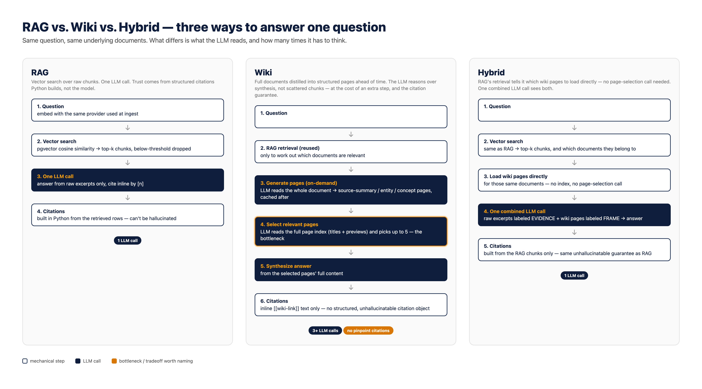

Every post in this series so far has taken [RAG](/posts/contextinjection/) as a given — [Part 2](/posts/agenticaiforprofessionals2/) built the retrieval core, [Part 4](/posts/agenticaiforprofessionals4/) demoed it live, and the whole trust mechanism from [Part 1](/posts/agenticaiforprofessionals1/) rests on citations built from raw retrieved chunks, never generated by the model. This post questions that default: is vector-similarity retrieval over raw text actually the right approach, or just the familiar one? The comparison is with a pattern this series has been using the entire time without calling it a product feature — the [`llmwiki/`](/posts/agenticaiforprofessionals1/) research wiki from Part 1, now built directly into `nsw-legal-research-assistant` itself as a second way to answer questions, plus a third approach that tries to combine both.

## The idea: turn the research method into a product feature

Part 1's `llmwiki/` pattern was never just a way to organize research notes — it's a specific claim about how to make an LLM's knowledge more reliable: don't re-read raw source material from scratch every time, distill it once into structured, typed pages (`source-summary`, `entity`, `concept`), and reason over that synthesis instead. That's exactly what a new `app/wiki/` module now does to the same NSW Caselaw documents `nsw-legal-research-assistant` already has RAG-indexed:

```python
# backend/app/wiki/generate.py
"""Generate LLM Wiki pages from a full document. On-demand: called when a
document is first queried via the wiki path, cached in the wiki_pages table
afterward.

- source-summary: A distilled summary of the document's key facts, holdings,
  and reasoning. One per document.
- entity: A real-world entity mentioned in the document (a party, a statute,
  a legal principle).
- concept: A legal concept, rule, or holding discussed."""
```

Same four-category taxonomy as the research wiki (`source-summary`, `entity`, `concept`, `comparison` — though no `comparison` pages have actually been generated yet, only the first three), same `[[wiki-link]]` cross-referencing, same idea of distillation over raw retrieval. It's stored in Postgres now instead of Markdown files, generated on-demand by the LLM the first time a document is queried, and cached afterward.

## Three pipelines for the same question



RAG's pipeline is the one [Part 2](/posts/agenticaiforprofessionals2/) already covered, with one real addition since: embed the question, pull the nearest chunks by cosine similarity, one LLM call, done — citations built afterward in Python from the retrieved rows. The addition, covered in full further down, is a second retrieval pass: once stage one has worked out which *documents* are relevant, stage two re-scans just those documents with a wider budget and a relaxed threshold, catching a chunk that's genuinely part of a relevant document but didn't win the cross-document ranking — a later page correcting an earlier one, for instance.

Wiki's pipeline reuses RAG's retrieval for exactly one thing — figuring out which *documents* are relevant, not which text — then hands off entirely to synthesized pages instead of raw chunks:

```python
# backend/app/wiki/query.py
"""The query flow:
1. Use RAG retrieval to identify which documents are relevant (reuse existing
   infrastructure — no double-embedding)
2. Ensure wiki pages exist for those documents (generate on-demand if not)
3. Build the wiki index from existing pages
4. LLM reads the index → identifies relevant pages by title/type
5. LLM reads the full content of relevant pages
6. LLM synthesizes an answer with [[wiki-link]] citations"""
```

That's two LLM calls just for retrieval-equivalent work (page-selection, then synthesis) before counting the on-demand generation call a first-time query triggers — three-plus calls in the worst case, against RAG's one.

## A bug this post found, and a bug this post caused to get fixed

This section originally documented a real, unresolved discrepancy: asked "What damages were awarded in Mason v Demasi?" — the same question [Part 4](/posts/agenticaiforprofessionals4/) asked live — RAG and Hybrid both answered **$76,459.50** while Wiki, inconsistently across different runs, sometimes answered **$176,459.50** instead. Not a rounding difference — $100,000 apart, and only one of them is what the court actually ordered. Checking the underlying document settled which: page 2's cover sheet and page 18's "revised assessment" both independently state $176,459.50 as the final, operative figure; page 4 mentions $76,459.50 only in passing, describing an earlier trial-court award the Court of Appeal itself revised upward.

That's still true. What's different now is *why* RAG and Hybrid were getting it wrong, because the actual root cause got found and fixed rather than just reported. Two compounding problems, both traced directly to source material, not guessed at:

**The page containing the correction was buried in similarity ranking.** `config.py`'s own new code comment states it precisely: "a corrected damages figure on page 18 of Mason v Demasi [2012] NSWCA 210 ranked #24 of 117 chunks within its OWN document for a direct damages question — below `rag_top_k=5` globally and below the similarity threshold, so it was never seen by the LLM, while a superseded figure from an earlier page ranked #1 and got cited as if final." Every dollar figure RAG ever quoted was a real, correctly-cited excerpt — nothing was hallucinated — but retrieval kept surfacing the *superseded* number because the *final* one, sitting in the same document, never made the cut.

**Repeated PDF boilerplate was diluting the chunks that did rank well.** Every page of this BarNet/JADE-sourced PDF opens with the same multi-line publication-info block — "BarNet publication information," a date, a publication number, a "View this document in a browser" line — before any actual case text. That block was getting embedded as part of every chunk, diluting the embedding of the one line that actually mattered (page 2's "Judgment for the appellant in the sum of $176,459.50") enough to push it further down the ranking than the real content alone would have.

Both are now fixed, and both fixes are structural, not prompt-only patches. `pdf_extraction.py` now strips any line repeating across a large fraction of a document's pages before chunking — frequency-based, not a hardcoded string list, so it generalizes past this one publisher's boilerplate. `retrieval.py` now retrieves in two stages: stage one finds which *documents* are relevant across the whole scoped pool, exactly as before; stage two re-scans just those documents with a wider budget and a relaxed threshold, since document-level relevance is already established — catching exactly the kind of later-page-correcting-an-earlier-one chunk that stage one alone was structurally incapable of surfacing. On top of both, `qa.py` and `hybrid.py`'s prompts now explicitly instruct the model: if two excerpts state different figures for what looks like the same claim, don't silently pick one — state which is final/operative if the sources make that clear.

Re-ingesting the existing PDFs to apply the boilerplate fix, then re-running every approach against the live stack, live, this session:

| | Answer |
|---|---|
| RAG | "According to [14], the damages awarded in Mason v Demasi are $176,459.50. Note: This figure is explicitly stated as the 'Judgment for the appellant' and does not appear to be subject to further revision or re-assessment in any of the provided excerpts." |
| Wiki | "According to [[Mason v Demasi [2012] NSWCA 210]], the Court of Appeal ordered judgment for the appellant in the sum of $176,459.50." |
| Hybrid | "According to [14] ([2012] NSWCA 210, p.2): View this document in a browser, the damages awarded to the appellant, Penelope Jayne Mason, was $176,459.50." |

All three, correct, independently — and `compare_approaches.py` now has an automated check built in for exactly this ("Correctness check (expects '176,459.50' in answer): RAG=True Wiki=True Hybrid=True"), so this isn't a one-off manual read, it's a committed, repeatable assertion. Worth not skipping past the rough edge in Hybrid's answer, though: "View this document in a browser" is leftover boilerplate that the frequency fix *didn't* catch, quoted verbatim into the answer because it happened to sit right next to the real figure on page 2. The stripping is frequency-based across a whole document, not a targeted removal of every publisher-chrome line on every page — a real, remaining imperfection, not a cleaned-up story.

## A second example — why the synthesis helps even when nothing's wrong

Not every advantage is a caught error. Here's the actual `source-summary` page the wiki generated for *Huang v Nazaran* [2026] NSWDC 298 — one of the two safe fixture cases from [Part 2](/posts/agenticaiforprofessionals2/), not matter-specific:

> **Huang v Nazaran [2026] NSWDC 298**
>
> **Parties**
> The plaintiff is Chenlong Huang and the defendant is Fatemeh Shahla Nazaran.
>
> **Facts**
> The parties had a dispute over noise from an air conditioning unit and unauthorized works. The matter gave rise to extensive litigation in the Local Court, District Court, and Court of Appeal. A costs assessment was made in the name of "Fatemeh Nazaran" but the judgment issued against the defendant in the name of "Fatemeh Shahla Nazaran".
>
> **Issues**
> The issue before the court is whether to vary the judgment to reflect the correct name of the defendant.
>
> **Holdings and Orders**
> The court ordered that the judgment be varied to amend the name of the defendant/judgment debtor from "Fatemeh Shahla Nazaran" to "Fatemeh Nazaran". The registrar was directed to issue an amended judgment to reflect this order. All applications for further enforcement of the amended judgment were referred to a Judicial Registrar.
>
> **Reasoning and Key Legal Principles**
> The court relied on the Uniform Civil Procedure Rules 2005 (NSW) and the implied jurisdiction of the court to correct its own records. The court noted that the entry of a judgment following the registration of costs certificates is a "ministerial act" which makes the costs certificate enforceable as a judgment but does not change its legal effect.

(Regenerated fresh for this redraft, worth noting for its own sake: the wording above differs from an earlier draft of this post that quoted the same page — different section headings, different phrasing throughout, same underlying facts. Wiki page generation is itself an LLM call, so re-running it doesn't reproduce the same text twice, only the same substance. That's expected, and the same non-determinism this series has flagged everywhere else it applies.)

A RAG chunk is, by design, roughly 800 characters of one page's text. Getting from "what happened in this case" to an answer means the LLM has to reassemble parties, issues, holdings, and orders from whichever handful of chunks happened to score highest — and if the holding and the orders live on different pages, a top-k retrieval that only pulls one of them silently gives an incomplete answer. This page already has all of it organized, written once, and reusable for every future question about this case.

## The tradeoff that used to be worse than this

This section originally reported something that cut against this whole series' central trust argument: `query_wiki()` returned `citations: []` unconditionally, every single time, regardless of `grounded: True`. [Part 1](/posts/agenticaiforprofessionals1/) called RAG grounding "the core trust mechanism, not a feature" specifically because citation *metadata* gets built in Python from the retrieved database rows, never generated by the model — and Wiki, as originally built, gave that guarantee up entirely.

That's been fixed since, and the fix is worth reading in full because of how it's described in its own code comment:

```python
@dataclass
class WikiCitation:
    """Document-level (not pinpoint) traceability for a /qa/wiki answer --
    honest about what it is: a real link to the source document a wiki page
    was generated from, not a page-number-accurate excerpt citation the way
    RAG's Citation is. See query_wiki's docstring for why /qa/wiki previously
    returned citations: [] unconditionally despite grounded: True, and why
    that was a real gap rather than a deliberate design choice."""

    wiki_page_title: str
    document_id: str
    document_title: str | None
    citation: str | None
    source_trust: str
    source_url: str | None
```

That's a direct acknowledgment, in the app's own source, that the gap this post originally documented "was a real gap rather than a deliberate design choice" — not a hedge, not a reframe, an actual admission written into the code. `/qa/wiki` now returns one `WikiCitation` per page it actually used: a real, structured, document-level link, including the same `source_trust` flag RAG and Hybrid citations already carried, so an unverified bulk-import source shows up as such through the Wiki path too, which it previously didn't. What it still isn't: page-number-accurate. RAG's `Citation` points at an exact page a browser can jump to; `WikiCitation` points at the document a synthesized page was built from, no page number, because a wiki page can draw on the whole document rather than one excerpt of it. Narrower gap than "always `[]`," but a real one still — worth stating precisely rather than either overclaiming the fix or leaving the outdated "always empty" version standing.

## Hybrid: reuse RAG's retrieval instead of re-deriving it

The fix isn't obvious until you look at where Wiki actually spends its extra calls. Nothing about combining RAG and Wiki *requires* the slow index-read-and-select step — that step exists only because Wiki, on its own, has no other way to know which pages are relevant. But Hybrid already has RAG's vector search telling it exactly which documents matter. So it skips the index entirely and loads those documents' wiki pages directly:

```python
# backend/app/rag/hybrid.py
"""Design principle: RAG chunks provide the *evidence* (verbatim text with
pinpoint citations the LLM can quote), while wiki pages provide the *frame*
(structured understanding of holdings, entities, and legal concepts that helps
the LLM reason about which evidence matters and why).

Single LLM call for the answer (unlike the Wiki path's 3+ calls), making
this only slightly slower than pure RAG while gaining wiki context."""
```

One combined prompt, both source types clearly labeled so the LLM knows which is which — with a new paragraph added since this post's first draft, direct evidence that the finding below actually fed back into the real prompt:

```python
HYBRID_SYSTEM_PROMPT = """You have access to two kinds of sources:

**A. RAW EXCERPTS** (numbered below with [N] markers) -- verbatim text from
uploaded documents, with citation metadata. Cite these inline using their
bracket marker, e.g. [1]. These are your primary evidence for factual claims.

**B. WIKI CONTEXT** (structured wiki pages below) -- synthesized summaries
and cross-referenced analysis... Use these to understand the structure of a
case... but when stating a factual claim, cite the RAW EXCERPT that supports
it rather than the wiki summary.

If two excerpts (or an excerpt and a wiki page) state different figures or
outcomes for what looks like the same claim, do not silently pick one -- a
later stage of the same proceeding (an appeal revising a trial judge's
figure, a correction) often supersedes an earlier one. State which figure is
final/operative if the sources make that clear, and say so explicitly if
they don't, rather than guessing. When stating a factual claim, still cite
the RAW EXCERPT that supports it, not the wiki summary."""
```

That last paragraph is a direct, named response to exactly the failure this post originally found in this exact spot — more on that below.

And critically, the citations returned are built from the RAG chunks only — the same Python-constructed, unhallucinatable objects as pure RAG, not from anything the wiki pages contributed:

```python
# citations from RAG chunks only — wiki pages provide context, not primary citations
citations = [Citation(marker=f"[{i}]", ...) for i, chunk in enumerate(chunks, start=1)]
```

Hybrid is the one approach that doesn't force a choice between the two properties this series has cared about most: RAG's structural citation guarantee, and Wiki's synthesized reasoning.

## Built by one agent, fixed by another

Worth being upfront about, since it's a real methodology difference from the rest of this series, and it doesn't end where it first looked like it would. The wiki module, the hybrid module, both endpoints, both MCP tools — Phase 6.6's first pass was written with OpenCode's Big Pickle model, not Claude Code, continuing the multi-agent comparison from the [Space Invaders post](/posts/invaders/). The same pattern that post found showed up again here: fast, working code that needed a debugging pass rather than arriving clean. Three real bugs surfaced during implementation — a missing `WikiPage` import that crashed `query.py` outright, a citation-matching bug fixed by stripping `[[ ]]` brackets and adding fuzzy title matching, and an Ollama timeout (120s) too short for generating wiki pages from large documents, raised to 600s.

That was where this post originally ended its methodology note. It doesn't end there anymore. Testing that Big Pickle code for this post surfaced three deeper problems no amount of debugging-pass polish had caught: the retrieval-completeness gap that produced the wrong damages figure, Wiki's unconditional `citations: []`, and the bare-citation wiki-page-title bug that broke Q1. All three got fixed — not by Big Pickle, but in a rewrite by Claude Code running Sonnet 5, touching core RAG files (`retrieval.py`, `qa.py`, `pdf_extraction.py`) that Big Pickle's original pass never went near. The fixes are documented inline as direct responses to this investigation, not vague improvements — `retrieval.py`'s two-stage retrieval cites "a corrected damages figure on page 18 of Mason v Demasi [2012] NSWCA 210" by name in its own code comment, and `WikiCitation`'s docstring explicitly names the gap this post reported and calls it "a real gap rather than a deliberate design choice."

That's a different shape of multi-agent story than the Space Invaders post told: not three agents building the same thing in parallel for comparison, but one agent's real output, tested in public, revised by a second agent based on exactly what the testing found. The blog post and the codebase fed each other rather than one just describing the other.

## The real comparison, before and after the fix

`scripts/compare_approaches.py` runs the same six questions through `/qa`, `/qa/wiki`, and `/qa/hybrid` and reports groundedness and latency for each. Four runs, across two different code states, all real, none cherry-picked:

| Run | Code state | RAG grounded / avg | Wiki grounded / avg | Hybrid grounded / avg |
|---|---|---|---|---|
| This session, run 1 | Before the fix, cold cache | 5/6, 23.1s | 5/6, 66.1s | 5/6, 19.7s |
| This session, run 2 | Before the fix, warm cache | 5/6, 28.6s | 5/6, 36.7s | 5/6, 50.4s |
| Project's own committed benchmark | Before the fix, warm cache | 5/6, 9.4s | 4/6, 12.8s | 5/6, 14.4s |
| Project's own detailed run | Before the fix, warm cache | 5/6, 20.9s | 4/6, 37.5s | 5/6, 52.9s |
| **This session, after the retrieval/prompt fix** | **After, warm cache, reingested PDFs** | **5/6, 22.2s** | **5/6, 15.1s** | **5/6, 44.7s** |

Latency was never going to settle into a clean number on a single local Ollama setup under whatever load happened to exist at the time — that much held both before and after. What actually changed is worth being precise about: groundedness agreement across all four *before* runs was inconsistent (Wiki dropped to 4/6 in two of them, on the same Q1 title-matching failure each time); the *after* run hit 5/6 across the board, matching RAG and Hybrid, with the Q1 failure gone. Wiki also went from the *slowest* approach in three of four earlier runs to the *fastest* of the three post-fix — better titles mean fewer wasted page-selection misses, and a fully warm cache means no on-demand generation cost hiding inside the timer.

### The after run, per question

**Q1 — Sader v Renbar, tribunal outcome** (in-domain, fixture doc)

| | Grounded | Time | Answer summary |
|---|---|---|---|
| RAG | True | 6.5s | "Application dismissed" + costs order details |
| Wiki | **True** | 4.8s | "The tribunal ordered that the application be dismissed," citing the now-correctly-titled `[[Sader v Renbar Constructions PL [2025] NSWCATCD 47]]` page |
| Hybrid | True | 3.8s | "Application dismissed," cites both the raw excerpt and the wiki summary |

This is the one that used to fail, every time, for an architectural reason: the wiki page's title was just `[2025] NSWCATCD 47` — no party names — so the LLM-as-retriever step reading the index couldn't match "Sader v Renbar" to it. The generation prompt now requires `"<case name or party names> <citation>"` as the title, explicitly, with an example of exactly this failure mode written into the instruction. Confirmed directly in the database after regenerating: the page title is now `Sader v Renbar Constructions PL [2025] NSWCATCD 47`, and Wiki resolves this question correctly in 4.8 seconds — faster than RAG.

**Q2 — Huang v Nazaran, costs-correction power** (in-domain, fixture doc)

| | Grounded | Time | Answer summary |
|---|---|---|---|
| RAG | True | 14.2s | Express power under Part 36.16 + implied power |
| Wiki | True | 17.3s | "Implied jurisdiction to correct its own records," citing two pages |
| Hybrid | True | 54.5s | Combines both, slowest of the three on this question |

**Q3 — Mason v Demasi, liability decision** (in-domain matter)

| | Grounded | Time | Answer summary |
|---|---|---|---|
| RAG | True | 34.2s | "Respondents admitted liability" |
| Wiki | True | 14.6s | Hedges: "do not contain enough information to determine the court's decision," despite the same admission being in its own retrieved page |
| Hybrid | True | 111.9s | Combines the admission with fuller procedural history — slowest single answer in this run |

Worth reporting honestly rather than only the win from Q1: Wiki's answer here is a *new*, different kind of imperfection — not wrong, but needlessly hedgy, declining to commit to an answer its own source material already states plainly. Fixing one failure mode (title matching) didn't make every other judgment call reliable; it closed the specific gap it targeted.

**Q4 — Mason v Demasi, damages figures** (in-domain matter, specific figures) — see the full worked example above. All three: **$176,459.50**, correctly, independently, confirmed by the script's own automated check.

**Q5 — Companion Animals Act 1998, dog-attack liability** (partially in-domain, Handbook)

| | Grounded | Time | Answer summary |
|---|---|---|---|
| RAG | True | 40.5s | "Strict liability on dog owners" |
| Wiki | True | 42.3s | Same conclusion, drawing on five wiki pages across three documents |
| Hybrid | True | 88.7s | Same conclusion, slowest of the three — largest combined context of any question in this run |

**Q6 — Trademark opposition filing process** (out-of-domain, expected not grounded)

| | Grounded | Time | Answer summary |
|---|---|---|---|
| RAG | False | 7.0s | "Couldn't find anything relevant" |
| Wiki | False | 0.1s | "Couldn't find anything relevant" |
| Hybrid | False | 4.6s | "Couldn't find anything relevant" |

Wiki still resolves this almost instantly, same as every earlier run — it short-circuits before doing any of its expensive steps once RAG's reused retrieval step finds nothing relevant to begin with.

**Summary statistics, after the fix**

| Metric | RAG | Wiki | Hybrid |
|---|---|---|---|
| Grounded | 5/6 | 5/6 | 5/6 |
| Avg time | 22.2s | 15.1s | 44.7s |
| Citations per answer | Up to 15 (structured, page-accurate) | Document-level (`WikiCitation`, no page number) | Up to 15 (structured, page-accurate) |
| Correctness check (`176,459.50`) | Pass | Pass | Pass |
| Out-of-domain handling | Correct | Correct | Correct |

The citations row changed for a real reason, not just a bigger number: RAG's own retrieval fix means a single question can now pull up to 15 chunks across two stages rather than a flat 5 — more complete, and part of why RAG itself got slower in this run than in the fastest of the pre-fix runs. Wiki's citations are no longer the constant zero this table used to show every single run; they're real now, just still document-level rather than page-accurate the way RAG's and Hybrid's are.

## What's not built yet

This is backend and MCP only — `ask_nsw_caselaw_wiki` and `ask_nsw_caselaw_hybrid` are real, callable tools, but there's no frontend UI for either yet, unlike every other skill in this series since [Part 3](/posts/agenticaiforprofessionals3/). No screenshots of a browser this time, because there's nothing in the browser to screenshot. That's also honestly the more interesting reason this post exists as backend-only analysis rather than a demo: the question it's answering — is RAG the right default? — is a decision worth making with real comparison data before spending the design effort on a UI for the answer.

## Where this leaves the default

RAG stays the default, and for the first time in this post, that's not a hedge — the reason [Part 1](/posts/agenticaiforprofessionals1/) picked it in the first place, the non-negotiable citation guarantee, is intact, and the retrieval-completeness gap that used to sit underneath it doesn't anymore, at least not for the specific failure mode this post found and traced to ground. That's a genuinely different ending than this post had a few hours earlier: not "no approach reliably closes this gap," but "the gap got closed, at the retrieval and extraction layer, underneath all three approaches at once" — which is itself the more interesting result, because it means what looked like an architectural limitation of RAG turned out to be a fixable bug in RAG.

What Wiki and Hybrid add on top of a now-more-complete RAG is a narrower, more honest question than "which approach wins." Wiki adds real, if document-level, citations now — a genuine gap closed, not just documented — and it's capable of the same whole-document synthesis that caught this bug in the first place (see Q3 above), even if it doesn't reliably use that capability every time. Hybrid adds a second, corroborating source type in the same answer at a real, measured latency cost (44.7s average against RAG's 22.2s in this run) — worth it if the corroboration itself has value, not worth it if RAG alone already gives a complete, citation-backed answer, which after this fix, it more often now does.

The honest state of this project, three fixes and four comparison runs in: the thing worth testing next isn't which of these three approaches to standardize on. It's what other retrieval-completeness gaps are still sitting in this corpus, unfound, for exactly the same reason this one was — a real conflict between two pages of the same document, with nothing yet watching for that pattern except a person who went looking.
