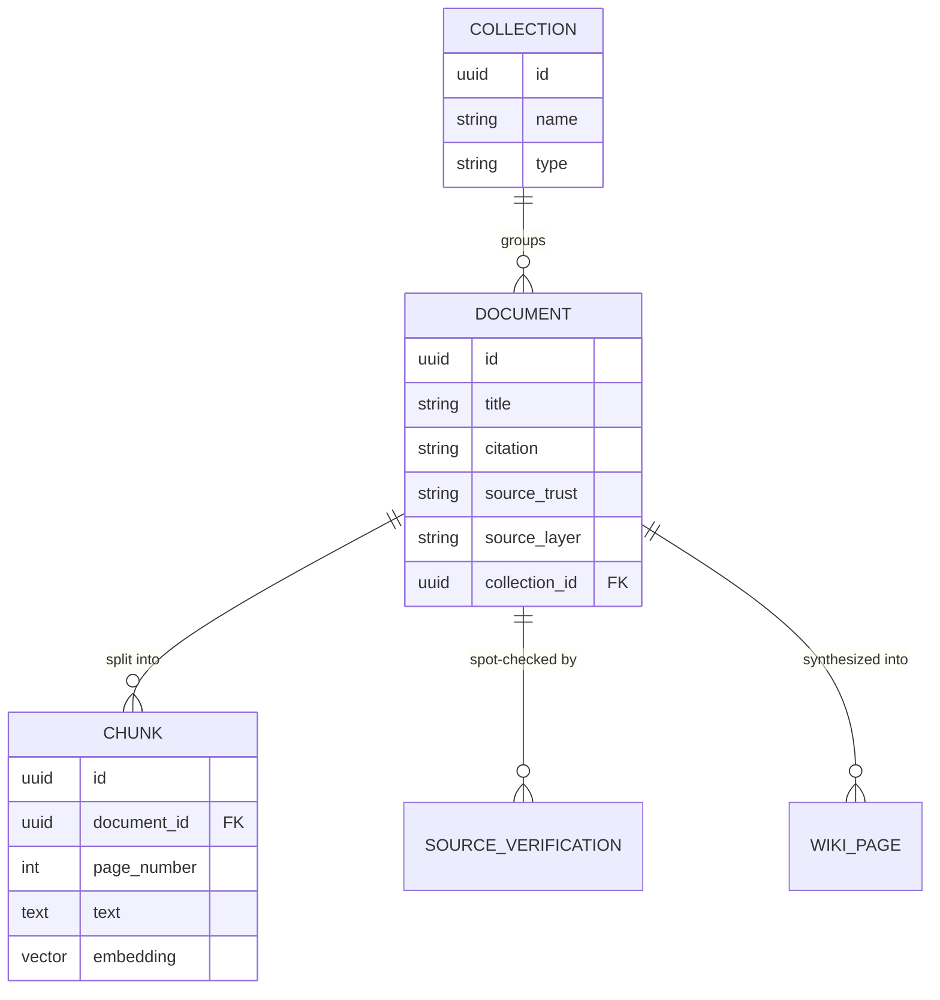

[Part 2](/posts/agenticaiforprofessionals2/) introduced the database layer of `nsw-legal-research-assistant` in passing — two tables, `Document` and `Chunk`, enough to get retrieval working end to end. The app has grown considerably since then: nine tables now, a Brief Builder workflow, chat history, wiki pages, trust tiers. The database layer itself, though, has stayed remarkably stable in shape — the same Postgres instance, the same `pgvector` extension, the same cosine-distance query at the centre of everything. This post is the deep dive that earlier one was not: the full schema as it exists today, why Postgres was the right call for a vector store here (the reasoning is written up as `ADR-0002` in the sibling repo's `llmwiki`, not just something I decided informally), a step-by-step Docker build a system administrator could follow from nothing but a base Postgres image, and — because I keep circling back to whether I would build this app the same way twice — how the same database layer could be scaffolded by a Claude Code user through GitHub's Spec Kit instead of by hand.

## A toy example: cosine distance with three numbers, by hand

Before 768-dimension real vectors and a 20,000-row real table, here is the entire mechanism this post is about, at a size a calculator could check. Cosine distance measures the *angle* between two vectors, ignoring their length — two vectors pointing the same direction score as identical even if one is twice as long as the other, which is exactly the property that lets it compare a short question against a long paragraph of judgment text fairly. Three toy "documents," each reduced to a 3-number vector, and one toy "question":

```sql
CREATE TABLE toy_items (id int, label text, embedding vector(3));
INSERT INTO toy_items VALUES
  (1, 'about dogs',  '[1, 0, 0]'),
  (2, 'about cats',  '[0.9, 0.1, 0]'),
  (3, 'about taxes', '[0, 0, 1]');

SELECT label, round((embedding <=> '[1, 0, 0]')::numeric, 4) AS distance
FROM toy_items
ORDER BY distance;
```

Run against a real, throwaway table on the same live Postgres this series has traced throughout (not hand-calculated, not simulated):

```
   label     | distance
-------------+----------
 about dogs  |   0.0000
 about cats  |   0.0061
 about taxes |   1.0000
```

"About dogs" scores a distance of exactly `0` against a query pointing in the identical direction — a perfect match. "About cats" is nearly identical (`0.0061`) because its vector points almost the same way, just tilted slightly by that `0.1` in the second position. "About taxes" scores the maximum distance, `1`, because its vector points in a completely unrelated direction (no overlap with the first two numbers at all). This is the entire idea `chunks.embedding <=> query_vector` scales up to 768 dimensions and 20,000 real rows below — nothing conceptually different happens at real scale, there are just many more numbers per vector and many more rows to rank.

## Why Postgres, not a dedicated vector database

The obvious alternative to `pgvector` is a purpose-built vector database — Pinecone, Weaviate, Qdrant, and others exist specifically to serve embedding search at scale. I did not choose Postgres by default; the architecture decision record for this stack lays out two independent reasons, and both still hold:

1. **The corpus size makes a dedicated vector database unnecessary.** The confirmed scope for this app is 50 to 200 uploaded documents — real retrieval-augmented generation over a curated matter file, not context-stuffing an entire jurisdiction's case law. At a few hundred documents, chunked into a few hundred characters each, the `chunks` table holds a few tens of thousands of rows, not billions. A dedicated ANN (approximate nearest neighbor) index earns its keep once a corpus reaches the high hundreds of thousands or millions of vectors; below that, an exact nearest-neighbor scan over an ordinary table is fast enough that the extra moving part is not worth the operational cost of running, syncing, and paying for a second database.
2. **Everything else in this app already lives in Postgres.** `Chunk.embedding` is one column on an ordinary SQLAlchemy-mapped table, sitting right next to `Chunk.document_id`, `Chunk.page_number`, and `Chunk.text`. The retrieval query in `app/rag/retrieval.py` is a single SQL statement that joins `chunks` to `documents` and orders by cosine distance in the same breath — no separate round trip to a vector service, no keeping two databases' data in sync, no risk of a `Document` row and its embeddings drifting out of step because one system committed and the other did not. Postgres's transactional guarantees cover the vectors exactly the same way they cover everything else.

There is a genuine tradeoff being accepted here, and it is worth naming rather than glossing over: `pgvector` supports both exact and approximate search (it ships `ivfflat` and `hnsw` index types for the latter), but as of this post, `nsw-legal-research-assistant` does not create either kind of index on `chunks.embedding` — every retrieval query in `retrieval.py` is a full, exact scan ordered by the `<=>` cosine-distance operator. That is a deliberate v0 choice, not an oversight: an exact scan over tens of thousands of rows on a laptop returns in well under the time a network round trip to an external LLM provider takes anyway, so an index would be optimizing a part of the request that is not the bottleneck. It is also exactly the kind of decision that needs revisiting, not repeating from memory, once the corpus grows past this app's current scale — and the fact that it is a one-line `CREATE INDEX` away, on the same table, in the same database, rather than a migration to a different system, is itself part of the case for Postgres.

## The schema

Nine tables, all defined in one file (`backend/app/models.py`), UUID primary keys throughout:

| Table | Purpose |
|---|---|
| `Collection` | A named, flat grouping of documents — the UI calls this a "database" or "matter". |
| `Document` | One ingested source. Carries `source_trust` ("verified" upload vs. "bulk_import"), `source_layer` ("primary_law" vs. "practical_guidance"), `content_hash` for dedup, and Jade's own `citation_report` JSON. |
| `Chunk` | One embedded passage of a `Document`, with `page_number` and the `pgvector` `embedding` column — the unit retrieval actually operates on. |
| `SourceVerification` | A human spot-check record against a `Document` of unconfirmed provenance. |
| `WikiPage` | Output of the "Wiki" query mode — full-document synthesis, with its own per-claim citation list. |
| `ChatSession` / `ChatExchange` | Persisted chat history, one exchange per question/answer round-trip. |
| `Brief` / `BriefArgument` | Brief Builder's stateful, multi-stage workflow. |

The relationships that matter for retrieval — everything else either hangs off `Document` or stands alone:



Every one of the 20,354 real rows [Part 7](/posts/agenticaiforprofessionals7/) queries lives in the `CHUNK` box, and every one of them traces back through exactly one `DOCUMENT` to exactly one `COLLECTION` — which is the entire mechanism behind scoping a question to "just the Lemon Law collection" rather than searching the whole 146-document corpus.

The table that matters most for this post is `Chunk`:

```python
# backend/app/models.py
EMBEDDING_DIM = settings.ollama_embed_dimensions  # 768 for nomic-embed-text

class Chunk(Base):
    __tablename__ = "chunks"

    id: Mapped[uuid.UUID] = mapped_column(UUID(as_uuid=True), primary_key=True, default=uuid.uuid4)
    document_id: Mapped[uuid.UUID] = mapped_column(
        UUID(as_uuid=True), ForeignKey("documents.id", ondelete="CASCADE"), nullable=False
    )
    chunk_index: Mapped[int] = mapped_column(Integer, nullable=False)
    page_number: Mapped[int] = mapped_column(Integer, nullable=False)
    text: Mapped[str] = mapped_column(Text, nullable=False)
    embedding: Mapped[list[float]] = mapped_column(Vector(EMBEDDING_DIM), nullable=False)
    created_at: Mapped[datetime] = mapped_column(DateTime(timezone=True), server_default=func.now())
```

`class Chunk(Base):` is a Python **class** — a blueprint for creating objects that bundle data together ([Part 6](/posts/agenticaiforprofessionals6/) explains classes, objects, and inheritance from first principles if this is unfamiliar). `Chunk` inheriting from `Base` is what tells SQLAlchemy "this class corresponds to a real database table," and every line inside it declares one column: `id: Mapped[uuid.UUID] = mapped_column(...)` reads as "this class has an attribute called `id`, typed as a UUID (`Mapped[uuid.UUID]` is a type hint, also covered in Part 6), backed by a real Postgres column configured by `mapped_column(...)`." This is an **ORM** (Object-Relational Mapper) — the whole point of it is that Python code elsewhere in the app can write `chunk.page_number` or `chunk.embedding` as ordinary attribute access, and SQLAlchemy translates that, behind the scenes, into the real SQL `SELECT`/`INSERT`/`UPDATE` statements Postgres actually understands, without this app's own code ever writing raw SQL by hand for the common cases. `Vector(EMBEDDING_DIM)` comes from the `pgvector.sqlalchemy` package — a thin SQLAlchemy type that maps a Python `list[float]` straight onto Postgres's `vector` column type, with no manual serialization on either side. `EMBEDDING_DIM` is fixed at table-creation time and has to match whichever embedding model actually wrote the vectors — 768 dimensions for the default `nomic-embed-text` (served locally through Ollama), 1536 for OpenAI's `text-embedding-3-small` if the provider is switched. Part 2 covers why that switch is a column migration, not a config flip; it has not changed here.

Retrieval reads that column with `pgvector`'s `cosine_distance()` helper, joined directly against `Document` in one query:

```python
# backend/app/rag/retrieval.py
distance = Chunk.embedding.cosine_distance(query_vector)
query = select(Chunk, Document, distance.label("distance")).join(Document, Chunk.document_id == Document.id)
rows = session.execute(query.order_by(distance).limit(top_k)).all()
```

That compiles to ordinary SQL using `pgvector`'s `<=>` operator (cosine distance; `1 - distance` gives cosine similarity) — the same operator I use directly from `psql` later in this post to sanity-check the database independently of the application code sitting on top of it.

## Standing up the Postgres server, step by step

This is the part written for whoever has to actually provision this — not necessarily me, not necessarily someone who has read the application code above. Everything here assumes Docker as the host and works from a base Postgres image up, exactly as the real `docker-compose.yml` in the repo does.

### 1. Decide how the `vector` extension gets into the image

Postgres does not ship the `pgvector` extension by default — `CREATE EXTENSION vector` fails on a stock `postgres` image because the extension's compiled binary is not present on disk. There are two legitimate ways to get it there, and it is worth understanding both even though the app itself only uses the first:

**Option A — pull the prebuilt image.** The `pgvector` project publishes ready-made images on Docker Hub that are a stock Postgres image with the extension already compiled in:

```bash
docker pull pgvector/pgvector:pg16
```

This is what `nsw-legal-research-assistant` actually uses. `pg16` is one of several supported tags (`pg13` through `pg18`, each also available pinned to a Debian codename like `pg16-bookworm`), so the tag chooses the Postgres major version, not a separate `pgvector` version.

**Option B — build it yourself from a base Postgres image.** If a hardened or centrally-approved base image is a requirement (common in a regulated environment where "pull a community image from Docker Hub" is not an acceptable answer to "where did this container come from"), the `pgvector` maintainers' own `Dockerfile` shows exactly what Option A does under the hood, starting from the official `postgres` image:

```dockerfile
ARG PG_MAJOR=16
ARG DEBIAN_CODENAME=bookworm
FROM postgres:$PG_MAJOR-$DEBIAN_CODENAME
ARG PG_MAJOR

ADD https://github.com/pgvector/pgvector.git#v0.8.6 /tmp/pgvector

RUN apt-get update && \
    apt-mark hold locales && \
    apt-get install -y --no-install-recommends build-essential postgresql-server-dev-$PG_MAJOR && \
    cd /tmp/pgvector && \
    make clean && \
    make OPTFLAGS="" && \
    make install && \
    mkdir /usr/share/doc/pgvector && \
    cp LICENSE README.md /usr/share/doc/pgvector && \
    rm -r /tmp/pgvector && \
    apt-get remove -y build-essential postgresql-server-dev-$PG_MAJOR && \
    apt-get autoremove -y && \
    apt-mark unhold locales && \
    rm -rf /var/lib/apt/lists/*
```

Worth reading line by line rather than skimming: it installs the build toolchain (`build-essential`, `postgresql-server-dev-16` for the matching server headers), compiles `pgvector` from a pinned tag (`v0.8.6`, not a floating branch), installs it, then **removes** the build toolchain again in the same layer so the final image does not carry a C compiler it no longer needs. That last step is not cosmetic — it is the difference between a production image and a development one sitting in the same registry.

### 2. Write the Compose service

The real service definition, unmodified, from `docker-compose.yml`:

```yaml
services:
  postgres:
    image: pgvector/pgvector:pg16
    restart: unless-stopped
    environment:
      POSTGRES_USER: ${POSTGRES_USER:-nsw_legal}
      POSTGRES_PASSWORD: ${POSTGRES_PASSWORD:-changeme}
      POSTGRES_DB: ${POSTGRES_DB:-nsw_legal_research}
    ports:
      - "5432:5432"
    volumes:
      - pg_data:/var/lib/postgresql/data
      - ./backend/db/init:/docker-entrypoint-initdb.d
    healthcheck:
      test: ["CMD-SHELL", "pg_isready -U ${POSTGRES_USER:-nsw_legal}"]
      interval: 5s
      timeout: 5s
      retries: 10

volumes:
  pg_data:
```

Four things a system administrator reading this for the first time should not skip past:

- **`pg_data` is a named volume, not a bind mount.** Postgres's on-disk files live inside a volume Docker manages, so the data survives `docker compose down` and container recreation — it is only lost if the volume itself is explicitly removed (`docker compose down -v`).
- **The healthcheck runs `pg_isready`, not a raw TCP check.** A container can accept TCP connections before Postgres has finished its startup recovery; `pg_isready` asks the server itself whether it is ready to accept queries, which is what the `backend` service's `depends_on: postgres: condition: service_healthy` actually waits on before starting.
- **`POSTGRES_PASSWORD` defaults to `changeme`.** That default exists so `docker compose up` works with zero configuration for local development — it is not a production credential, and anything beyond a laptop needs a real value supplied via `.env`, never the default left in place.
- **Docker Compose derives the project name — and therefore volume names — from the directory name by default.** Two independent checkouts of the same repo on one machine, both named `nsw-legal-research-assistant`, will silently share the same `pg_data` volume: a real gotcha the build log for this app records hitting during a clean-checkout test. Set `COMPOSE_PROJECT_NAME` explicitly if more than one instance ever needs to coexist on the same host.

### 3. Enable the extension via an init script, not a manual step

Pulling an image with `pgvector`'s binary compiled in is not the same as the extension being active in a given database — `CREATE EXTENSION` still has to run once, per database. Rather than remembering to run that by hand after every fresh volume, the official Postgres image runs any `.sql` file it finds under `/docker-entrypoint-initdb.d/` automatically, exactly once, the first time it starts against an empty data directory. The real init script is one line:

```sql
-- backend/db/init/001_enable_pgvector.sql
-- Runs automatically on first container start (postgres image's docker-entrypoint-initdb.d convention).
-- The pgvector/pgvector image ships the extension binary; this just activates it for this database.
CREATE EXTENSION IF NOT EXISTS vector;
```

...mounted straight into that directory in the Compose file above (`./backend/db/init:/docker-entrypoint-initdb.d`). Numbering the file `001_` costs nothing now and matters the moment a second init script is ever added, since the entrypoint runs everything in that directory in filename order.

### 4. Bring it up and verify independently of the application

```bash
docker compose up -d postgres
docker compose ps          # STATUS should read "healthy", not just "running"
```

Then check the extension actually activated, without going anywhere near the FastAPI backend:

```bash
docker compose exec postgres psql -U nsw_legal -d nsw_legal_research -c "\dx"
```

```
                                   List of installed extensions
  Name   | Version |   Schema   |                     Description
---------+---------+------------+-------------------------------------------------------------
 plpgsql | 1.0     | pg_catalog | PL/pgSQL procedural language
 vector  | 0.8.6   | public     | vector data type and ivfflat and hnsw access methods
```

### 5. Let the application create its own schema — and know the one real gotcha in doing so

`nsw-legal-research-assistant` does not use a migration framework. Tables are created directly from the SQLAlchemy models on backend startup:

```python
# backend/app/main.py
@asynccontextmanager
async def lifespan(app: FastAPI):
    # v0: create tables on startup rather than running migrations. Fine at this
    # scale; revisit with Alembic if the schema needs versioned changes later.
    Base.metadata.create_all(bind=engine)
    yield
```

That is a reasonable v0 choice, and it comes with exactly one sharp edge worth knowing before it bites: `create_all()` only creates tables that do not exist yet. It will never add a column to a table that is already there. This app hit that directly when `Brief.llm_provider` was added to the model after real matter data already existed in a running `briefs` table — the fix was one manual, additive statement run directly against the database:

```sql
ALTER TABLE briefs ADD COLUMN llm_provider VARCHAR NULL;
```

Nullable, no default-value backfill needed, so the statement was safe to run against a live table. That will not always be true for every future column — worth remembering before treating `create_all()`-only as free forever.

### 6. Run a retrieval query by hand

Useful for confirming the database layer works entirely independently of the Python application sitting on top of it — pass a query vector directly and let Postgres do the ranking:

```sql
SELECT id, page_number, left(text, 60) AS excerpt,
       1 - (embedding <=> '[0.01,0.02, /* ...768 values... */]') AS similarity
FROM chunks
ORDER BY embedding <=> '[0.01,0.02, /* ...768 values... */]'
LIMIT 5;
```

`<=>` is `pgvector`'s cosine-distance operator; `1 - distance` gives the same cosine-similarity number `retrieval.py` computes in Python. In production this vector comes from actually embedding a question through whichever provider ingested the corpus — `nomic-embed-text` by default — but for a sanity check, any 768-dimension vector confirms the operator, the index-free scan, and the column type all work together end to end, without the LLM orchestration layer in the way.

## The same result, scaffolded with Claude Code and Spec Kit

Everything above is how this database layer actually came to exist — written by hand, one file at a time, validated against a live stack at each phase. There is a second, increasingly common way a Claude Code user could arrive at the identical result: [Spec Kit](https://github.com/github/spec-kit), GitHub's open-source toolkit for spec-driven development. I have not run Spec Kit against this app — what follows is a grounded description of the real workflow, not a transcript of a session that happened.

Spec Kit is worth pointing out here specifically because `agentic-ai-for-professionals` already practises a hand-rolled version of the same discipline: every architectural decision behind this database layer — Postgres over a dedicated vector store, the two-stage retrieval design, the trust-tier columns — lives in a numbered ADR under `llmwiki/wiki/architecture/`, written before or alongside the code, not reverse-engineered from it afterward. Spec Kit formalizes exactly that habit — specify before plan, plan before tasks, tasks before implementation — as a set of slash commands with real, versioned artifacts on disk, rather than a wiki convention a team has to remember to follow.

**Install and initialize.** Spec Kit ships as a CLI, `specify`, installed via `uv`:

```bash
uv tool install specify-cli
```

For an existing project — adding this database layer to an already-running app tree, rather than starting a repo from nothing — initialize in place:

```bash
cd apps/nsw-legal-research-assistant
specify init --here --force --integration claude
```

`--integration claude` installs Spec Kit's skills into `.claude/skills`, which is how Claude Code discovers the `/speckit-*` commands below. `--here` targets the current directory instead of scaffolding a new one; `--force` allows that in a directory that already has files in it, which this one does.

**Run the workflow.** Constitution is set once per project; specify through converge repeat per feature — here, one feature: the database layer itself.

```text
/speckit-constitution Every table uses UUID primary keys and cascade-safe foreign keys. No citation is
ever asserted by the model -- every citation traces to a real retrieved database row. Schema changes
are additive where possible; a destructive change needs an explicit migration step, not a silent drop.

/speckit-specify Add a Postgres database layer for a legal research assistant: documents carrying
citation metadata (title, medium-neutral citation, court, decision date), chunks holding page-scoped
extracted text and an embedding vector, collections grouping documents into named matters, and
retrieval that returns the nearest chunks to a query by cosine similarity, optionally scoped to one
document or one collection.

/speckit-plan Use Postgres with the pgvector extension via the pgvector/pgvector:pg16 Docker image,
enabled through a docker-entrypoint-initdb.d init script rather than a manual step. Model tables with
SQLAlchemy 2.0 declarative Mapped[...] syntax. Fix the embedding column at 768 dimensions to match
the nomic-embed-text embedding model served through Ollama. For this v0, create tables directly from
the models on startup rather than introducing a migration framework.

/speckit-tasks
/speckit-implement
/speckit-converge
```

Each command hands off a real artifact to the next rather than passing instructions along conversationally: `/speckit-specify` writes `spec.md`, `/speckit-plan` writes `plan.md` capturing exactly the technology decisions given above, `/speckit-tasks` turns that plan into a dependency-ordered `tasks.md` — something in the shape of "create the Compose service and init script" before "define the SQLAlchemy models" before "wire the cosine-distance retrieval query," each task explicit about what it depends on finishing first. `/speckit-implement` works through that list; `/speckit-converge` checks the result against `spec.md` and reports whether it actually satisfies what was asked for, repeating with `/speckit-implement` until it does. All of it lands under `.specify/` in the repo, reviewable the same way the hand-written ADRs above are — the difference is that Spec Kit enforces the specify-before-plan-before-tasks ordering structurally, where this repo's own wiki convention only enforces it by habit.

Where this genuinely earns its keep over building by hand is exactly the gotcha from step 5 above: adding `Brief.llm_provider` to a live table. Run through `/speckit-specify` ("add a per-brief LLM provider override, nullable, no backfill needed") and `/speckit-plan` ("this is an additive column on an existing table with real data — no migration framework in place, so the plan has to state the manual `ALTER TABLE` explicitly and confirm nullability makes it safe"), that decision and its reasoning end up written down in `plan.md` before the `ALTER TABLE` statement runs, rather than living only in a README paragraph written after the fact — which is, not coincidentally, exactly the same distinction between "decided and recorded" and "decided and remembered" that this repo's own ADR practice exists to close.

## Check your understanding

1. In the toy `cosine distance` example, "about cats" (`[0.9, 0.1, 0]`) scored `0.0061` against the query `[1, 0, 0]`. Without running any SQL, would you expect a fourth toy row, `[0.5, 0.5, 0]`, to score closer to `0` or closer to `1`? Why?
2. `chunks.embedding` is declared `vector(768)`, fixed at table-creation time. If the app switched its embedding model from `nomic-embed-text` (768 dimensions) to OpenAI's `text-embedding-3-small` (1536 dimensions) tomorrow, would `ALTER TABLE chunks ALTER COLUMN embedding TYPE vector(1536);` alone be enough to make retrieval work correctly again? What else would have to happen to the 20,354 rows already in that column?
3. This post says `nsw-legal-research-assistant` creates no `ivfflat` or `hnsw` index on `chunks.embedding`. If the corpus grew from 146 documents to 146,000, what would you expect to happen to query time, and at what point would adding an index stop being optional?
4. `Base.metadata.create_all(bind=engine)` runs on every backend startup. If you deleted the `Chunk` class from `models.py` entirely and restarted the backend, would the real `chunks` table in Postgres — and its 20,354 rows — be dropped? Why or why not?
