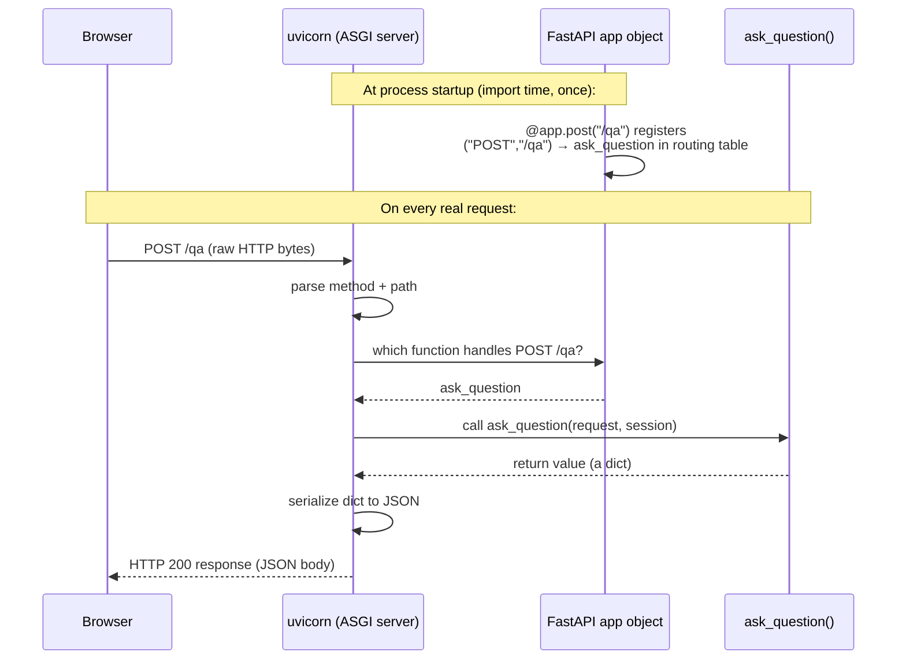

[Part 5](/posts/agenticaiforprofessionals5/) covered the Postgres and `pgvector` layer of `nsw-legal-research-assistant` — schema, Docker setup, the cosine-distance query. This post starts a new arc through the Python service sitting directly on top of that database: not a tour of the whole backend at once, but one layer at a time, in enough depth that a reader with no Python background can actually follow the real code. This post is that foundation — FastAPI itself, the handful of Python language features that show up everywhere in this codebase, and exactly what happens between a request landing on the server and your own function being called. [Part 7](/posts/agenticaiforprofessionals7/) picks up from here with retrieval and embeddings; [Part 8](/posts/agenticaiforprofessionals8/) with the LLM providers and prompts; [Part 9](/posts/agenticaiforprofessionals9/) with testing and hosting.

This post assumes no prior Python experience. Every piece of syntax that is not ordinary English gets explained the first time it appears.

## Five pieces of Python syntax that recur throughout this series

**Type hints.** `def foo(question: str) -> dict:` reads as "a function named `foo`, taking one argument called `question` which should be a string of text, and returning a dictionary." The `: str` and `-> dict` parts are called **type hints** — they document what kind of value is expected, and tools can check them, but Python does not actually enforce them at runtime the way some languages do. `str | None` means "a string, or the special empty value `None`" — the `|` is read as "or." `list[Citation]` means "a list where every item is a `Citation`."

**Decorators.** A line starting with `@`, placed directly above a function definition, is a **decorator** — it wraps extra behaviour around the function without changing the function's own code. `@app.post("/qa")` above a function tells the FastAPI web framework: "whenever an HTTP `POST` request arrives at the URL path `/qa`, call this function, and send back whatever it returns as the response." You never write the code that listens on a network port, parses the incoming request, or converts the return value to JSON — the decorator and the framework behind it do that.

**f-strings.** `f"[{i}]"` is a **formatted string literal** — the `f` before the opening quote means anything inside `{curly braces}` gets evaluated as a Python expression and inserted into the text. If `i` is `3`, `f"[{i}]"` produces the text `[3]`.

**Dataclasses.** `@dataclass` above a `class` definition auto-generates the boring parts of a data-holding class — a constructor that takes one argument per field, and sensible printing/comparison — so a class like `Citation` (Part 8) can be defined as a short list of named fields with types, rather than hand-written boilerplate.

**Comprehensions.** `[f(x) for x in some_list]` builds a new list by running `f(x)` for every item `x` in `some_list`, all on one line — a compact `for` loop that produces a list instead of just repeating an action. `enumerate(chunks, start=1)` pairs each item in `chunks` with a counting number starting at 1, instead of 0.

## Classes, objects, and inheritance, from scratch

A `class` is a blueprint for creating things that bundle data and behaviour together. `class AnthropicProvider:` (Part 8 covers this class fully) defines the blueprint; `AnthropicProvider(api_key, model)` — calling the class name like a function — actually builds one real object (an **instance**) from it, a process called **instantiation**. `def __init__(self, api_key, model):` is the **constructor**, a special method Python calls automatically the moment an instance is created, whose job is to set up that instance's starting data. `self` is the first parameter of every method on a class, and it always means "the specific instance this method was called on" — Python passes it in automatically; you never type it yourself when calling the method, only when defining it. `self._client = Anthropic(api_key=api_key)` stores a value onto *this* instance, readable later as `self._client` from any other method on the same instance.

`class AnthropicProvider(LLMProvider):` — a class name in parentheses after the class being defined — is **inheritance**: it means "an `AnthropicProvider` *is a kind of* `LLMProvider`," required to honour whatever shape `LLMProvider` demands, and usable anywhere code asks for "some `LLMProvider`" without needing to know which specific one it actually got. This single mechanism is why a factory function (Part 8) can hand back four completely different classes and every piece of code that calls `provider.generate(...)` never has to ask which one it received. `QuestionRequest(BaseModel)`, seen below, is the same pattern with a different parent class: Pydantic's `BaseModel` supplies the "read this data, check its types" behaviour, and `QuestionRequest` just lists which fields it needs.

## How FastAPI actually turns a Python function into a web server

The honest answer to "what does `@app.post(\"/qa\")` do" is more mechanical than "a decorator wraps the function" suggests.

```python
# backend/app/main.py
app = FastAPI(title="NSW Legal Research Assistant", lifespan=lifespan)

@app.post("/qa")
def ask_question(request: QuestionRequest, session: Session = Depends(get_session)) -> dict:
    ...
```

`app = FastAPI(...)` creates one object — an instance of the `FastAPI` class, following exactly the class/instance/constructor pattern above — and that object's job, among other things, is to hold a **routing table**: an internal lookup from ("`POST`", "`/qa`") to "call `ask_question`." Crucially, `@app.post("/qa")` runs exactly once, at the moment Python first reads through `main.py` from top to bottom when the process starts (this is called **import time**) — it does not run every time a request arrives. All it does, once, is add one entry to that routing table. `ask_question` itself does not run again until an actual matching request shows up, however many requests that ends up being over the life of the running process.

FastAPI itself never opens a network socket, reads raw bytes off the wire, or writes an HTTP response by hand — that is `uvicorn`'s job, a separate program ([Part 9](/posts/agenticaiforprofessionals9/) covers the exact Dockerfile line that launches it). `uvicorn` is what is called an **ASGI server**: it does the actual networking — accepting a TCP connection, reading the raw HTTP request text, parsing out the method and path — and then, for every single request, asks the `app` object one question: "given `POST /qa`, which function handles this?" It looks up the routing table built at import time, finds `ask_question`, and calls it. Once `ask_question` returns, `uvicorn` takes whatever came back, and — because FastAPI already converted it to a JSON-shaped response object — writes the real HTTP response bytes back onto the network connection.



The `request: QuestionRequest` and `session: Session = Depends(get_session)` parameters work because FastAPI can look at a function's own type hints while building the routing table, using Python's built-in ability to inspect a function's signature at runtime rather than only at the moment it is called. Seeing `request: QuestionRequest` (a Pydantic `BaseModel` subclass), it knows to parse the incoming JSON body into that shape before calling `ask_question`, and reject the request with a clear error if the JSON does not match. Seeing `session: Session = Depends(get_session)`, it knows to call `get_session()` first (Part 5's `db.py` — opens one database connection), and pass whatever that produces in as `session`, closing it automatically once `ask_question` returns. This is **dependency injection**: `ask_question` receives a validated request object and an open database session as if they had simply always existed, because FastAPI built them before calling it, purely by reading the type hints on the function's own parameter list — no line inside `ask_question` parses JSON or opens a connection by hand.

## Step 1 of the real trace: the major-failure question arrives

The question this whole arc traces end to end is the real one from the live app: **"what is a major failure under Australian Consumer Law,"** asked against the real **NSW Lemon Law Authorities (Jade live-fetch)** collection. Here is exactly what FastAPI does with it before any retrieval or LLM logic runs at all:

```python
# backend/app/main.py
class QuestionRequest(BaseModel):
    question: str
    document_id: uuid.UUID | None = None
    collection_id: uuid.UUID | None = None
    history: list[HistoryTurnIn] | None = None
    layer: str | None = None
    session_id: uuid.UUID | None = None


@app.post("/qa")
def ask_question(request: QuestionRequest, session: Session = Depends(get_session)) -> dict:
    history = [HistoryTurn(question=h.question, answer=h.answer) for h in (request.history or [])]
    result = answer_question(
        session, request.question,
        document_id=request.document_id, collection_id=request.collection_id,
        history=history, layer=request.layer,
    )
    ...
```

`QuestionRequest` is a **Pydantic model** — a class whose job is purely to describe the shape of some data. For the real request, `request.question` is `"what is a major failure under Australian Consumer Law"`, `request.collection_id` is the Lemon Law collection's real UUID (`1b19aace-10d5-4d82-a8f6-9aa9691dc729` — a real id, confirmed directly against the live database), and `request.history` is empty, since this is the first question of the conversation. The list-comprehension line converts each plain history item into a `HistoryTurn` dataclass — the shape `answer_question()` expects internally — which, for an empty list, just produces another empty list.

`answer_question()` is where retrieval, embeddings, and the language model all actually happen — and that is genuinely a lot of ground, worth its own dedicated post rather than a rushed paragraph here. [Part 7](/posts/agenticaiforprofessionals7/) picks up exactly at this line, tracing what `answer_question()` does first: turning that question into a search over Postgres.
