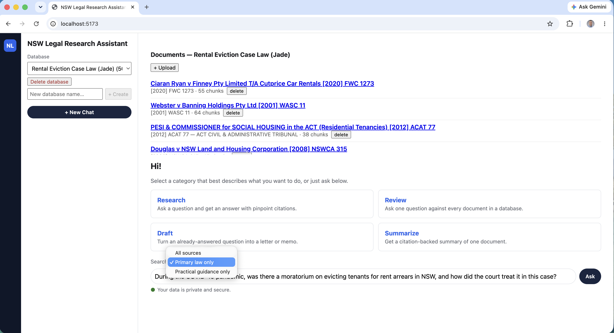
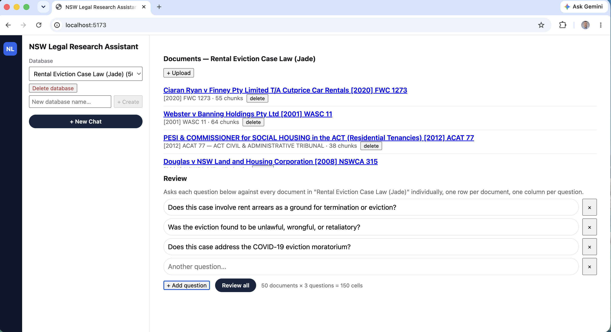
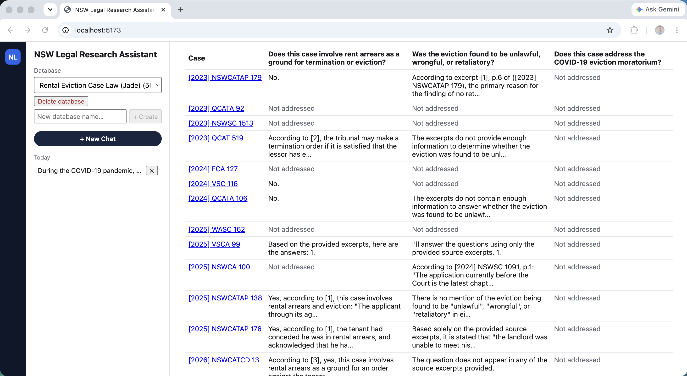
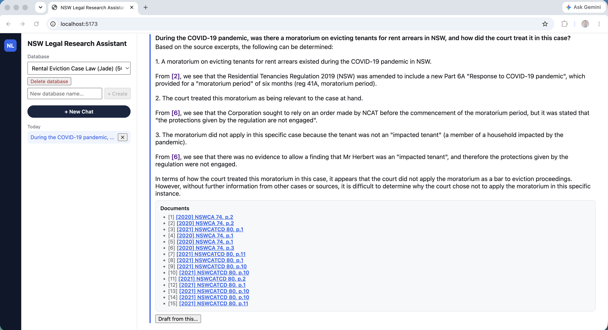
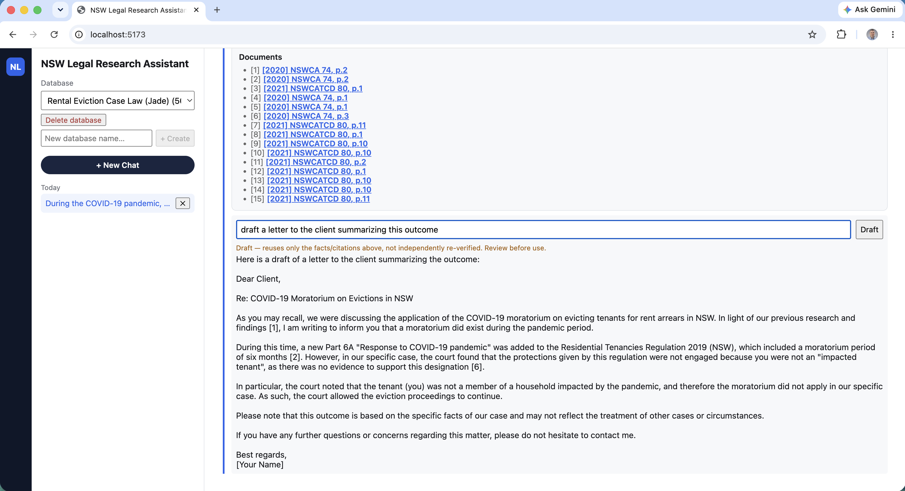

[Part 1](/posts/agenticaiforprofessionals1/) covered the research; [Part 2](/posts/agenticaiforprofessionals2/) and [Part 3](/posts/agenticaiforprofessionals3/) built the RAG core, frontend, and MCP server; [Part 4](/posts/agenticaiforprofessionals4/) ran it live against Thomson Reuters' own demo script; [Part 5](/posts/agenticaiforprofessionals5/) found a real retrieval-completeness bug in RAG itself, fixed it, and left one open question — what other gaps like it are still sitting in this corpus, unfound. The same commit that shipped Part 5's fix also carried a batch of work that post never covered, because it wasn't about that specific bug: client-held conversation history and a new combinable source-layer axis, independently validated the same day by Thomson Reuters' own product. This post picks up from there. It's a single session's worth of hardening beyond that: those two pieces, a rename driven by the project's own research wiki, and a UI redesign that finally matches CoCounsel Core's actual interface instead of a plain chat panel.


*The redesigned shell: a Database dropdown, a Research/Review/Draft/Summarize skill-tile landing view, and a source-layer filter scoping search to primary law only*

## Conversation history, still entirely client-held

Follow-up questions like "what sentence was imposed?" don't retrieve well on their own — nothing in the text says which case "that" refers to. A new module rewrites them before retrieval, using recent conversation history:

```python
# backend/app/rag/condense.py
"""Conversation-aware query rewriting: turns a vague follow-up ("What
sentence was imposed?") into a self-contained question ("What sentence was
imposed on each defendant in R v Evans, R v Rawlinson and R v Proud [2014]
NSWSC 979?") using recent conversation history, before retrieval runs.

...this call only ever changes what question gets embedded and searched
for. It never touches citation-sourcing -- citations are still built in
Python from whatever chunks the (possibly rewritten) question actually
retrieves, exactly as before. A bad rewrite degrades to today's behavior
(a question that doesn't retrieve well, or an honest "not found"); it has
no path to a fabricated citation, because nothing about how citations are
sourced changes here.
"""
```

The guardrail is the same one that's run through every skill in this series since Part 2: a worse rewrite can only produce a worse *retrieval*, never a worse *citation*, because citations are still Python-constructed from real rows, never generated by the model.

## Combinable source layers — and Thomson Reuters validated the design the same day

CoCounsel Legal sells "primary law" (Westlaw) and "practical guidance" (Practical Law) as separate, combinable subscription layers. This app now has the same axis, per-document and per-chunk:

```python
# backend/app/rag/retrieval.py
# A document classified primary_law can still contain an editorial insert --
# NSW judgments and JADE republications sometimes carry a HEADNOTE the source
# itself explicitly disclaims as not being part of the judgment (confirmed
# directly in this corpus: Rigby v State of New South Wales [2022] NSWCA 14,
# p.2, "HEADNOTE / This headnote is not to be read as part of the judgment").
# source_layer classifies the whole document (a reasonable default -- most
# of a judgment PDF genuinely is the judgment), but a chunk landing inside
# one of these inserts shouldn't inherit primary_law confidence just because
# its parent document mostly is one.
_EDITORIAL_INSERT_RE = re.compile(r"headnote.{0,80}not to be read as part of the judgment", re.IGNORECASE | re.DOTALL)
```

The filter surfaces directly in the search bar — "All sources / Primary law only / Practical guidance only," visible in the hero screenshot above — and scopes retrieval, not just display. It's the same idea CoCounsel Core's own "Search a Database" skill from [Part 1](/posts/agenticaiforprofessionals1/) is built on: a database is a curated, scoped collection, not a web-scale index, and scoping *within* that collection by source type is a natural extension of the same philosophy, not a new one.

Worth noting in passing, since the timing was strange: the same day this shipped, Thomson Reuters put out a GA press release for a next-generation CoCounsel Legal, headlined by a new feature called Westlaw Brief Builder — sold as access to a combination of exactly these two layers, primary law plus practical guidance. Not proof of anything beyond coincidence in timing, and not the reference point this app is actually built against — that's still CoCounsel Core's fixed, tested skill catalog from Part 1 — but real confirmation that combinable source layers isn't a made-up framing.

## Matter becomes Database

Small on its own, but driven by the same research discipline as everything else in this series — not a cosmetic relabel:

> Per wiki research (`cocounsel-legal-original-architecture-and-skills.md`), CoCounsel's own "Database" concept is scoped by case, client, or industry — broader than "matter," and this app's own collections (e.g. "Dog Bite Case Law (Jade)") already aren't always matter-scoped.

Paired with it: real deletion. `DELETE /documents/{id}` cascades chunks, verifications, wiki pages, and the stored PDF file; `DELETE /collections/{id}` is an explicit, irreversible decision — delete the database and every document inside it, not just the grouping:

```python
# backend/app/collections.py
def delete_collection(session: Session, collection: Collection) -> int:
    """Explicit user decision: deleting a database deletes every document
    inside it too (chunks, embeddings, stored PDFs), not just the grouping.
    Document.collection_id's FK is ondelete="SET NULL" at the DB level --
    the right default for any other path that might delete a Collection
    row -- but that would only orphan documents into "All documents", not
    remove them, so this explicitly deletes each one first."""
```

The frontend backs that up with a real confirmation cost: typing the database's own name back before "Delete database" does anything, visible in the sidebar in the hero screenshot.

## Upload hardening: duplicates, multi-file, and a database that isn't real

Three small fixes, same root cause — a v0 upload flow that had never been pushed on:

- **Duplicate detection.** Every uploaded PDF gets a SHA-256 of its raw bytes; a second upload of the same file into the same database is rejected rather than silently duplicating chunks and skewing retrieval counts.
- **Multi-file upload**, with document titles backfilled from the stored filename for anything that predates it.
- **Blocking uploads into "All documents"** — the unscoped view across every database was never a real collection to upload *into*, just a display mode, and the upload form used to let you try anyway.

## Persistent chat sessions and a real Summarize skill

CoCounsel Core's demo shows reloadable chat history in a sidebar — this app's chat used to be entirely stateless, by deliberate Phase 6.5 design. That decision gets reversed here, but narrowly:

> `ChatSession`/`ChatExchange` give the frontend real, reloadable chat history — a deliberate reversal of the earlier Phase 6.5 "stateless, nothing stored server-side" decision. `app/rag/qa.py`'s `answer_question()` is completely untouched: persistence is a pure write-after-read side effect... History stays client-sent exactly as before, so prompt processing and persistence remain independent — omit `session_id` and behavior is unchanged from before this commit.

The new Summarize skill deliberately doesn't use similarity retrieval — a generic "summarize this document" has no query to embed-search against — so it evenly samples chunks across the whole document instead:

```python
# backend/app/rag/summarize.py
def _sample_indices(total: int, max_chunks: int) -> list[int]:
    """Evenly spaced indices across [0, total), always including index 0 and
    total-1, so the summary reflects the whole document (opening AND
    closing/outcome), not just its first N chunks."""
```

Verified live against the 1,461-chunk Civil Liability Handbook: it correctly sampled 40 excerpts across the whole document and self-reported the sampling limit in its own output, rather than silently presenting a partial read as complete.

## A UI shell that actually matches CoCounsel Core's IA

Every screenshot in this post is this redesign. Dark navy icon rail, white sidebar and content area, the skill-tile landing view, "Documents" result cards with highlighted citations, a trust badge, and — replacing every citation that used to pop a new tab — a real split-pane PDF viewer for same-origin, locally-stored documents. Bulk-import citations pointing at jade.io or NSW Caselaw still open in a new tab, since those generally can't be framed anyway.

Deliberate simplifications, written down rather than silently decided: no multi-workspace switcher, since this is a single-user app and Database selection already plays that scoping role; no fake "Results" tab; Draft stays a follow-up-only action on an already-grounded answer, never a standalone "start here" tile, because its entire trust design depends on reusing only facts that are already grounded.

## The Review grid, actually finished

`review_collection()` has taken a *list* of questions since it was first written — but for a while, nothing called it that way. The `/review` endpoint used to wrap a single question in a one-element list and flatten the response back down, with its own docstring admitting as much: *"review_collection() itself now takes a list of questions... but this endpoint's request/response shape hasn't been updated to expose that yet — deliberately paused mid-build."* That gap closed this session. `ReviewRequest` now takes `questions: list[str]` directly, and `ReviewPanel.tsx` grew an actual multi-question UI — an "Add question" row and one column per question, not just one:


*Three questions queued against the Rental Eviction Case Law (Jade) database — 50 documents × 3 questions = 150 cells, with the client-side limit check surfacing before the request is even sent*

`MAX_REVIEW_CELLS` — the same guardrail from Part 4's Beat 4 that caps how many LLM round trips a single Review request can trigger — got raised from 60 to 200 to let a real demo run against the full 50-document collection, with the reasoning for the new number written down rather than picked by feel: *"Still a real ceiling, not removed — 200 cells is still a real number of LLM round trips... if this app grows collections meaningfully past ~50 documents as routine, revisit this number against actual observed latency rather than raising it again by feel."* Real output, one row per document, one column per question:


*The finished grid — three questions (rent arrears as a termination ground, unlawful/retaliatory eviction, the COVID-19 moratorium) answered independently against every document in the database*

What's still genuinely unfinished, precisely: the MCP tool, `review_nsw_caselaw_collection`, still only accepts a single `question: str` and wraps it the old way — Claude Code (or any other MCP client) can't yet ask a multi-question grid the way the browser now can. REST and the frontend caught up; MCP hasn't yet.

## Live: a scoped, filtered question, and a drafted letter

Scoped to Rental Eviction Case Law (Jade), filtered to primary law only:

> **During the COVID-19 pandemic, was there a moratorium on evicting tenants for rent arrears in NSW, and how did the court treat it in this case?**

Real output, fifteen citations deep across two documents:

> A moratorium on evicting tenants for rent arrears existed during the COVID-19 pandemic in NSW. From [2], we see that the Residential Tenancies Regulation 2019 (NSW) was amended to include a new Part 6A "Response to COVID-19 pandemic," which provided for a "moratorium period" of six months (reg 41A). [...] The moratorium did not apply in this specific case because the tenant was not an "impacted tenant" — there was no evidence to allow a finding that Mr Herbert was an "impacted tenant," and therefore the protections given by the regulation were not engaged.


*Grounded answer, primary-law-only, with fifteen page-linked citations across [2020] NSWCA 74 and [2021] NSWCATCD 80*

Click **Draft from this…**, and the same skill-chaining pattern from Part 4 runs again — no new retrieval, just the answer and citations already on screen, reused into a different shape:


*The Draft prompt, empty*

> draft a letter to the client summarizing this outcome


*Instruction typed, "Drafting..." in progress*

Real output — a full client letter, grounded in nothing but the citations already established above:

> Dear Client, Re: COVID-19 Moratorium on Evictions in NSW. [...] During this time, a new Part 6A "Response to COVID-19 pandemic" was added to the Residential Tenancies Regulation 2019 (NSW), which included a moratorium period of six months [2]. However, in our specific case, the court found that the protections given by this regulation were not engaged because you were not an "impacted tenant," as there was no evidence to support this designation [6].


*The drafted letter, with the same review-before-use disclaimer from Part 4: "Draft — reuses only the facts/citations above, not independently re-verified. Review before use."*

## What's still ahead

Unchanged from Part 3: Phase 7, deploying all of this to AWS EKS, and a real Anthropic-vs-Ollama comparison once cloud API keys are actually in the mix rather than taken on faith. Plus the MCP-side Review gap just noted above. Same rule as every post in this series — document what's built, not what's planned.
