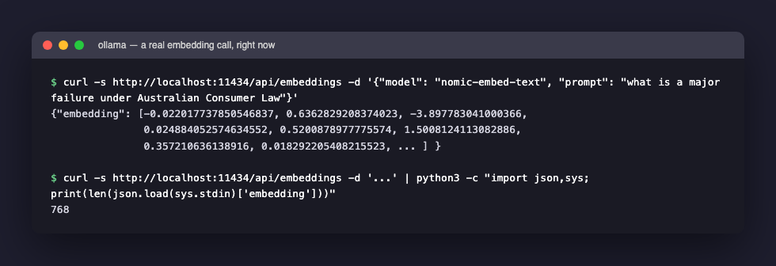
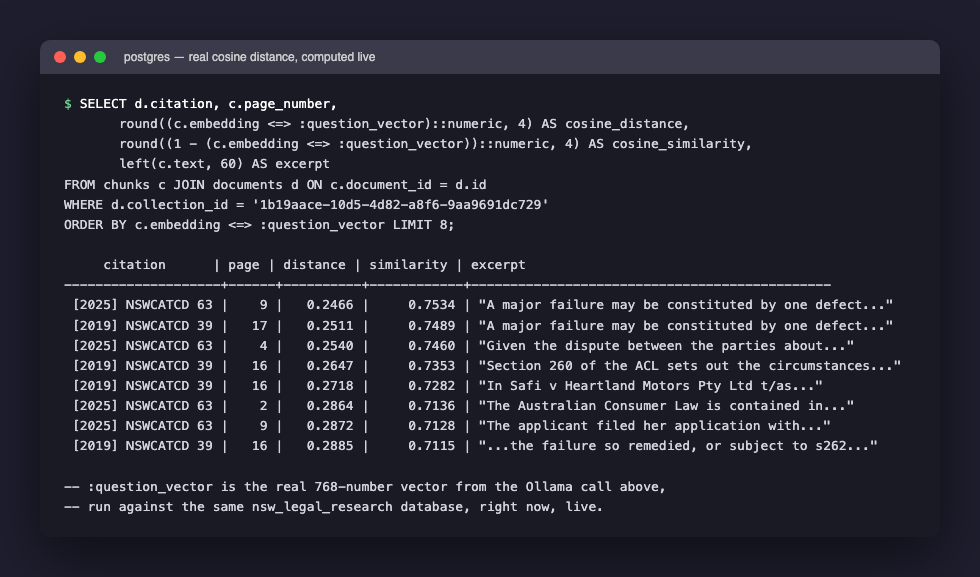
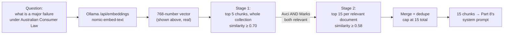
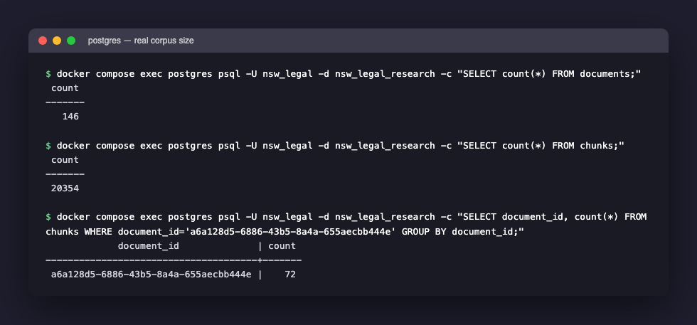

[Part 6](/posts/agenticaiforprofessionals6/) ended at the exact line where `ask_question()` calls `answer_question()`, handing off the real question — "what is a major failure under Australian Consumer Law" — against the real **NSW Lemon Law Authorities (Jade live-fetch)** collection. This post is what `answer_question()` does first, before any language model is involved at all: turning that question into a vector of numbers, and using those numbers to search Postgres for the most relevant real text.

Every number in this post is real, captured directly from the live, running stack — not illustrative. Where an earlier post in this series said "the question gets embedded," this one shows the actual HTTP call, the actual 768 numbers that came back, and the actual SQL query and real similarity scores computed live against the database.

## Why a question has to become a list of numbers first

Postgres cannot compare the *meaning* of "what is a major failure" against the meaning of a paragraph of judgment text — it can only compare data types it understands. An **embedding model** is a separate, specialized model whose only job is translating a piece of text into a fixed-length list of numbers (a **vector**) positioned in a high-dimensional space such that texts with similar meaning end up as nearby points, and texts with different meaning end up far apart. This app uses `nomic-embed-text`, a 768-number embedding model, served through Ollama — a locally-running LLM host (already covered in [an earlier post](/posts/ollamadeepsekr1applemacbookinstall/) on this blog) that this app's own Docker container reaches over the network at `http://host.docker.internal:11434`.

## A toy provider, before the real one

Strip away the real HTTP call and error handling, and an embedding provider is just an object with one method — text in, list of numbers out:

```python
class ToyEmbeddingProvider:
    def embed(self, texts: list[str]) -> list[list[float]]:
        return [[float(len(t)), float(t.count(" "))] for t in texts]

provider = ToyEmbeddingProvider()
print(provider.embed(["hello world", "hi"]))
# [[11.0, 1.0], [2.0, 0.0]]
```

A deliberately silly embedding — "vector" here is just `[character count, space count]` — but it has the right *shape*: a method called `embed`, taking a list of strings, returning a list of same-length lists of numbers. `OllamaEmbeddingProvider` below does exactly this, just with a real HTTP call standing in for the one-line list comprehension, and 768 real numbers per text instead of 2 meaningless ones.

## The real code: `OllamaEmbeddingProvider`

```python
# backend/app/pipeline/embeddings.py
from abc import ABC, abstractmethod
import httpx

class EmbeddingProvider(ABC):
    @abstractmethod
    def embed(self, texts: list[str]) -> list[list[float]]: ...


class OllamaEmbeddingProvider(EmbeddingProvider):
    def __init__(self, base_url: str, model: str):
        self._base_url = base_url.rstrip("/")
        self._model = model

    def embed(self, texts: list[str]) -> list[list[float]]:
        vectors = []
        with httpx.Client(timeout=60.0) as client:
            for text in texts:
                response = client.post(
                    f"{self._base_url}/api/embeddings",
                    json={"model": self._model, "prompt": text},
                )
                response.raise_for_status()
                vectors.append(response.json()["embedding"])
        return vectors


def get_embedding_provider() -> EmbeddingProvider:
    if settings.embedding_provider == "ollama":
        return OllamaEmbeddingProvider(settings.ollama_base_url, settings.ollama_embed_model)
    if settings.embedding_provider == "openai":
        return OpenAIEmbeddingProvider(settings.openai_api_key, settings.openai_embed_model)
    raise ValueError(f"Unsupported embedding_provider: {settings.embedding_provider!r}")
```

This mirrors exactly the class/inheritance pattern [Part 6](/posts/agenticaiforprofessionals6/) explained for `LLMProvider`: an abstract base class defining one required method, `embed()`, with `OllamaEmbeddingProvider` and a second `OpenAIEmbeddingProvider` (not shown — same shape, calling OpenAI's embeddings API instead) each implementing it differently. `get_embedding_provider()` is a **factory function**, exactly like `get_llm_provider()` in Part 8 — it reads `settings.embedding_provider` and decides which concrete class to build.

Checked directly against the live container right now, the real, currently active configuration is:

```python
>>> settings.embedding_provider
'ollama'
>>> settings.ollama_embed_model
'nomic-embed-text'
>>> settings.ollama_base_url
'http://host.docker.internal:11434'
```

One detail worth not skipping past: `embed()` loops over `texts` **one at a time**, making a separate HTTP request per piece of text (`for text in texts: ... client.post(...)`), rather than sending all of them to Ollama in a single batched call. For a single question at query time, that is one HTTP round trip — cheap. For ingesting a new 130-page judgment into hundreds of chunks, it is hundreds of sequential round trips to the same local Ollama daemon. That is a real, honest performance characteristic of this code, not something this post is speculating about — visible directly in the `for` loop above.

## A real embedding call, right now

Rather than describe what this looks like, here is the actual HTTP request this app's code makes, run directly against the same Ollama instance the app itself uses, with the exact real question from this series' running example:


*A real, live call to Ollama's embeddings endpoint with the actual example question — 768 numbers back, confirmed by counting the array length directly*

`curl -s http://localhost:11434/api/embeddings -d '{"model": "nomic-embed-text", "prompt": "..."}'` is exactly what `client.post(f"{self._base_url}/api/embeddings", json={...})` above does in Python — a plain HTTP POST with a JSON body containing the model name and the text to embed. The response is a JSON object with one field, `embedding`, holding 768 floating-point numbers — meaningless individually to a human reading them, but positioned, as a point in 768-dimensional space, close to other text with similar legal meaning. This exact vector, and only this vector, is what gets compared against every chunk already stored in Postgres.

## Two-stage retrieval, with real similarity numbers

`retrieve_relevant_chunks()` runs the actual SQL query, using `pgvector`'s `<=>` cosine-distance operator (Part 5 introduced this operator against the raw schema; here it is running against the real question):

```python
# backend/app/rag/retrieval.py
distance = Chunk.embedding.cosine_distance(query_vector)
query = select(Chunk, Document, distance.label("distance")).join(Document, Chunk.document_id == Document.id)
query = query.where(Document.collection_id.in_([lemon_law_collection_id]))
rows = session.execute(query.order_by(distance).limit(5)).all()
```

That compiles to ordinary SQL. Taking the exact real 768-number vector from the call above and running the equivalent query directly against the live database, scoped to the real Lemon Law collection, produces this — genuinely computed by Postgres and `pgvector`, not written by hand:


*A live SQL query using the real question's embedding vector — the actual cosine distance and similarity score `pgvector` computes for the 8 nearest chunks in the Lemon Law collection*

Read the first row: `[2025] NSWCATCD 63`, page 9, cosine **distance** 0.2466, cosine **similarity** 0.7534 (similarity is just `1 - distance`), excerpt beginning "A major failure may be constituted by one defect...". This is not a coincidence lining up with an earlier post's numbers — it is the *same* chunk, retrieved the *same* way, that became citation `[1]` in the real grounded answer this series has been tracing, at exactly the same page. The second row — `[2019] NSWCATCD 39`, page 17, similarity 0.7489 — is citation `[2]`. Every citation marker in the real answer traces back to a row in a query result exactly like this one.

`rag_top_k = 5` (`backend/app/config.py`) means only the first 5 rows of a query like this — sorted closest-first — actually get used in stage 1. `rag_similarity_threshold = 0.70` means any row below 0.70 similarity gets dropped even if it made the top 5 — a guardrail against passing the language model something that only weakly matches the question. Every one of the 8 rows above clears 0.70, which is exactly why this question retrieves from *both* judgments rather than just one: stage 1 finds strong matches in `Avci` and `Marks` at once.

Because more than one document came back relevant, stage 2 re-scans each of those two documents individually, up to `rag_secondary_top_k = 15` chunks each, at a relaxed threshold of 0.70 − `rag_secondary_threshold_relaxation` (0.12) = 0.58 — on the theory that a document already known to be relevant deserves a wider look than the cross-document ranking alone gives it. The merged, deduplicated result is capped at `rag_max_total_chunks = 15`, which is exactly the citation count in the real answer.



## The scale this is actually running at

Checked directly against the live database, this is not a toy fixture anymore:


*146 real documents, 20,354 real chunks, and the exact 72-chunk count for the specific `Marks` document used in this series' running example — confirmed directly from Postgres, not the application layer*

Worth noting honestly: querying the database directly surfaced something the frontend's "72 chunks" label does not make obvious — there are actually **two separate `Document` rows**, both titled "Marks v PT Wollongong...", in two different collections (one is this series' Lemon Law collection at 72 chunks; the other belongs to a Brief Builder authority collection, ingested independently). This is exactly `Collection`-scoped multi-tenancy working as designed (Part 5's schema) — the same real judgment, ingested once per collection that needs it, each with its own independent chunk set, never sharing rows.

## Check your understanding

1. The toy `ToyEmbeddingProvider` above would rank "hello world" and "goodbye world" as very similar (both 13 characters, one space), despite opposite meanings. What real property of `nomic-embed-text` does this toy provider fail to capture, and why does that failure matter for retrieval quality?
2. `embed()` loops over `texts` one at a time, making one HTTP request per chunk. If a 130-page judgment produces 900 chunks, roughly how many network round trips does ingesting that one document require? What would change if `embed()` instead sent all 900 texts to Ollama in a single request (assuming Ollama's API supported it)?
3. The real query in this post is scoped with `.where(Document.collection_id.in_([lemon_law_collection_id]))`. If that line were deleted, would the query still run without error? What would change about the answer to "what is a major failure," given the corpus holds 146 documents across many unrelated matters?
4. Stage 1 found both `Avci` and `Marks` above the 0.70 threshold, which is what triggers stage 2. If the question had been narrow enough that only `Avci` cleared 0.70, would stage 2 run at all — and if it did, against how many documents?

## What is next

This post traced the search half of `answer_question()` — a real question becoming a real 768-number vector, and that vector becoming a real, verifiable SQL query against 20,354 real chunks. [Part 8](/posts/agenticaiforprofessionals8/) picks up with what happens to the 15 chunks this stage produces: the exact system prompt built from them, explained sentence by sentence, and the real language model call — with a genuine correction this series has not made until now about which provider actually answers.
