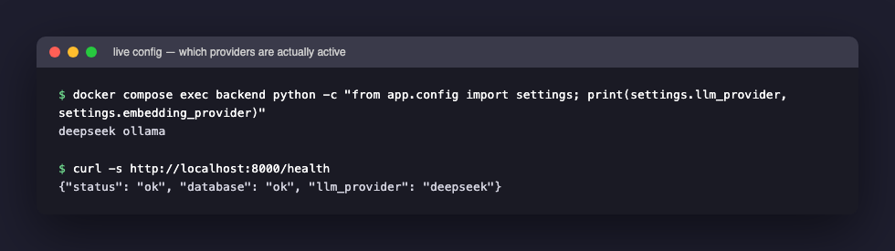
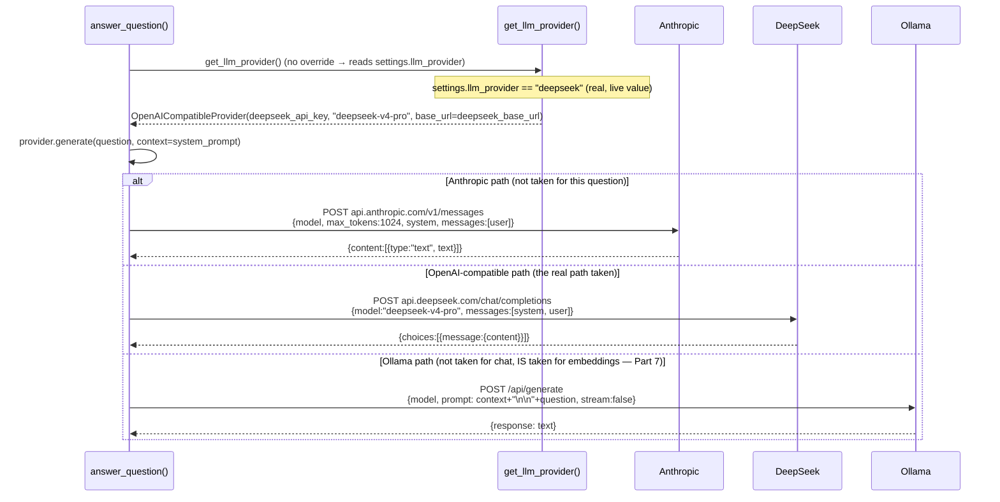
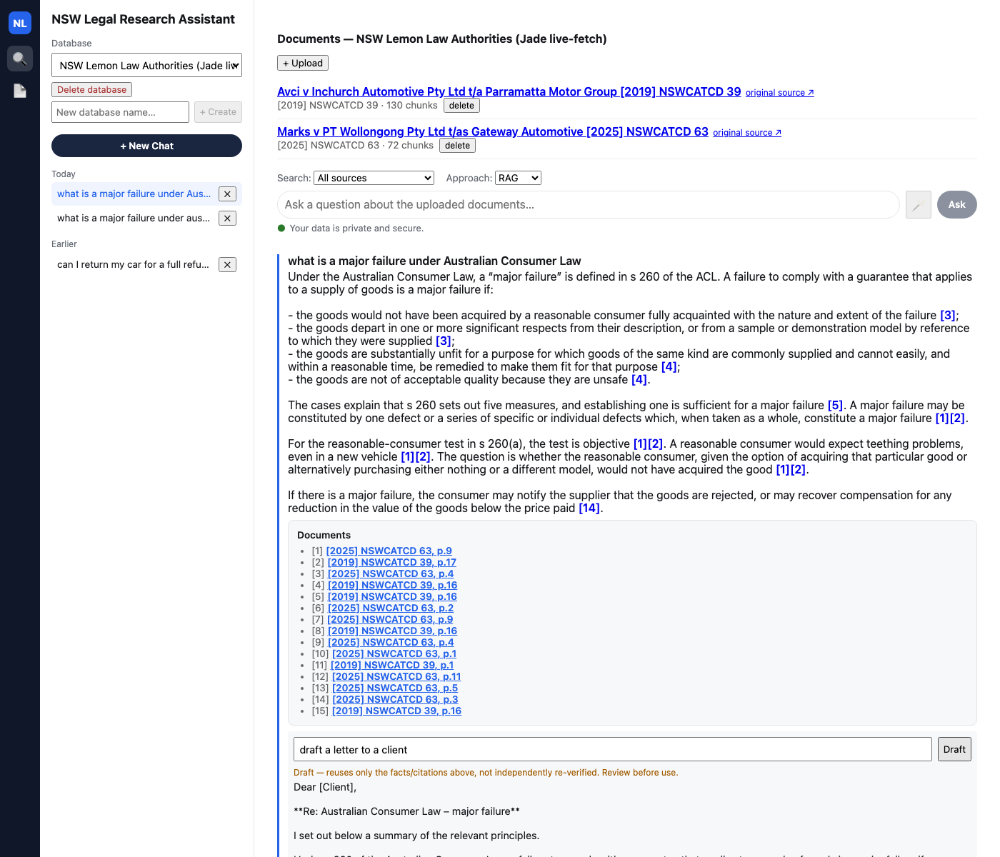

[Part 7](/posts/agenticaiforprofessionals7/) ended with 15 real chunks retrieved from Postgres for the real question, "what is a major failure under Australian Consumer Law." This post is what happens to those 15 chunks next: the exact system prompt built from them, sent to a real language model, and the real answer that came back — checked directly against the live, running app rather than assumed from reading the source code alone, which turned up a genuine correction worth making plainly rather than quietly.

## A correction, made directly against the live app

Every earlier post in this series describing this app's default LLM behaviour said, correctly reading the source code, that `settings.llm_provider` defaults to `"anthropic"`. That is true of the *code's default*. It is not true of *this app as actually configured and running right now* — checked directly against the live backend container:


*The real, currently active configuration, read directly from inside the running backend container and from its own `/health` endpoint — chat answers come from DeepSeek, not Anthropic*

`settings.llm_provider` is `"deepseek"` in the real deployed `.env`, and `/health`'s own response confirms it independently. This matters for exactly the reason this whole post exists: "provider-agnostic" is a real, true property of this codebase's design, but *which* provider is actually answering a given real question is a fact about configuration, not about code — and the only way to know it for certain is to check the running system, not to read a default value in `config.py` and assume it holds. Every provider-specific claim in this post is checked the same way.

## Before retrieval even runs: rewriting a vague follow-up

`answer_question()` (Part 6's trace) calls one more thing before Part 7's retrieval ever starts — `condense_question()` — and for the very first question in a conversation, Part 6 already showed it does nothing at all (`if not history: return question`). A **real** follow-up question exercises the other branch. Asked live, right after the major-failure question above, with that prior exchange passed as history:

```python
# backend/app/rag/condense.py
CONDENSE_PROMPT = """You are rewriting a follow-up question so it can be searched on its own, \
without needing the conversation before it.

Recent conversation (most recent last):
{history_block}

New question: {question}

Rewrite the new question as a single, self-contained question -- but ONLY if it implicitly \
refers to something in the conversation above... If the new question ALREADY stands on its \
own... return it completely unchanged. Do not answer the question. Do not add any fact that \
wasn't already in the new question or the conversation above...

Rewritten question (return ONLY the question text, nothing else, no quotes, no commentary):"""

def condense_question(question: str, history: list[HistoryTurn]) -> str:
    if not history:
        return question
    prompt = CONDENSE_PROMPT.format(history_block=_build_history_block(history), question=question)
    provider = get_llm_provider()
    rewritten = provider.generate(prompt).strip().strip('"')
    return rewritten or question
```

**What was actually typed**, as a genuine follow-up, live against the running app:

> `"what remedy is the consumer entitled to if there is one?"`

**What `condense_question()` actually rewrote it to** — a real, live model call, using the exact prior exchange as `{history_block}`:

> `"What remedy is a consumer entitled to under Australian Consumer Law if there is a major failure?"`

This is the whole mechanism made concrete: the vague phrase "if there is one" — meaningless on its own to a similarity search, since it names no topic at all — became "if there is a major failure," and the question picked up "under Australian Consumer Law" from context, entirely by the model reading the prior exchange and making the implicit reference explicit, exactly as the prompt instructs. `.strip().strip('"')` is defensive cleanup — trimming whitespace and any stray quote marks the model might wrap its answer in — and `rewritten or question` falls back to the original question if the model somehow returns an empty string, using the `or` idiom already seen throughout this series.

The re-asked question then goes through Part 7's retrieval exactly as before — real embedding, real cosine-distance search — and came back **grounded**, with **15 citations again**, this time correctly finding s 259(3) and s 263(4) (the actual remedy provisions) rather than re-finding s 260 (the major-failure *definition* provisions from the first question). Nothing about retrieval or citation-building changed for a condensed question — `condense_question()` only ever changes *what text gets embedded and searched for*, never how a citation gets sourced once chunks come back, which is exactly why a bad rewrite could at worst degrade to an honest "not found," never fabricate a citation.

## A toy example: what a "system prompt" actually is

If you have never called an LLM API directly, "system prompt" can sound abstract. It is not — it is just one more field in an HTTP request body. Two API calls, same question, different system prompt, real difference in behaviour:

```python
# Call 1 -- no system prompt at all
client.messages.create(
    model="claude-sonnet-5", max_tokens=100,
    messages=[{"role": "user", "content": "What is the capital of France?"}],
)
# -> "The capital of France is Paris."

# Call 2 -- a system prompt constraining how it must answer
client.messages.create(
    model="claude-sonnet-5", max_tokens=100,
    system="Answer only in French, in exactly one word.",
    messages=[{"role": "user", "content": "What is the capital of France?"}],
)
# -> "Paris."
```

The `system` field is not magic — it is text the API treats as instructions-with-authority rather than just more conversation, and every provider that supports it (Part 6 covered Anthropic's `AnthropicProvider`, using exactly this `system=` parameter) sends it as a genuinely separate field in the request body, never mixed into the `messages` array. This app's real system prompt below does the same thing at far greater length: instead of "answer in French, one word," it is "answer using only these 15 numbered excerpts, cite every claim, say so if the excerpts do not cover it" — a longer, more specific version of the identical mechanism.

## The full system prompt, sentence by sentence

This is the actual, complete text sent to the model for every grounded-answer question, with the real 15-chunk block from Part 7 substituted in at the bottom:

```python
# backend/app/rag/qa.py
SYSTEM_PROMPT_TEMPLATE = """You are a legal research assistant. Answer the question using ONLY the numbered \
source excerpts below -- do not use any outside knowledge, even if you know the \
answer. Cite every factual claim inline using the excerpt's bracket marker, e.g. \
[1]. If the excerpts do not contain enough information to answer, say so \
explicitly instead of guessing. Some excerpts are marked [UNVERIFIED SOURCE] -- \
these come from a bulk-imported dataset of unconfirmed provenance, not a \
document a person verified and uploaded. When a claim relies on one, say so \
explicitly (e.g. "an unverified source states...") rather than presenting it \
with the same confidence as an unmarked excerpt. Some excerpts are marked \
[PRACTICAL GUIDANCE, NOT PRIMARY LAW] -- these come from a handbook, guide, \
or law firm article commenting ON the law, not from an actual judgment or \
statute. When a claim relies on one, phrase it as guidance/commentary (e.g. \
"one guide states..." or "according to a practitioner summary...") rather \
than stating it as if it were the law itself -- an unmarked excerpt is an \
actual primary-law source (a judgment) and can be stated directly. If two \
excerpts state different figures or outcomes for what looks like the same \
claim (e.g. a damages amount), do not silently pick one -- a later stage of \
the same proceeding (an appeal revising a trial judge's figure, a \
correction, a re-assessment) often supersedes an earlier one. State which \
figure is the final/operative one if the excerpts make that clear (e.g. one \
excerpt explicitly says it revises or sets aside the other), and say so \
explicitly if they don't make it clear which one controls, rather than \
guessing.

{context_block}"""
```

A system prompt is nothing magical — it is a piece of plain-text instructions handed to the model in a privileged position (as `system` content, in the case of Anthropic and OpenAI-shaped APIs; concatenated in front of everything else, in Ollama's case — Part 6's abstract-base-class explanation is why the calling code never has to know which). Reading this one clause by clause, since every sentence exists to close one specific, real failure mode:

- **"Answer the question using ONLY the numbered source excerpts below — do not use any outside knowledge, even if you know the answer."** This is the entire grounding guarantee, stated as an instruction. The model very likely *does* know general facts about Australian Consumer Law from its own training — this sentence tells it not to use that knowledge, and to treat the 15 excerpts as the *only* permitted source of fact, even when its own training data would let it answer faster or more completely.
- **"Cite every factual claim inline using the excerpt's bracket marker, e.g. [1]."** This is what produces the `[1]`, `[2]`, `[3]` markers visible in the real answer below — the model is told the exact citation syntax to use, matching the numbering Part 7's `_build_context_block()` already assigned.
- **"If the excerpts do not contain enough information to answer, say so explicitly instead of guessing."** The instruction that makes an honest "not found" possible at all, rather than the model padding out a thin match with plausible-sounding invention.
- **The `[UNVERIFIED SOURCE]` and `[PRACTICAL GUIDANCE, NOT PRIMARY LAW]` paragraphs** teach the model to recognise two literal text tags Part 7's `_build_context_block()` inserts inline for certain chunks, and hedge its language accordingly. Neither tag appears anywhere in the real Lemon Law prompt, because both `Avci` and `Marks` are `verified`, `primary_law` documents — but the instruction is present in every call regardless, since the same prompt template serves every question against every collection, some of which do contain flagged content.
- **The final paragraph, about two excerpts stating different figures**, exists because of a real, specific failure this app's build log records: a case where an appeal judgment's revised figure and a trial judgment's original figure both got retrieved together, and the model needed explicit instruction not to silently pick one without saying so.

Every sentence in this prompt is a direct response to a real way a language model could otherwise get something wrong — not a generic "be careful" instruction, but a specific patch for a specific, identifiable risk.

## A real DeepSeek prompt-and-response transcript

Rather than describe what the model does with this prompt, here is a genuinely real call made directly to the live app while writing this post — the exact question this series has traced throughout, sent fresh, answered by the real, currently-configured DeepSeek provider:

**What was sent** (system content — the template above with the real 15-chunk block from Part 7 substituted in; user content — just the bare question):

```
system: "You are a legal research assistant. Answer the question using ONLY
         the numbered source excerpts below... [15 labelled excerpts from
         Avci and Marks, exactly as retrieved in Part 7]"
user:   "what is a major failure under Australian Consumer Law"
```

**What came back, verbatim, from the real `/qa` endpoint, right now:**

> From the provided sources, a "major failure" under the Australian Consumer Law is defined by s 260 of the ACL [3][4]. Section 260 contains five measures against which non-compliance is assessed, and establishing **one** of those measures is sufficient [5].
>
> The excerpts identify the following grounds:
>
> - **Reasonable-consumer test (s 260(a))**: the goods would not have been acquired by a reasonable consumer fully acquainted with the nature and extent of the failure [3][4]. In applying this test, the cases state that a major failure may be constituted by one defect or a series of defects which, taken as a whole, constitute a major failure; the test is objective; and a reasonable consumer would expect teething problems even in a new vehicle [1][2].
> - **Departure from description/sample/demonstration (s 260(b))**: the goods depart in one or more significant respects from their description, or from a sample or demonstration model [3].
> - **Substantially unfit for a common purpose and not easily remedied** [4].
> - **Unsafe (s 260(e))**: the goods are not of acceptable quality because they are unsafe [4].
>
> The excerpt at [3] also begins quoting s 260(c) — "the goods are substantially unfit for a..." — but it is cut off, so the provided sources do not contain the full text of that paragraph.

That last sentence is worth pausing on: the model noticed one of its own retrieved excerpts was truncated mid-sentence, and said so explicitly, rather than either inventing the missing text or silently ignoring the gap. Nothing in the system prompt specifically instructs "notice truncated excerpts" — this is the general "do not guess" instruction being followed in a situation the prompt's author did not anticipate word for word, which is exactly the kind of behaviour a well-scoped instruction is supposed to generalise to.

## Four providers, one interface, genuinely different mechanics

```python
# backend/app/llm/base.py
class LLMProvider(ABC):
    @abstractmethod
    def generate(self, prompt: str, context: str | None = None) -> str: ...
```

```python
# backend/app/llm/__init__.py
def get_llm_provider(override: str | None = None) -> LLMProvider:
    provider = override or settings.llm_provider
    if provider == "anthropic":
        return AnthropicProvider(settings.anthropic_api_key, settings.anthropic_model)
    if provider == "openai":
        return OpenAICompatibleProvider(settings.openai_api_key, settings.openai_model)
    if provider == "deepseek":
        return OpenAICompatibleProvider(settings.deepseek_api_key, settings.deepseek_model, base_url=settings.deepseek_base_url)
    if provider == "ollama":
        return OllamaProvider(settings.ollama_base_url, settings.ollama_chat_model)
    raise ValueError(f"Unsupported llm_provider: {provider!r}")
```

`override or settings.llm_provider` is Python's short-circuit `or`: use `override` if it was given (a truthy value), otherwise fall back to the global setting. For the real question above, no override was passed, so `provider = settings.llm_provider = "deepseek"`, and `get_llm_provider()` returns an `OpenAICompatibleProvider` — the **same class DeepSeek and OpenAI share**, since DeepSeek's API is deliberately OpenAI-compatible, just pointed at a different `base_url`.

```python
# backend/app/llm/anthropic_provider.py
def generate(self, prompt, context=None):
    response = self._client.messages.create(
        model=self._model, max_tokens=1024,
        system=context or "",
        messages=[{"role": "user", "content": prompt}],
    )
    return response.content[0].text
```

```python
# backend/app/llm/openai_compatible_provider.py -- the real path for this app's actual answer
def generate(self, prompt, context=None):
    messages = []
    if context:
        messages.append({"role": "system", "content": context})
    messages.append({"role": "user", "content": prompt})
    response = self._client.chat.completions.create(model=self._model, messages=messages)
    return response.choices[0].message.content
```

```python
# backend/app/llm/ollama_provider.py
def generate(self, prompt, context=None):
    full_prompt = f"{context}\n\n{prompt}" if context else prompt
    with httpx.Client(timeout=600.0) as client:
        response = client.post(f"{self._base_url}/api/generate", json={"model": self._model, "prompt": full_prompt, "stream": False})
        return response.json()["response"]
```



Four concrete, verifiable facts, all visible directly in the code above:

- **Anthropic and the OpenAI-compatible path both use an explicit `system`/`user` role split** — the excerpts and the question are sent as structurally distinct fields, never concatenated into one blob. This is the real mechanism behind the system prompt's instructions carrying real weight.
- **`max_tokens=1024` is a hard ceiling Anthropic's class applies** (roughly 750–800 words) that the `OpenAICompatibleProvider` class — the one actually used for the real DeepSeek answer above — does **not** set at all, relying on that API's own defaults instead. A real, minor inconsistency between the two paths, not a deliberate design choice documented anywhere.
- **None of the three providers stream.** Every one calls a single, blocking request/response API and returns one complete string once fully finished. [Part 11](/posts/agenticaiforprofessionals11/) covers what this means for the chat UI: the whole answer appears at once, not word by word.
- **Ollama's path has no role structure at all** — `f"{context}\n\n{prompt}"` is plain string concatenation, because Ollama's `/api/generate` endpoint is a flat text-completion API, not a chat API with message roles. The "provider-agnostic" interface genuinely hides a real mechanical difference in how the request is shaped underneath, not just a different network address.

## A second skill built on the first, not on the database

Typing "draft a letter to a client" right after the answer above, in the real running app, produces this:


*A real, live draft — "Dear \[Client\]... Re: Australian Consumer Law – major failure..." — generated from the prior answer above, with the app's own disclaimer printed directly beneath it*

That is `draft_from_answer()`, and the detail worth noticing is what it does *not* do: it never runs Part 7's retrieval again.

```python
# backend/app/rag/draft.py
CONTEXT_TEMPLATE = """You previously gave the following grounded answer to a legal research question, \
backed by these numbered source citations. When drafting what's asked next, use \
ONLY the facts and citations already established below -- do not introduce new \
facts, new cases, or new figures. Keep the bracket citation markers (e.g. [1]) \
inline wherever you reference a fact from a citation, exactly as they appear \
below.

Prior question: {question}
Prior answer:
{answer}
Citations:
{citations_block}"""


def draft_from_answer(question, answer, citations, instruction):
    context = CONTEXT_TEMPLATE.format(question=question, answer=answer, citations_block=_build_citations_block(citations))
    provider = get_llm_provider()
    draft_text = provider.generate(instruction, context=context)
    return DraftResult(draft=draft_text)
```

`draft_from_answer()` calls the exact same `get_llm_provider()` factory, and the exact same `generate()` method traced above — mechanically indistinguishable from the grounded-answer call at the API level, just given a completely different `context`: the entire prior exchange, rather than freshly-retrieved chunks. There is no `Chunk.embedding.cosine_distance()` call anywhere in this function, so there is structurally nothing for it to search, and therefore nothing for it to fabricate a *new* source for. It can still misstate or subtly reweight a fact it was correctly given — which is exactly why the real screenshot above shows the app's own disclaimer printed directly beneath the draft: *"Draft — reuses only the facts/citations above, not independently re-verified. Review before use."*

## The same two skills, exposed identically over REST and MCP

```python
# backend/app/mcp_server.py
server = MCPServer("nsw-legal-research-assistant")

@server.tool()
def ask_nsw_caselaw(question: str, document_id: str | None = None, collection_id: str | None = None) -> dict:
    ...  # calls answer_question() directly -- the exact function traced in Parts 6-8

@server.tool()
def draft_from_nsw_caselaw_answer(question: str, answer: str, citations: list[dict], instruction: str) -> dict:
    ...  # calls draft_from_answer() directly
```

`@server.tool()` is [MCP](/posts/agenticaiforprofessionals3/)'s equivalent of `@app.post(...)` from Part 6 — instead of registering a URL path, it registers a named tool an AI agent can discover and call, over stdio (standard input/output) rather than a network socket. A Claude Code session asking `ask_nsw_caselaw` this exact question gets the identical DeepSeek-generated, 15-citation answer the frontend shows, because both entry points call `answer_question()` directly.

## A real unit test for the provider-selection logic

This one function — `get_llm_provider()` — genuinely is covered by an automated test, using a technique worth naming since it recurs in good test suites generally:

```python
# backend/tests/test_llm.py
from app.config import settings
from app.llm import get_llm_provider
from app.llm.openai_compatible_provider import OpenAICompatibleProvider

def test_override_wins_over_the_global_default(monkeypatch):
    monkeypatch.setattr(settings, "llm_provider", "anthropic")
    provider = get_llm_provider("deepseek")
    assert isinstance(provider, OpenAICompatibleProvider)
    assert provider._model == settings.deepseek_model
```

`monkeypatch` is a pytest fixture — pytest automatically supplies it as a function argument whenever a test asks for it by name — that temporarily changes an attribute for the duration of one test, then automatically restores the original value afterward, even if the test fails partway through. `monkeypatch.setattr(settings, "llm_provider", "anthropic")` forces the global setting to `"anthropic"` regardless of what the real `.env` says, so this test's outcome does not depend on however the app happens to be configured on whichever machine runs it — a genuinely important property, since Part 6's earlier assumption (reading the default and believing it) is exactly the mistake a test like this exists to make impossible. `get_llm_provider("deepseek")` passes an explicit override, and `isinstance(provider, OpenAICompatibleProvider)` checks that the returned object really is built from that class — confirming the override wins over the (deliberately falsified) global default, and does so without a single real network call, since constructing a provider object just wires up a client, it does not call out anywhere until `.generate()` runs.

## Check your understanding

1. In the toy example, Call 2's `system` field says "answer only in French, in exactly one word." If that same instruction were pasted into the `messages` array as part of the `user` content instead of into `system`, would the API call still work? What is genuinely different about the two approaches, beyond where the text physically sits in the request?
2. This app's real system prompt says "answer using ONLY the numbered source excerpts below." If a user asked "what is the capital of France?" against the Lemon Law collection, what would you expect the real answer to be, and why — walk through what the 15-chunk retrieval step (Part 7) would actually find for that question.
3. `condense_question()` and the main grounded-answer call both call `get_llm_provider()` with no override. Are they guaranteed to use the *same* provider as each other for a single request? What about the `draft_from_answer()` call for the same conversation?
4. `OpenAICompatibleProvider.generate()` sets no `max_tokens` at all, while `AnthropicProvider.generate()` hardcodes `max_tokens=1024`. If DeepSeek's API applies its own default cap of, say, 4096 tokens, what real, observable difference could a user notice between a long DeepSeek answer and a long Anthropic answer to the same grounded question?

## What is next

This post covered the language-model layer completely: the real system prompt explained clause by clause, a genuine correction about which provider actually answers, all four providers' real mechanics compared, a real DeepSeek transcript, the drafting skill, and the one real unit test covering provider selection. [Part 9](/posts/agenticaiforprofessionals9/) covers how this whole Python service is tested end to end and hosted — with real terminal output from the live Docker stack, not a description of one.
