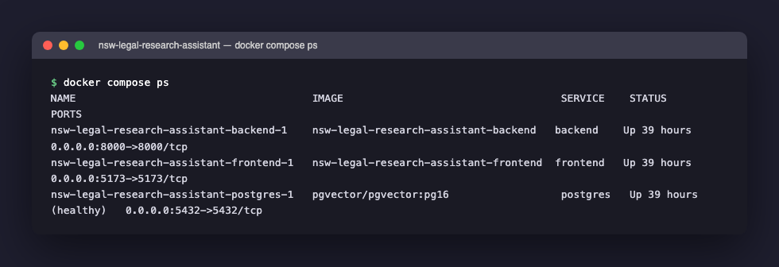
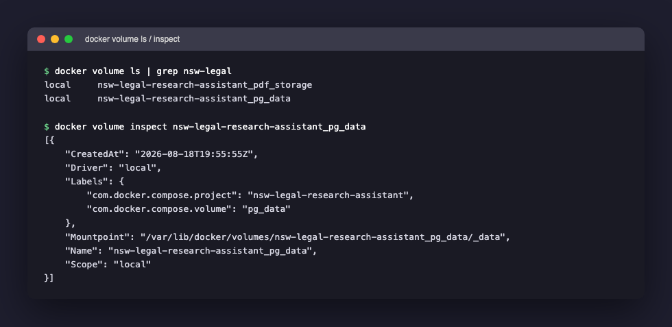
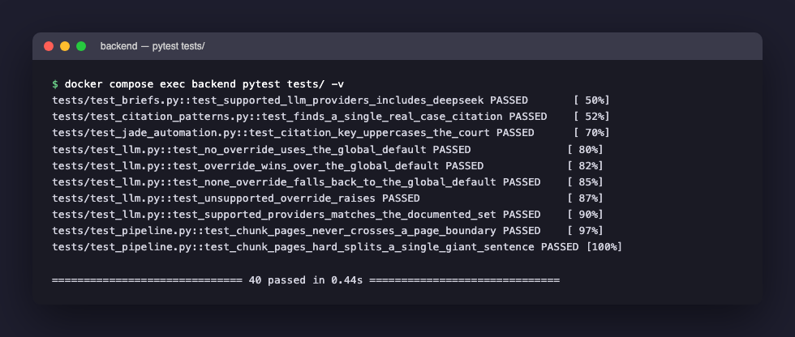

[Part 6](/posts/agenticaiforprofessionals6/) through [Part 8](/posts/agenticaiforprofessionals8/) traced the real Python service from request to grounded answer. This post steps back from that single request to cover two things that apply to the whole service: how it is actually tested, and how it is actually hosted — both shown against the real, live `nsw-legal-research-assistant` stack running on the same machine this series is written on, not a clean-room description of what a Docker Compose stack generally looks like.

## The real stack, right now

```bash
docker compose ps
```


*The actual three containers this series has been tracing against — backend, frontend, and postgres — captured live, mid-series, not staged for this screenshot*

`STATUS` reading "Up 39 hours" and "(healthy)" are not placeholder text — this is the genuine uptime of the containers this whole series' real screenshots, real SQL queries, and real LLM calls were captured against.

## The backend Dockerfile, line by line

```dockerfile
FROM python:3.12-slim
WORKDIR /app
RUN apt-get update && apt-get install -y --no-install-recommends pandoc && rm -rf /var/lib/apt/lists/*
COPY requirements.txt requirements-dev.txt ./
RUN pip install --no-cache-dir -r requirements-dev.txt
COPY app ./app
COPY scripts ./scripts
EXPOSE 8000
CMD ["uvicorn", "app.main:app", "--host", "0.0.0.0", "--port", "8000", "--reload"]
```

`FROM python:3.12-slim` starts from an official, pre-built image that already has Python 3.12 installed — a smaller ("slim") variant with fewer extras than the default Python image. `WORKDIR /app` sets the working directory for every instruction that follows, inside the container, to `/app`. `RUN apt-get install ... pandoc` installs a system-level program (not a Python package), needed because Brief Builder's Draft stage converts canonical Markdown to `.docx` files through it. `pip` is Python's own package installer; `requirements.txt`/`requirements-dev.txt` are plain text files, one package name per line, listing everything the app needs (FastAPI, SQLAlchemy, `pgvector`, `anthropic`, `openai`, `pytest`, and so on) — `pip install -r requirements-dev.txt` installs every one of them in one command. The two `COPY` lines copy the actual application source code into the image. `CMD [...]` is the command that runs when a container starts: `uvicorn` is the program that runs a FastAPI app and turns it into a real, listening web server ([Part 6](/posts/agenticaiforprofessionals6/) traces exactly what it does with each request); `--reload` tells it to watch the source files and restart automatically whenever one changes — invaluable while developing, and never something you want running in production.

`--reload` and a `requirements-dev.txt` that ships `pytest` inside the runtime image are both correct choices for local development and both wrong for a production image — this app's own `docker-compose.yml` comment says so directly, and the README's build-status table confirms production deployment (AWS/EKS) has not been built yet.

## How Docker volumes actually work

A running container's filesystem is, by default, thrown away the moment the container is removed — anything written inside it during its life disappears along with it. A **volume** is Docker's mechanism for a directory that lives *outside* any single container's lifecycle, which one or more containers can mount at a path inside themselves. This app declares two:

```yaml
# docker-compose.yml
volumes:
  postgres:
    volumes:
      - pg_data:/var/lib/postgresql/data
  backend:
    volumes:
      - pdf_storage:/app/storage

volumes:
  pg_data:
  pdf_storage:
```

`pg_data:/var/lib/postgresql/data` mounts a volume named `pg_data` at the exact path Postgres itself writes its real database files to inside the container. This is precisely why `docker compose down` (which removes containers) does not lose any real data, while `docker compose down -v` (which additionally removes volumes) does — the volume, not the container, is where the data actually lives.

Checked directly against this app's real, live volume:


*The real `pg_data` volume backing every SQL query and every real cosine-distance number in this series — its actual creation timestamp, its actual on-disk mount point, and the Compose project label that ties it to this specific stack*

`"Mountpoint": "/var/lib/docker/volumes/nsw-legal-research-assistant_pg_data/_data"` is a real path on the host machine's own filesystem (inside Docker's own managed storage area, on Linux terms even when Docker Desktop is running on macOS) — this is genuinely where every one of the 20,354 real chunks from [Part 7](/posts/agenticaiforprofessionals7/) physically lives on disk, independent of whether the `postgres` container itself is currently running. `"CreatedAt": "2026-08-18T19:55:55Z"` is the real moment this volume was first created — over a month before this post was written, meaning every real number in this series reflects a database that has been accumulating real data for weeks, not a fixture spun up fresh for a screenshot. `Labels.com.docker.compose.project` is exactly the mechanism [Part 5](/posts/agenticaiforprofessionals5/) warned about: Docker Compose derives this label from the directory name by default, which is why two independent checkouts sharing the same directory name can silently end up sharing (and corrupting) the same volume — a real gotcha this app's own build log records hitting.

## The real test suite, run live

```bash
docker compose exec backend pytest tests/ -v
```


*40 real tests, run directly inside the live backend container while writing this post — not a historical log, the actual current state of the test suite*

Categorising all 40 by what they actually exercise, and — critically — what they deliberately do *not* touch:

| File | What it tests | Database? | Network? | LLM? |
|---|---|---|---|---|
| `test_pipeline.py` | PDF text extraction and page-safe chunking, against real NSW Caselaw fixture PDFs | No | No | No |
| `test_citation_patterns.py` | The regex that finds and deduplicates citations inside extracted text | No | No | No |
| `test_jade_automation.py` | `_citation_key()` — the function that tells `Avci` and `Marks` apart by citation, not name | No | No | No |
| `test_briefs.py` | `create_brief()`'s validation logic, which runs and can raise *before* touching the database | No (deliberately, `session=None`) | No | No |
| `test_llm.py` | `get_llm_provider()`'s dispatch logic — [Part 8](/posts/agenticaiforprofessionals8/) covers this one directly | No | No | No (constructing a provider does not call it) |
| `test_brief_develop.py` | The logic that strips a fabricated citation a model might hallucinate, from real and synthetic examples | No | No | No |

Every single one of the 40 real tests runs with **no live Postgres connection, no live network call, and no live LLM call** — all 40 pass in 0.44 seconds, visible directly in the screenshot, which is only possible because none of them are waiting on a database round trip or an API response. This is a deliberate, consistent shape across the whole suite: test the deterministic, pure-function parts of the pipeline cheaply and constantly, and verify the expensive parts (a real database, a real model) a different way entirely.

## Where automated coverage stops, and what actually closes the gap

There is no committed pytest suite that spins up a real Postgres+`pgvector` database and asserts `retrieve_relevant_chunks()` returns the right rows, or one that mocks an LLM API and asserts a provider builds the exact request [Part 8](/posts/agenticaiforprofessionals8/) traced — worth stating plainly rather than implying otherwise. That layer is verified two other ways instead:

1. **Manually, against the live Docker stack**, recorded directly in the build plan at each phase — the README's Phase 1 entry states the exact verification: uploading fixture PDFs through the live endpoint and confirming in Postgres "119 chunks, all 768-dim vectors, correct page numbers, auto-detected citations."
2. **A committed smoke-test script that is a genuine integration test**, `backend/scripts/mcp_smoke_test.py` — it spawns `app/mcp_server.py` as a real child process over stdio, the same transport Claude Code uses, and calls a real tool for real, exercising the database, the embedding call, and the language model all in one script.

```python
# backend/scripts/mcp_smoke_test.py
params = StdioServerParameters(command="python", args=["-m", "app.mcp_server"], env=dict(os.environ))
async with stdio_client(params) as (read, write):
    async with ClientSession(read, write) as session:
        await session.initialize()
        result = await session.call_tool("ask_nsw_caselaw", {"question": QUESTION})
        payload = json.loads(result.content[0].text)
```

`async`/`await` mark this code as **asynchronous** — it can pause at an `await` (waiting for the subprocess to respond) and let other work happen in the meantime, rather than freezing the whole program. `env=dict(os.environ)` copies every current **environment variable** — the same `DATABASE_URL`, `DEEPSEEK_API_KEY`-style values Part 5 and this post's Compose file set — into the spawned subprocess. This is not incidental: the script's own docstring records a genuine bug this exact test caught during real verification — `StdioServerParameters` does not inherit the parent process's environment by default, so without this line the spawned server silently fell back to `config.py`'s default provider with no API key configured at all. A unit test with a mocked subprocess would never have surfaced this, because the whole point of this script is a real process boundary.

That is the actual shape of automated confidence in this app today: 40 fast, deterministic unit tests running in well under a second, plus a small number of real, full-stack scripts proving the expensive parts — a live database, a live model, a live subprocess — still agree with each other, run on demand rather than continuously (there is no CI pipeline configured for this app).

## What is next

Parts 6 through 9 covered the Python backend completely: FastAPI's mechanics, the RAG pipeline, the LLM layer, and now testing and hosting. [Part 10](/posts/agenticaiforprofessionals10/) crosses the network boundary to the other side: the React and TypeScript frontend that turns everything this arc has traced into the page a person actually reads.
