[Claude Code Part 15](/posts/claudecode15/) ended with an LCD module that Claude Code could talk to, because the board carried its own display and its own library. This time the target is a bare ATtiny85-20PU: an 8-pin microcontroller with no USB port, no LED, and no board around it. The chips came from [flashtree](https://www.flashtree.com/products/00028), a five-pack listed at $12.99 USD on sale. To write to them I used a cheap USB programmer, the Tiny AVR Programmer, and I asked Claude Code to handle everything else.

## Beat 1 — Build the circuit in Tinkercad

I also built the circuit in [Tinkercad](https://www.tinkercad.com), Autodesk's free browser circuit simulator, to check the power and the wiring alongside the real hardware.


*Starting a new Circuits design from the Create menu*

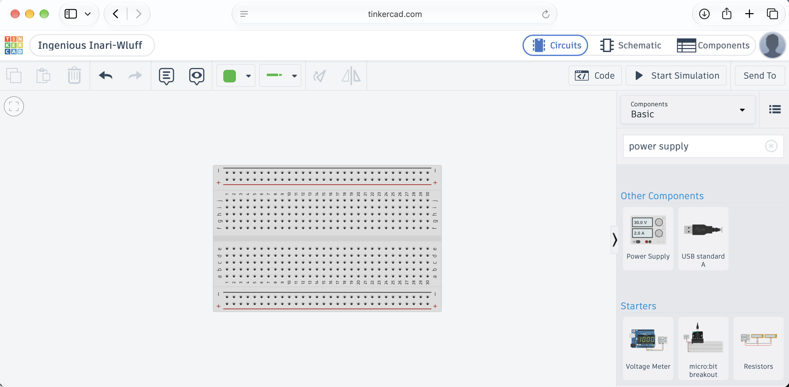
*Searching the components for a power supply to drive the breadboard*

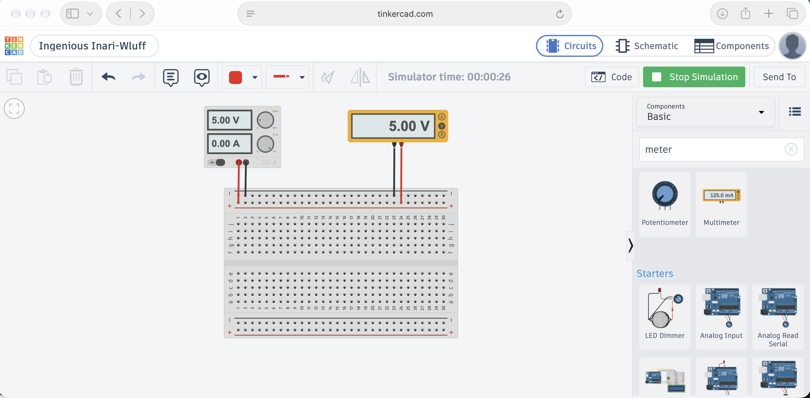
*A running simulation with the supply and multimeter both reading 5.00 V*

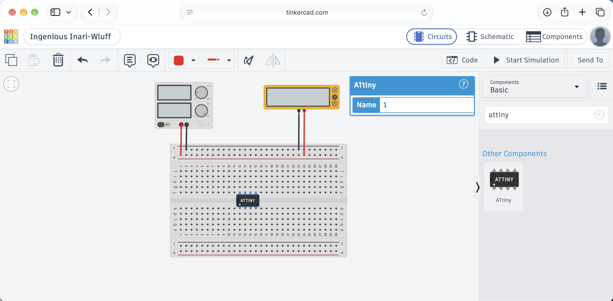
*The ATtiny placed on the breadboard and named in its properties panel*

Tinkercad can also program the chip with blocks. I started in the blocks editor, with a forever loop that switches the built-in LED on and off, and then switched to the text view.

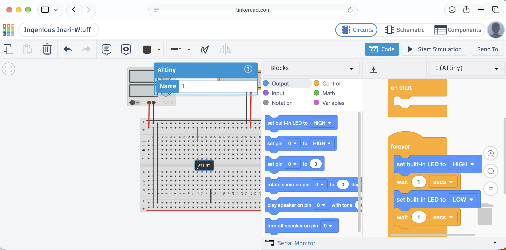
*The blocks editor, with the LED switched on for one second and off for one second in a forever loop*

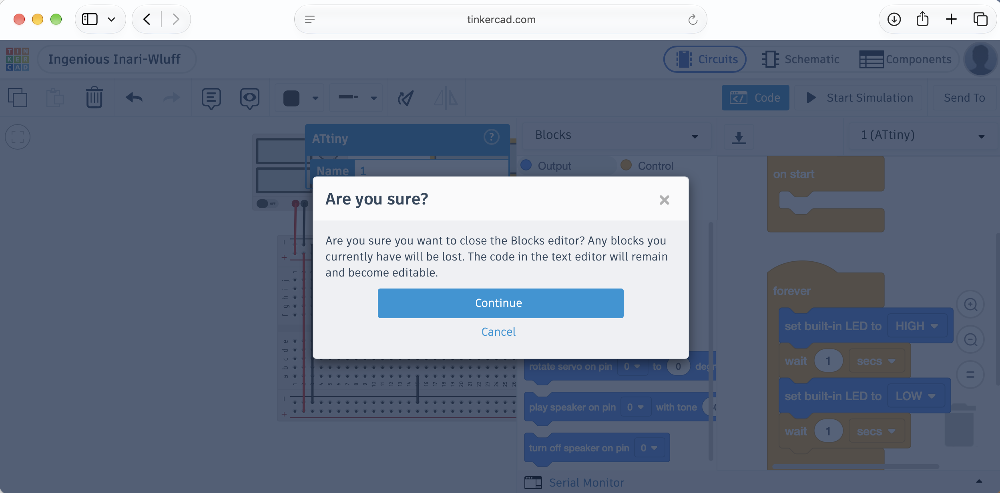
*Tinkercad warns that closing the blocks editor loses any blocks you have not converted*

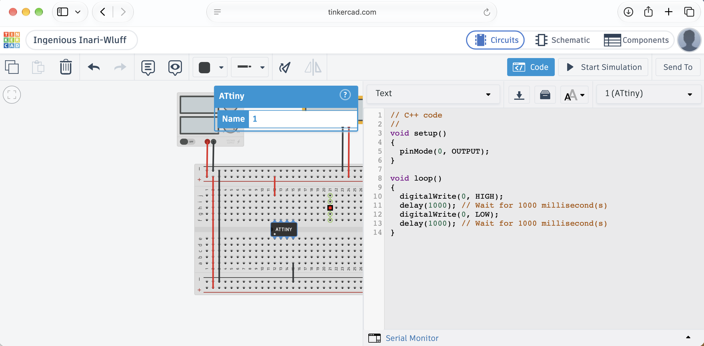
*The same program as text, with `digitalWrite(0, HIGH)` and `digitalWrite(0, LOW)` separated by 1000 ms delays*

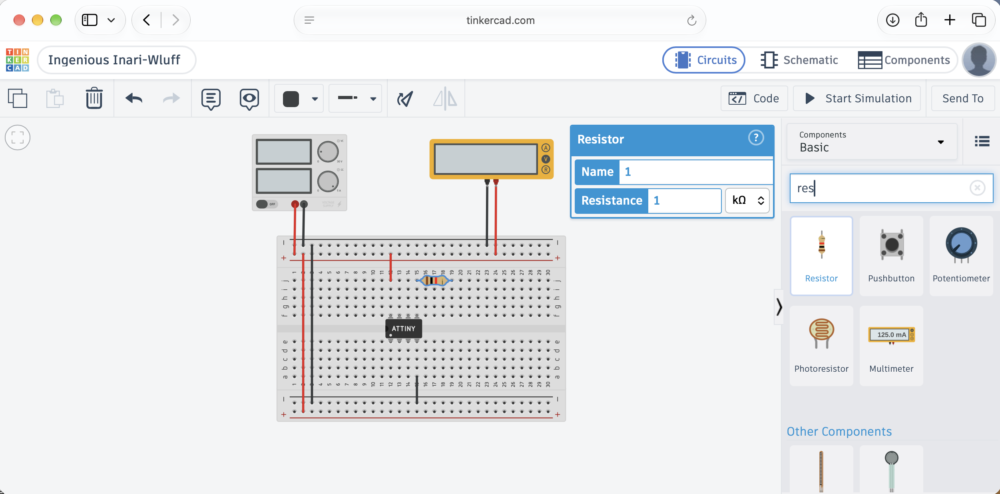
*Adding a 1 kΩ resistor to the breadboard*

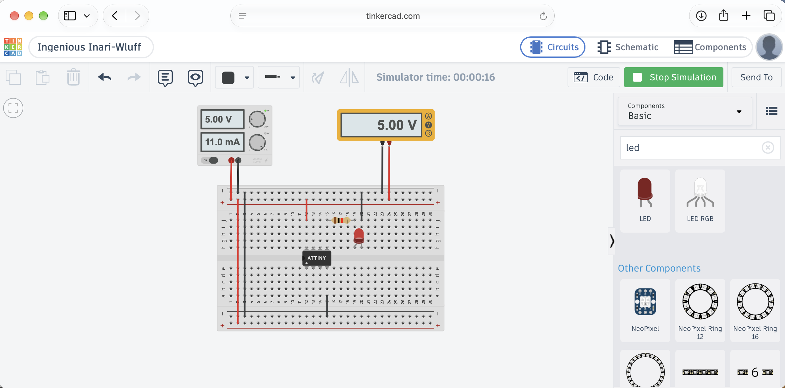
*The running simulation with the LED added, the supply at 5.00 V, and 11.0 mA drawn*

## Beat 2 — Ask Claude Code for a blink program

With the circuit sketched, I asked Claude Code for the real program in a new composer, pointed at an empty project folder.

```PROMPT
create an ATTiny85-20PU blink program and upload to the microprocessor
```

Claude needed an AVR compiler, and on this Apple Silicon Mac there were two obvious ways to get one. It asked me to choose, and it recommended trusting the osx-cross/avr tap. I accepted that recommendation. Claude also said it would check with me before making that change, because trusting a tap is a security setting.

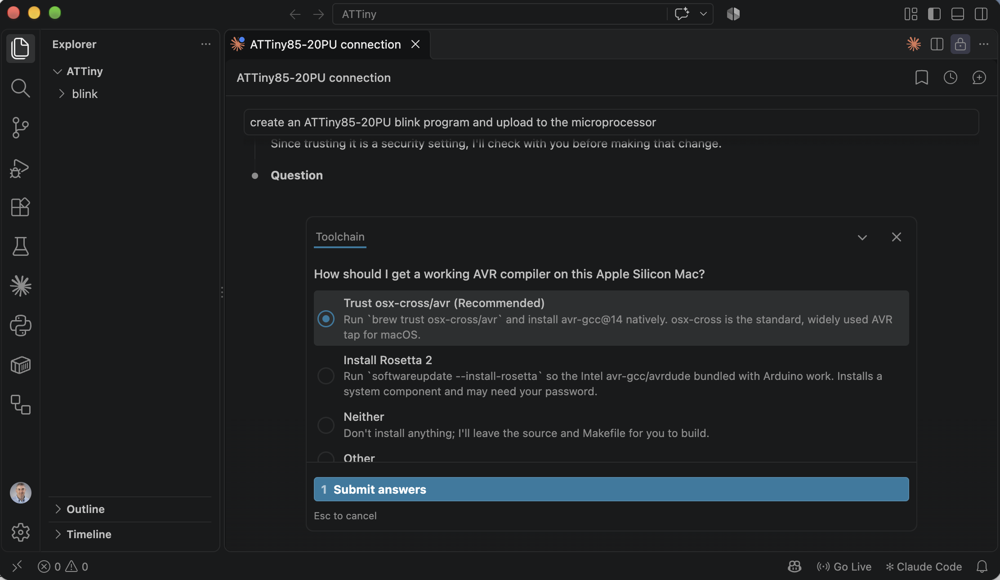
*Claude asked how to get a working AVR compiler; I took the recommended option*

Claude then wrote `blink.c` and a `Makefile` and ran the upload. `avrdude` wrote 82 bytes and read them back to verify them. The build commands it gave me were:

```bash
cd ~/ATTiny/blink
export PATH=/opt/homebrew/opt/avr-gcc@14/bin:$PATH
make flash
```

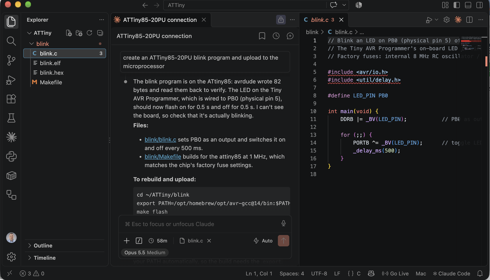
*Claude wrote the blink program, flashed it, and confirmed the readback; it said it could not see the board, so I needed to check the LED myself*

:::brain-power Before you read the code
Does `DDRB` control the direction of each pin, or the level it drives? Make a guess before reading on.
:::

Here is the program, exactly as I pasted it from the project:

```c
// Blink an LED on PB0 (physical pin 5) of an ATtiny85.
// The Tiny AVR Programmer's on-board LED is wired to PB0.
// Factory fuses: internal 8 MHz RC oscillator / 8 = 1 MHz.

#include <avr/io.h>
#include <util/delay.h>

#define LED_PIN PB0

int main(void) {
    DDRB |= _BV(LED_PIN);           // PB0 as output

    for (;;) {
        PORTB ^= _BV(LED_PIN);      // toggle LED
        _delay_ms(500);
    }
}
```

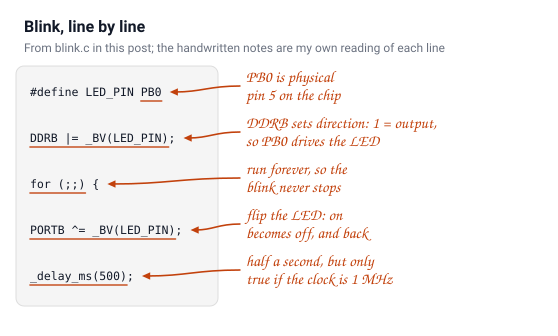
*The blink program line by line, with a note beside each line in my own words*

The logic is short. `DDRB` sets PB0 as an output, and the loop toggles it every 500 ms, so the LED changes state twice a second, a 1 Hz blink. The comment's claim that the programmer's own LED sits on PB0 is the one thing in this program that I could not confirm from the photos. The Tiny AVR Programmer hookup guide says "there's an on-board amber LED connected to pin 0 of the ATtiny85," and adds "The LED is connected to pin 0 in the Arduino environment." Pin 0 in that environment is PB0, which is physical pin 5. So the comment is correct, and the programmer's amber LED is the first thing that should blink.

:::watch-it The clock is part of the program
`_delay_ms(500)` does not measure the chip's clock. It assumes the value of `F_CPU`. If the fuses change the clock and the code keeps its 1 MHz assumption, the delays are wrong and the LED blinks at the wrong speed.
:::

## Beat 3 — Plug in the hardware

Next came the physical side: the programmer, the chip, and a USB connection.

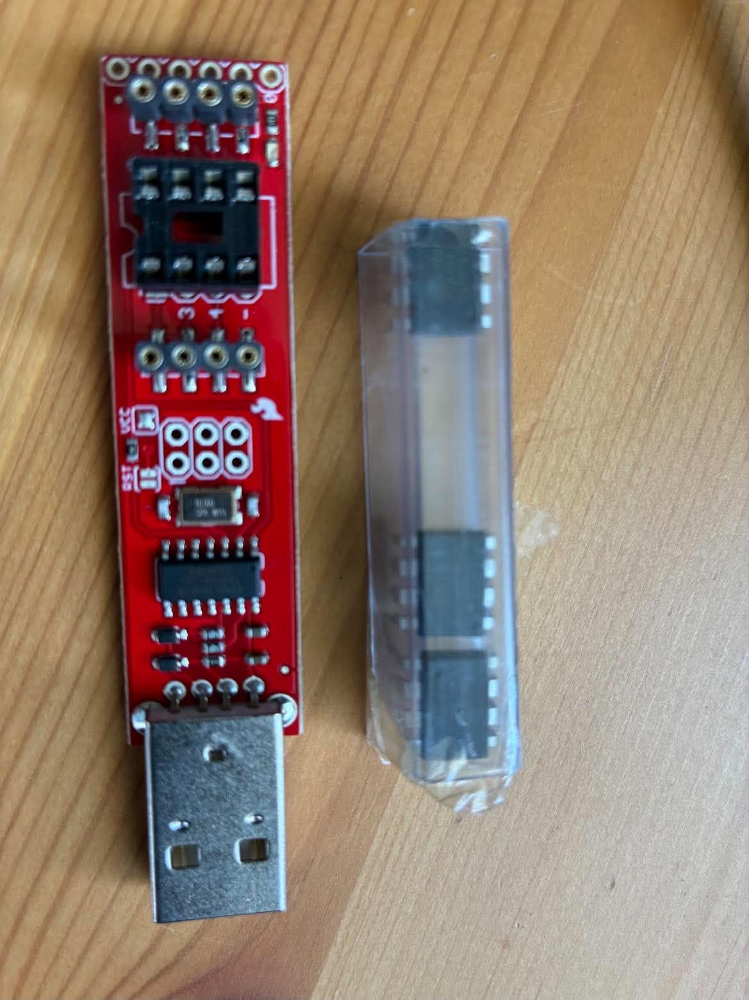
*The Tiny AVR Programmer beside a tube of ATtiny85 chips*

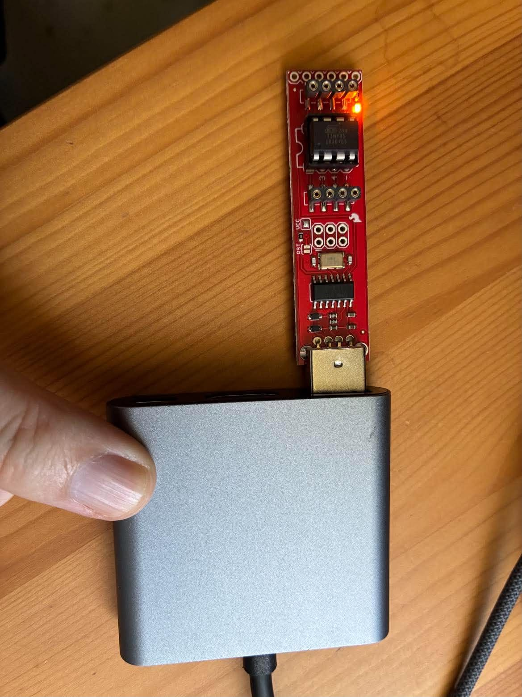
*The programmer on a USB-C hub with its amber LED lit once it has power*

When I plugged the programmer in, macOS asked whether to let the accessory connect. I allowed it.


*macOS asks permission before a USB accessory can connect; I allowed FabISP*

## Beat 4 — Can you see the chip?

I asked the question as a plain sentence, as I did for the LCD module in [Claude Code Part 15](/posts/claudecode15/).

```PROMPT
can you see ATTiny85-20PU connected via Tiny AVR Programmer
```

Claude went looking for `avrdude` first, and found the copy bundled with the Arduino tools. That copy is an Intel binary, and Rosetta is not installed on this Mac, so it would not run. Claude installed a native `avrdude` with Homebrew and queried the chip in the background.

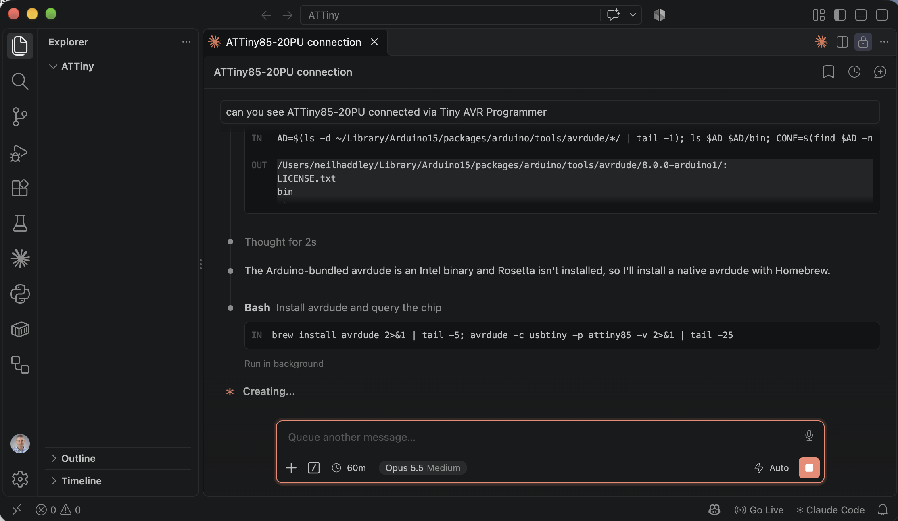
*Claude found the Arduino-bundled avrdude is Intel-only, then installed a native one with Homebrew*

The query worked. Claude identified the programmer and the chip:

- **Programmer:** a USBtiny, which calls itself "FabISP" (VID `0x1781`, PID `0x0C9F`)
- **Chip:** device signature `1E 93 0B`, which is the ATtiny85
- **Fuses:** low `0x62`, high `0xDF`, extended `0xFF`, the factory defaults. The chip runs its internal 8 MHz RC clock divided by 8, so 1 MHz.
- **Upload command:** `avrdude -c usbtiny -p attiny85 -U flash:w:yourfile.hex:i`
- **8 MHz option:** set the low fuse to `0xE2` if I want the faster clock

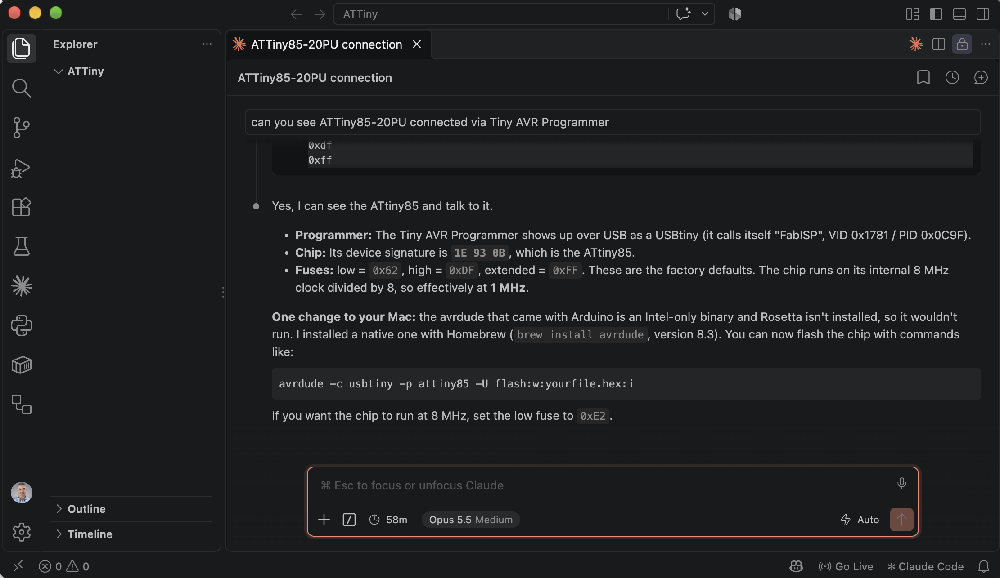
*Claude identified the programmer, the ATtiny85 signature, and the factory fuse settings*

:::under-the-hood Reading the fuse bytes
The low fuse byte holds the clock settings. Bit 7 is CKDIV8: a 0 there divides the clock by 8. So `0x62` (bit 7 = 0) runs at 1 MHz, and `0xE2` (bit 7 = 1) runs at the full 8 MHz.
:::

:::pencil Sharpen your pencil
If I changed the low fuse to `0xE2` but left the code unchanged, would the LED blink faster, slower, or at the same speed? Work it out from the code's `F_CPU` assumption.

:::answer
Faster. The code still assumes 1 MHz, so each `_delay_ms(500)` wait is only 1/8 of 500 ms when the chip runs at 8 MHz. The LED toggles about eight times faster.
:::
:::

Claude also made a point I had not expected: the 1 MHz setting in the Makefile is not an arbitrary choice. It matches the factory fuses, so the delay in the code matches the clock the chip actually runs at, with no change needed on the chip.

## The result

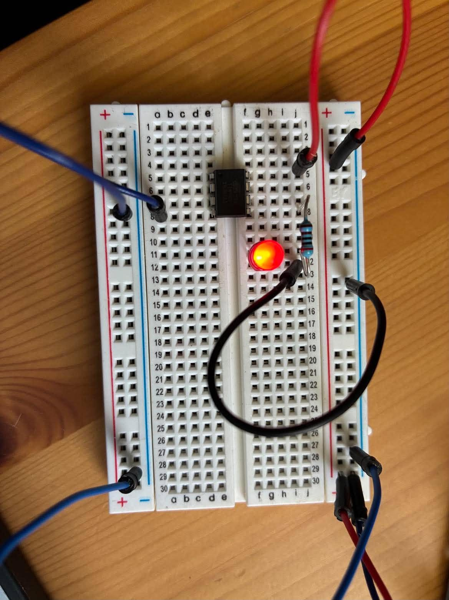
*The breadboard LED lit on the ATtiny85 circuit. This is a single frame, so it shows that the output works, not the 500 ms timing.*

:::no-dumb-questions
**Q: If `avrdude` read the bytes back, why does a lit LED still not prove the timing?**

A: The readback compares the flash contents with the file I built. It proves the bytes arrived intact. It says nothing about the clock, the wiring, or how fast the loop runs. One frame shows that the output works at that moment. Only watching the blink over several seconds shows the timing.
:::

## What stands out

- **Claude could not see the board, and it said so.** Its message after the upload said "I can't see the board, so check that it's actually blinking." The readback from `avrdude` proved the program was written, not that it runs. I checked the LEDs myself.
- **My own first doubt was wrong.** When I read the blink comment against the photos, I suspected that the programmer's LED could not be on PB0. The hookup guide says it is, so the comment was right and my suspicion was not. The lesson I took is to check a hardware claim against a source before publishing it, whether it comes from Claude or from my own reading of a photo.
- **The surprises were in the toolchain, not the wiring.** The LCD in Claude Code Part 15 hid a wiring quirk inside a library's source comments. This chip is bare, so the problems were an Intel-only `avrdude` on an Apple Silicon Mac, and a fuse setting that decides the clock speed the code's delays depend on.
- **Claude asked before the security change and not before the rest.** It stopped to ask before trusting the Homebrew tap. After my answer, it installed the toolchain and a native `avrdude` through Homebrew without asking again.

:::bullet-points Recap
- Claude Code found and installed a native `avrdude`, because the Arduino copy is Intel-only.
- The chip identifies as an ATtiny85 with factory fuses, which matches the 1 MHz delays in the code.
- A lit LED is one frame of evidence. The blink rate still needs to be watched over time.
:::

## References

- [flashtree Original Atmel Dip-8 ATTINY85-20PU](https://www.flashtree.com/products/00028)
- [Tiny AVR Programmer Hookup Guide (PDF)](https://mm.digikey.com/Volume0/opasdata/d220001/medias/docus/15/Tiny_AVR_Prog_Hookup_Guide_Web.pdf)
- [Tinkercad](https://www.tinkercad.com)
