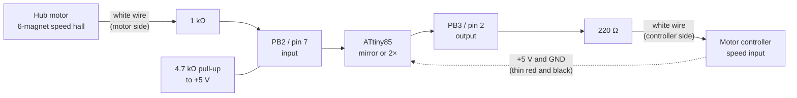
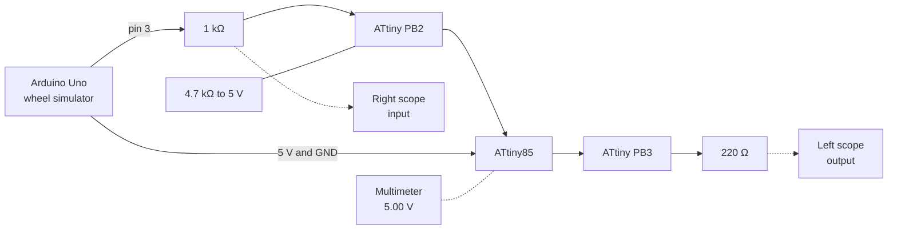
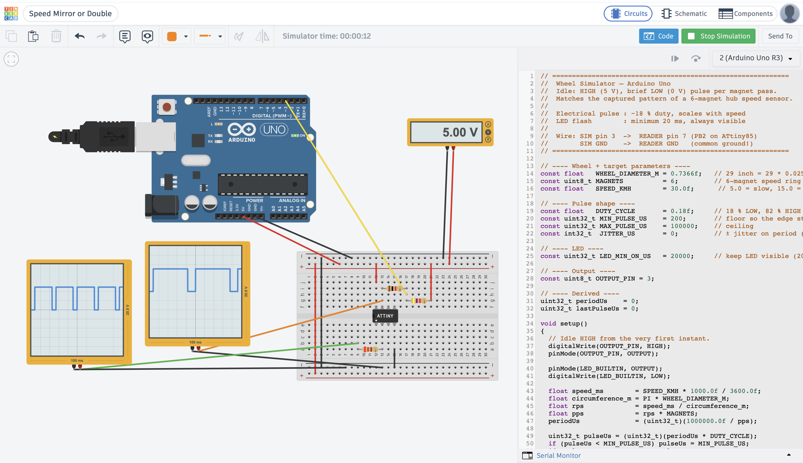
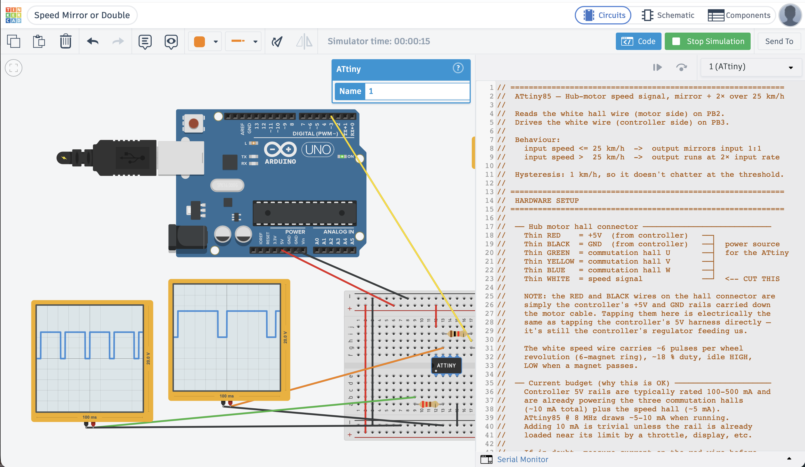
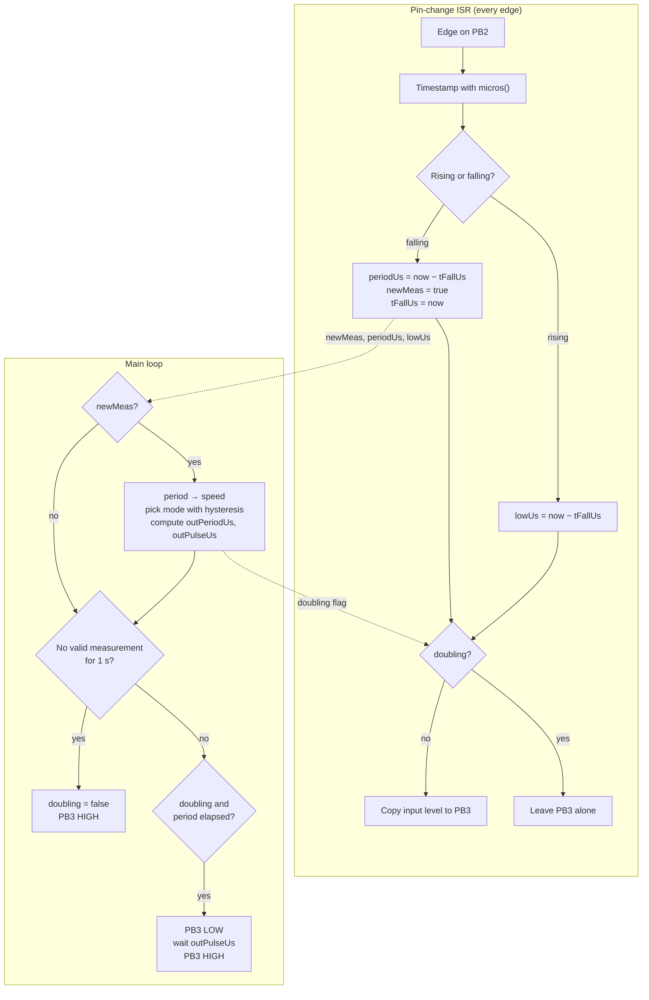
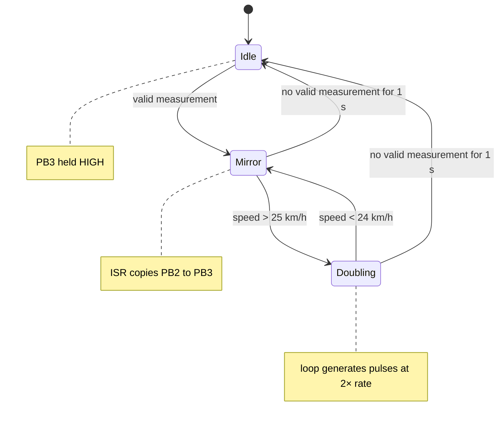
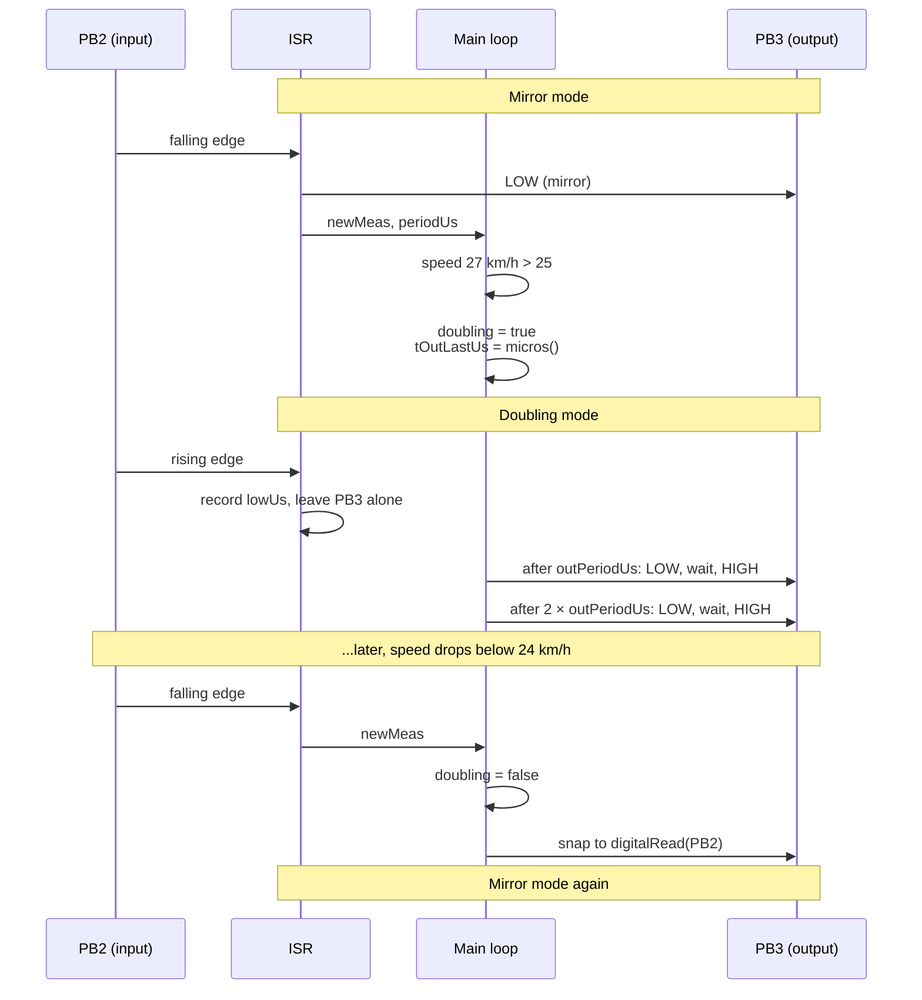

[Part 1](/posts/attiny1/) ended with a bare ATtiny85 blinking an LED. A blink program only drives a pin. This time the same chip has to read a signal, measure it, and drive a second signal from it, all in real time.

The job is an e-bike speed limiter. A hub motor has a speed sensor: a ring of 6 magnets and a hall sensor that pulls a white wire LOW each time a magnet passes. The motor controller counts those pulses to work out how fast the wheel turns. I cut that white wire and put the ATtiny85 in the gap.

- **Below 25 km/h**, the chip copies the signal straight through, so the controller sees the true speed.
- **Above 25 km/h**, the chip sends pulses at twice the input rate, so the controller sees twice the true speed. A controller set to a limit above 25 km/h then cuts assistance at about 25 km/h real speed.



*The ATtiny85 sits in the cut speed wire and takes its power from the controller's own 5 V rail*

## Why 25 km/h

The threshold comes from the law where I would ride. [Transport for NSW](https://www.transport.nsw.gov.au/roadsafety/bicycle-riders/ebikes) says that a road-legal e-bike in NSW must have:

- a maximum continuous rated power of 500 watts
- a motor that provides throttle power assistance up to 6 km/h, or up to 25 km/h when the rider is pedalling
- a motor that does not provide power at speeds higher than 25 km/h

## Beat 1 — A fake wheel in Tinkercad

I did not want to test this on a moving bike first, so I built the bench test in [Tinkercad](https://www.tinkercad.com), as I did in Part 1. Tinkercad can run two microcontrollers in one circuit, each with its own code. I used an Arduino Uno as a wheel simulator and the ATtiny as the device under test.



*The bench version of the circuit, with an oscilloscope on each side of the chip*

The Uno sketch converts a target speed into a pulse train that matches a real 6-magnet hub: idle HIGH, with a short LOW pulse for each magnet. These are its main settings:

```c
const float    WHEEL_DIAMETER_M = 0.7366f;  // 29 inch
const uint8_t  MAGNETS          = 6;        // 6-magnet speed ring
const float    SPEED_KMH        = 15.0f;    // the speed I change between runs
const float    DUTY_CYCLE       = 0.18f;    // 18 % LOW, 82 % HIGH
```

In `setup()` it turns the speed into a period:

```c
float speed_ms        = SPEED_KMH * 1000.0f / 3600.0f;
float circumference_m = PI * WHEEL_DIAMETER_M;
float rps             = speed_ms / circumference_m;
float pps             = rps * MAGNETS;
periodUs              = (uint32_t)(1000000.0f / pps);
```

:::brain-power Before you read the numbers
A 29-inch wheel has a circumference of about 2.31 m. At 25 km/h, how many milliseconds pass between two magnets? Work it out before you read the table.
:::

| Speed | Input period | Input LOW pulse | Mode | Output period | Output LOW pulse |
|---|---|---|---|---|---|
| 5 km/h | 278 ms | 50.0 ms | mirror | 278 ms | 50.0 ms |
| 15 km/h | 92.6 ms | 16.7 ms | mirror | 92.6 ms | 16.7 ms |
| 20 km/h | 69.4 ms | 12.5 ms | mirror | 69.4 ms | 12.5 ms |
| 25 km/h | 55.5 ms | 10.0 ms | mirror (threshold) | 55.5 ms | 10.0 ms |
| 27 km/h | 51.4 ms | 9.3 ms | double | 25.7 ms | 4.6 ms |
| 30 km/h | 46.3 ms | 8.3 ms | double | 23.1 ms | 4.2 ms |

## Beat 2 — Mirror mode at 15 km/h

I set `SPEED_KMH` to 15 and started the simulation. Both scopes show the same thing: one LOW pulse in each 100 ms window, because at 15 km/h a magnet passes every 92.6 ms. The output copies the input.


*At 15 km/h both scopes show a single LOW pulse per window, so the ATtiny passes the signal straight through*

## Beat 3 — Doubling mode at 30 km/h

I changed `SPEED_KMH` to 30 and ran it again. Now the scopes disagree. The right scope, on the input, shows about two pulses per 100 ms window, one every 46 ms. The left scope, on the output, shows about four, one every 23 ms.


*At 30 km/h the output (left) has twice as many pulses as the input (right)*


*The same run with the ATtiny's code open. The header comment describes the behaviour, the 1 km/h hysteresis, and how the hub connector's wires are used.*

## The problem: two modes, two timing budgets

The two modes want different things from the chip, and that conflict shapes the whole program.

**Mirror mode** needs the output to follow the input within microseconds. If the main loop copies the level, the copy waits for whatever the loop is doing, so it lags and jitters. The only place that sees every edge the moment it happens is the pin-change interrupt service routine (ISR).

**Doubling mode** needs pulses that do not correspond to any input edge. The chip has to generate them, which means waiting between them. Waiting inside the ISR is a bad idea:

```c
ISR(PCINT0_vect) {
    digitalWrite(OUT_PIN, LOW);
    delayMicroseconds(6000);       // blocks for 6 ms
    digitalWrite(OUT_PIN, HIGH);
}
```

While the ISR sits in `delayMicroseconds`, it cannot see new input edges, and those edges are the measurements the speed calculation depends on.

:::fireside-chat The ISR and the loop argue about who owns PB3
**ISR:** I see every edge the moment it happens. Let me drive the output. Nobody can mirror faster than me.

**Loop:** Fine below 25 km/h. Above it, the output needs pulses that do not line up with your edges. Are you going to sit and wait 4 ms for each one?

**ISR:** No. If I block, I miss the next edge, and then nobody knows the speed.

**Loop:** Then you measure and I generate. You can interrupt me in the middle of a pulse, and I will still be there when you return.

**ISR:** And who decides which of us drives the pin?

**Loop:** I do. I set one flag, `doubling`, and you read it on every edge.
:::

The answer is to split the work by mode:

| Mode | Who drives PB3 | Why |
|---|---|---|
| Mirror (below 25 km/h) | The ISR, on every edge | Lowest latency, exact level tracking |
| Doubling (above 25 km/h) | The main loop | It has to schedule pulses, and the ISR cannot wait without missing edges |



*The ISR measures and mirrors; the loop decides and generates. Three values and one flag cross between them.*

## The ISR

The ISR records three facts about the input and nothing more: the time of the last falling edge, the period between falling edges, and the width of the last LOW pulse. It does not compute speed and it never writes `doubling`.

```c
ISR(PCINT0_vect)
{
  uint32_t now  = micros();
  bool     high = (PINB & (1 << HALL_IN_PIN)) != 0;

  if (high) {
    // Rising edge — capture LOW pulse width
    if (tFallUs != 0) {
      lowUs = now - tFallUs;
    }
  } else {
    // Falling edge — capture period, flag new measurement
    if (tFallUs != 0) {
      periodUs = now - tFallUs;
      newMeas  = true;
    }
    tFallUs = now;
  }

  // Mirror mode: copy input level straight to output
  if (!doubling) {
    if (high) PORTB |=  (1 << OUT_PIN);
    else      PORTB &= ~(1 << OUT_PIN);
  }
}
```

The mirror path writes `PORTB` directly instead of calling `digitalWrite`, which keeps the copy to a couple of instructions.

## The loop

Once per input cycle, when the ISR sets `newMeas`, the loop does four things:

1. **Converts period to speed.** One wheel revolution takes `period × 6`, so `speed = circumference / (period × 6)`, times 3.6 for km/h.
2. **Chooses the mode, with hysteresis.** It enters doubling above 25 km/h and leaves below 24 km/h, so a speed that hovers at 25 does not flip the mode on every pulse.
3. **Precomputes the output schedule.** When doubling, `outPeriodUs = period / 2` and `outPulseUs = pulse / 2`, which keeps the 18 % duty cycle.
4. **Handles transitions**, which is the subtle part (see below).



*The three states the output can be in. The 1 km/h gap between the two thresholds is the hysteresis.*

Between measurements the loop runs the doubling scheduler. It checks `micros()`, and if a full output period has passed since the last pulse, it emits one:

```c
if (doubling) {
  uint32_t nowUs = micros();
  if ((uint32_t)(nowUs - tOutLastUs) >= outPeriodUs) {
    tOutLastUs += outPeriodUs;
    digitalWrite(OUT_PIN, LOW);
    delayMicroseconds(outPulseUs);
    digitalWrite(OUT_PIN, HIGH);
  }
}
```

`tOutLastUs += outPeriodUs` rather than `tOutLastUs = nowUs` keeps the schedule from drifting: a late pulse does not push every later pulse back.

:::no-dumb-questions
**Q: The loop also blocks in `delayMicroseconds`. Why is that acceptable when blocking in the ISR was not?**

A: Interrupts still fire while the loop is blocked. The ISR preempts `delayMicroseconds`, timestamps the edge, and returns, so no input edge is lost. Only the loop's own work waits.

**Q: How much of the time does the loop spend blocked?**

A: At 27 km/h the doubled output period is 25.7 ms and each pulse is about 4.6 ms, so the loop is blocked for under a fifth of each period. At 60 km/h it is about 2 ms out of 11.6 ms. Well past 100 km/h the pulses would eat too much of the budget, and the next step would be a hardware timer (Timer1 in CTC mode). For a 25 km/h limit that is unnecessary.

**Q: The ISR reads `doubling` while the loop writes it. Is that safe?**

A: A `bool` is one byte on AVR, so the write is a single instruction and the ISR can never see half of it. At worst the ISR mirrors one extra edge during a transition.
:::

## The hard part: mode transitions

Transitions are where two independent pieces of code, the ISR and the loop, could both be driving PB3.



*Both transitions happen inside the `newMeas` branch, so they line up with a real falling edge*

- **Mirror to doubling:** the loop resets the scheduler with `tOutLastUs = micros()`, so the first synthetic pulse comes one full output period later rather than at some random moment.
- **Doubling to mirror:** the loop copies the current input level to the output with `digitalWrite(OUT_PIN, digitalRead(HALL_IN_PIN))`. From then on, the ISR keeps them in step.

:::watch-it The handover into doubling is not perfectly clean
The decision to start doubling is made right after a falling edge, and in mirror mode the ISR has just copied that LOW to PB3. When the ISR stops mirroring, nothing raises the output again until the loop's first synthetic pulse ends, one output period plus one pulse width later. At 27 km/h that is one LOW pulse stretched to about 30 ms. The controller sees one long pulse and then the doubled train, so in practice it is one odd reading. If it mattered, the fix would be to end that first LOW pulse after `outPulseUs` from the falling edge, instead of waiting for the scheduler.
:::

:::watch-it Idle can fight the ISR when the wheel starts
The idle branch writes PB3 HIGH on every pass of the loop until a valid measurement arrives. A valid measurement needs two falling edges. So when the wheel starts from rest, the ISR mirrors the first LOW pulse and the loop overwrites it with HIGH a few microseconds later. The controller misses the first pulse or two after a stop. Below about 1.4 km/h every input period is longer than 1 s and is rejected, so the output stays HIGH, which the controller reads as standing still.
:::

## Edge cases the code guards

| Case | Guard |
|---|---|
| Very short glitch pulse | Reject measurements where the period is under 1 ms |
| Stopped wheel | Reject measurements where the period is over 1 s |
| Pulse wider than the period | Reject when `w >= p`, which can only be noise |
| No measurement for 1 s | Go idle: output HIGH, `doubling = false` |
| Output faster than 1 kHz | Clamp `outPeriodUs` to 1 ms |
| Output pulse too short | Clamp `outPulseUs` to 500 µs |
| Output pulse as wide as the period | Clamp `outPulseUs` to `outPeriodUs / 2` |

:::pencil Sharpen your pencil
At 26 km/h the chip is doubling. The rider slows to 24.5 km/h. Is the output mirrored or doubled? What about at 23.5 km/h?

:::answer
At 24.5 km/h it is still doubled. The chip only leaves doubling below 25 − 1 = 24 km/h. At 23.5 km/h it switches back to mirror on the next falling edge.
:::
:::

:::under-the-hood The full ATtiny85 sketch
The header comment explains the wiring, the power budget, and a bench test to run before riding. The bench-test table near the end gives the period and pulse width I expect on PB3 at each simulator speed.

```c
// ============================================================
//  ATtiny85 — Hub-motor speed signal, mirror + 2× over 25 km/h
//
//  Reads the white hall wire (motor side) on PB2.
//  Drives the white wire (controller side) on PB3.
//
//  Behaviour:
//    input speed <= 25 km/h  ->  output mirrors input 1:1
//    input speed >  25 km/h  ->  output runs at 2× input rate
//
//  Hysteresis: 1 km/h, so it doesn't chatter at the threshold.
//
// ============================================================
//  HARDWARE SETUP
// ============================================================
//
//  ── Hub motor hall connector ────────────────────────────
//    Thin RED    = +5V  (from controller)   ──┐
//    Thin BLACK  = GND  (from controller)   ──┤  power source
//    Thin GREEN  = commutation hall U       ──┤  for the ATtiny
//    Thin YELLOW = commutation hall V       ──┤
//    Thin BLUE   = commutation hall W       ──┤
//    Thin WHITE  = speed signal             ──┘  <-- CUT THIS
//
//    NOTE: the RED and BLACK wires on the hall connector are
//    simply the controller's +5V and GND rails carried down
//    the motor cable. Tapping them here is electrically the
//    same as tapping the controller's 5V harness directly —
//    it's still the controller's regulator feeding us.
//
//    The white speed wire carries ~6 pulses per wheel
//    revolution (6-magnet ring), ~18 % duty, idle HIGH,
//    LOW when a magnet passes.
//
//  ── Current budget (why this is OK) ─────────────────────
//    Controller 5V rails are typically rated 100-500 mA and
//    are already powering the three commutation halls
//    (~10 mA total) plus the speed hall (~5 mA).
//    ATtiny85 @ 8 MHz draws ~5-10 mA when running.
//    Adding 10 mA is trivial unless the rail is already
//    loaded near its limit by a throttle, display, etc.
//
//    If in doubt, measure current on the red wire before
//    and after — you should see a bump of <10 mA.
//
//    Do NOT try to power the ATtiny from the WHITE wire.
//    That wire is a signal, not a supply.
//
//  ── Cut the white wire into two halves ──────────────────
//    Motor side  = hall sensor output (idles HIGH via the
//                  controller's original pull-up; pulls LOW
//                  when a magnet passes)
//    Ctrl side   = controller's speed input (has its own
//                  internal pull-up)
//
//  ── Wiring after the cut ────────────────────────────────
//
//     Motor side of white wire
//          │
//         [1 kΩ]        series protection
//          │
//          ├──────────────── PB2 (pin 7)   hall input
//          │
//         [4.7 kΩ]      pull-up to 5V
//          │
//          └── +5V  ── tapped from the hub connector's
//                     thin RED wire (same node that feeds
//                     the hall sensor's own supply)
//
//     Controller side of white wire
//          │
//         [220 Ω]        series protection
//          │
//          └──────────────── PB3 (pin 2)   output (mirror or 2×)
//
//  ── ATtiny85 power ──────────────────────────────────────
//     Pin 8 (Vcc)  ── hub connector thin RED  (+5V)
//     Pin 4 (GND)  ── hub connector thin BLACK (GND)
//     Pin 1 (RESET) ─ leave floating (or 10 kΩ to Vcc)
//
//     Decoupling, soldered right at the chip:
//       100 nF ceramic       across pin 8 / pin 4
//       10 µF electrolytic   across pin 8 / pin 4
//
//     The 10 µF matters more than usual here because motor
//     PWM switching injects ripple onto the 5V rail.
//     Keep the wires short and route them away from the
//     three thick phase wires if possible.
//
//  ── Do NOT touch ─────────────────────────────────────────
//     Green / Yellow / Blue commutation hall wires
//     (used by the controller for motor commutation —
//      interfering with them will damage the controller
//      or cause the motor to stutter)
//
//  ── Bill of materials ────────────────────────────────────
//     1x ATtiny85 (DIP-8, internal 8 MHz)
//     1x 4.7 kΩ resistor   (hall pull-up)
//     1x 1 kΩ   resistor   (hall input series)
//     1x 220 Ω  resistor   (output series)
//     1x 100 nF ceramic cap
//     1x 10 µF electrolytic cap
//     1x small piece of perfboard
//
//  ── Bench check before riding ───────────────────────────
//     1. Bike on stand, wheel off the ground, power on.
//     2. Scope / fast meter on motor-side white wire —
//        clean 0/5 V square wave as the wheel spins.
//     3. Same on controller-side white wire —
//        mirrors below 25 km/h, doubles above.
//     4. Throttle up. Bike should hit its speed cap
//        earlier than usual (~2× earlier), confirming the
//        doubling is working.
//     5. Verify the ATtiny's 5V rail (pin 8) stays steady
//        while the motor is running. If it dips by more
//        than ~100 mV, add another 100 nF locally or use
//        a small LC filter (10 µH + 10 µF) inline on the
//        RED wire feeding the ATtiny.
//
//  ── Bench test with the Arduino Uno simulator ───────────
//     Uno pin 3 (SIM out) ──[1 kΩ]──┬── ATtiny PB2 (pin 7)
//                                   │
//                                  [4.7 kΩ]
//                                   │
//                                  +5V (shared)
//
//     Uno GND ──────────────────────┴── ATtiny GND (pin 4)
//     Uno 5V  ────────────────────────── ATtiny Vcc (pin 8)
//                                        (with 100nF + 10µF)
//
//     Simulator settings: MAGNETS = 6, DUTY_CYCLE = 0.18.
//
//     Set SPEED_KMH to each value and watch PB3 on a scope:
//       5  -> mirror  (278 ms period, 50.0 ms pulse)
//       20 -> mirror  (69 ms period,  12.5 ms pulse)
//       25 -> mirror  (56 ms period,  10.0 ms pulse) [threshold]
//       27 -> double  (26 ms period,  4.6 ms pulse)
//       30 -> double  (23 ms period,  4.15 ms pulse)
//
// ============================================================
//  PIN MAP (ATTinyCore, ATtiny85 @ 8 MHz internal)
// ============================================================
//    Pin 1  PB5 / RESET   unused
//    Pin 2  PB3           OUTPUT  -> controller-side white wire
//    Pin 3  PB4           unused
//    Pin 4  GND           -> hub connector thin BLACK
//    Pin 5  PB0           unused
//    Pin 6  PB1           unused
//    Pin 7  PB2 / A1      INPUT   <- motor-side white wire
//    Pin 8  Vcc           -> hub connector thin RED
//
// ============================================================

#include <avr/interrupt.h>

#define OUT_PIN      3       // PB3, physical pin 2
#define HALL_IN_PIN  2       // PB2, physical pin 7

// ---- Wheel / sensor ----
const float WHEEL_CIRCUMFERENCE_M = 29.0f * 0.0254f * PI;  // ~2.314 m
const int   PULSES_PER_REV        = 6;                     // 6-magnet ring
const float SPEED_WARN_KMH        = 25.0f;
const float SPEED_HYST_KMH        = 1.0f;

// ---- Sanity limits ----
const uint32_t MIN_INPUT_PERIOD_US = 1000;      // reject very fast glitches
const uint32_t MAX_INPUT_PERIOD_US = 1000000;   // >1 s period = stopped
const uint32_t MIN_OUT_PULSE_US    = 500;       // never shorter than this
const uint32_t MIN_OUT_PERIOD_US   = 1000;      // never faster than 1 kHz
const unsigned long STALE_MS       = 1000;      // no measurement = idle

// ---- ISR-shared state ----
volatile uint32_t tFallUs  = 0;     // timestamp of last falling edge
volatile uint32_t periodUs = 0;     // fall-to-fall period
volatile uint32_t lowUs    = 0;     // LOW pulse width (fall-to-rise)
volatile bool     newMeas  = false; // set by ISR, cleared by loop
volatile bool     doubling = false; // read by ISR (affects mirroring)

// ---- Loop-only state ----
uint32_t      outPeriodUs = 0;
uint32_t      outPulseUs  = 0;
uint32_t      tOutLastUs  = 0;
unsigned long lastMeasMs  = 0;

// ------------------------------------------------------------
//  Pin-change ISR
//    - measures input period and pulse width
//    - mirrors input level onto output when NOT in doubling mode
// ------------------------------------------------------------
ISR(PCINT0_vect)
{
  uint32_t now  = micros();
  bool     high = (PINB & (1 << HALL_IN_PIN)) != 0;

  if (high) {
    // Rising edge — capture LOW pulse width
    if (tFallUs != 0) {
      lowUs = now - tFallUs;
    }
  } else {
    // Falling edge — capture period, flag new measurement
    if (tFallUs != 0) {
      periodUs = now - tFallUs;
      newMeas  = true;
    }
    tFallUs = now;
  }

  // Mirror mode: copy input level straight to output
  if (!doubling) {
    if (high) PORTB |=  (1 << OUT_PIN);
    else      PORTB &= ~(1 << OUT_PIN);
  }
}

// ---------------- setup ----------------
void setup()
{
  pinMode(HALL_IN_PIN, INPUT);     // external 4.7k pull-up fitted
  pinMode(OUT_PIN, OUTPUT);
  digitalWrite(OUT_PIN, HIGH);     // idle high, hall-style

  PCMSK |= (1 << HALL_IN_PIN);     // unmask PCINT on PB2
  GIMSK |= (1 << PCIE);            // enable pin-change group
  sei();
}

// ---------------- main loop ----------------
void loop()
{
  // ---- Process any new measurement ----
  if (newMeas) {
    newMeas = false;

    uint32_t p = periodUs;
    uint32_t w = lowUs;

    if (p >= MIN_INPUT_PERIOD_US && p <= MAX_INPUT_PERIOD_US && w < p) {
      lastMeasMs = millis();

      // Speed: one wheel revolution = p * PULSES_PER_REV microseconds
      float revTimeSec = (p / 1e6f) * (float)PULSES_PER_REV;
      float speed_kmh  = (WHEEL_CIRCUMFERENCE_M / revTimeSec) * 3.6f;

      // Doubling decision with hysteresis
      bool wasDbl = doubling;
      if (!doubling && speed_kmh > SPEED_WARN_KMH) {
        doubling = true;
      } else if (doubling && speed_kmh < SPEED_WARN_KMH - SPEED_HYST_KMH) {
        doubling = false;
      }

      // Compute output timing
      if (doubling) {
        outPeriodUs = p / 2;      // 2× frequency -> half the period
        outPulseUs  = w / 2;      // preserve duty cycle
      } else {
        outPeriodUs = p;
        outPulseUs  = w;
      }
      if (outPeriodUs < MIN_OUT_PERIOD_US) outPeriodUs = MIN_OUT_PERIOD_US;
      if (outPulseUs  < MIN_OUT_PULSE_US)  outPulseUs  = MIN_OUT_PULSE_US;
      if (outPulseUs  >= outPeriodUs)      outPulseUs  = outPeriodUs / 2;

      // ---- Transitions ----
      if (doubling && !wasDbl) {
        // Just entered doubling: sync the output scheduler
        tOutLastUs = micros();
      }
      if (!doubling && wasDbl) {
        // Just exited doubling: snap output to input level
        digitalWrite(OUT_PIN, digitalRead(HALL_IN_PIN));
      }
    }
  }

  // ---- Idle: no input activity ----
  if (millis() - lastMeasMs > STALE_MS) {
    doubling = false;
    digitalWrite(OUT_PIN, HIGH);
    return;
  }

  // ---- Doubling: generate synthetic pulse train ----
  if (doubling) {
    uint32_t nowUs = micros();
    if ((uint32_t)(nowUs - tOutLastUs) >= outPeriodUs) {
      tOutLastUs += outPeriodUs;
      digitalWrite(OUT_PIN, LOW);
      delayMicroseconds(outPulseUs);
      digitalWrite(OUT_PIN, HIGH);
    }
  }

  // ---- Mirror mode: ISR already handles output, nothing to do here ----
}
```
:::

:::under-the-hood The 32-bit reads in the loop are not atomic
`uint32_t p = periodUs;` takes four single-byte loads on an 8-bit AVR. If the ISR fires between them, `p` can hold half of an old value and half of a new one. Here the loop reads `periodUs` microseconds after the falling edge that set it, and the next falling edge is tens of milliseconds away, so the race is very unlikely. The textbook fix is to copy the values with interrupts off:

```c
#include <util/atomic.h>

uint32_t p, w;
ATOMIC_BLOCK(ATOMIC_RESTORESTATE) {
  p = periodUs;
  w = lowUs;
}
```
:::

## What stands out

- **The split is the design.** No single line is clever. What makes it work is noticing that mirroring is a zero-latency job that belongs in the ISR, and doubling is a scheduling job that belongs in the loop. Forcing one mechanism to do both breaks one of the modes.
- **Two microcontrollers made a cheap test rig.** The Uno pretends to be the wheel, so I could change one constant and rerun instead of spinning a real wheel to 30 km/h on a stand.
- **The scopes confirmed the behaviour, not the numbers.** A 100 ms window shows that the output has twice as many pulses at 30 km/h. It does not show the transitions, which only happen when the speed crosses 25 km/h during a run. Those I checked by reading the code, which is how I found the stretched pulse at the handover.

:::bullet-points Recap
- The ATtiny85 measures the hub-motor speed signal and mirrors it below 25 km/h and doubles it above, with 1 km/h of hysteresis.
- The ISR timestamps edges and mirrors; the main loop computes speed, picks the mode, and generates the doubled pulses.
- One `volatile bool` decides who drives the output, and both transitions happen on a falling edge.
- Tinkercad with an Uno as a fake wheel showed one pulse per window at 15 km/h on both sides, and twice as many pulses on the output at 30 km/h.
:::

## References

- [Part 1 — Programming a bare ATtiny85](/posts/attiny1/)
- [Tinkercad](https://www.tinkercad.com)
- [Transport for NSW: E-bikes](https://www.transport.nsw.gov.au/roadsafety/bicycle-riders/ebikes)
- [avr-libc: atomic and non-atomic blocks](https://avrdudes.github.io/avr-libc/avr-libc-user-manual/group__util__atomic.html)
