I have a right superior oblique (fourth nerve) palsy, dating from a road traffic accident in November 2018, and with it constant binocular double vision. My prescription of record carries vertical prism split between the two eyes plus a small amount of base-out. What it does not carry — what no pair of glasses can carry — is the *rotational* part, because a prism bends light up, down or sideways and no optic rotates a retinal image.

For the past few months I have been building a private OpenXR project at `/code/openxr-skybox` to measure that rotation in a headset and correct it. Today I published the first piece of it as a standalone interactive page: [**Between the shoulders**](https://haddley.github.io/bielschowsky/). This post walks through what that page shows and where the numbers came from.

*The simplest panel on the page, and the one to start with: a level horizon, drawn as each eye receives it. My head is straight and nothing is tilted in the room — but the right eye's copy already falls away to the left by 5.5°, past the ±3.5° within which I can pull the two together, and the shaded wedge in the third panel is the doubling. This is what a straight line looks like to me.*

## The published page

The page is a single self-contained HTML file with a head-roll slider, a correction toggle, and half a dozen panels that all update together. It runs entirely in the browser — no headset needed.

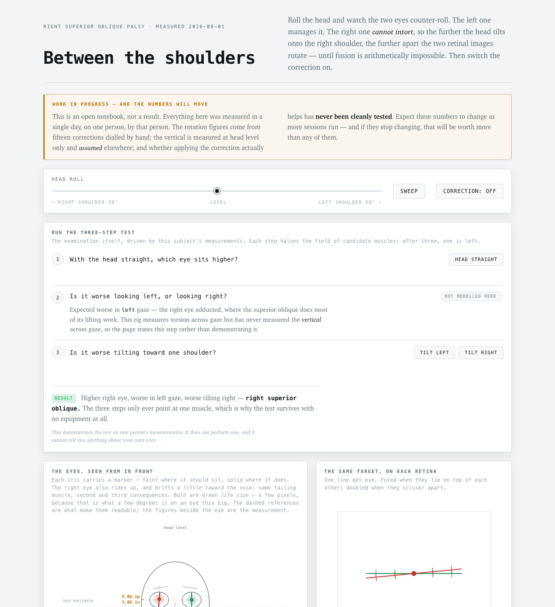
*I opened the page and left the head roll at level. The banner at the top says what the page is: an open notebook, not a result. Everything on it was measured on one person, by that person, and whether applying the correction actually helps has never been cleanly tested.*

## Running the three-step test

The Bielschowsky head-tilt test was described in 1935 and is still how a fourth nerve palsy is identified in a clinic. It is the third step of a three-step examination, and it needs no equipment at all. I built the page so that it *runs* the three steps against my own measurements rather than just describing them.

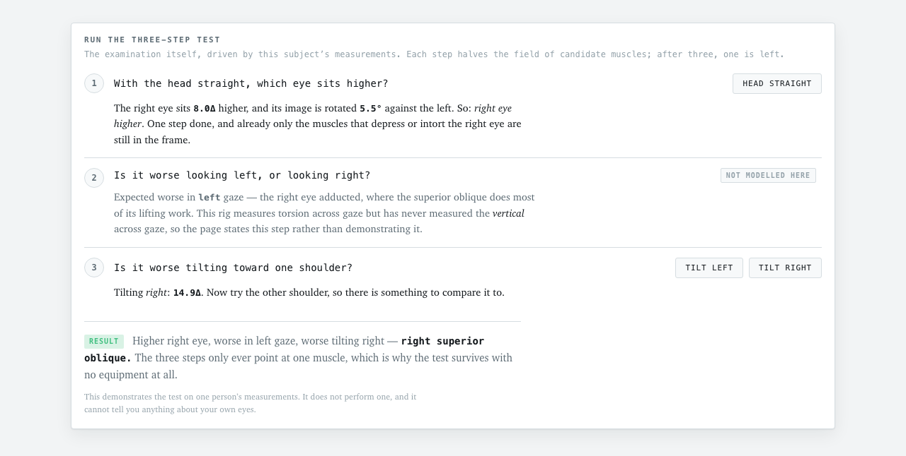
*I clicked "Head straight" and then "Tilt right". With my head straight the right eye sits 8.0Δ higher and its image is rotated 5.5° against the left; tilting right takes the vertical to 14.9Δ. Higher right eye, worse in left gaze, worse tilting right — right superior oblique. The middle step is stated rather than demonstrated, because this rig has never measured the vertical deviation across gaze.*

## What happens when I roll my head

The first panel draws both eyes from in front. When the head rolls, the otoliths command ocular counter-roll — the eyes rotate against the head to keep the world upright, recovering about 15% of the roll. Intorting the right eye is a job shared by the superior oblique and the superior rectus, and mine is the palsied one.

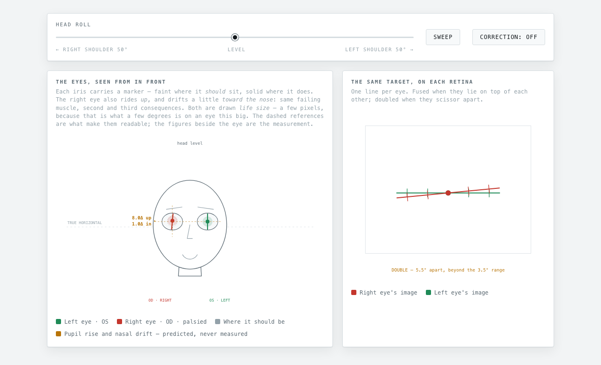
*With the head level, the two retinal images are already 5.5° apart — beyond the ±3.5° range within which I can pull them together — and the right eye sits 8.0Δ higher.*

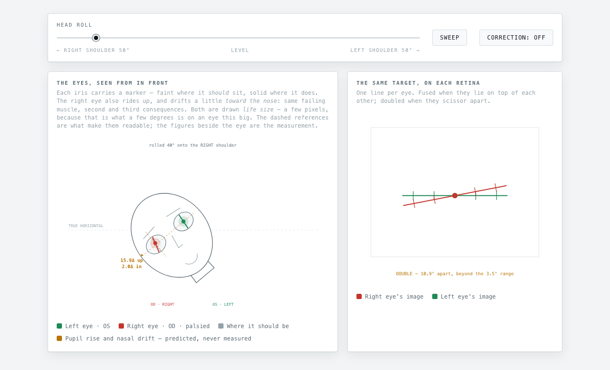
*I dragged the slider 40° onto my right shoulder. The right eye is asked for intorsion it cannot supply, so it falls short: the two images rotate to 10.9° apart and the right eye rides 15.9Δ higher. Rolling the other way hands the job to the inferior oblique and inferior rectus, which manage it perfectly well, and the mismatch shrinks to about 3° at the left shoulder.*

That last sentence is the whole reason for my head posture. Leftward tilt is the only free variable that drives the torsional demand toward zero, and I found it years before I could measure it.

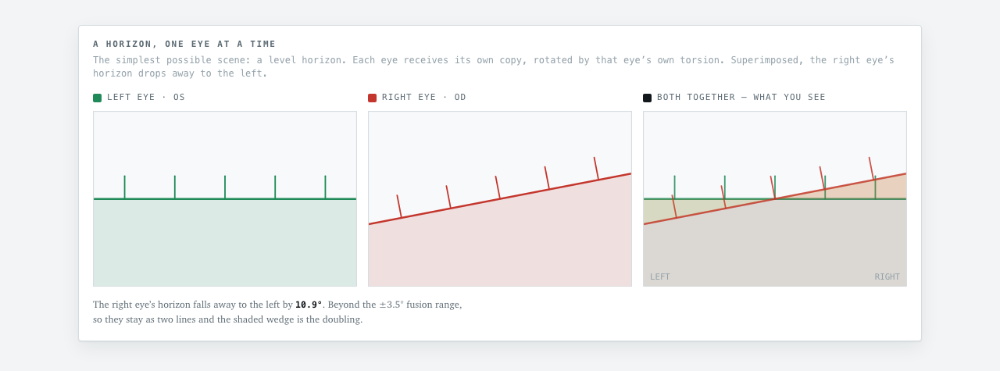
*The horizon panel from the top of this post, at the same 40° of right roll. The 5.5° wedge I live with at rest has grown to 10.9°.*

## The number that matters

The meter puts the mismatch against my measured cyclofusional range — the ±3.5° band inside which the two images can be pulled together.

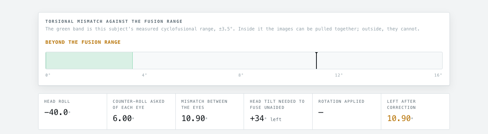
*At 40° of right roll the mismatch is 10.90°, three times the fusion range. The readout also computes what it would take to fuse unaided: 34° of leftward head tilt.*

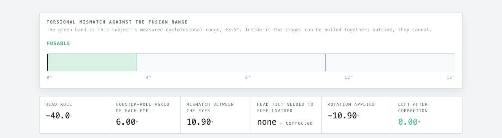
*I switched the correction on. The headset pre-rotates what the right eye is shown by −10.90°, and what is left after correction is 0.00° — inside the green band, with no head tilt required.*

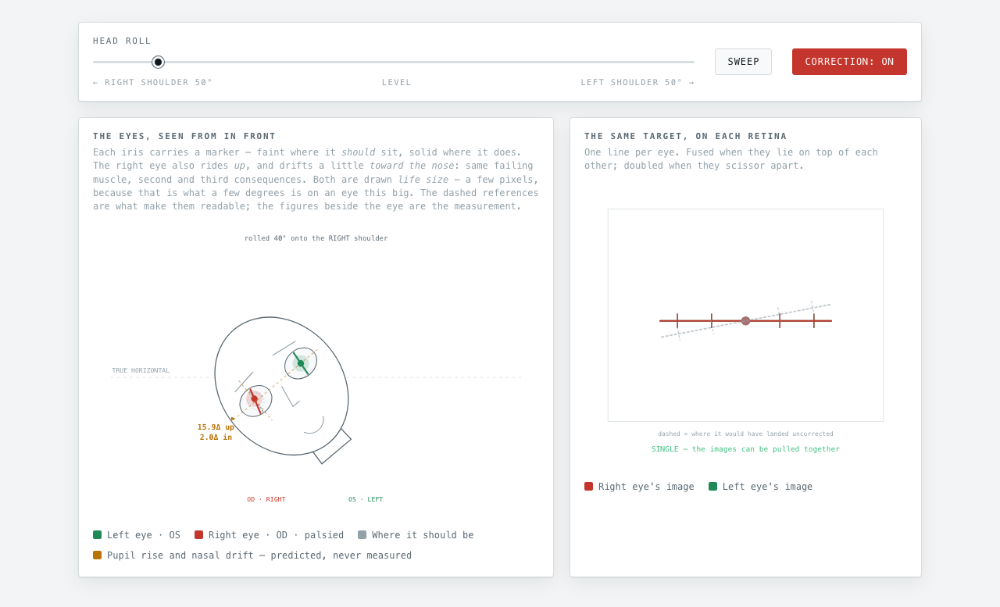
*The same toggle, seen on the retina panel: the dashed lines are where the right eye's image would have landed uncorrected, and the solid lines now lie on top of each other. Single, at 40° of right roll.*

## Three components, unequally well known

I was careful to draw the correction as three separate things, because they are not equally trustworthy.

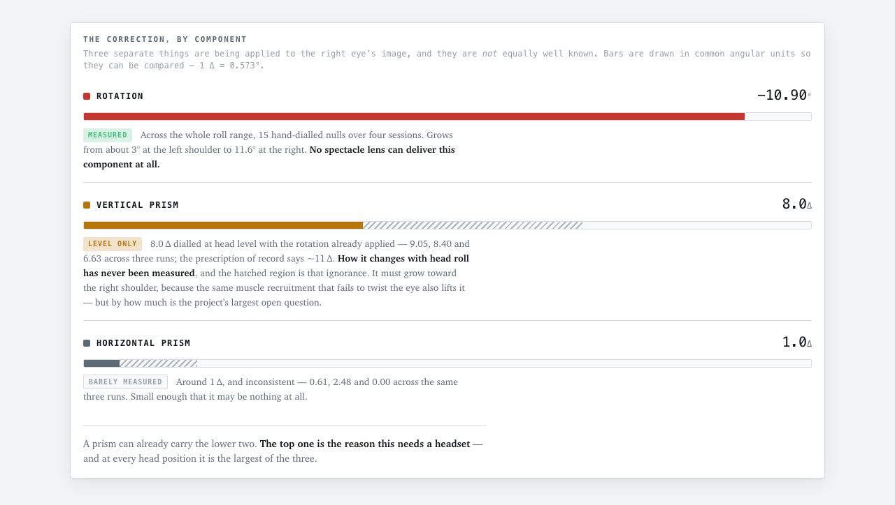
*Rotation is measured across the whole roll range and no spectacle lens can deliver it at all. Vertical prism — 8.0Δ, dialled at head level once the rotation was already right — is exactly what a prism does, and the prescription of record calls for roughly 11Δ; how it changes with head roll has never been measured, and the hatched region is that ignorance. Horizontal prism came out at 0.61, 2.48 and 0.00 across three runs, so it may be nothing at all.*

## Where the curve comes from

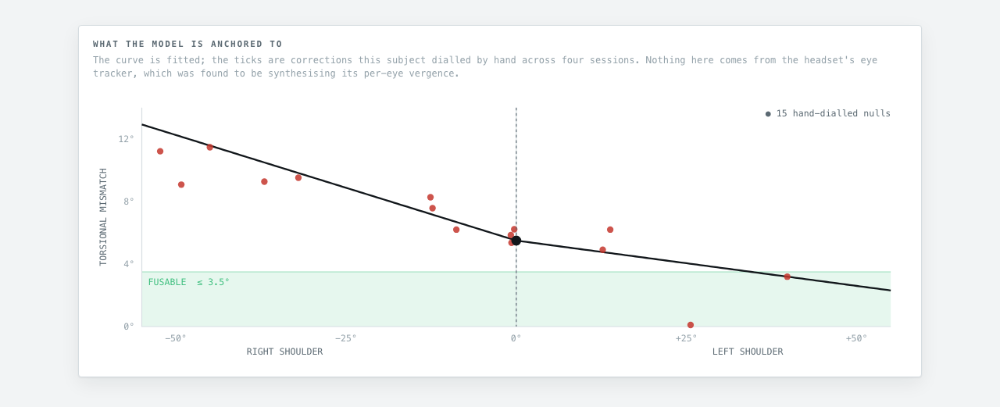
*The curve is fitted; the ticks are fifteen corrections I dialled by hand across four sessions in a Quest Pro. Nothing on the page comes from the headset's eye tracker — I found that its per-eye vergence signal was being synthesised, so I stopped using it and did the whole thing subjectively.*

## Every number, and how much I trust it

The page closes with two short tables, because I would rather a reader see the whole state of the evidence in one place than have to infer it from the prose.

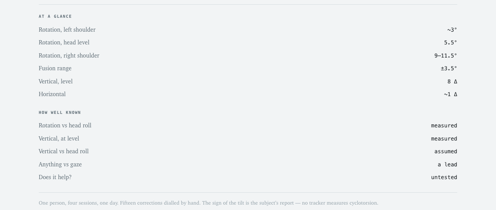
*The first table is the measurements; the second is my confidence in each of them. Rotation against head roll is measured, the vertical is measured at head level only and assumed everywhere else, anything against gaze direction is a lead rather than a result, and "does it help?" is still untested.*

## The private project behind it

`openxr-skybox` is a native OpenXR app in a single C++ file — instance, session, stereo swapchains, frame loop — with an Android/NDK build for Quest standalone and a Python script that paints the six cubemap faces. It takes its name from where it started.

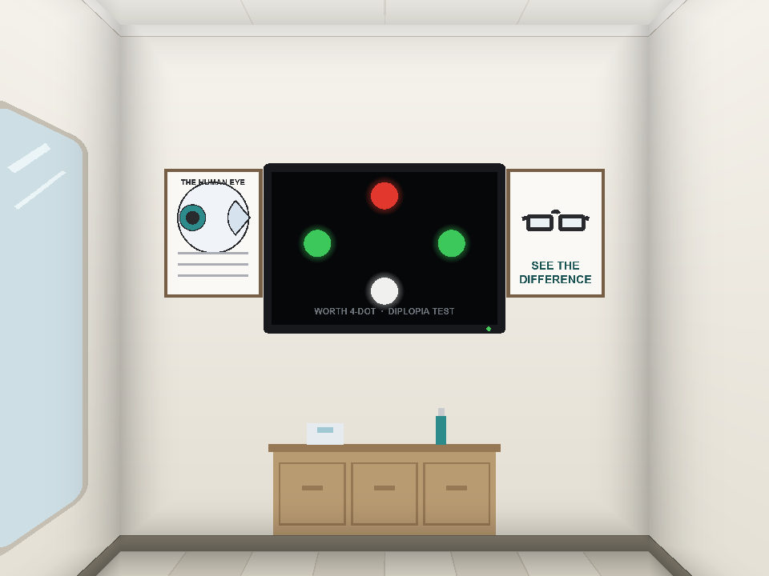
*A stylized optometrist's office, rendered as a cubemap skybox: the eye chart wall, with a Worth 4-Dot double-vision test on the digital display. Each face of the cube is one wall of the room, so the skybox reads as a real interior — and the whole scene costs one draw call.*

Around it sit three standalone test rigs and a sixty-page wiki:

- **`passthrough-min`** — can the *real* world be corrected? On a Quest Pro, no: one camera device, a `CameraService` reject, and a UID AppOp pinned to `ignore`. The Passthrough Camera API is Quest 3/3S only.
- **`correction-min`** — a rendered room of test objects at 0.5m to 12m with vertical prism, horizontal prism and torsion dialled live into each eye. Rendered content needs no camera permission, so this works on a Pro.
- **`bead-min`** — a high-contrast bead with dichoptic line pairs through it. Fused, they are one clean cross; apart, the gap and the tilt *are* the misalignment. It measures across gaze and head posture, corrects the right eye from head position, and writes an animated HTML report.

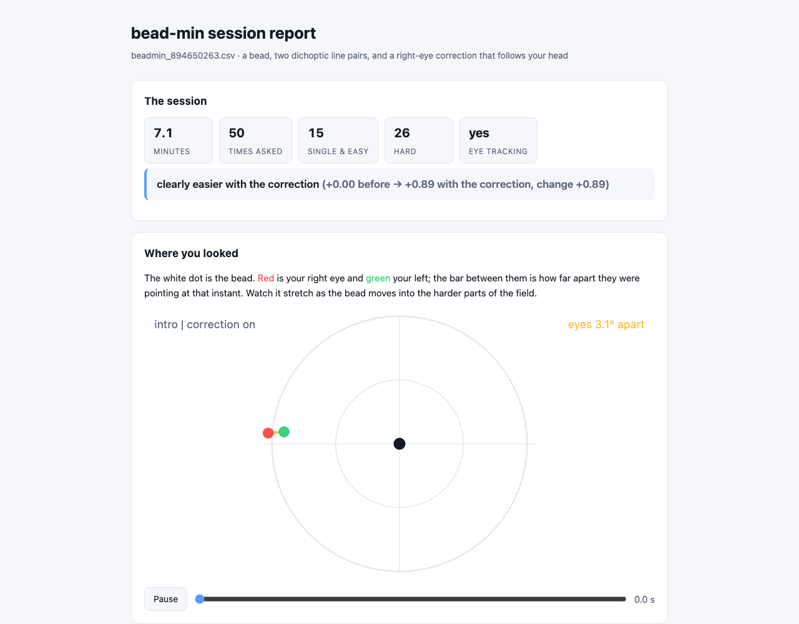
*A `bead-min` session report: 7.1 minutes, 50 questions, and a self-reported verdict of "clearly easier with the correction". I am not counting that as evidence — the project's own findings still list "does it help" as untested, and the A/B comparisons run so far have each turned out to be confounded one way or another.*

The repository stays private for now: it contains my medical records and session data. What is public is the [Bielschowsky page](https://haddley.github.io/bielschowsky/) ([source](https://github.com/Haddley/bielschowsky)) and the WebXR port at [haddley.github.io/vision](https://haddley.github.io/vision/) ([source](https://github.com/Haddley/vision)), which runs in a browser, in Quest Browser, or in Safari on Apple Vision Pro.

## The caveats, which belong in the post and not in a comment

This is an educational demonstration, not a medical device. It is not validated, and it is n = 1 — one person, who is also the person who built it. It should not replace an examination with a neuro-optometrist or ophthalmologist, and nothing here is an offer of treatment. New or changing double vision needs a clinician urgently.

The rotation curve is fitted to fifteen hand-dialled corrections across four sessions in a single day. The vertical component is measured at head level only and *assumed* to scale away from it — that assumption is drawn hatched throughout the page and has never been tested. And the direction the right eye's horizon falls comes from my own report rather than from an instrument: no eye tracker made or sold measures the sign of cyclotorsion, because that needs iris-pattern tracking and no headset does it.

Corrections are genuinely welcome. I would rather be told I am wrong than encouraged.

## References

- [Between the shoulders — right superior oblique palsy](https://haddley.github.io/bielschowsky/)

- [Meta Unity](/posts/metaunity/) — the earlier write-up of the Quest prism work

- [Three Step Test for Cyclovertical Muscle Palsy — EyeWiki](https://eyewiki.org/Three_Step_Test_for_Cyclovertical_Muscle_Palsy)

- [Parks–Bielschowsky three-step test — Wikipedia](https://en.wikipedia.org/wiki/Parks%E2%80%93Bielschowsky_three-step_test)
