Business Central now ships its own [Model Context Protocol](https://modelcontextprotocol.io) (MCP) server, built directly into the product. It exposes Business Central's APIv2 objects to an MCP client without writing a custom server first, which is the approach I took in my earlier [Model Context Protocol](/posts/mcpserver2/) posts. This post follows the steps in [How to Connect Business Central MCP to Claude Desktop](https://katson.com/how-to-connect-business-central-mcp-to-claude-desktop/), adapted for Claude Code instead of Claude Desktop: registering an Entra app, turning on the MCP server inside Business Central, and connecting Claude Code to it.

## Part 1 — Registering the Entra app

Business Central's MCP server authenticates over OAuth, so before turning it on, I needed an Entra app registration that Claude Code could sign in through.

### Creating the app registration

I opened Microsoft Entra ID in the Azure portal and used Add, then App registration, to start a new one.

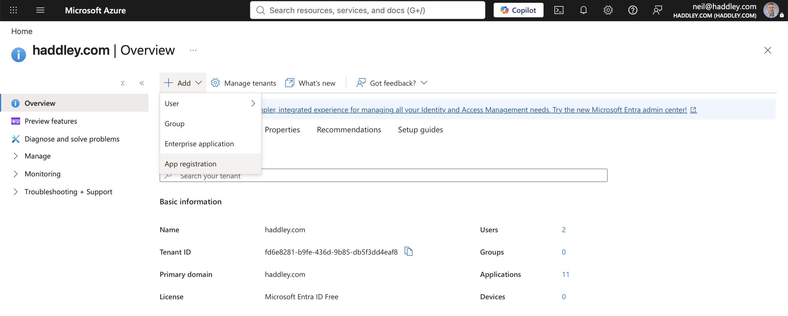
*I opened the haddley.com tenant's Overview page and clicked Add, then App registration*

I named it "Business Centrl MCP" — a typo I only noticed after the app was already created, and left uncorrected throughout the rest of this post since it is what actually appears in every later screenshot — set Supported account types to "Multiple Entra ID tenants", and left Redirect URI blank for this screen — that comes next.

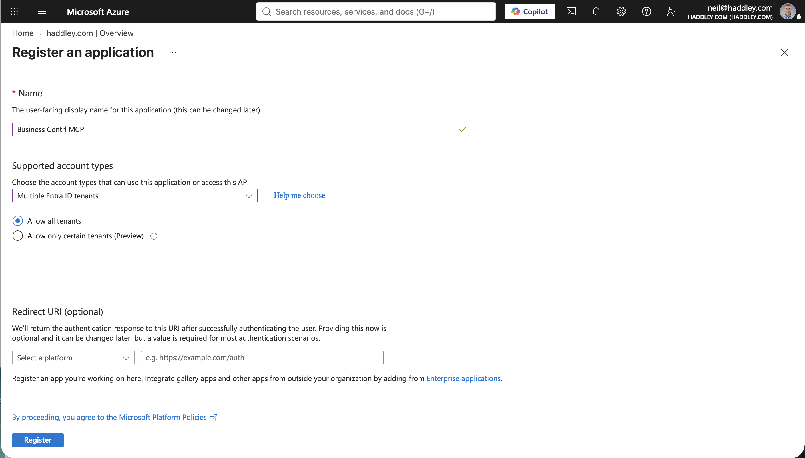
*I named the app, chose Multiple Entra ID tenants under Supported account types, and left Redirect URI blank, then clicked Register*

The app was created immediately, with its own Application (client) ID, Object ID, and Directory (tenant) ID.

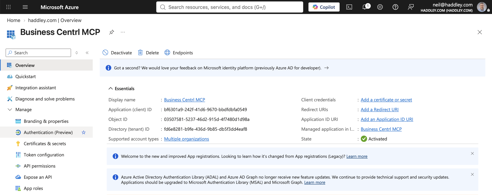
*The app registration was created*

### Adding the redirect URI

The MCP OAuth flow needs a loopback redirect URI to listen on locally during sign-in. I went to Authentication, clicked Add a Redirect URI, and chose the "Mobile and desktop applications" platform.

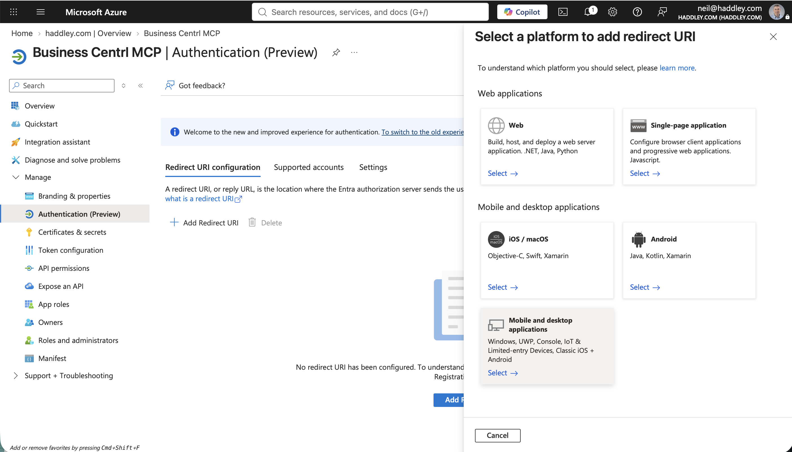
*I selected Authentication in the left navigation, clicked Add Redirect URI, then chose the Mobile and desktop applications platform*

I entered `http://localhost:33418/oauth/callback` as the redirect URI and clicked Configure. The port number has to match whatever the MCP client listens on locally during sign-in.

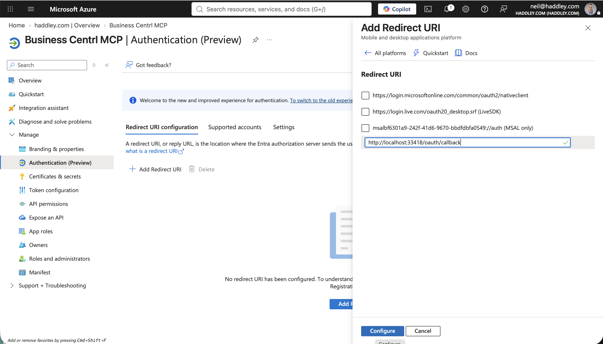
*I entered http://localhost:33418/oauth/callback as the redirect URI*

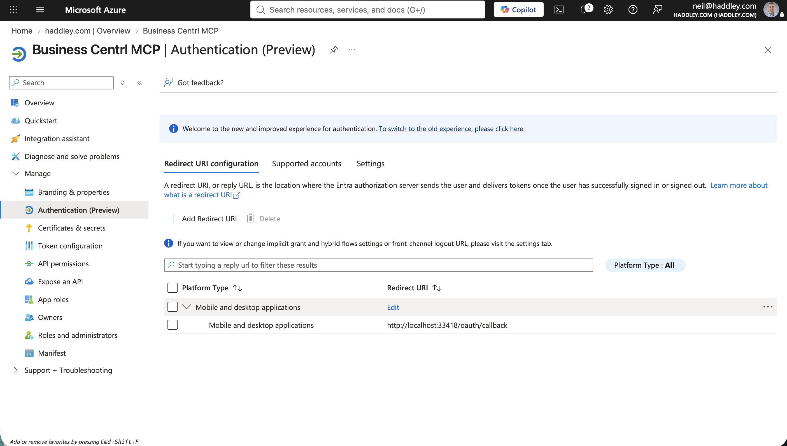
*The redirect URI was saved under the Mobile and desktop applications platform*

### Granting API permissions

By default the app only had Microsoft Graph's User.Read permission.

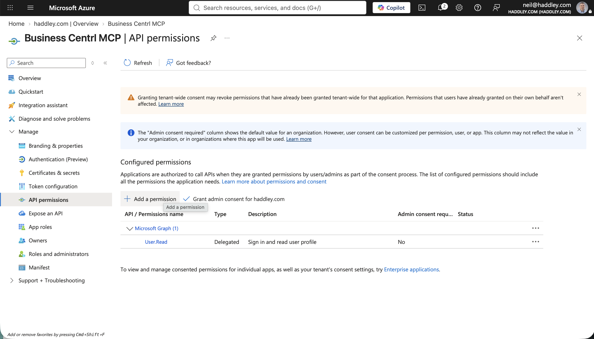
*Configured permissions started with only Microsoft Graph's User.Read*

I clicked Add a permission and selected Dynamics 365 Business Central from the list of commonly used Microsoft APIs.

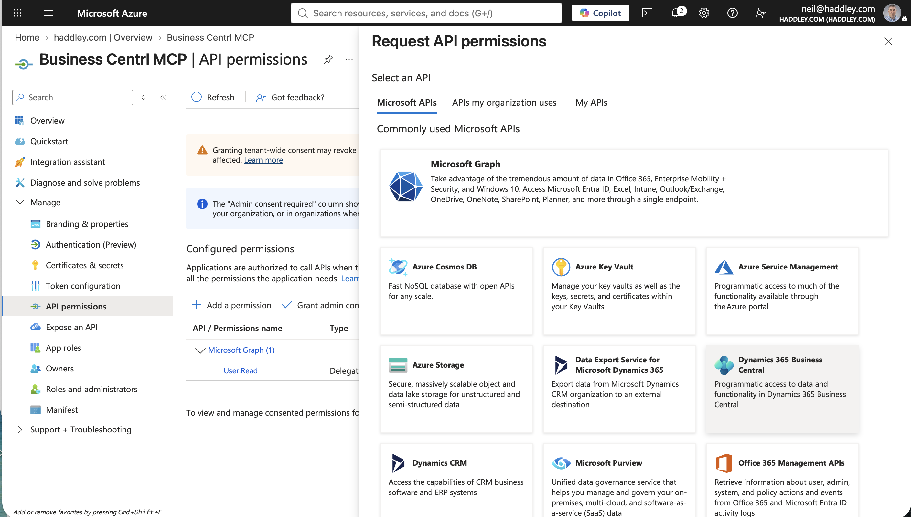
*I selected Dynamics 365 Business Central from the Microsoft APIs tab*

I chose Delegated permissions, since Claude Code calls the MCP server as me, the signed-in user, rather than as an unattended background service.

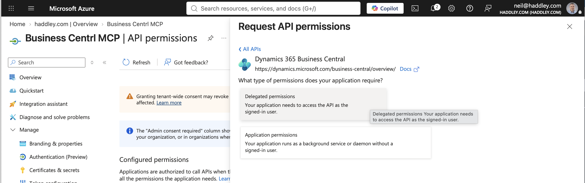
*I chose Delegated permissions*

I checked `Financials.ReadWrite.All` under the Business Central API's delegated permissions and clicked Add permissions.

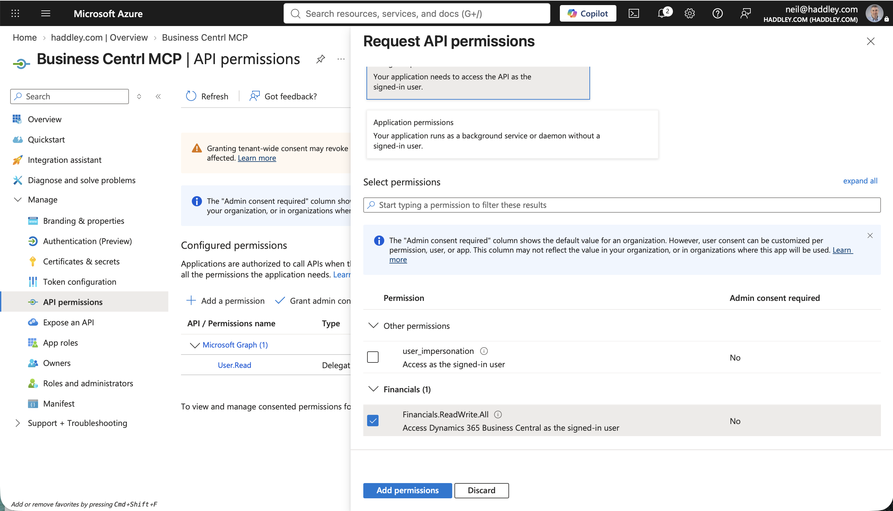
*I checked Financials.ReadWrite.All under the Business Central API's delegated permissions*

Configured permissions then listed both `Financials.ReadWrite.All` against Dynamics 365 Business Central and the original `User.Read` against Microsoft Graph — a write-capable permission at the Entra layer, wider than the read-only tools Part 2 actually ends up exposing through the MCP configuration itself.

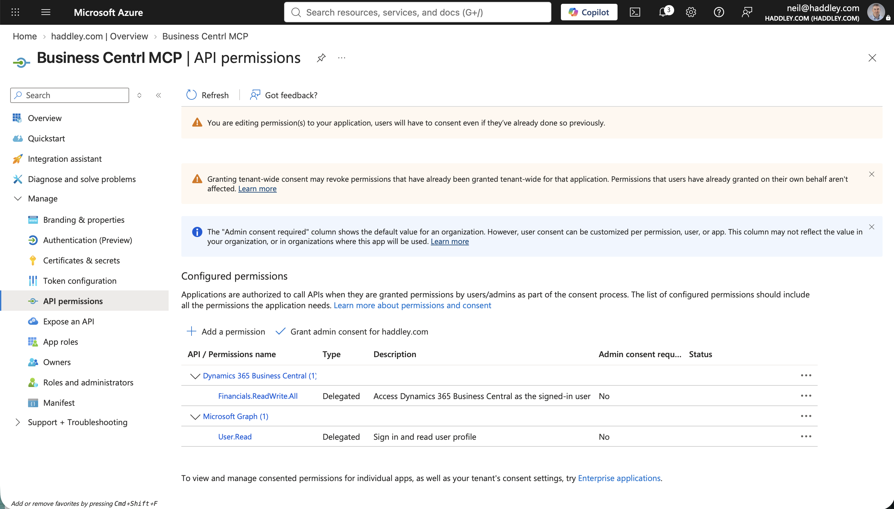
*Both permissions were listed: Financials.ReadWrite.All against Business Central, and User.Read against Microsoft Graph*

### Capturing the IDs

Two values from the app's Overview page are needed later, when Claude Code's own MCP configuration is written: the Application (client) ID and the Directory (tenant) ID.

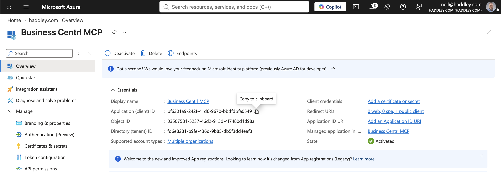
*I copied the Application (client) ID from the Overview page*

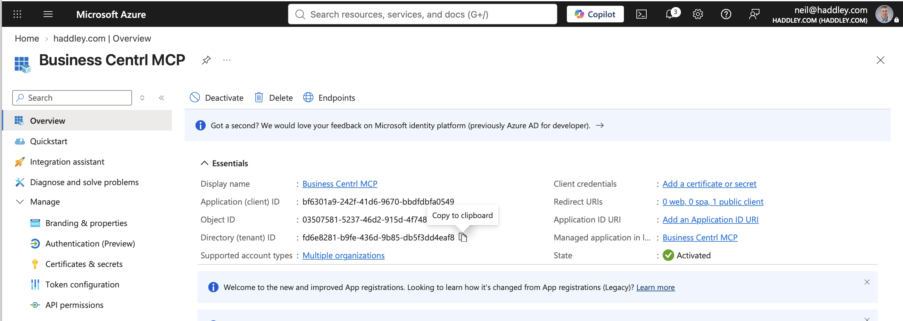
*I copied the Directory (tenant) ID from the same page*

## Part 2 — Turning on the MCP server in Business Central

With the Entra app in place, the next step was inside Business Central itself: exposing a specific set of APIv2 objects through its own MCP server.

I opened Business Central against the Cronus USA demo company.

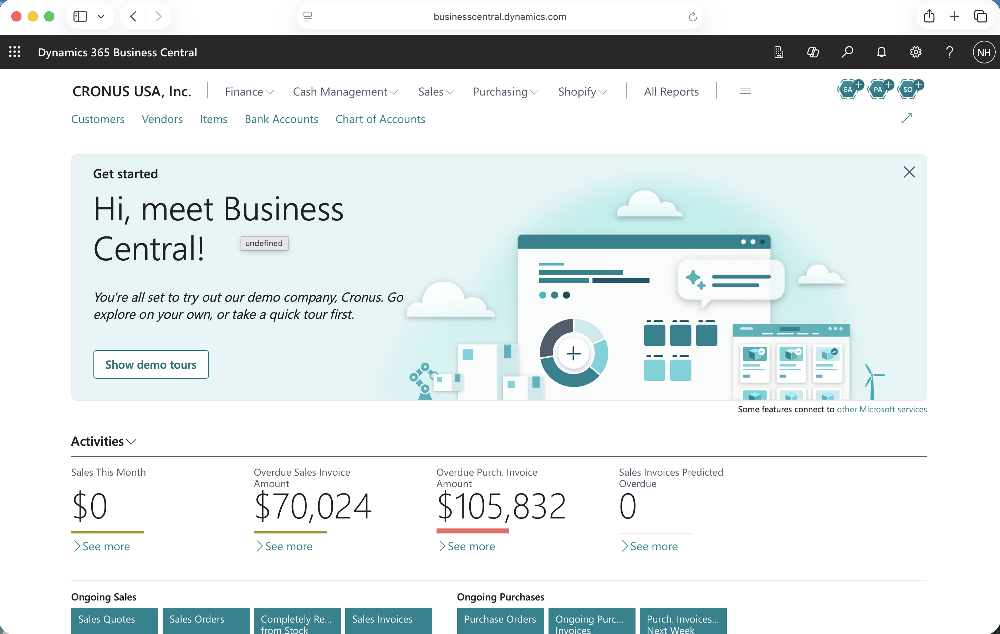
*I opened Business Central against the Cronus USA, Inc. demo company*

Business Central ships with a "Default MCP configuration" already present, with Active, Default, and Dynamic Tool Mode all switched on — in Dynamic Tool Mode, tools are discovered and exposed automatically rather than from a fixed list.

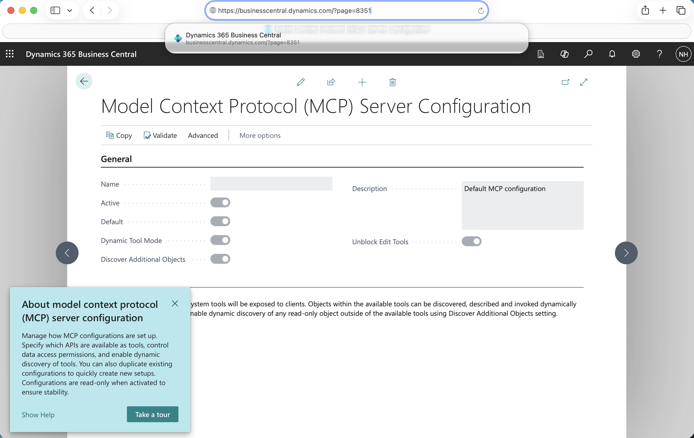
*I navigated to the Model Context Protocol (MCP) Server Configuration page and found the existing Default MCP configuration, with Dynamic Tool Mode switched on*

To control exactly which APIs Claude Code could see, I created a new configuration instead of relying on the dynamic default. Leaving Dynamic Tool Mode off puts the configuration into Static Tool Mode, where only the objects explicitly added to Available Tools are exposed to clients.

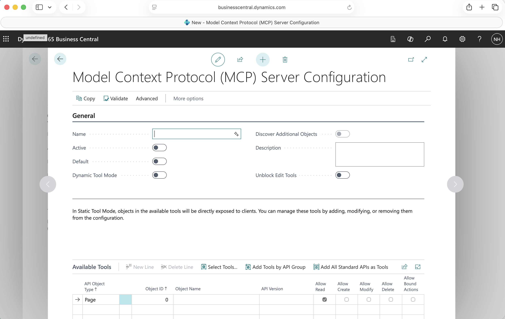
*I clicked New to start a blank Model Context Protocol (MCP) Server Configuration, with Dynamic Tool Mode left off*

I named it "Blog Post", switched Active and Default on, and clicked Add All Standard APIs as Tools, which populated Available Tools with every standard APIv2 page — each one added with Allow Read checked, and Create, Modify, Delete, and Bound Actions left unchecked.

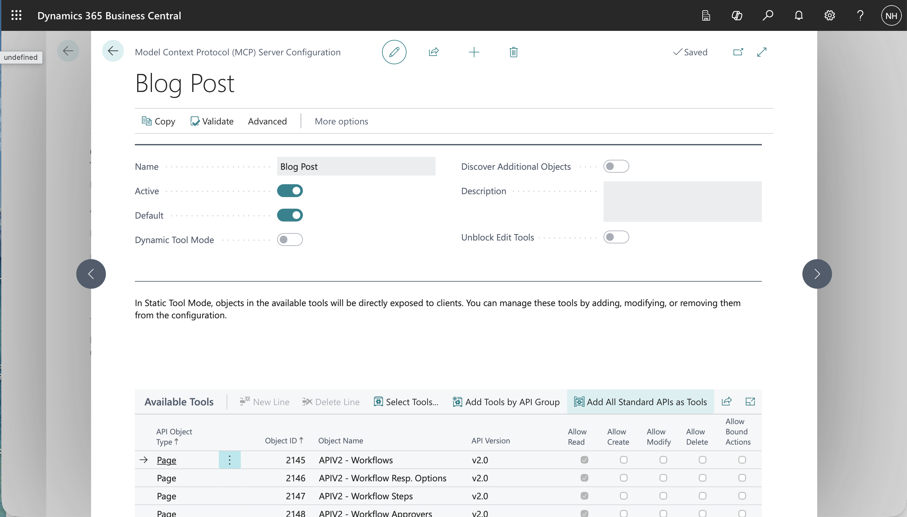
*I named the configuration "Blog Post", switched Active and Default on, clicked Add All Standard APIs as Tools, and the configuration saved with every standard APIv2 page listed as a read-only tool*

## Part 3 — Connecting Claude Code

Claude Desktop reads its MCP servers from `claude_desktop_config.json`; Claude Code reads them from a project-scoped `.mcp.json` file instead, the same file my earlier [RAG](/posts/rag1/) series used for a local MCP server. Business Central's MCP server speaks HTTP rather than stdio, though, so the bridge between the two is `mcp-remote`, an npm package that handles the HTTP transport and the Microsoft sign-in on Claude Code's behalf.

### Installing mcp-remote

```bash
npm install -g mcp-remote@latest
```

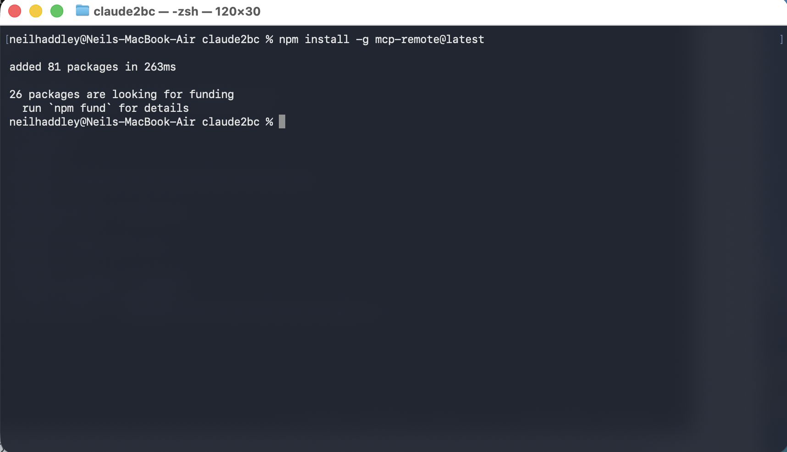
*I ran npm install -g mcp-remote@latest, which added 81 packages*

### Writing .mcp.json

In the project's root folder, I created `.mcp.json`:

```json
{
  "mcpServers": {
    "businesscentral": {
      "command": "npx",
      "args": [
        "-y",
        "mcp-remote",
        "https://mcp.businesscentral.dynamics.com",
        "33418",
        "--transport",
        "http-only",
        "--header",
        "TenantId: fd6e8281-b9fe-436d-9b85-db5f3dd4eaf8",
        "--header",
        "EnvironmentName: Production",
        "--header",
        "Company: CRONUS USA, Inc.",
        "--header",
        "ConfigurationName: Blog Post",
        "--static-oauth-client-info",
        "{\"client_id\": \"bf6301a9-242f-41d6-9670-bbdfdbfa0549\"}"
      ]
    }
  }
}
```

Every value in that `args` array traces back to something captured in Parts 1 and 2: `https://mcp.businesscentral.dynamics.com` is the fixed MCP endpoint for Business Central Online; `33418` is the local port `mcp-remote` listens on for the OAuth callback, matching the redirect URI registered in Part 1; `--transport http-only` tells `mcp-remote` to use plain HTTP rather than trying SSE first; the `TenantId` header is the Directory (tenant) ID from Part 1; `EnvironmentName` and `Company` identify the Business Central environment and company to connect to; `ConfigurationName` selects the "Blog Post" MCP configuration created in Part 2, rather than the dynamic default; and `--static-oauth-client-info` supplies the Application (client) ID from Part 1, telling `mcp-remote` which Entra app to authenticate as.

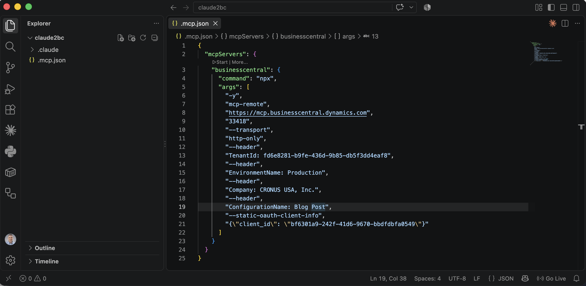
*I created .mcp.json in the project root, pointing mcp-remote at the Business Central MCP endpoint with the tenant ID, environment, company, configuration name, and client ID captured in Parts 1 and 2*

### Confirming the connection

Starting Claude Code in the project directory and running `/mcp` listed `businesscentral` among the connected servers, with 414 tools available — one for every APIv2 page the "Blog Post" configuration exposed in Part 2.

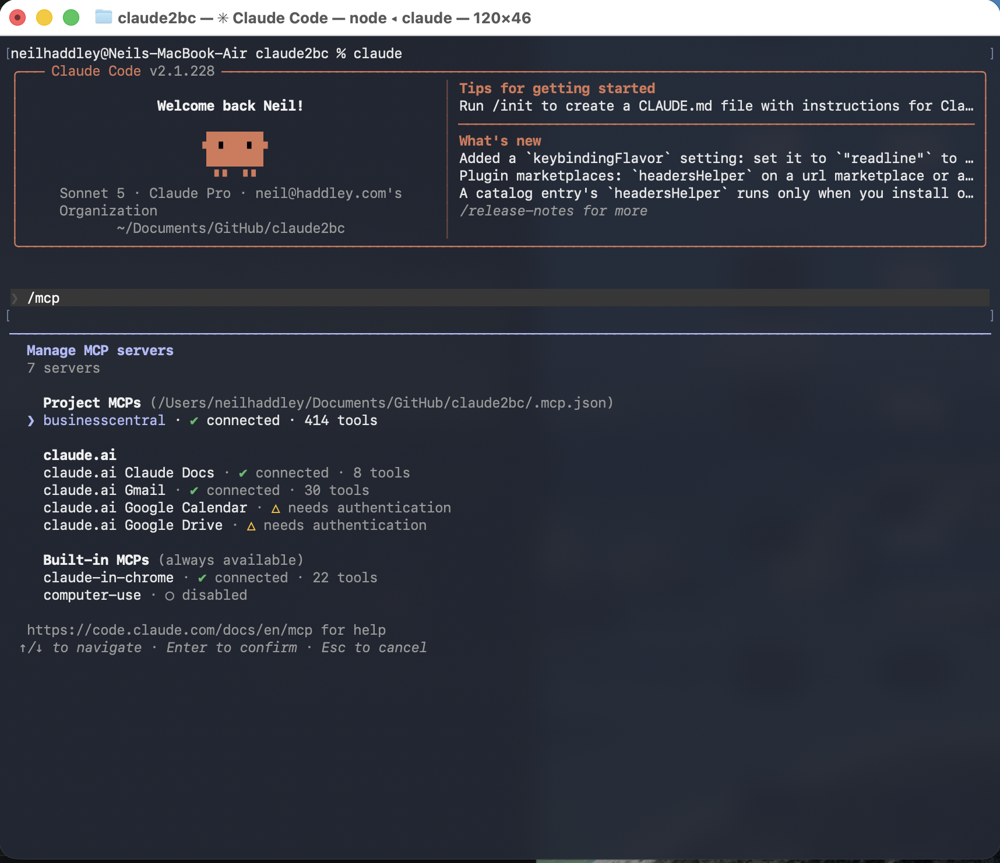
*`/mcp` listed businesscentral as a Project MCP, connected, with 414 tools*

Selecting `businesscentral` from that list showed the exact command Claude Code launched — the same `npx ... mcp-remote ...` command written into `.mcp.json` — along with its connection status and tool count.

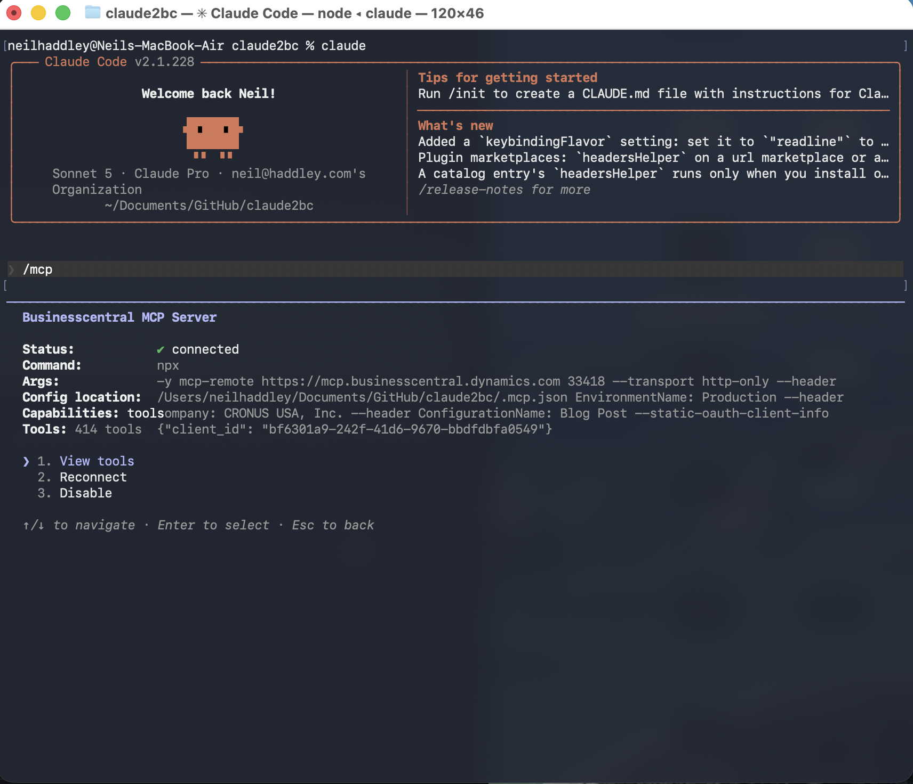
*The businesscentral MCP server detail view: connected, 414 tools, and the full mcp-remote command Claude Code ran*

Drilling into "View tools" listed the individual tools themselves, one per exposed APIv2 page, each named after the page and marked read-only — matching the Allow Read-only permissions set in Part 2's "Blog Post" configuration.

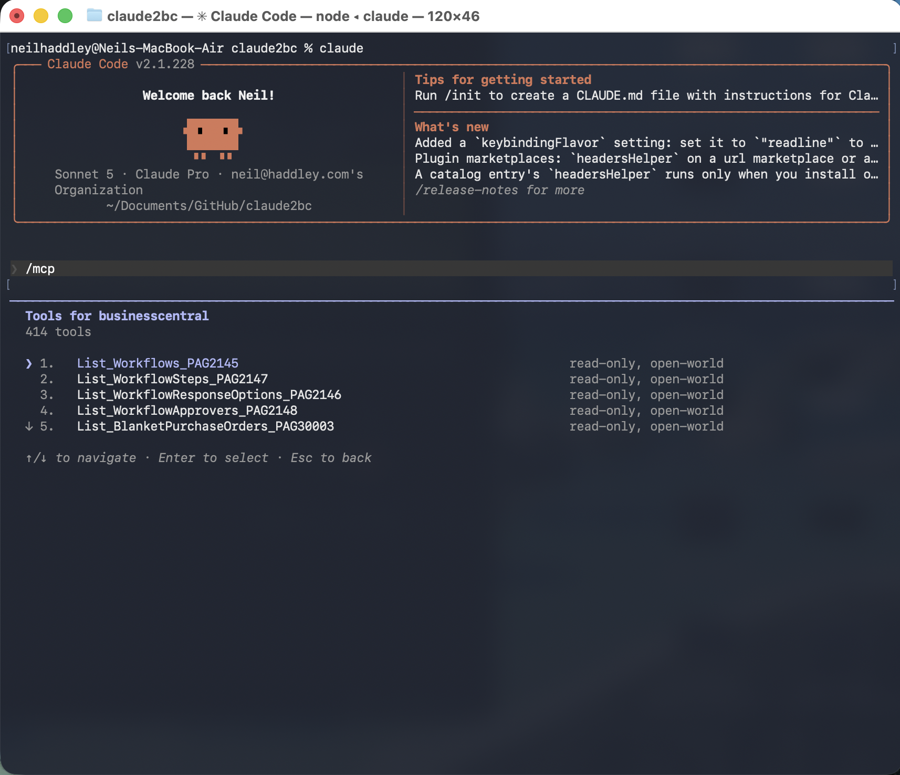
*Tools for businesscentral: 414 read-only tools, one per APIv2 page, such as List_Workflows_PAG2145 and List_WorkflowSteps_PAG2147*

### A real query

With the server connected, I asked Claude Code a plain-English question about the Cronus demo data.

```PROMPT
List the first 10 customers from Business Central — show name, number, and city.
```

Claude Code called the `businesscentral` tool and answered from the real data returned — the Cronus USA demo company only has five customers, so it reported that rather than padding the table out to ten.

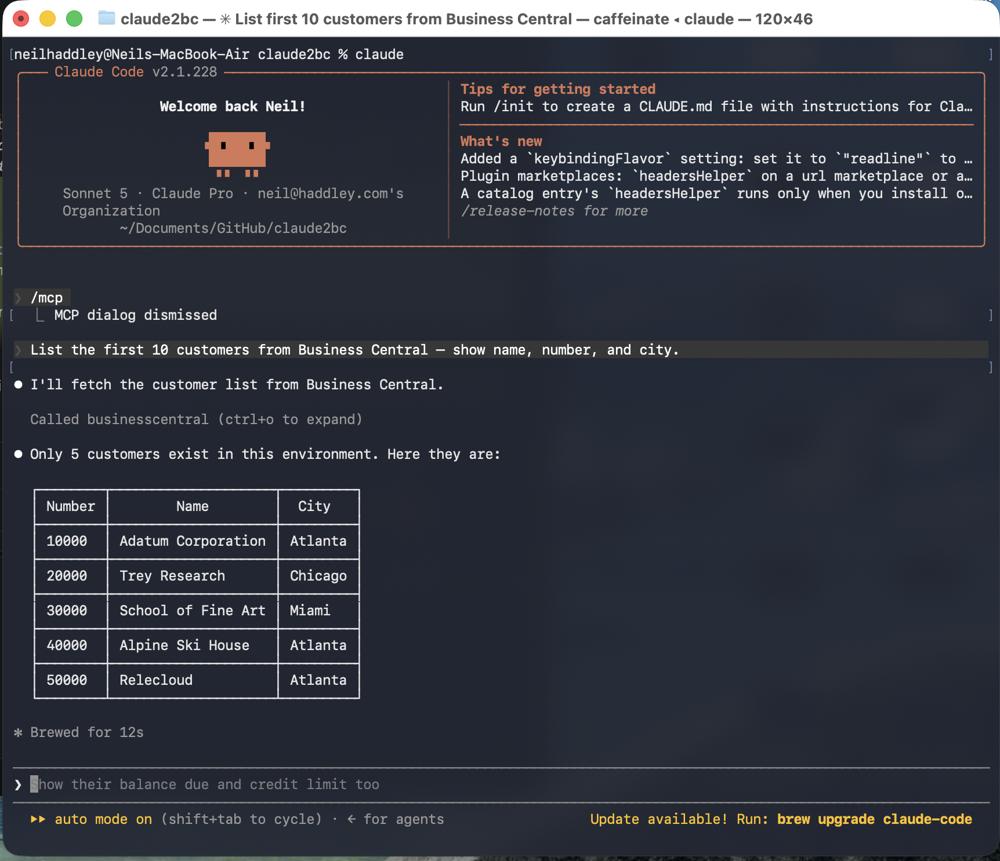
*Claude Code called the businesscentral MCP tool and returned all five real customers in the Cronus USA, Inc. demo company, correctly noting there were fewer than the ten I asked for*

## What actually got built

An Entra app registration providing the OAuth identity, a Business Central MCP configuration exposing 414 APIv2 pages as read-only tools, and a project-scoped `.mcp.json` bridging the two into Claude Code through `mcp-remote` — three separate pieces of setup, each verified independently, ending in a real, unscripted question about the Cronus demo data answered from genuine Business Central records rather than a guess.

## References

- [How to Connect Business Central MCP to Claude Desktop — Katson](https://katson.com/how-to-connect-business-central-mcp-to-claude-desktop/)
