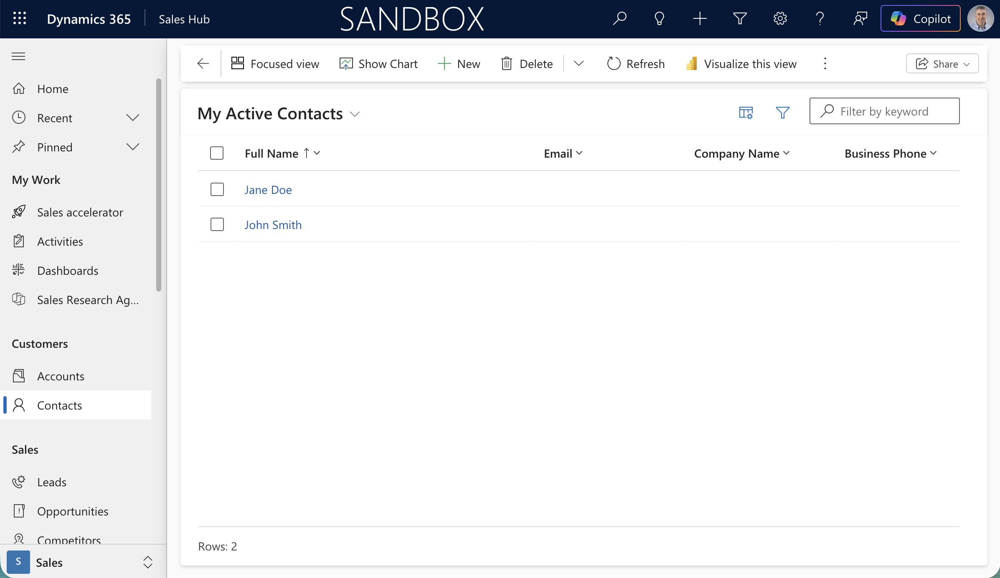
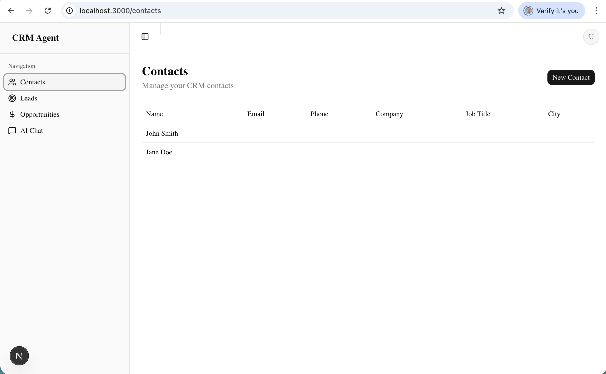
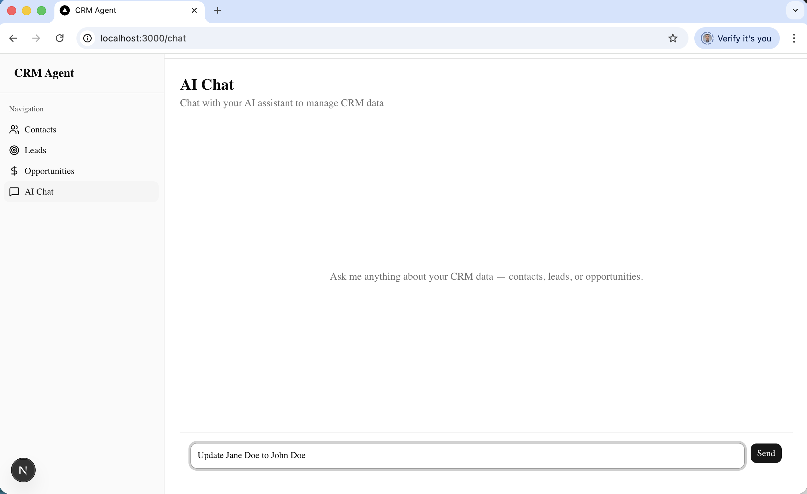
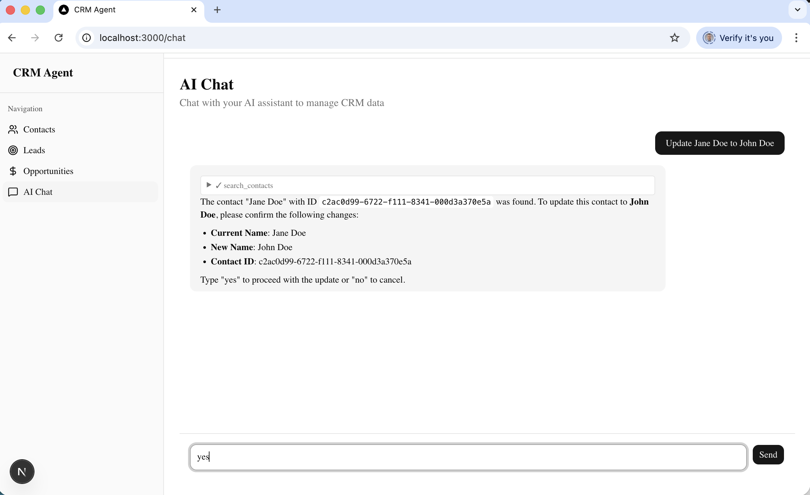
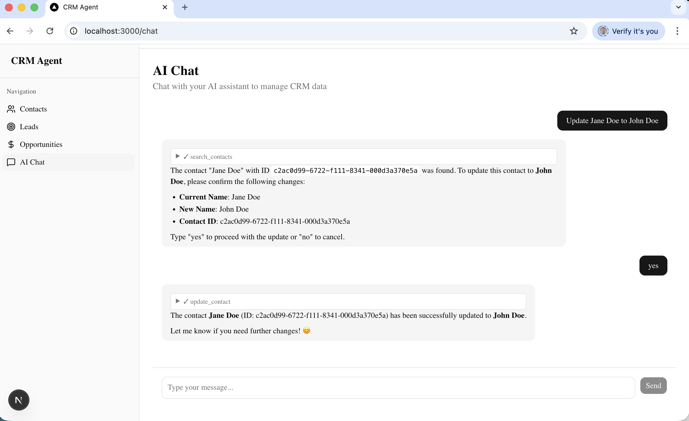
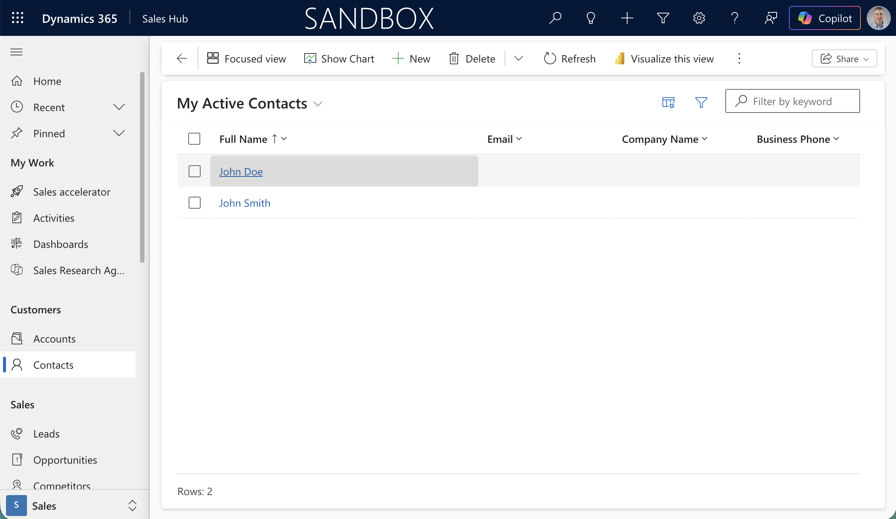

Here's how the AI Agent page works end-to-end:

## LLM

- Model: Qwen3:30b running locally via Ollama (http://localhost:11434)
- Connection: Ollama exposes an OpenAI-compatible API; the app connects using @ai-sdk/openai-compatible (src/lib/ai/ollama.ts)
- Responses stream token-by-token back to the browser

## Request Flow

1. User types a message in ChatPanel and submits
2. useChat (Vercel AI SDK v6) sends the full conversation history via DefaultChatTransport to POST /api/chat
3. The API route converts messages with convertToModelMessages, then calls streamText with the model, system prompt, tools, and message history
4. The streamed response flows back to the client as a UIMessageStream, rendered in real-time by MessageBubble components

## Tools (Agentic Capability)

The LLM can call 9 tools — it decides which to invoke based on the user's message:

| Tool | Action |
|---|---|
| search_contacts | Search Dynamics contacts by name/email/company |
| create_contact | Create a new contact record |
| update_contact | Update an existing contact by ID |
| search_leads | Search leads by name/subject/company |
| create_lead | Create a new lead |
| update_lead | Update an existing lead by ID |
| search_opportunities | Search opportunities by name |
| create_opportunity | Create a new opportunity |
| update_opportunity | Update an existing opportunity by ID |

All tools call the same Dynamics 365 Dataverse Web API helpers used by the rest of the app (src/lib/dynamics/). Tool execution happens server-side in the API route — the LLM never touches Dynamics directly.

## Multi-Step Execution

`stopWhen: stepCountIs(5)` allows up to 5 agentic steps per user message. This means the model can chain tool calls — e.g. search for a contact, then update it — without the user needing to prompt again between steps.

## System Prompt

The model is instructed to act as a CRM assistant, present data in readable formats, and confirm details with the user before creating or updating records.

## create_contact

Here's the full lifecycle of the create_contact tool:

## Definition (src/app/api/chat/route.ts)

```typescript
create_contact: tool({
  description: "Create a new contact in the CRM",
  inputSchema: z.object({
    firstname: z.string().describe("First name"),
    lastname: z.string().describe("Last name"),
    emailaddress1: z.string().optional().describe("Email address"),
    telephone1: z.string().optional().describe("Phone number"),
    jobtitle: z.string().optional().describe("Job title"),
    company: z.string().optional().describe("Company name"),
  }),
  execute: async (data) => {
    const contact = await createContact(data);
    return contact;
  },
}),
```

`tool()` is a Vercel AI SDK v6 helper that packages three things together:

- **description** — natural language explanation sent to the LLM so it knows when to use this tool
- **inputSchema** — a Zod schema that defines the exact JSON shape the LLM must produce when calling it. The SDK serialises this to JSON Schema and passes it to Ollama as part of the model request
- **execute** — the server-side function that runs when the LLM invokes the tool

## How It Gets Called

**1. LLM decides to use it**

When the user says something like "create a contact for John Smith at Acme", the LLM sees all 9 tool definitions (descriptions + schemas) in the streamText request. It responds not with text, but with a structured tool call JSON:

```json
{
  "tool": "create_contact",
  "input": {
    "firstname": "John",
    "lastname": "Smith",
    "company": "Acme"
  }
}
```

**2. SDK validates and executes**

The AI SDK validates the LLM's output against the Zod inputSchema, then calls the execute function with the typed arguments. This runs server-side in the API route.

**3. execute calls Dynamics**

`createContact(data)` calls `src/lib/dynamics/contacts.ts` → `createEntity()` → Dataverse Web API (POST /contacts). The created contact record is returned.

**4. Result fed back to the LLM**

The tool result (the new contact object) is appended to the conversation as a tool message. The LLM then generates a natural language response confirming what was created. This counts as one step toward the `stopWhen: stepCountIs(5)` limit.


*The Dynamics 365 Sandbox showing My Active Contacts with Jane Doe and John Smith*


*The CRM Agent app showing the Contacts page with both contacts synced from Dynamics*



*I typed "Update Jane Doe to John Doe" into the AI Chat*


*The agent searched for the contact, found Jane Doe, and asked me to confirm the name change before proceeding*


*After I typed "yes", the agent called update_contact and confirmed the contact was successfully updated to John Doe*



*Back in Dynamics 365, the contact now shows as John Doe — the update was reflected in real time*

## References

- [Vercel AI SDK Documentation](https://sdk.vercel.ai/docs)
- [Ollama](https://ollama.com)
- [Dynamics 365 Dataverse Web API](https://learn.microsoft.com/en-us/power-apps/developer/data-platform/webapi/overview)
- [@ai-sdk/openai-compatible](https://sdk.vercel.ai/providers/openai-compatible)
