Ollama added a `launch claude` command that starts Claude Code backed by a local model instead of the Anthropic API. I wanted to see how well it held up on a real task.

I ran the command to get started.

```PROMPT
ollama launch claude
```

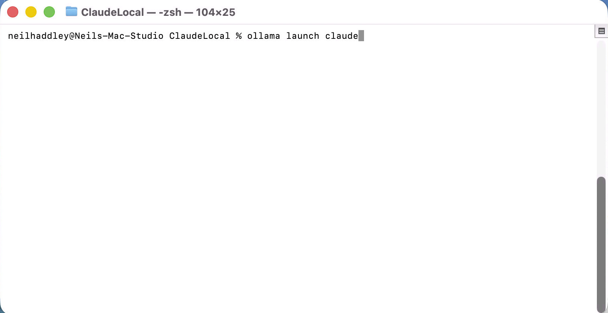
*I ran `ollama launch claude` in the terminal*

A model selection menu appeared with a recommended list sorted by capability.

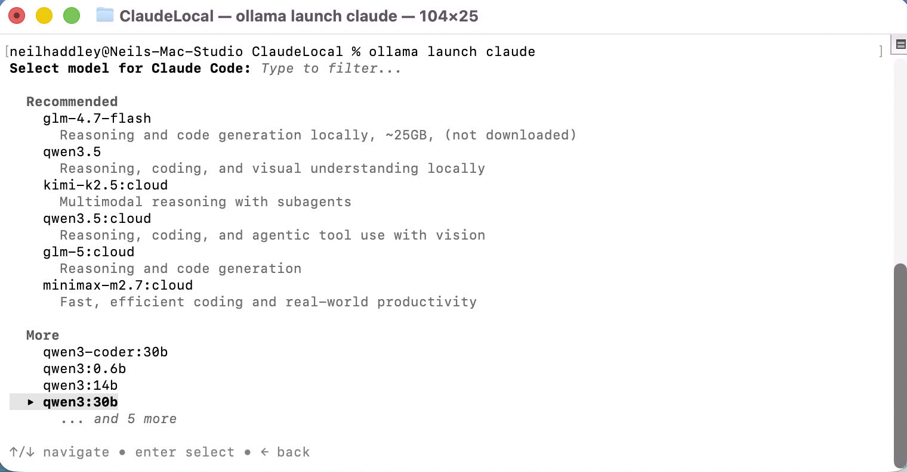
*I saw the model picker — recommended models at the top, more options below*

I scrolled down to `qwen3-coder:30b` and selected it.

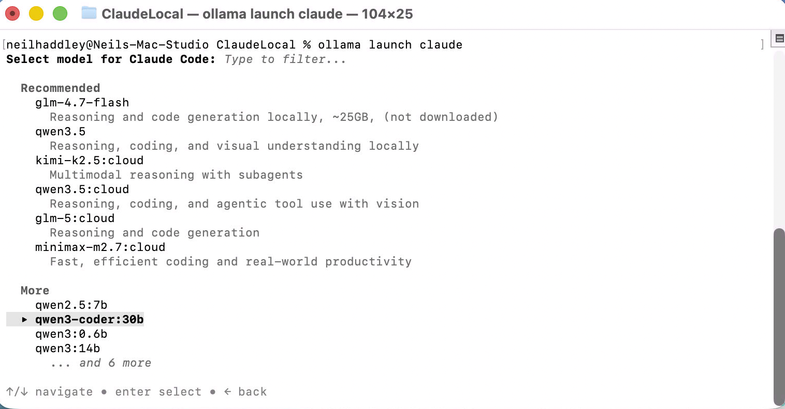
*I selected qwen3-coder:30b from the list*

Claude Code launched immediately, showing the familiar welcome screen — but now routing through the local Ollama model rather than the API.

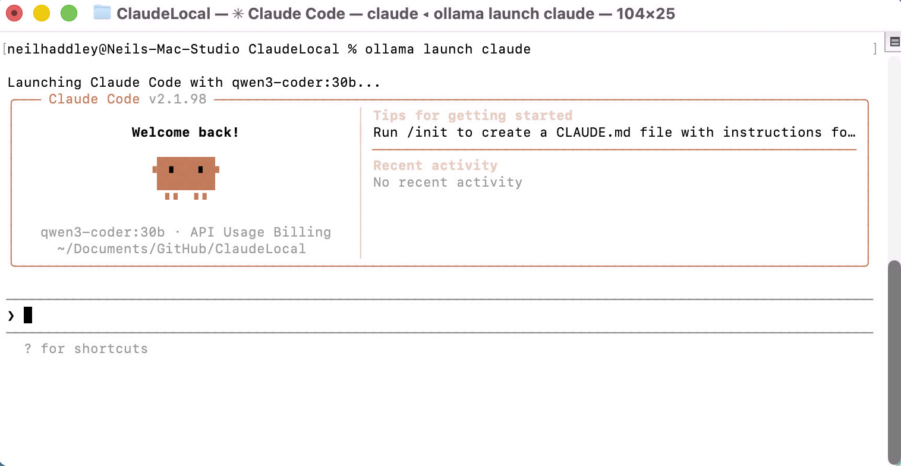
*I saw Claude Code start up with qwen3-coder:30b as the backend*

I gave it a task.

```PROMPT
create a web page breakout game
```

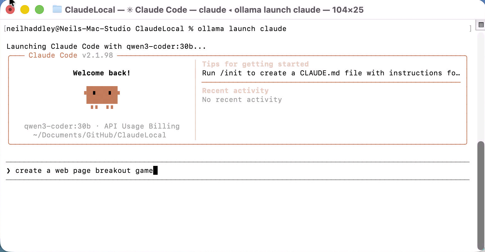
*I typed the prompt to build a breakout game*

While it was running I checked Activity Monitor. Ollama was using 41.48 GB of memory to run the 30B model — essentially the whole machine.

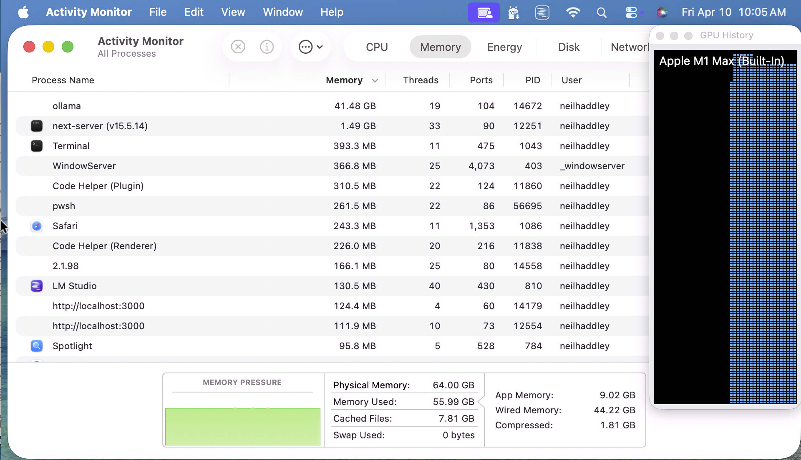
*I saw ollama consuming 41.48 GB RAM to run the model locally*

The model asked to create `breakout.html`.

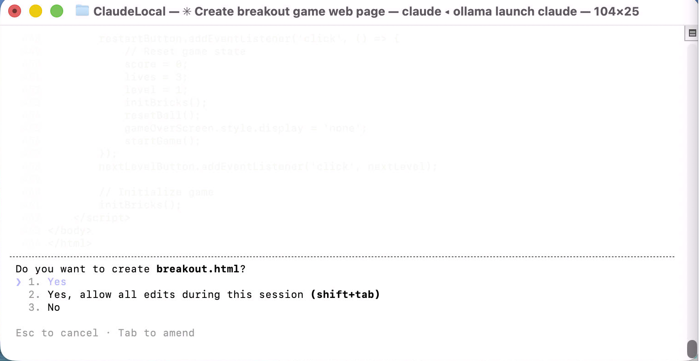
*I was asked to approve creating breakout.html — I clicked Yes*

It wrote 444 lines of HTML, CSS and JavaScript in one shot.

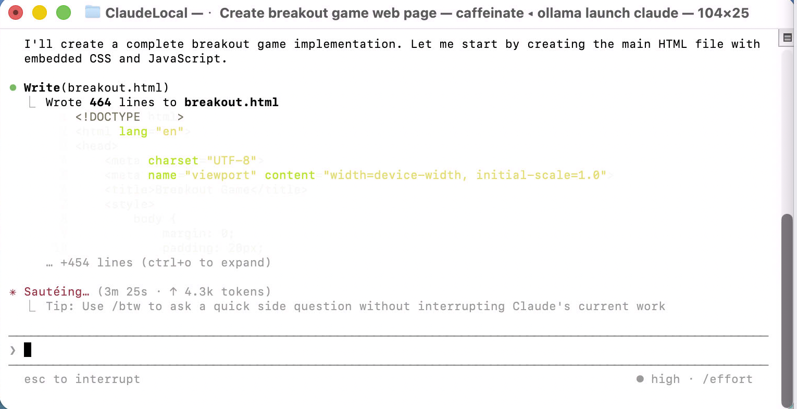
*I watched it write 444 lines to breakout.html*

The completion summary listed score tracking, multiple levels, a lives system, game over and win screens, and responsive design. It took 3 minutes 40 seconds.

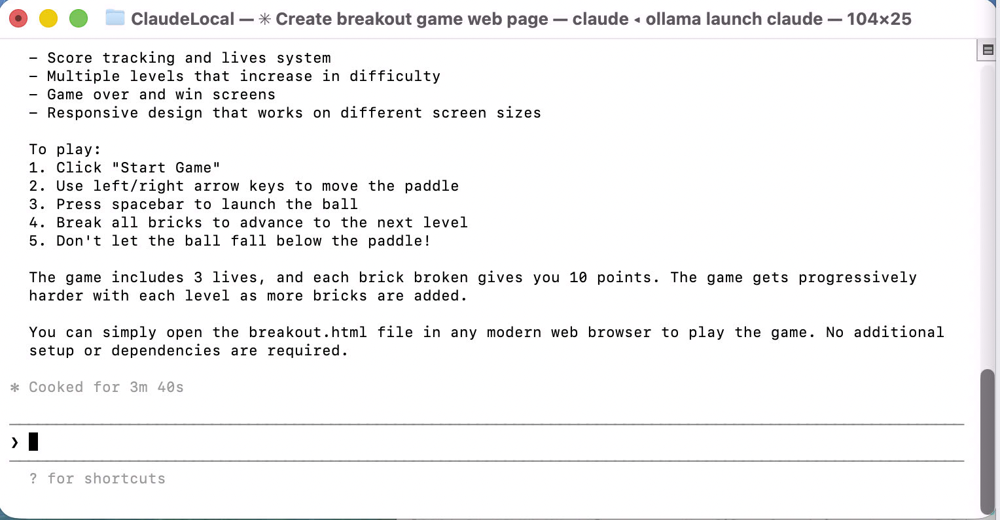
*I read the summary — full feature set, cooked in 3m 40s*

The model then offered to open the page with a local server.

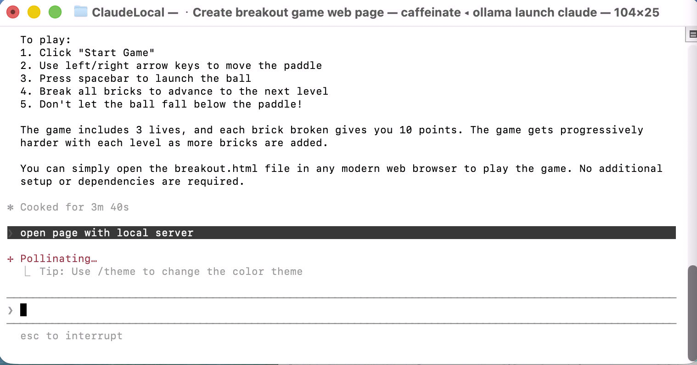
*I was offered the option to open the game with a local server*

It ran `python3 -m http.server 8000` and asked for approval.

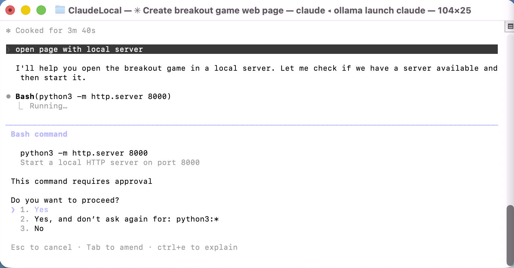
*I approved running the HTTP server on port 8000*

The game opened in the browser — colourful brick grid, paddle, score and lives all present.

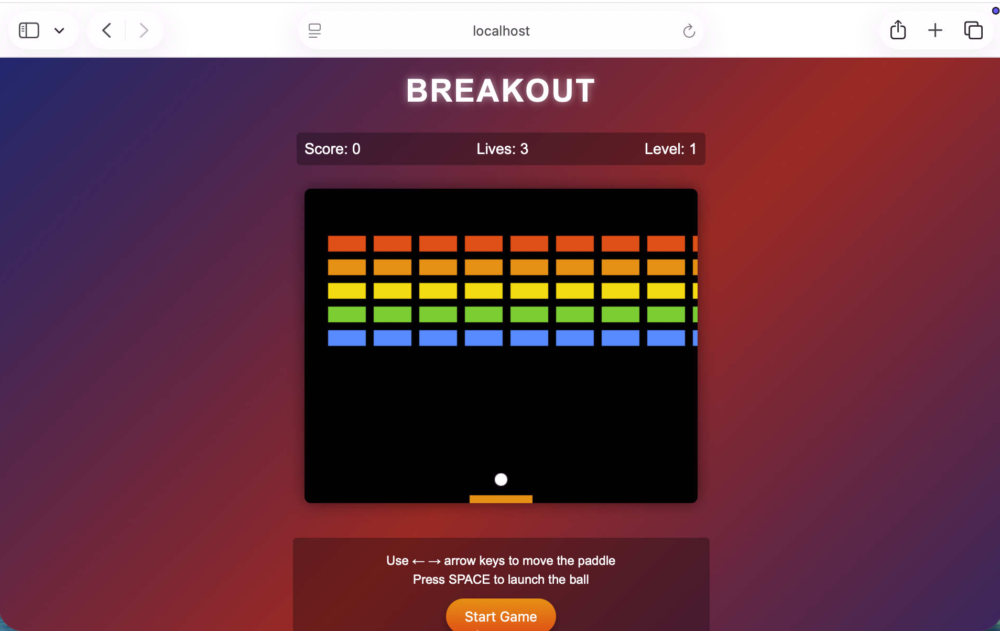
*I saw the finished Breakout game ready to play*

I started playing. Score 60, two lives used, bricks already clearing.

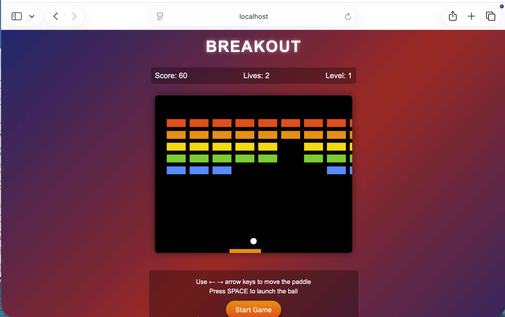
*I played the game — score 60, bricks clearing nicely*

The quality was genuinely good. Running a 30B coder model locally through Ollama and Claude Code produced a working game with no iteration needed. The memory footprint is steep, but on a Mac Studio with 64 GB it was fine.

## References

- [Claude Code — Ollama integration docs](https://docs.ollama.com/integrations/claude-code)
- [Claude Code with Anthropic API compatibility — Ollama Blog](https://ollama.com/blog/claude)
- [Using Claude Code With Ollama Local Models — DataCamp](https://www.datacamp.com/tutorial/using-claude-code-with-ollama-local-models)
