In [Part 11](/posts/claudecode11/) I used `ollama launch claude` to run Claude Code backed by a local model — qwen3-coder:30b running entirely on the Mac Studio, consuming 41 GB of RAM. It worked well, but it was slow (3m 40s for the breakout game) and pinned the machine while it ran.

This time I tried a different approach: pointing Claude Code at the DeepSeek API. DeepSeek exposes an Anthropic-compatible endpoint, so by setting three environment variables — `ANTHROPIC_BASE_URL`, `ANTHROPIC_API_KEY`, and `ANTHROPIC_MODEL` — Claude Code routes through DeepSeek's cloud models instead of either Anthropic's API or a local Ollama model. No RAM pressure, near-instant responses, and at a fraction of the cost: the whole session — 5 API requests and 114,235 tokens — came to less than $0.01.

The trade-off is that your prompts and code go to an external service rather than staying on-device. For a toy game that's fine — for sensitive codebases the local Ollama approach is the safer choice.

I started by creating a DeepSeek API key.

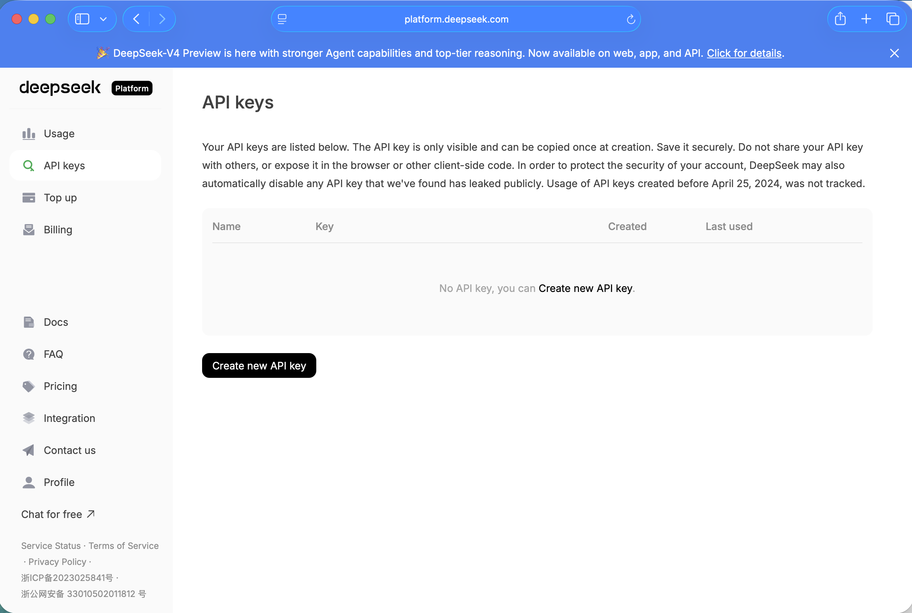
*I navigated to the DeepSeek platform API keys page — no keys existed yet*

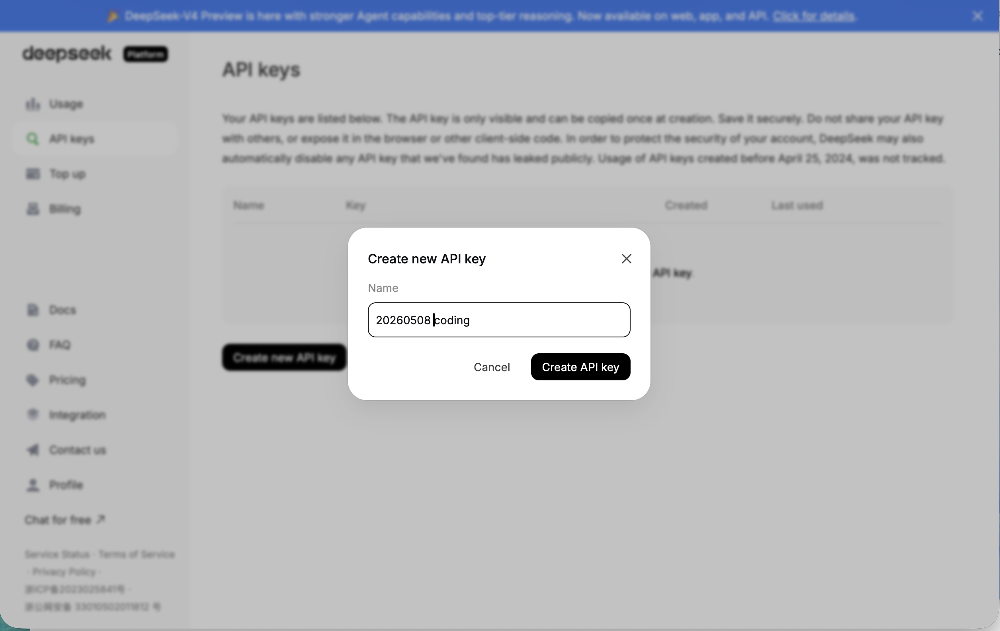
*I clicked "Create new API key" and entered a name for the key*

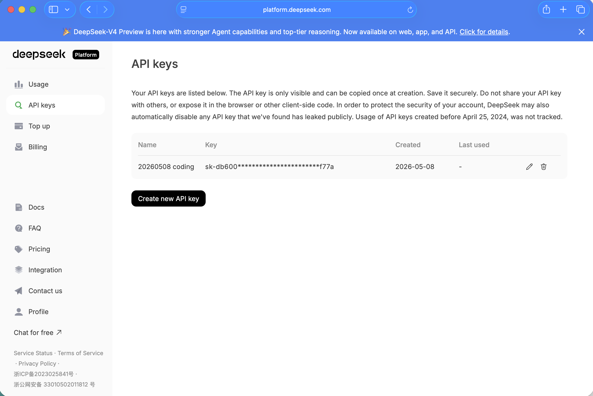
*The new API key was created and listed on the page*

Then I exported the three environment variables and launched Claude Code.

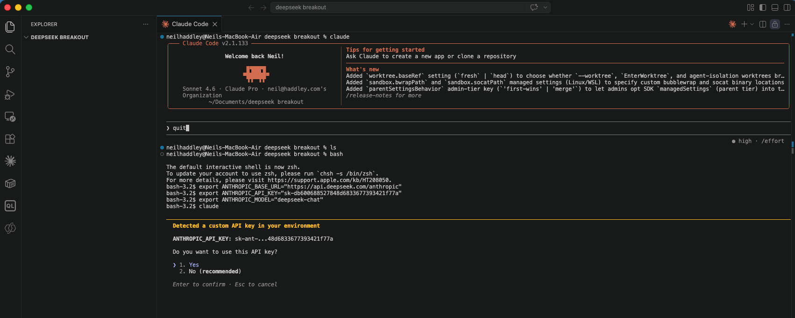
*I exported the DeepSeek endpoint and API key as Anthropic environment variables, then ran Claude Code — it detected the custom API key and asked whether to use it*

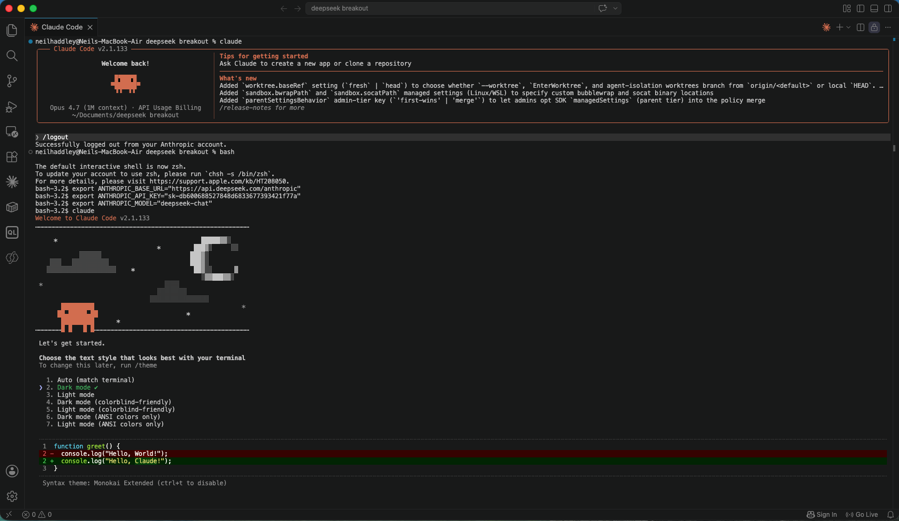
*Claude Code launched with the DeepSeek backend connected*

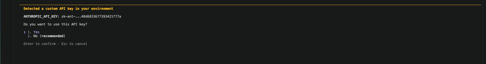
*Claude Code prompted me to confirm use of the custom API key — I selected Yes*

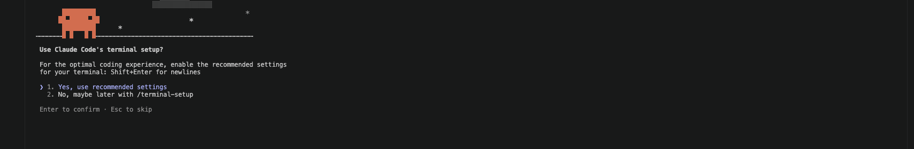
*Claude Code asked whether to apply its recommended terminal settings*

I used the same prompt as Part 11 to make it an easy comparison.

```PROMPT
create a web page breakout game
```

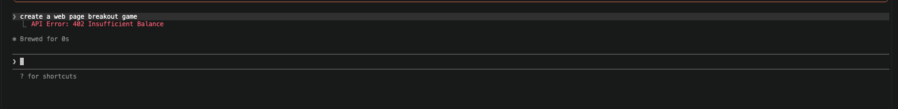
*I asked Claude Code to create a breakout game but got an API Error 402 — Insufficient Balance on the DeepSeek account*

The account had no credit yet, so I topped it up.

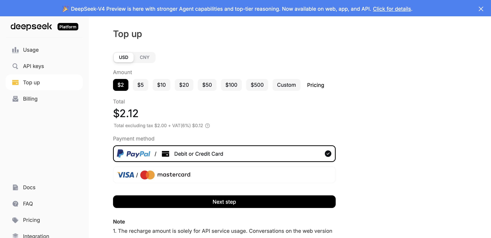
*I went to the DeepSeek Top Up page and selected $2 to add credit*

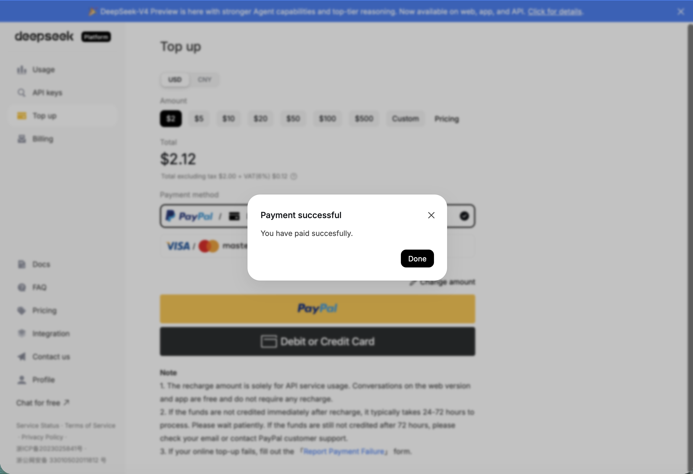
*The payment went through successfully*

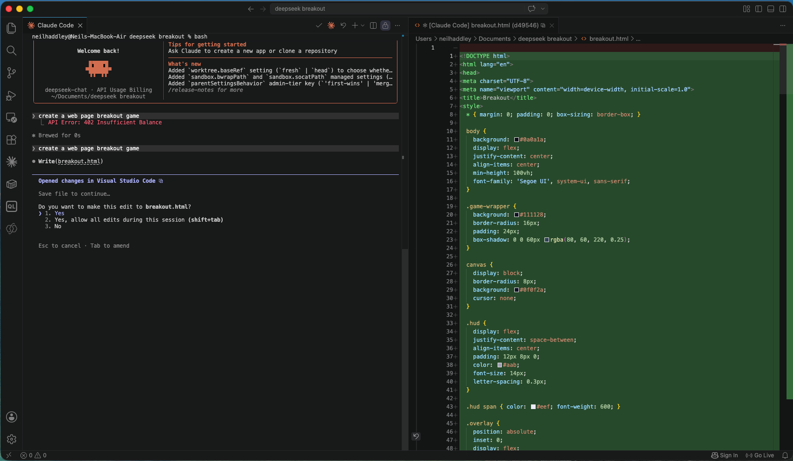
*After topping up, I reran the prompt — Claude Code generated the breakout game HTML and CSS*

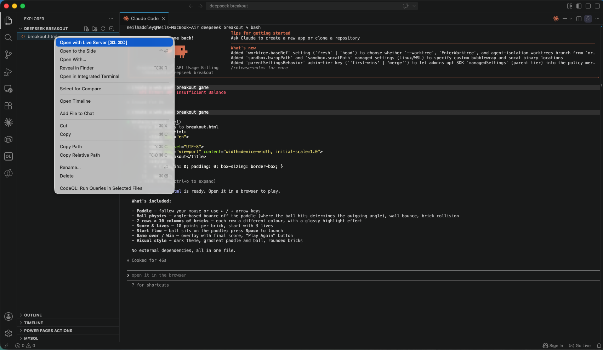
*I right-clicked the file and chose Open with Live Server to preview it in the browser*

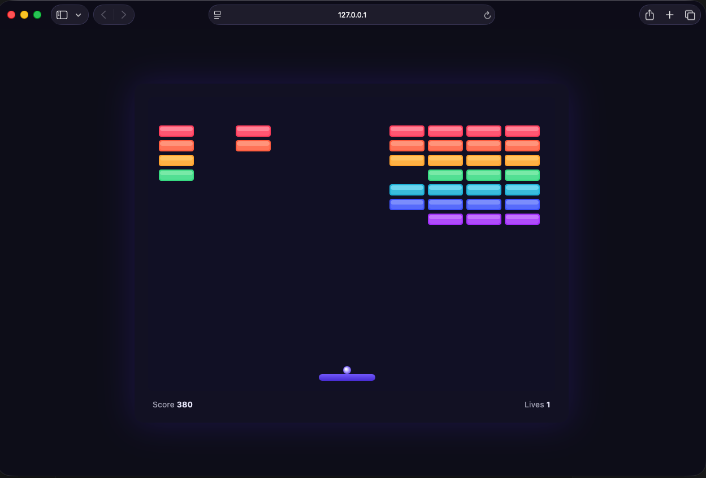
*The breakout game loaded and ran in the browser — score 380, most bricks still in play*

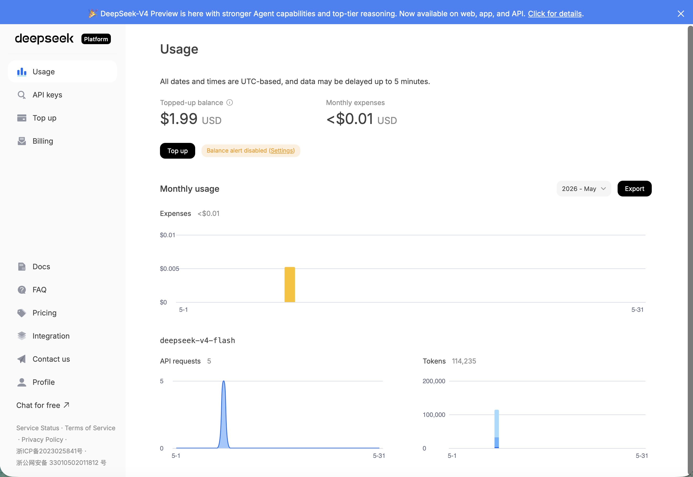
*The DeepSeek usage page showed the session cost less than $0.01 — 5 API requests and 114,235 tokens from a $2 top-up*

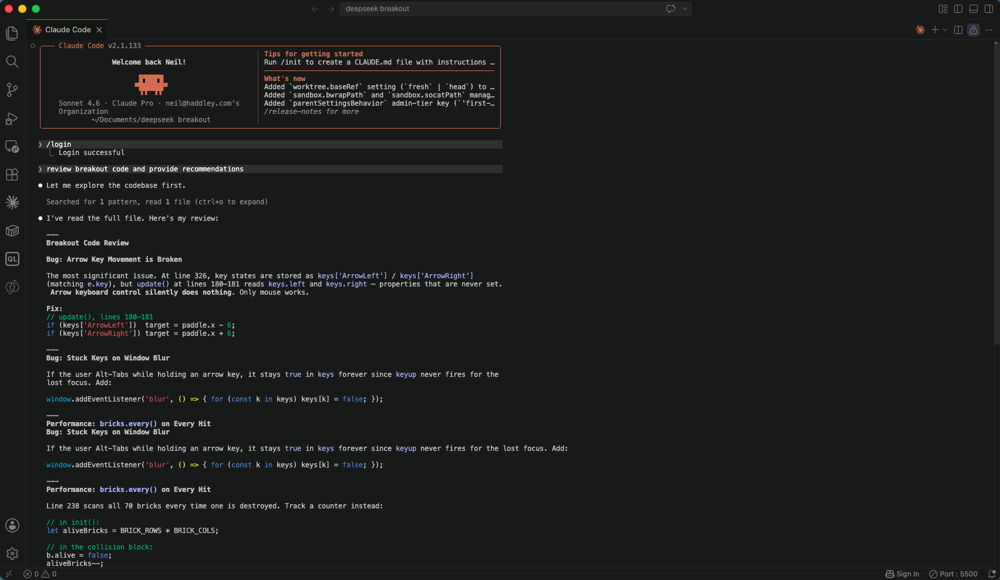
*I asked Claude Code to review the game code — it identified several issues and suggested improvements*

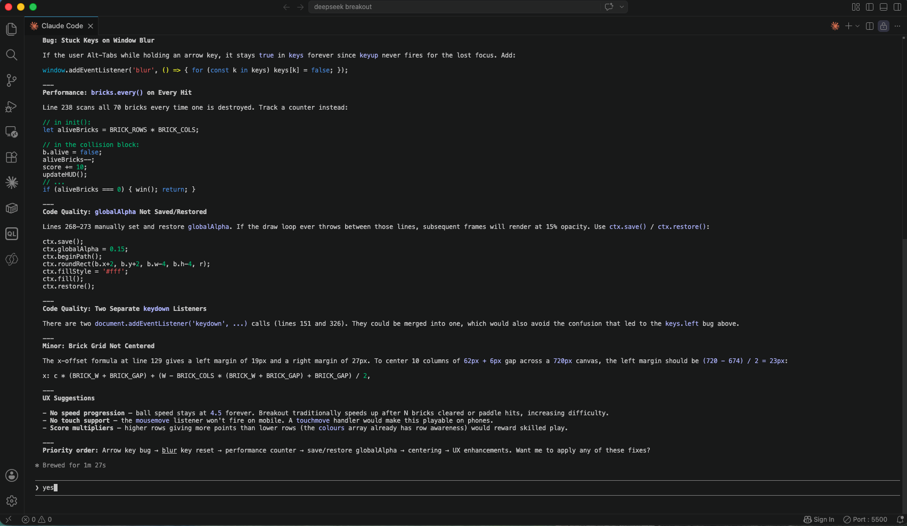
*Claude Code continued listing its recommended fixes for the game*

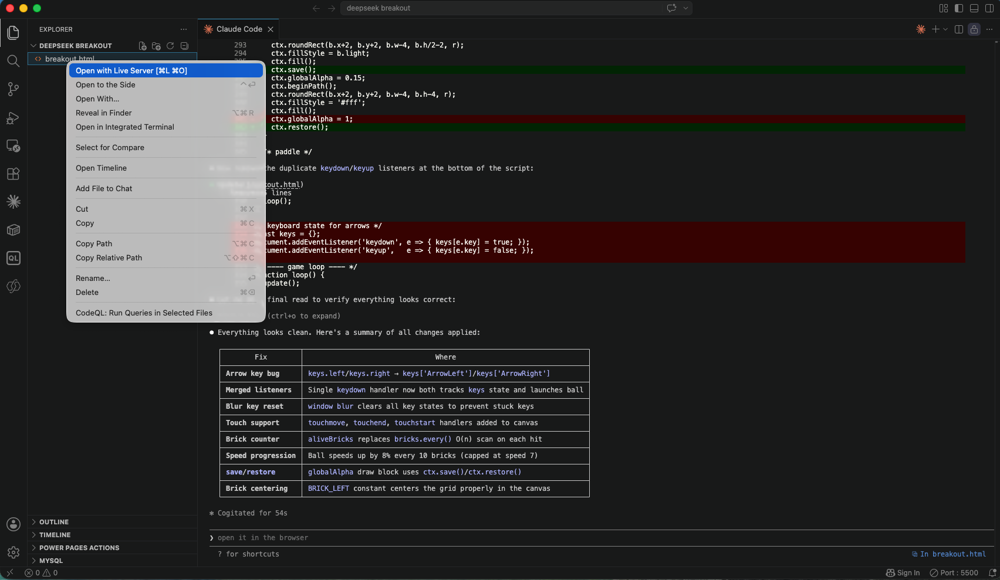
*I opened the updated file with Live Server again to test the changes*

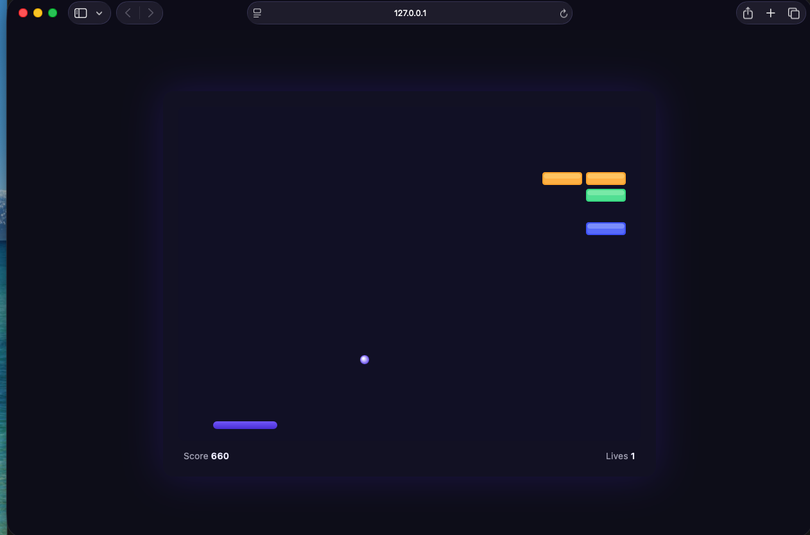
*The improved game was nearly complete — score 660, only a handful of bricks remaining*

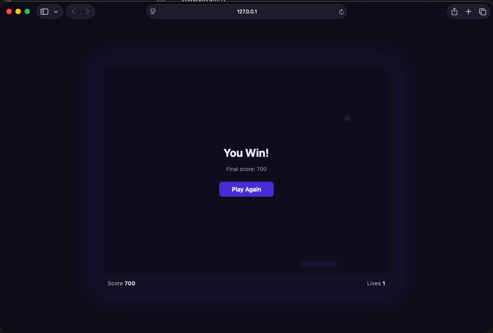
*I cleared all the bricks and won — final score 700*

## References

- [How to Run Claude Code Against DeepSeek V4 for $3 a Session (Step-by-Step)](https://www.mindstudio.ai/blog/run-claude-code-against-deepseek-v4-free-cloud-code-proxy)
