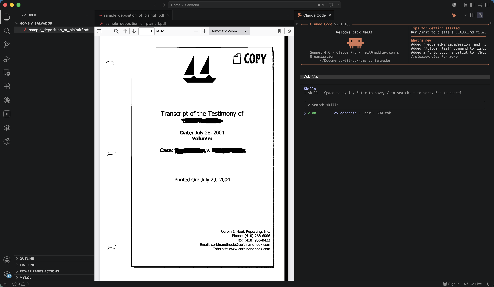
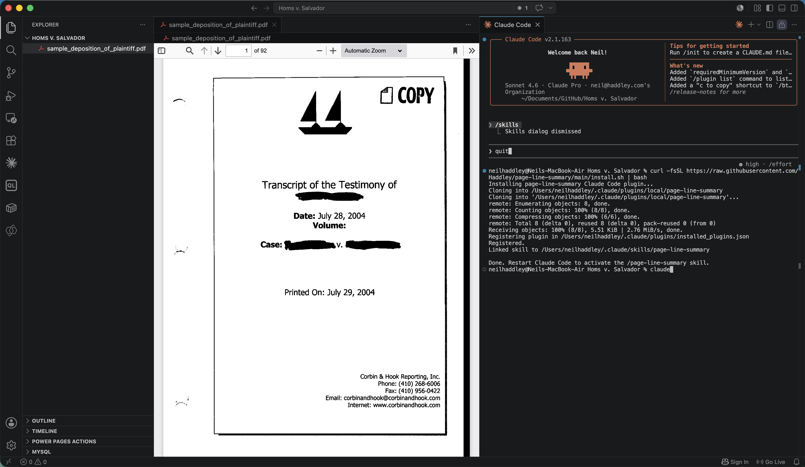
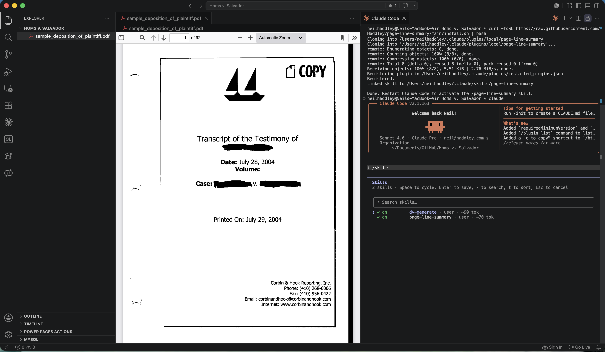
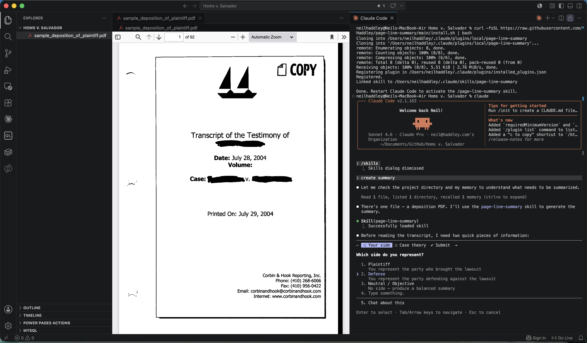
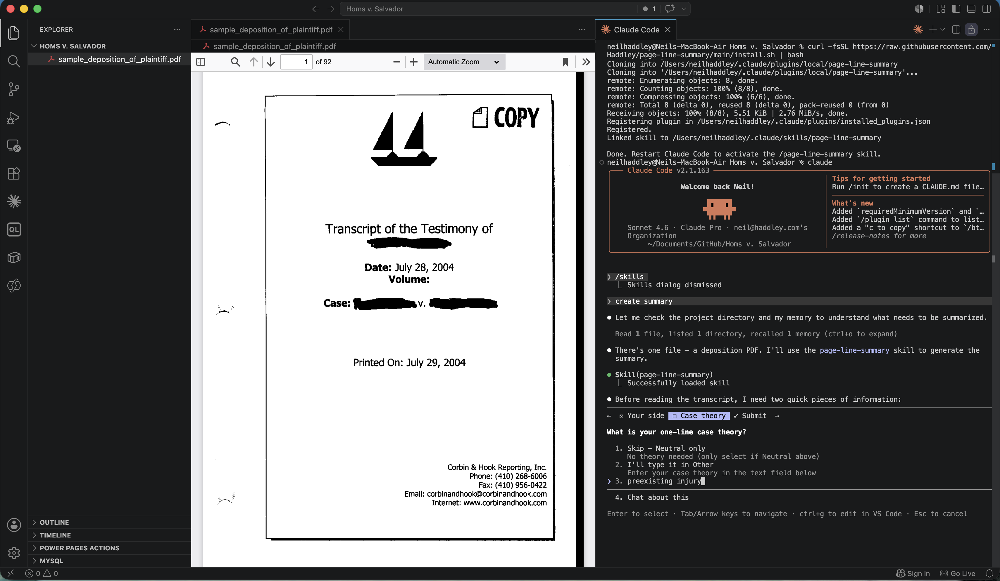
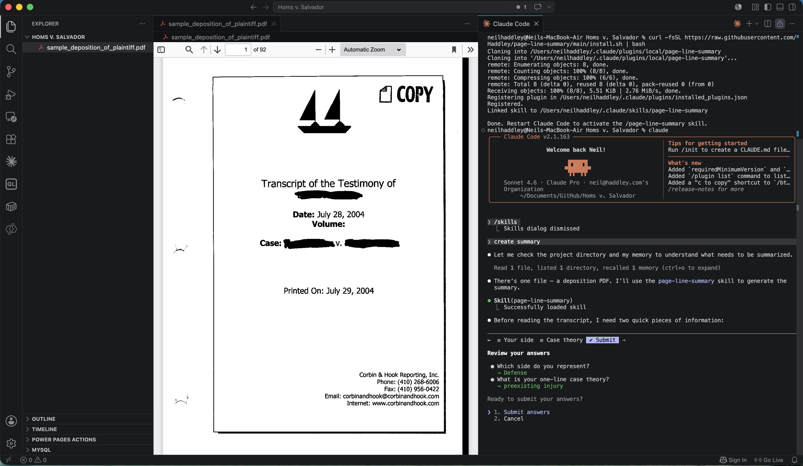
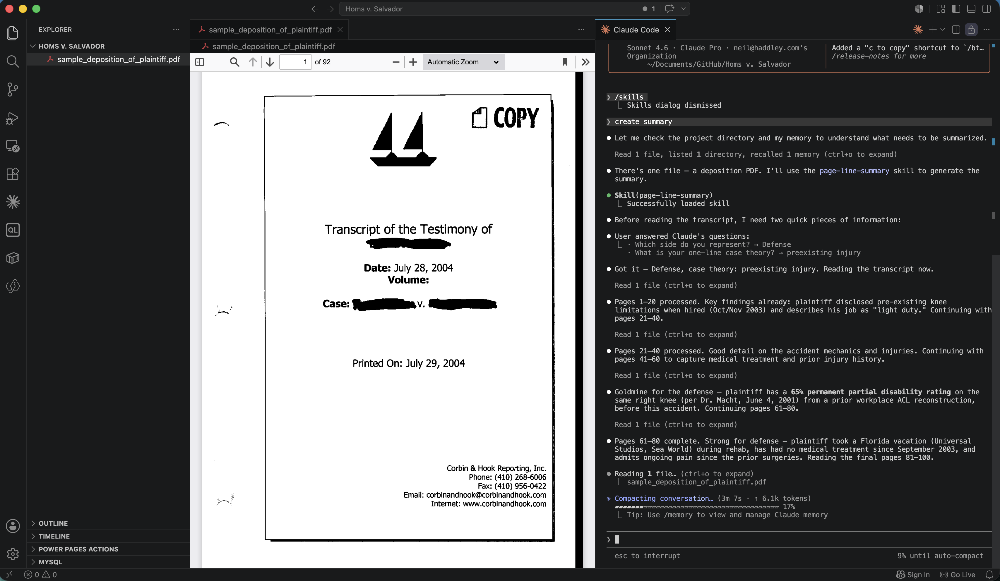
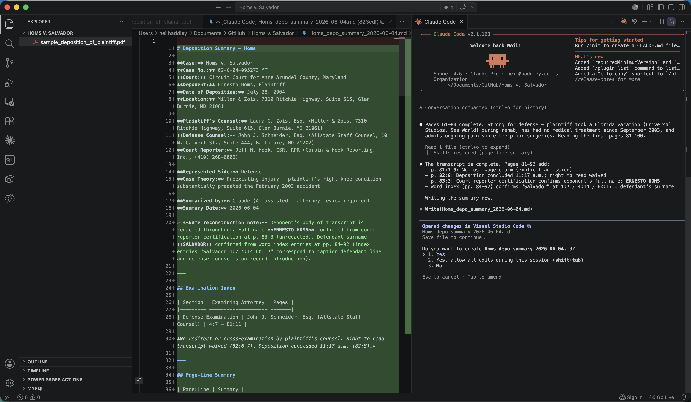
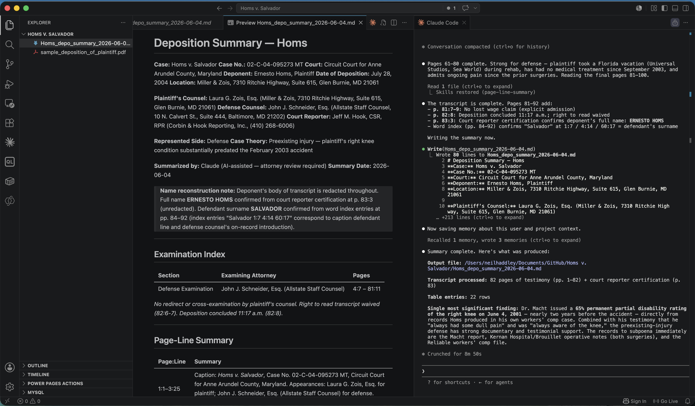

I built a Claude Code skill called `page-line-summary` that generates professional Page-Line Deposition Summaries from transcript files. It reads the transcript, asks which side you represent and your case theory, then produces a structured Markdown document — case caption, examination index, two-column page:line table, and strategic key takeaways — ready for attorney review. The skill installs with a single curl command and runs directly from the Claude Code CLI. For the same skill running inside Claude Cowork, see [Claude Cowork (Part 1)](/posts/claudecowork1/).

A Page-Line Summary is the litigation standard for condensing deposition transcripts. It uses a two-column table — the left column gives the transcript reference (e.g., `25:14–19`), the right column summarises what was said. The goal is about one page of summary per five to ten pages of transcript, focusing on admissions, inconsistencies, damages, and facts that directly support or undermine the case theory. To test the skill I used a sample transcript from a personal injury case, *Homs v. Salvador*, and ran it through as the defence side.

```bash
  curl -fsSL https://raw.githubusercontent.com/Haddley/page-line-summary/main/install.sh | bash
```



*I opened the deposition transcript in VS Code and ran /skills to see the available skills*


*I ran the curl install command, which cloned the repository and registered the skill with Claude Code*


*I started claude and checked that the page-line-summary skill was listed*


*The skill asked which side I represent before reading the transcript*


*I selected Defense and the skill asked for a one-line case theory*


*I confirmed my answers: Defense, with a preexisting injury theory*


*The skill read the 92-page transcript in chunks, flagging key admissions and damages facts as it went*



*The skill saved the summary as a Markdown file in the same directory as the transcript*


*The formatted summary rendered with the case caption, examination index, page-line table, and key takeaways*

## Deposition Summary

````MARKDOWN
# Deposition Summary — Homs

**Case:** Homs v. Salvador
**Case No.:** 02-C-04-095273 MT
**Court:** Circuit Court for Anne Arundel County, Maryland
**Deponent:** Ernesto Homs, Plaintiff
**Date of Deposition:** July 28, 2004
**Location:** Miller & Zois, 7310 Ritchie Highway, Suite 615, Glen Burnie, MD 21061

**Plaintiff's Counsel:** Laura G. Zois, Esq. (Miller & Zois, 7310 Ritchie Highway, Suite 615, Glen Burnie, MD 21061)
**Defense Counsel:** John J. Schneider, Esq. (Allstate Staff Counsel, 10 N. Calvert St., Suite 444, Baltimore, MD 21202)
**Court Reporter:** Jeff M. Hook, CSR, RPR (Corbin & Hook Reporting, Inc., (410) 268-6006)

**Represented Side:** Defense
**Case Theory:** Preexisting injury — plaintiff's right knee condition substantially predated the February 2003 accident

**Summarized by:** Claude (AI-assisted — attorney review required)
**Summary Date:** 2026-06-04

> **Name reconstruction note:** Deponent's body of transcript is redacted throughout. Full name **ERNESTO HOMS** confirmed from court reporter certification at p. 83:3 (unredacted). Defendant surname **SALVADOR** confirmed from word index entries at pp. 84–92 (index entries "Salvador 1:7 4:14 60:17" correspond to caption defendant line and defense counsel's on-record introduction).

---

## Examination Index

| Section | Examining Attorney | Pages |
|---------|--------------------|-------|
| Defense Examination | John J. Schneider, Esq. (Allstate Staff Counsel) | 4:7 – 81:11 |

*No redirect or cross-examination by plaintiff's counsel. Right to read transcript waived (82:6-7). Deposition concluded 11:17 a.m. (82:8).*

---

## Page-Line Summary

| Page:Line | Summary |
|-----------|---------|
| 1:1–3:25 | Caption: *Homs v. Salvador*, Case No. 02-C-04-095273 MT, Circuit Court for Anne Arundel County, Maryland. Appearances: Laura G. Zois, Esq. for plaintiff; John J. Schneider, Esq. (Allstate Staff Counsel) for defense. Court reporter: Jeff M. Hook, CSR, RPR, Corbin & Hook Reporting. |
| 4:7–5:18 | Examination commences. Schneider identifies himself as Allstate Staff Counsel representing defendant Salvador. Plaintiff sworn. Standard deposition ground rules administered (truthfulness, clarification protocol, distinction between "I don't know" and a guess). |
| 6:1–9:18 | Background: Age 28; born and raised New York; moved to Maryland ~1998; current zip 21060. Separated; girlfriend "Niki" (~8 years together, spelling confirmed in index as N-I-U-R-K-A at 5:21). Three children: stepson age 14, son age 6, daughter age 9 months. Current employer since October/November 2003: environmental company (Clean Venture) — chemical technician, **light duty only**. |
| 9:16–12:19 | **[KEY FACT]** When hired at Clean Venture, plaintiff self-disclosed knee restrictions: *"No heavy lifting. Nothing that's going to hurt my knee."* Employer accommodates: plaintiff does not carry trash bags; does not move drums without a cart. Knee limitations self-reported to a new employer while still in post-accident rehabilitation, consistent with pre-existing functional ceiling. |
| 13:1–21:10 | Prior employment: co-owned/operated barber shop (~2 years until accident); worked at girlfriend's grocery store on Mondays (unpaid); New York employment included West Side Federation for Senior Housing, supermarket work, and odd jobs. Education: 10th grade at Chelsea Vocational HS (expelled); GED; approximately 4 months of barber school. |
| 22:1–26:5 | Plaintiff moved from New York to Maryland ~1998. Lived in Oakdale, MD (~4 years), then current address (~1 year). Family remains in New York (grandfather, grandmother, brother). No significant facts for liability or damages theory. |
| 26:5–29:21 | **[KEY FACT]** Accident road conditions: winter night; ground wet; residual snow on road shoulders from approximately 2 weeks prior; no fresh snow; no ice (26:5-10; 29:6-9). Road: Point Pleasant between Sunny Brook and Genine; one lane each direction; double yellow center line (visible); sloped curve (27:14,19; 28:4). Plaintiff traveling toward Genine at 15–20 mph (speed limit 25 mph); had reduced speed due to wet ground (28:16-18; 29:13). |
| 29:13–32:21 | **[KEY FACT]** Collision: Plaintiff first observed defendant's headlights at approximately 10–15 feet (31:9). Defendant's vehicle crossed the double yellow line into plaintiff's lane. Plaintiff grabbed steering wheel; evasion impossible (trees on right, oncoming traffic risk on left). Impact: front driver's side to front driver's side, head-on (31:11-14). No eyewitnesses to the collision (41:2-4). |
| 33:1–37:21 | **[EXHIBIT]** Exhibits 1–5 introduced. Exhibit 1 — right knee cuts/lacerations (33:12-16). Exhibit 2 — left knee scratches (34:8-9). Exhibit 3 — chest bruising, seat belt area, bottom of ribs to left breast (35:5-6). Exhibit 4 — plaintiff's vehicle exterior front-end damage (36:1-2). Exhibit 5 — interior showing twisted/buckled frame under rear seat (36:19-20). Left arm bruise also noted (37:17-19). |
| 33:12–34:20 | **[DAMAGES]** Right knee impact: cuts/lacerations; piece of dashboard plastic embedded in knee — plaintiff removed it himself at the scene (40:15-16); knee struck dashboard directly (34:4-5). Left knee: scratches only; fully healed; no continuing problems (34:12-15). |
| 38:15–40:21 | **[KEY FACT — DEFENDANT ADMISSION AT SCENE]** Defendant stated immediately post-impact: *"Are you okay? Oh my God, I'm sorry. I'm sorry."* (39:19-21). Post-impact symptoms: difficulty breathing (40:6); plastic shard removed from right knee at scene (40:15-16). **[EXHIBIT 6]** Head bruise left side/top photographed (39:3-8). |
| 41:18–44:1 | ER: University of Maryland Shock Trauma. X-rays, possible CAT scan, morphine IV, knee sutured; released approximately 2–3 a.m. Lower back also treated at ER. |
| 44:11–46:21 | **[KEY FACT — PREEXISTING INJURY #1]** **1998 New York car accident — same right knee.** Arthroscopic surgery (meniscus cleaning/debridement) at Saint Barnabas Hospital, Bronx; physical therapy. Personal injury claim filed and settled through New York attorney (45:13-47:5). Plaintiff was approximately 22 years old at the time. |
| 47:1–50:21 | **[KEY FACT — PREEXISTING INJURY #2]** **Slip-and-fall at employer "Reliable" (Maryland).** Fell 8–10 feet from machinery while changing a light bulb; landed on side; right knee buckled on impact (48:8-21; 49:2). X-ray and MRI ordered. **Open ACL reconstruction surgery (patella tendon graft) performed November 24, 1999** by Dr. Brouillet at Kernan Hospital (57:19; 58:1-6). **Second arthroscopic surgery performed approximately 2000** by Dr. Brouillet because the first surgery was not fully successful (50:10-14). Workers' compensation claim filed and settled (59:1-4). |
| 50:20–56:11 | **[ADMISSION — PREEXISTING KNEE STATUS PRE-ACCIDENT]** After two surgeries on the right knee, plaintiff testified: *"Not 100 percent better, but I was able to return to somewhat normal activities"* (50:20-21); *"Always had some dull pain once in a while"* (55:18); *"Walking fine, stability, I was good"* (55:19); pain with long walking or being on it "too long" (56:3-4); knee *"not really"* prevented him from doing anything completely (56:11); *"Always aware of the knee"*; *"would always take it easy on the knee"* (51:15-21). Able to ride bicycle from approximately 2001 until the February 2003 accident (69-70). |
| 57:14–59:14 | **[KEY FACT / DAMAGES — PREEXISTING DISABILITY RATING]** Post-Reliable treatment: physical therapy at Concentral (employer's physicians). **Dr. Macht record (confirmed date June 4, 2001): 65% permanent partial disability of the right knee** (59:5-8). This rating was in place nearly two years before the February 2003 accident. Workers' comp claim settled (59:1-4). |
| 59:14–61:20 | **[KEY FACT — ACCIDENT DATE CONFIRMED]** Accident occurred **Monday evening, approximately 7:05–7:10 p.m., February 2003** (60:17; 61:15-17; 26:13-14 for time). Plaintiff's pre-accident functional level: riding bicycle, light recreational activities, employed as barber/shop co-owner. |
| 61:11–64:21 | **[DAMAGES — POST-ACCIDENT TREATMENT]** After February 2003 accident: physical therapy with Dr. Shepherd (referred through attorney) for knee and low back. Low back pain resolved within approximately 2 weeks (62:15-17). Dr. Shepherd referred plaintiff to Dr. O'Hearn for knee evaluation. **Surgery performed May 2003 on right knee** by Dr. O'Hearn (with Dr. Shepherd) (63:8-9; 64:9). Post-surgery rehabilitation: surgical site healed, then aquatic therapy, then regular physical therapy — approximately 3–4 months total. Last medical records from September 2003. |
| 65:1–67:21 | **[DAMAGES — CURRENT SYMPTOMS (July 2004)]** Right knee pain 4–5 times per week; activity-dependent: standing all day, walking long distances (mall), driving stick-shift vehicle (65:6-12). No instability or slippage (65:2-3). Shovel adaptation: uses left leg to kick shovel, right knee cannot bear that force (66:12-19). Pain management: Aspercreme, Flexall cream (OTC); occasional Aleve for severe pain only (67:15-16). Carries Flexall to work daily (67:21). No prescription medications. |
| 68:1–73:21 | **[DAMAGES — FUNCTIONAL LIMITATIONS (July 2004)]** Cannot ride bicycle (69:7). Avoids activities that might aggravate knee out of fear of reinjury (69:10-13). Cannot jog with children (71:4-8). Sexual limitations noted (70:15-18). *"Still haven't been able to say I can actually sit down and have no pain"* (73:12-13). Doctors told him: light duty only (73:21). |
| 74:1–75:21 | **[ADMISSION — TREATMENT GAP]** Last medical appointment: September 2003. As of deposition date (July 28, 2004), plaintiff had not seen Dr. Shepherd or Dr. O'Hearn for **over 10 months**. Recommended 1-year follow-up with Dr. O'Hearn had not been scheduled (74:7). No current prescription medications; relies solely on OTC topical creams (75:4-8). |
| 76:1–79:21 | Prior employer "Reliable" — workers' comp files; plaintiff confirms settlement. Concentral (physical therapy under workers' comp) referenced. **[ADMISSION]** During rehabilitation from the May 2003 surgery, plaintiff took a **vacation to Orlando, Florida — Universal Studios, Sea World, Kissimmee area** (79:14-21; 80:1-9). |
| 80:11–81:9 | **[ADMISSION]** No home exercise program as of deposition date (80:12). Did home exercises approximately 1–2 months after therapy ended, then stopped (80:16-18). **[ADMISSION — DAMAGES CEILING]** Schneider: *"You're not making any kind of a lost wage claim as a result of this accident?"* Plaintiff: *"No."* (81:7-9). |
| 81:10–82:8 | Defense examination concluded (81:10-11). No examination by plaintiff's counsel. Plaintiff waived right to read/correct transcript (82:6-7). **Deposition concluded 11:17 a.m.** (82:8). |
| 83:1–21 | Court reporter certification. Jeff M. Hook, CSR, RPR, Notary Public, State of Maryland. Certifies that **ERNESTO HOMS** personally appeared and was interrogated. Transcript prepared by computer-assisted transcription from stenographic notes. Hook not of counsel, not employed by counsel, not related to any party. Commission expires February 1, 2008. Signed Glen Burnie, Maryland, July 28, 2004. |

---

## Key Takeaways

1. **The right knee had two prior surgeries and an official 65% permanent partial disability rating before this accident.** Dr. Macht issued a rating of 65% permanent partial disability of the right knee on June 4, 2001 — nearly two years before the February 2003 collision. Defense should subpoena and introduce the Macht report, the Kernan Hospital surgical records, and Dr. Brouillet's operative notes. The 1998 Saint Barnabas arthroscopic records should also be obtained. These records, combined with plaintiff's own admissions about residual symptoms, directly support the preexisting-injury defense theory.

2. **Plaintiff's own testimony establishes the right knee was chronically symptomatic and functionally limited before the accident.** He used the words "always had some dull pain once in a while," was "always aware of the knee," and "would always take it easy on it." He disclosed knee restrictions when taking a new job in October 2003 — while still in post-accident rehabilitation — consistent with a functional ceiling established well before February 2003, not caused by it.

3. **No lost wage claim.** Plaintiff expressly conceded he is not asserting a lost wage claim from this accident (81:7-9), eliminating a significant damages category.

4. **A 10+ month gap in medical treatment significantly undermines the severity of the post-accident damages narrative.** Plaintiff's last medical contact was September 2003. As of the July 2004 deposition — more than a year after his May 2003 surgery — he had not completed a recommended annual follow-up and manages any pain entirely with over-the-counter topical creams. This gap is inconsistent with a claim of severe, ongoing, disabling pain.

5. **Plaintiff took an amusement park vacation (Universal Studios, Sea World) during the post-surgical rehabilitation period**, which directly contradicts the severity of the limitations he describes. This admission should be developed at trial with park ticket records or travel documentation and cross-referenced against any treating physician notes from that same period.

---

*AI-generated preliminary summary. Independent attorney review required for accuracy, completeness, and privilege. Do not rely on this summary without verification against the original transcript. Redacted party names reconstructed from the court reporter's word index and certification page — verify against the unredacted caption before filing or serving.*

````

## Skill

````MARKDOWN
---
name: page-line-summary
description: Generate a Page-Line Summary from a deposition transcript (PDF, TXT, or DOCX). Produces a formatted Markdown file with case caption, two-column page:line reference table, and litigation-focused analysis. Asks for the attorney's side and case theory before summarizing.
---

# Skill: Page-Line Deposition Summary

Generate a gold-standard Page-Line Summary from a deposition transcript for litigation use.

---

## Trigger & Arguments

Invoked as `/page-line-summary [file-path]`.

If the user provides a file path as an argument, use it. Otherwise, ask for one before proceeding.

---

## Step 1 — Gather Context

Before reading the transcript, collect the following. Ask all in a single message if not already provided:

1. **File path** — if not already given as an argument
2. **Which side do you represent?** — Plaintiff, Defense, or Neutral/Objective
3. **One-line case theory** — e.g., *"Defendant failed to warn of known product defects, causing plaintiff's injuries"* (skip if Neutral)

---

## Step 2 — Read the Transcript

Determine the file type from the extension:

**PDF (`.pdf`)**
Use the Read tool. For files over 10 pages, read in 20-page chunks (`pages: "1-20"`, `"21-40"`, etc.) until the full transcript is processed. Accumulate all content before summarizing.

**Plain text (`.txt`)**
Use the Read tool directly.

**Word document (`.docx`)**
Run this Bash command to extract plain text on macOS:
```bash
textutil -convert txt -stdout "[file-path]"
```
If `textutil` is unavailable, try:
```bash
pandoc "[file-path]" -t plain
```

---

## Step 3 — Parse & Identify Structure

After reading, identify:

- **Page/line markers** — most transcripts use a page number at the top and line numbers 1–25 down the left margin. Look for patterns like `Page 25`, standalone integers at line starts, or `25:14` inline references.
- **Caption block** — typically the first 3–5 pages: case name, case number, court, date, deponent name, attorneys present.
- **Examination sections** — `DIRECT EXAMINATION BY`, `CROSS EXAMINATION BY`, `REDIRECT EXAMINATION`, `RECROSS`, etc.

If the transcript lacks explicit page/line numbers, use the best available reference (e.g., document page numbers only) and note this in the summary header.

---

## Step 4 — Extract Caption Information

From the opening pages, extract:

- Case Name (e.g., *Smith v. Acme Corp.*)
- Case Number
- Court / Jurisdiction
- Deponent Full Name and Title / Role
- Date of Deposition
- Location
- Examining Attorney(s) — name, firm, and side
- Defending Attorney(s) — name, firm, and side

If any field is absent from the transcript, mark it `[Not stated in transcript]`.

### Redacted transcripts — reconstruct names from the word index

Many transcripts have party names blacked out in the body (common in published sample transcripts) while the **court reporter's word index** at the end remains unredacted. The index lists every word alphabetically with its page:line citations. Use it to recover names:

1. **Read the index pages** (typically the last 5–10 pages of the PDF).
2. **Identify known structural anchors** — fixed page:line positions where names must appear:
   - Caption plaintiff line (e.g., p.1:4–5 in most Maryland transcripts)
   - Caption defendant line (e.g., p.1:7–8)
   - Court reporter certification (last substantive page — names are rarely redacted here)
   - Counsel's introduction of themselves or their client (e.g., p.4:13–14)
3. **Cross-reference** — any index entry whose page:line citations match an anchor position is a party or attorney name.
4. **Validate gender/role** — confirm the reconstructed name is consistent with how the transcript refers to the person (she/he, plaintiff/defendant).
5. **Note the source** — add `*(name reconstructed from court reporter word index, p. XX — verify against unredacted caption)*` beside any name recovered this way.

---

## Step 5 — Generate the Page-Line Table

### Compression target

Aim for **1 page of summary per 5–10 pages of transcript**. For a 100-page transcript, produce roughly 10–20 substantive table rows — not 100. Be selective and high-yield.

### Priority order for inclusion

1. **Admissions** — any concession harmful to the witness's own side
2. **Key liability facts** — what happened, when, who was responsible
3. **Inconsistencies** — conflicts with prior testimony, pleadings, documents, or other witnesses
4. **Damages** — physical, financial, emotional harm; causation and extent
5. **Credibility factors** — bias, motive, relationship to parties, prior bad acts
6. **Expert opinions** (expert witnesses only) — qualifications, methodology, opinions, limitations conceded
7. **Exhibit references** — exhibits introduced; witness's admission, denial, or reaction
8. **Case-theory facts** — anything that directly supports or damages the stated case theory

### What to omit

- Routine swearing-in and stipulations
- Extended background and biography (unless the witness is an expert or credentials are disputed)
- Repetitive questions covering the same ground as a prior entry
- Pure procedural objections with no substantive outcome

### Table format

```markdown
| Page:Line | Summary |
|-----------|---------|
| 1:1–3:25  | Caption, appearances, oath administered. |
| 5:14–18   | Witness confirms employment as plant manager at Acme Corp., 2018–2023. |
| 12:4–13:2 | **[ADMISSION]** Witness received the March 3, 2021 safety inspection report and did not forward it to engineering. |
```

### Inline tags — use sparingly, only when clearly earned

| Tag | When to use |
|-----|-------------|
| `**[ADMISSION]**` | Damaging concession by the witness |
| `**[INCONSISTENCY]**` | Conflicts with prior statement, pleading, or document |
| `**[DAMAGES]**` | Relates to harm, causation, or quantification |
| `**[KEY FACT]**` | Central liability or chronology fact |
| `**[EXHIBIT]**` | Exhibit introduced or referenced |
| `**[EXPERT OPINION]**` | Expert witness opinion or methodology |

Do not tag routine testimony. Over-tagging dilutes the signal for the reviewing attorney.

---

## Step 6 — Assemble the Output Document

Build the full Markdown document in this order:

```markdown
# Deposition Summary — [Deponent Last Name]

**Case:** [Case Name]
**Case No.:** [Case Number]
**Court:** [Court / Jurisdiction]
**Deponent:** [Full Name], [Title / Role]
**Date of Deposition:** [Date]
**Location:** [Location]

**Plaintiff's Counsel:** [Name, Firm]
**Defense Counsel:** [Name, Firm]

**Represented Side:** [Plaintiff / Defense / Neutral]
**Case Theory:** [User's stated theory, or "Neutral — no theory provided"]

**Summarized by:** Claude (AI-assisted — attorney review required)
**Summary Date:** [Today's date: YYYY-MM-DD]

---

## Examination Index

| Section | Examining Attorney | Pages |
|---------|--------------------|-------|
| Direct  | [Name, Side]       | X–Y   |
| Cross   | [Name, Side]       | X–Y   |

---

## Page-Line Summary

| Page:Line | Summary |
|-----------|---------|
| ...       | ...     |

---

## Key Takeaways

3–5 bullet points identifying the most strategically significant facts from the standpoint of the represented side (or neutral observations if no side was given). Lead with the single most important finding.

---

*AI-generated preliminary summary. Independent attorney review required for accuracy, completeness, and privilege. Do not rely on this summary without verification against the original transcript.*
```

---

## Step 7 — Save the File

1. Determine output path: save in the same directory as the input transcript.
2. File name: `[DeponentLastName]_depo_summary_[YYYY-MM-DD].md` using today's date.
3. Use the Write tool to create the file.

Report to the user:
- Full output file path
- Total transcript pages processed
- Number of table entries in the summary
- One sentence identifying the single most significant finding

---

## Edge Cases

**No page/line numbers in transcript**
Add this note beneath the summary header: *"Transcript lacks explicit page/line numbering. References below are approximate page numbers based on document pagination."* Use `p.12` style references instead of `12:4`.

**Very short transcript (under 20 pages)**
Summarize more thoroughly — the 1:5–10 ratio is a ceiling, not a floor. Capture all substantively meaningful exchanges.

**Very long transcript (200+ pages)**
Read in chunks using the Read tool's `pages` parameter. Keep a running list of key entries as you go. Do not stop early — process the full transcript before writing the summary.

**Multiple deponents in one file**
Ask the user whether to summarize all deponents or a specific one. If all, create a separate `## [Deponent Name]` section with its own table and takeaways.

**Confidential or sealed transcript**
The transcript stays local — no data is sent to external services beyond Claude's inference. If the transcript bears a confidentiality designation, note it in the summary footer: *"Transcript marked [CONFIDENTIAL / ATTORNEYS' EYES ONLY]. Handle accordingly."*
````

## References

- [Example Deposition Transcripts and Outlines](https://www.millerandzois.com/professional-attorney-information-center/pre-trial/personal-injury-deposition-transcripts/)
