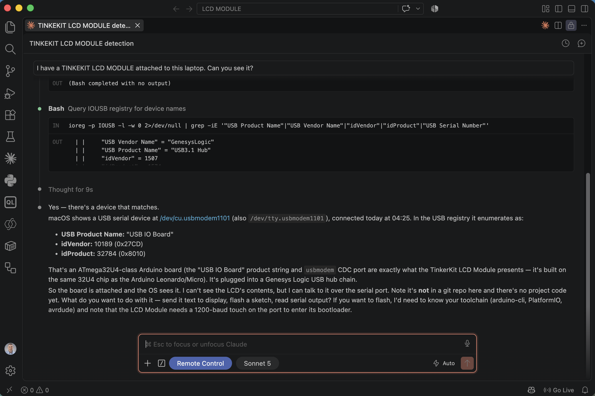
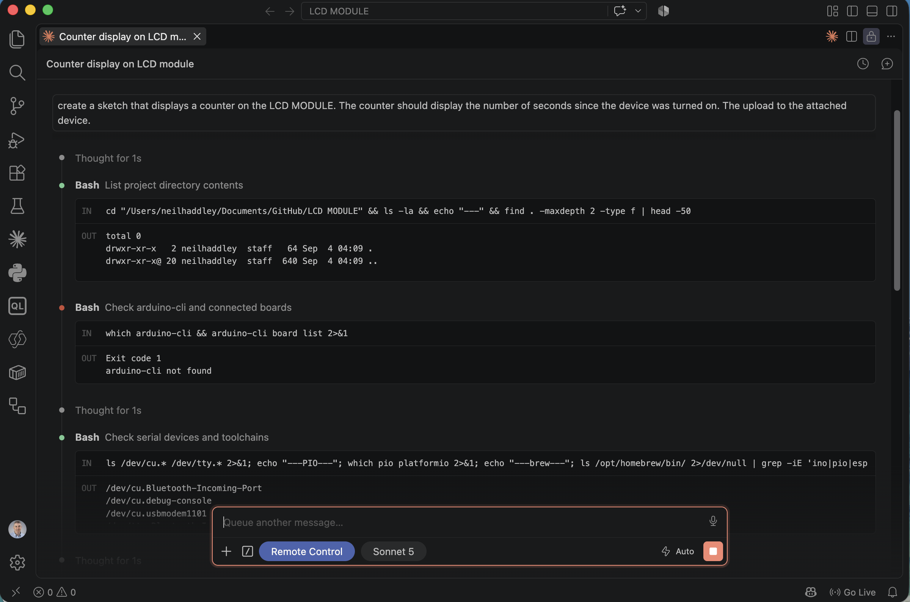
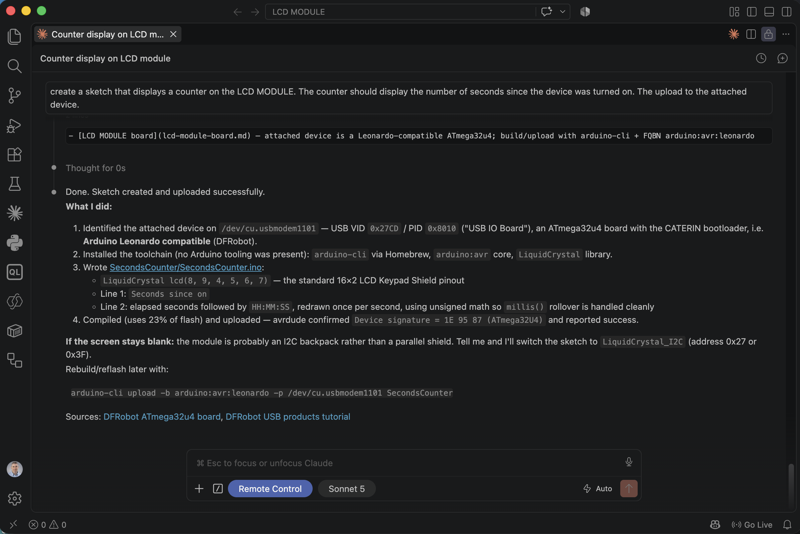
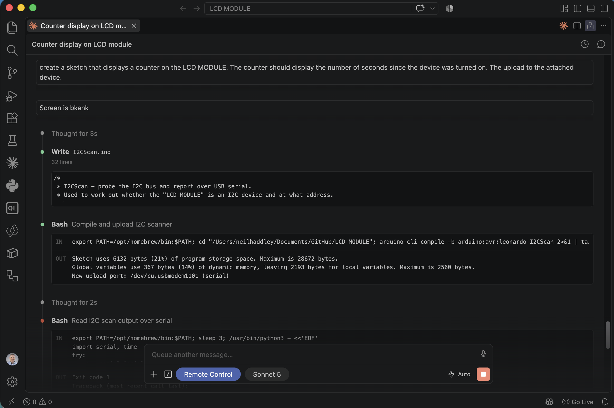
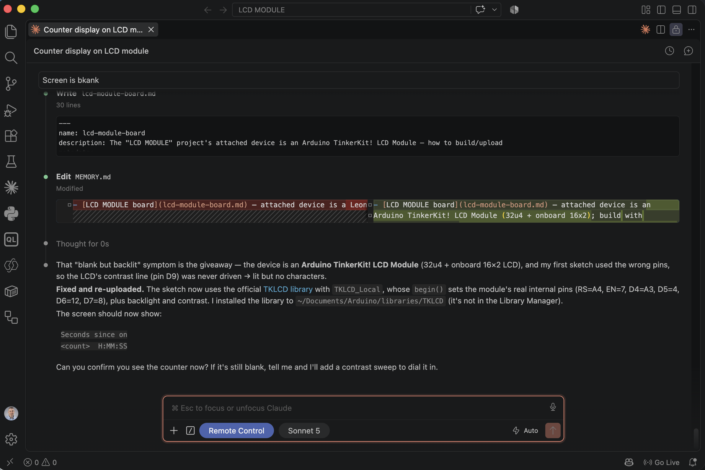
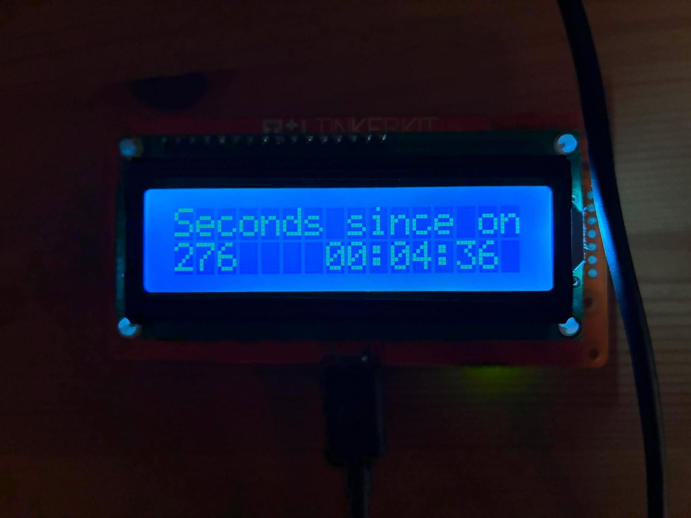
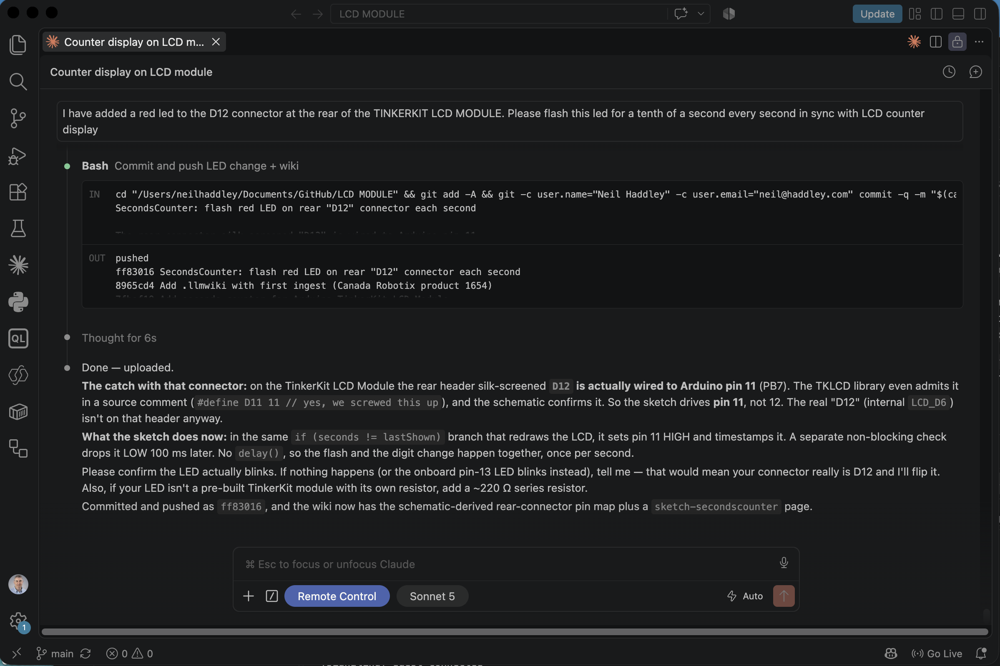
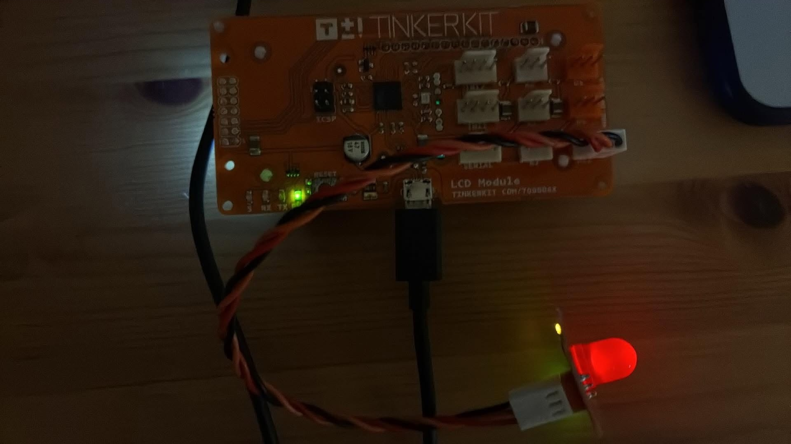

I plugged a TinkerKit LCD Module — a Arduino-compatible board with an onboard 16x2 character LCD — into my laptop and asked Claude Code whether it could see it. No project existed yet, nothing was wired up beyond the USB cable, and I had no idea whether an agent with terminal access could do anything useful with a bare serial device.

## Beat 1 — Can you even see it?

I typed the first prompt straight into an empty composer, not knowing whether Claude Code would be able to see a raw USB device with no project behind it yet.

```PROMPT
I have a TINKEKIT LCD MODULE attached to this laptop. Can you see it?
```


*I typed the prompt into a fresh composer — no project open yet*

Claude queried the macOS `IOUSB` registry directly and found it: a `/dev/cu.usbmodem1101` serial device enumerating as `USB IO Board`, idVendor `10189` (0x27CD), idProduct `32784` (0x8010) — an ATmega32u4-class board built on the same chip as an Arduino Leonardo or Micro, sitting behind a Genesys Logic USB hub. It correctly identified this as consistent with a TinkerKit LCD Module and noted there was no project directory yet, asking what I wanted to do with it.


*Claude ran `ioreg -p IOUSB` to enumerate the attached USB device and matched it to the board*

## Beat 2 — Writing and flashing a counter sketch

Next I asked for a real sketch, uploaded straight to the device.

```PROMPT
create a sketch that displays a counter on the LCD MODULE. The counter should display the number of seconds since the device was turned on. The upload to the attached device.
```

Claude created the project folder, discovered `arduino-cli` was not installed, and worked out the toolchain from scratch: checking serial devices, installing `arduino-cli` via Homebrew, then the `arduino:avr` core and `LiquidCrystal` library.


*Claude listed the empty project directory, found `arduino-cli` missing, then checked `/dev/cu.*` for serial devices*

It wrote `SecondsCounter.ino` using a plain `LiquidCrystal` constructor on the standard 16x2 LCD Keypad Shield pinout, compiled it, and uploaded — `avrdude` confirmed the real device signature `1E 95 87` (ATmega32U4) and reported success.


*Claude reported the sketch compiled at 23% flash and uploaded successfully, with a caveat about a possible I2C backpack if the screen stayed blank*

It did stay blank. The backlight lit up, but no characters appeared — exactly the caveat Claude had already flagged as a possibility.

## Beat 3 — "Screen is bkank"

I reported the problem exactly as I typed it, typo included.

```PROMPT
Screen is bkank
```

Claude's first move was to rule out an I2C backpack: it wrote a diagnostic `I2CScan.ino`, compiled and uploaded it, then tried to read the scan results back over serial with a small inline Python script.


*Claude wrote I2CScan.ino to probe the I2C bus, then tried reading the results back over the serial port*

That path hit a dead end, but the real diagnosis came from research, not the scan: Claude looked up the actual TinkerKit LCD Module hardware and realized the board is not a plain LCD shield at all — it's an ATmega32u4 with the 16x2 LCD wired directly onto the board's own internal pins, addressable only through TinkerKit's own `TKLCD` library. My first sketch had used a generic `LiquidCrystal` pinout that never drove the module's real contrast line, so the backlight came on with nothing displayed. Claude installed `TKLCD` manually (it isn't in the Arduino Library Manager), rewrote the sketch against `TKLCD_Local`, and re-uploaded.


*Claude diagnosed the real cause — the wrong LCD pin mapping — installed the TKLCD library, and rewrote the sketch against it*

It worked.


*The TinkerKit LCD Module actually displaying the counter — 276 seconds since power-on, no LED wired up yet*

## Beat 4 — A synced LED

I'd wired a red LED to the connector on the back of the board silk-screened `D12`, and asked for it to blink in time with the counter.

```PROMPT
I have added a red led to the D12 connector at the rear of the TINKERKIT LCD MODULE. Please flash this led for a tenth of a second every second in sync with LCD counter display
```

Claude found a hardware quirk before writing a line of code: the connector silk-screened `D12` is not actually wired to Arduino pin 12 at all — it's wired to pin 11 (PB7). The TKLCD library's own source comments admit as much (`#define D11 11 // yes, we screwed this up`), and the board's schematic confirmed it. Claude wrote the fix against the real pin, driving it HIGH in the same branch that redraws the LCD each second, then dropping it LOW 100ms later with a non-blocking timestamp check rather than a `delay()` call — so the LED flash and the digit change land in the same instant every time.


*Claude found the real "D12 is actually pin 11" wiring quirk in the TKLCD library's own source comments, fixed the sketch, and committed and pushed it as `ff83016`*


*The red LED lit mid-flash on the rear connector, synced to the counter*

## The result

```cpp
void loop() {
  unsigned long now     = millis();
  unsigned long seconds = now / 1000UL;  // unsigned math handles rollover

  // --- new second: update the LCD and start the LED flash together ---
  if (seconds != lastShown) {
    lastShown = seconds;

    digitalWrite(LED_PIN, HIGH);
    ledOn      = true;
    ledOnSince = now;

    unsigned long s = seconds % 60;
    unsigned long m = (seconds / 60) % 60;
    unsigned long h = seconds / 3600;

    char buf[LCD_COLS + 1];
    snprintf(buf, sizeof(buf), "%-7lu%02lu:%02lu:%02lu", seconds, h, m, s);

    lcd.setCursor(0, 1);
    lcd.print(buf);
  }

  // --- end the LED flash 100 ms after it started (non-blocking) ---
  if (ledOn && (now - ledOnSince) >= LED_FLASH_MS) {
    digitalWrite(LED_PIN, LOW);
    ledOn = false;
  }
}
```

Along the way Claude also stood up a small `.llmwiki` in the project — its own notes on the board's real wiring and the sketch's design — so the next session starts from what was actually learned here rather than rediscovering the D12-is-really-D11 quirk from scratch. The finished project, sketches and wiki included, is on GitHub at [Haddley/LCD-MODULE](https://github.com/Haddley/LCD-MODULE).

What stands out is not that Claude Code could write an Arduino sketch — it is that the entire loop, from "can you see this device" through a real hardware bug rooted in the board's own undocumented wiring quirk to a working, synced LED, ran end to end from a handful of plain-English prompts, with Claude doing every bit of the USB enumeration, toolchain setup, compiling, flashing, and git commits on its own.

## References

- [TinkerKit Arduino LCD 16x2 (Leonardo + Serial LCD Retail)](https://www.canadarobotix.com/products/1654?srsltid=AfmBOoqvxV2gd8lFQWxYu6uTLJ3KBg7kKvIop49F_oEX9r_rZiJQSbky)


- [Claude Code Turned $20 Gadgets Into Tiny Computers](https://www.youtube.com/watch?v=Zvb01TRY6UY)