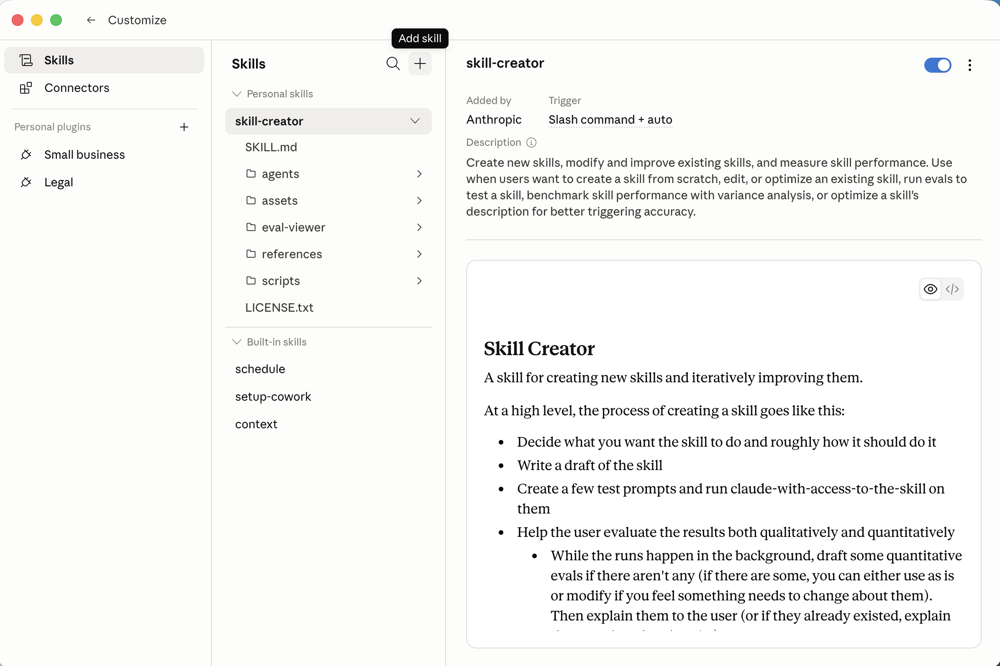

Claude Cowork is the desktop app version of Claude — it works with projects (local folders), skills, and scheduled tasks, but without needing the terminal. This post shows the same `page-line-summary` skill from [Claude Code (Part 14)](/posts/claudecode14/) running inside Cowork: I uploaded the skill through the UI, attached the transcript with `@`, answered the two context questions, and got back the same structured deposition summary — no curl command or CLI required.

*I selected the Homs v. Salvador project from the Work in a project dropdown*

*I clicked Allow when Cowork asked for permission to access the project folder*

*I opened the Skills panel in Customize and saw the page-line-summary skill listed under personal skills*

*I clicked the + button to see the options for adding a skill, including Upload a skill*

*The Upload skill dialog accepts a .md file or .zip containing a SKILL.md*

*After uploading, Cowork confirmed the skill with an "Uploaded page-line-summary" badge*

*The page-line-summary skill detail view showing its trigger and description inside Cowork*

*The skill picker showed page-line-summary with its description as a tooltip. I could have typed /page-line-summary*

*I typed @ to attach a file and the project's transcript appeared in the picker*

*I attached the PDF transcript directly to the skill invocation before submitting*

*The skill asked which side I represent — I selected Defense*

*I entered my case theory in the free-text field: preexisting condition*

*The skill started reading the transcript and immediately flagged the key knee limitation admission on p.14*

*Reading pages 45–60, the skill flagged the 65% permanent partial disability rating — two years before the accident*

*The skill assembled the summary and wrote the output file — 92 pages processed, 30 table entries*

*The skill reported its single most significant finding and linked the output document in Google Drive*

*The formatted summary opened in Google Drive with the full case caption and page-line table*

## References

- [Legal AI Is Growing Up. Chatbots Were Just the Awkward Phase.](https://www.youtube.com/watch?v=QeIqRnOhs9E&t=1768s)

