DeepSeek Harness is a developer-preview harness for building agent harnesses, and its pitch is that everything is a plugin — models, tools, skills, sessions, sandboxes, storage, loops, scheduling, and the whole UI can all be swapped or recomposed. That sounded like a perfect tool for a quick experiment: hand it a product requirements document (PRD) and a product design document (PDD) and see whether it could build the game they describe rather than just talking about it.

The result impressed me. I gave it a PRD and a PDD for a faithful browser recreation of the 1978 Taito Space Invaders, the agent read both files, built the game with none of the usual scaffolding, verified its own work with logic checks and a headless browser, and then let me play the finished thing. Here is how the whole session went.

## Everything is a plugin

The landing page is a striking claim: every capability is a plugin, with source code included. Depth of plugins ranges from providers and tools to sessions, sandboxes, and the UI itself.

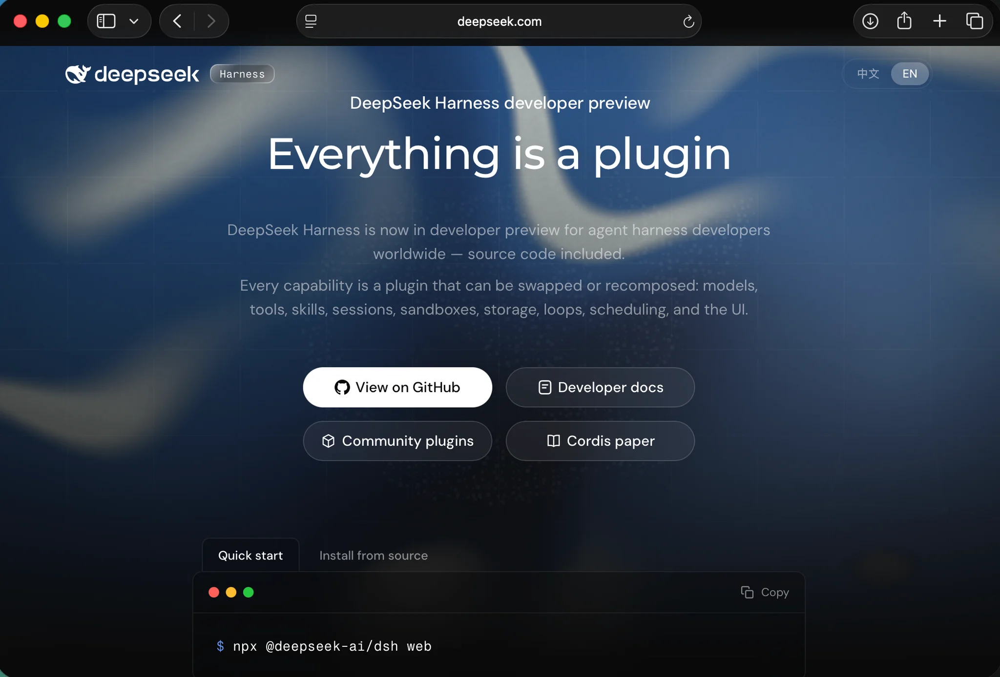
*I landed on the DeepSeek Harness developer-preview page — "Everything is a plugin" — with the Quick start command ready to copy*

The Quick start on that page is a single command: `npx @deepseek-ai/dsh web`. I did not have to clone anything, install a framework, or set up a build.

## Reading the docs first

I opened the documentation to understand what running `dsh web` actually does. The "Use the Web UI" guide explains that the command prints its URL, that the `dsh` process uses its own invoking directory as the default filesystem location, and that a fresh Web UI has no selected workspace until you add one.

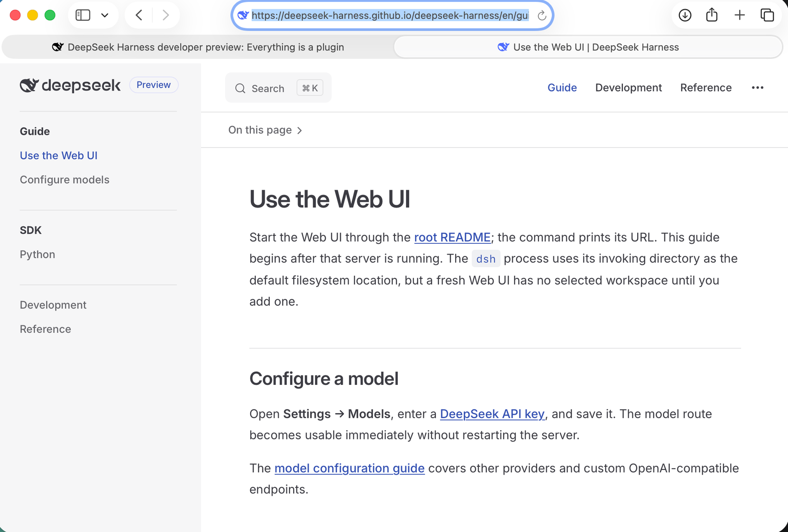
*The "Use the Web UI" guide explained that the command prints its URL and that a fresh Web UI starts with no workspace selected*

The "Configure a model" section was the important one. It said to open Settings → Models, enter a DeepSeek API key, and save it — the model route then becomes usable immediately without restarting the server. "Choose a workspace" covers adding the project directory where I started `dsh`, and "Run a task" is as simple as starting a session and sending a message.

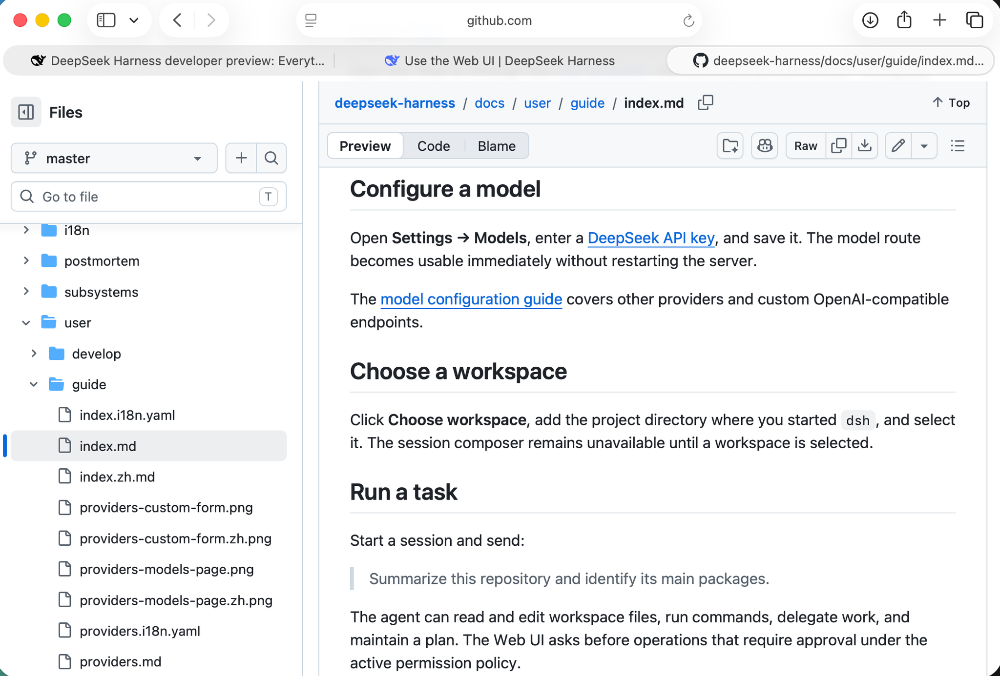
*The docs covered configuring a model, choosing a workspace, and running a task — the three things I needed to know before starting*

The README's "Run from npm" section matched what the Quick start showed, and added one detail I appreciated: the command starts the Web UI at `http://127.0.0.1:3080` and opens the default browser by default, and you pass `--no-open` to skip that. The README also shows how to run from a repository checkout.

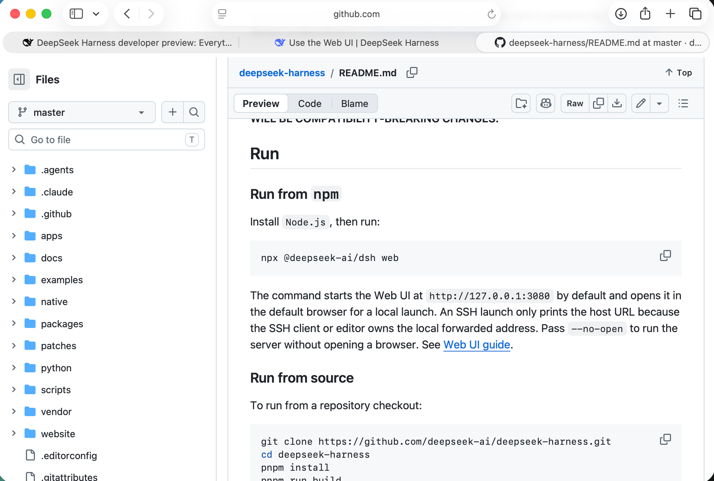
*The README confirmed the one-liner and that the Web UI opens at 127.0.0.1:3080 by default*

## Getting it running

I installed the package globally so that `dsh web` works from any directory. The global install pulled in a fair amount of tooling, and npm warned that five packages had install scripts not covered by `allowScripts` plus a deprecated `node-domexception` package.

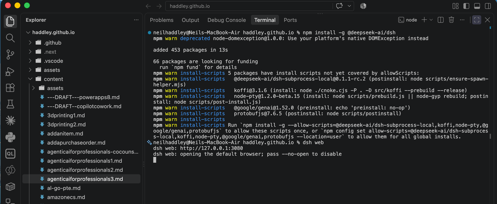
*I installed DeepSeek Harness globally, then ran `dsh web` — npm warned about packages with install scripts and a deprecated node-domexception*

The documented one-liner works just as well without the global install. The first time I ran `npx @deepseek-ai/dsh web`, npx downloaded and installed `@deepseek-ai/dsh@0.1.1-rc.2` and asked me to confirm before proceeding.

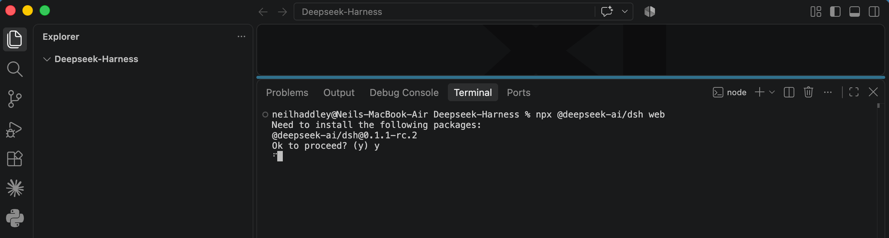
*Running the documented one-liner, npx offered to install @deepseek-ai/dsh@0.1.1-rc.2 and I accepted*

I cleared the npx cache first so the next run would pull the very latest rather than a cached copy, then launched it with `npx -y @deepseek-ai/dsh@latest web`.

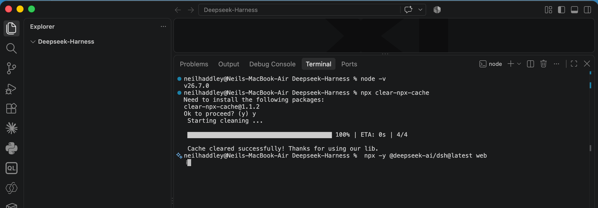
*I cleared the npx cache to make sure I was pulling the latest package*

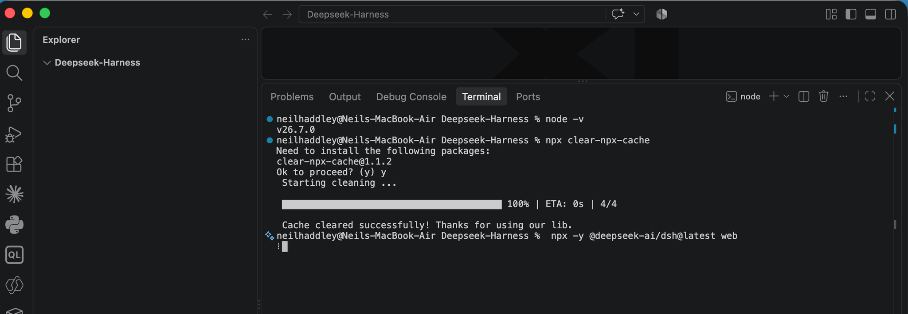
*After clearing the cache I launched the latest DeepSeek Harness from npm*

Either route ends at the same place. `dsh web` printed `http://127.0.0.1:3080` and opened the default browser for me — the log line also noted that you can pass `--no-open` to suppress that.

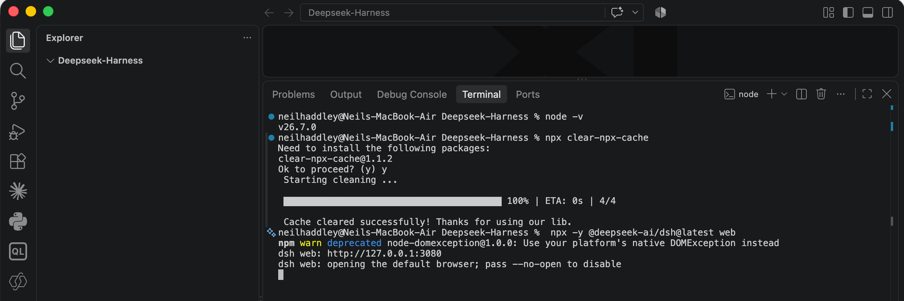
*`dsh web` started the server at http://127.0.0.1:3080 and opened the default browser*

The first launch is an empty state. The Web UI greeted me with "Into the Unknown", no sessions yet, and a prompt to choose a workspace to start. I clicked Choose workspace and added the Deepseek-Harness project directory — the one where my PRD and PDD live.

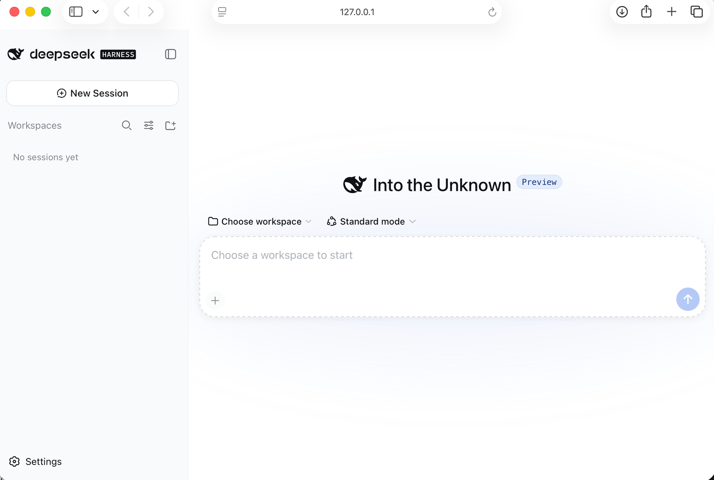
*The fresh Web UI had no workspace yet, so I chose the Deepseek-Harness directory where my PRD and PDD lived*

## The task

I created a new session named "Build invaders game from PRD" and typed the request into the composer in Standard mode. DeepSeek V4 FLASH High was the model in the top bar.

```PROMPT
Build invaders game see PRD.md and PDD.md
```

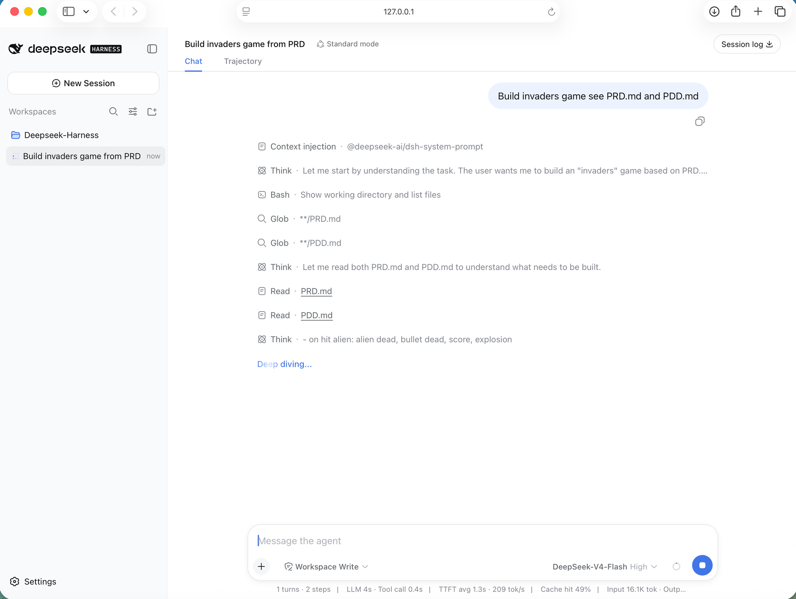
*I started the session and the agent set about reading both documents before building anything*

Rather than guessing, the agent first showed the working directory, globbed for both documents, and read them. You can see the thinking in the trace: it reasoned about the hit rules — on hit alien: alien dead, bullet dead, score, explosion — before diving into the build.

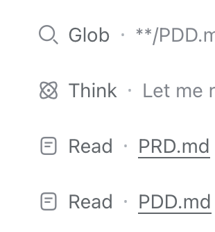
*The agent globbed for the two documents and read PRD.md and PDD.md before writing any code*

## What the PRD and PDD asked for

My PRD specified a faithful browser recreation of the 1978 arcade original running entirely client-side, with no build step, no dependencies, and no server. The requirements were specific: 50 aliens in a 5-row by 10-column grid with three visual types, moving as a synchronized group that steps down and reverses at the walls and speeds up as the swarm thins; a player cannon moved by the arrow keys or A/D; a single bullet in flight at a time; three lives with a respawn and an invulnerability window; scoring by alien type, a mystery UFO that awards bonus points, and a hi-score persisted in `localStorage`; four destructible shields; wave progression; a HUD; all audio synthesized through the Web Audio API with no audio files; and pixel-art sprites rendered on an 800 by 600 canvas.

The PDD went deeper on design. It specified an entry point of `index.html` loading `src/engine.js`, which imports constants, sprites, audio, input, and the entity classes — player, alien, bullet, alienBullet, explosion, shield, and ufo. It specified engine-managed alien movement with a square-root speed-scaling formula, AABB collisions, shields as a grid of destructible blocks, ASCII pixel-art sprite definitions, and a synthesized sound list with the march tempo scaling with the remaining alien count. It even explained a deliberate choice to double the arcade's original march frequencies because laptop speakers roll off below about 200 Hz.

## Verification

The biggest surprise was that the agent did not just hand back code and stop. It added its own tests and ran them.

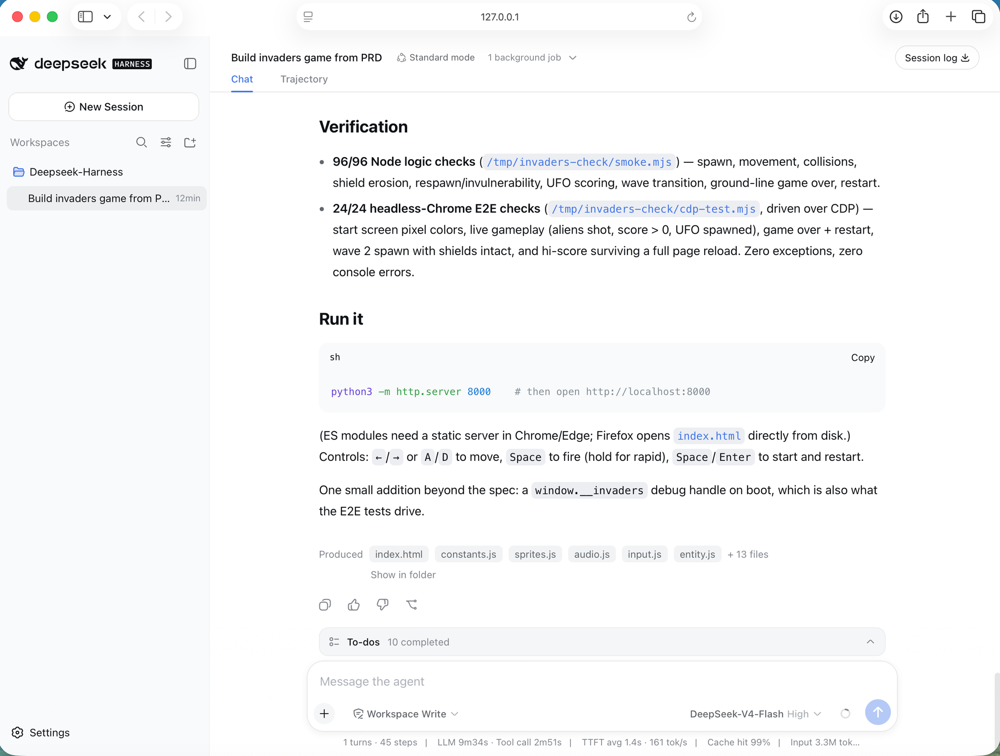
*The agent verified the build with 96 Node logic checks and 24 headless-browser E2E checks, all passing*

The Node logic checks covered spawn, movement, collisions, shield erosion, respawn and invulnerability, UFO scoring, wave transition, the ground-line game over, and restart. The deadlier test was the set of 24 headless-Chrome E2E checks driven over the DevTools Protocol, which loaded the page, asserted the start screen's pixel colours, played a live round (aliens shot, score above zero, UFO spawned), ran the game-over and restart path, spawned wave 2 with shields intact, and confirmed the hi-score survives a full page reload. Across everything there were zero exceptions and zero console errors.

I particularly liked one detail: the agent added a `window.__invaders` debug handle on boot that is not in the spec, specifically so the E2E tests had something to drive. It introduced a test seam into its own deliverable to make its verification possible. It reported producing `index.html`, `constants.js`, `sprites.js`, `audio.js`, `input.js`, `entity.js`, and thirteen further files.

## Running it

The agent's own "Run it" instructions noted that ES modules need a static server in Chrome or Edge (Firefox opens `index.html` directly from disk) and gave `python3 -m http.server 8080`. My 8080 was already in use, so I served on 8081 instead.

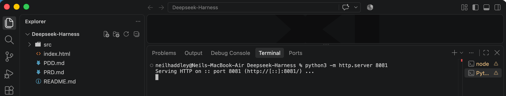
*I served the project with python3 -m http.server 8081 — the explorer shows the PRD, PDD, index.html, and the src folder the agent built*

The server served each ES module cleanly — `engine.js`, `constants.js`, `sprites.js`, `audio.js`, `input.js`, and all the entity modules — with the only 404 being `favicon.ico`, which the game never referenced.

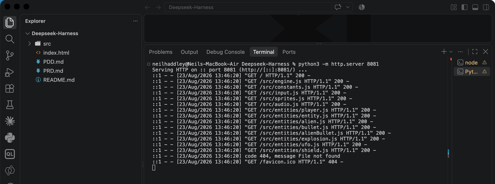
*The server served every src module with a 200, and only the unused favicon.ico 404'd*

Opening `http://localhost:8081` gave me the finished game. The screenshot shows the opening moments: the alien swarm in its classic red, cyan, and green bands, four shields, the player cannon, and a HUD with SCORE 0020, HI 0020, WAVE 1, and the three lives. The pixel-art sprites and marching-animation feel are faithful to the original.

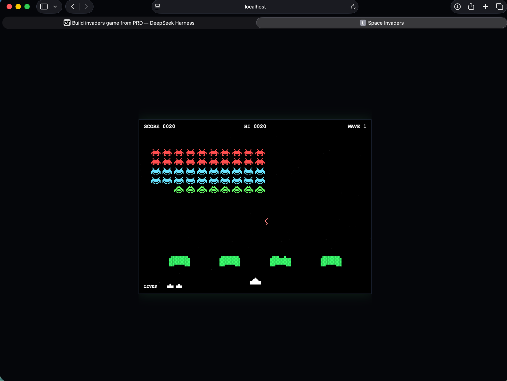
*The finished Space Invaders game running at localhost — the alien formation, shield bunkers, player cannon, and HUD all exactly as the PRD specified*

Controls are simple: the left and right arrows (or A and D) move the cannon, Space fires and can be held for rapid fire, and Space or Enter starts and restarts the game.

## The takeaway

The thing that stood out to me most was the workflow, not the code. DeepSeek Harness read a real requirements document and a real design document, mapped each requirement into a concrete implementation (the "on hit alien" rule became the collision branch in the code), built a complete game with zero dependencies and no build step, and then held itself to account by writing and running both logic tests and a headless-browser E2E suite before showing me the result. The `window.__invaders` debug handle in particular felt like the mark of an agent that was verifying its own work rather than merely generating code.
