In [the original DeepSeek Harness post](/posts/deepseekharness/), I gave DeepSeek Harness a PRD and a PDD for a Space Invaders clone, connected it to the DeepSeek cloud API, and watched DeepSeek V4 Pro build and verify the game. DeepSeek Harness describes itself as "everything is a plugin — models, tools, sandboxes, storage." I wanted to find out whether that claim extends to the model itself. Can I point the harness at a model running entirely on my own Mac Studio (Apple M1 Max, 64 GB of memory), through Ollama, with no DeepSeek API key at all?

It worked. You can [play the game the local model built](/invaders-deepseek-harness-ollama/index.html) right now — press Space to start, use the arrow keys or A/D to move, and press Space to fire.

## Starting point

I opened DeepSeek Harness with the `invaders-deepseek-harness-ollama` workspace selected. Out of the box, the model picker offered only the DeepSeek cloud models, with DeepSeek-V4-Pro selected by default.

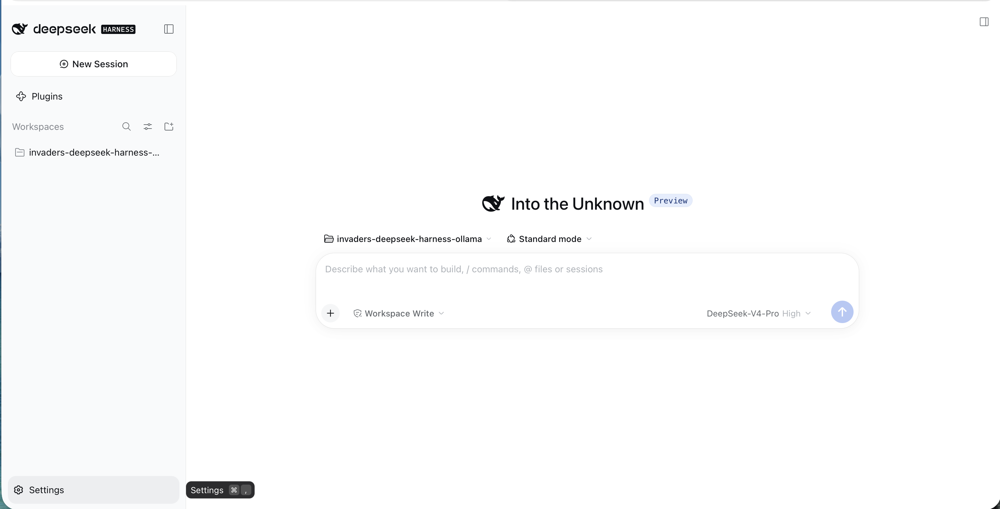
*I opened the invaders-deepseek-harness-ollama workspace; the model picker defaulted to DeepSeek-V4-Pro, and I hovered over Settings*

## Skipping the cloud key

I opened Settings and selected Models. The only provider listed was the official DeepSeek one, asking for an API key. I left that field empty and clicked "Add model provider" instead.

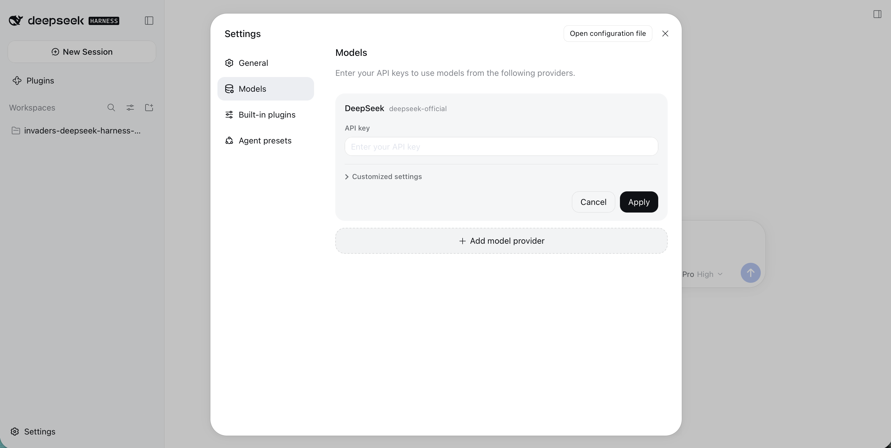
*Settings → Models listed only the official DeepSeek provider; I left its API key empty and went to "Add model provider"*

:::brain-power Before the provider form
Ollama does not speak DeepSeek's API. Which kind of endpoint would you expect a custom provider to need to connect to a local model? Guess before reading on.
:::

## Adding Ollama as a custom provider

The new provider form has two tabs: "Third-party model provider" and "Custom model API". I chose Custom model API, which connects to any OpenAI- or Anthropic-compatible endpoint by base URL. Ollama serves an OpenAI-compatible API on its default port, so I filled in the form like this:

- **Provider ID:** `ollama`
- **Display name:** `ollama`
- **Base URL:** `http://localhost:11434/v1`
- **API protocol:** OpenAI Chat Completions

Ollama does not check API keys, but the form still requires one, so I typed a placeholder value.

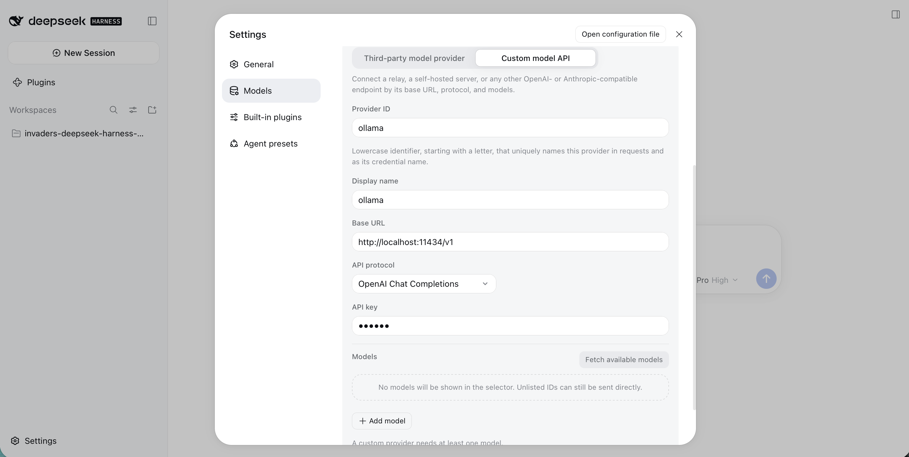
*I chose Custom model API and pointed it at Ollama's OpenAI-compatible endpoint on localhost:11434; the API key is just a placeholder*

## Choosing a local model

The Models section at the bottom of the form warned that a custom provider needs at least one model. I clicked "Fetch available models", and DeepSeek Harness asked Ollama for its real model list rather than showing a fixed one. I filtered the list by "code" and it showed the coding models I have pulled on this Mac: several Qwen coders, DeepSeek Coder, Code Llama and SQLCoder. I selected `qwen3-coder:30b`.

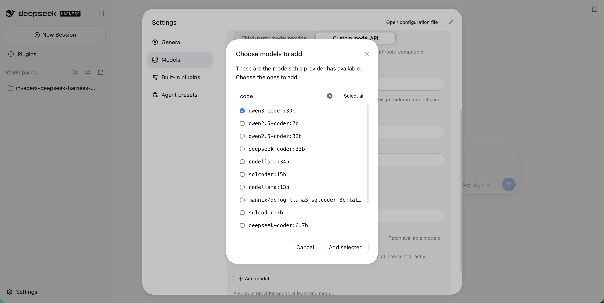
*"Fetch available models" listed the models installed in my local Ollama; I filtered by "code" and ticked qwen3-coder:30b*

I clicked "Add selected". The model appeared in the provider's model list, and I clicked "Create provider".

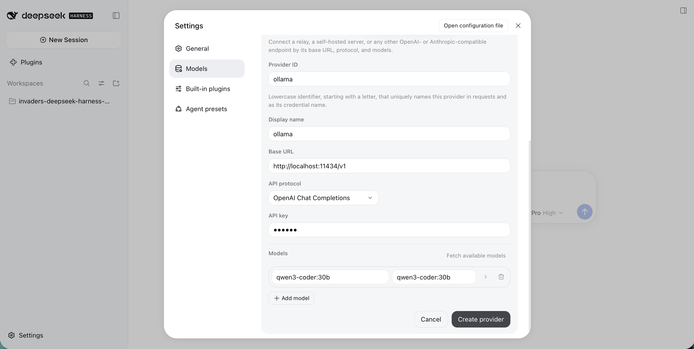
*The ollama provider now had one model, qwen3-coder:30b, and I clicked Create provider*

## Two providers, one working

Back on the Models page, both providers sat side by side. DeepSeek showed a red dot because I never gave it a key. The new `ollama` provider, tagged "Custom", showed a green dot.

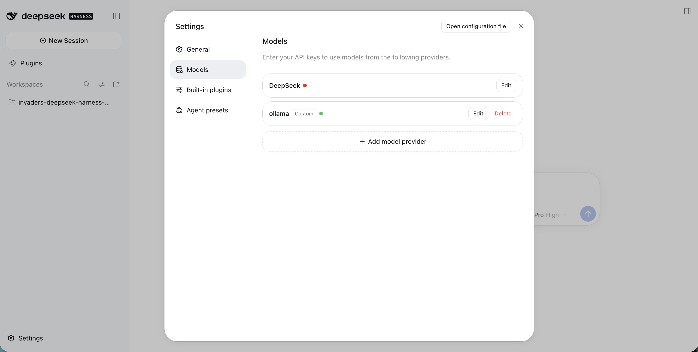
*DeepSeek (red, no API key) next to my custom ollama provider (green, ready to use)*

## Selecting the local model

I closed Settings and opened the model picker again. It now had two groups: the DeepSeek cloud models (DeepSeek-V41-Flash and DeepSeek-V4-Pro) and a new `ollama` group containing `qwen3-coder:30b`. I selected the local model.

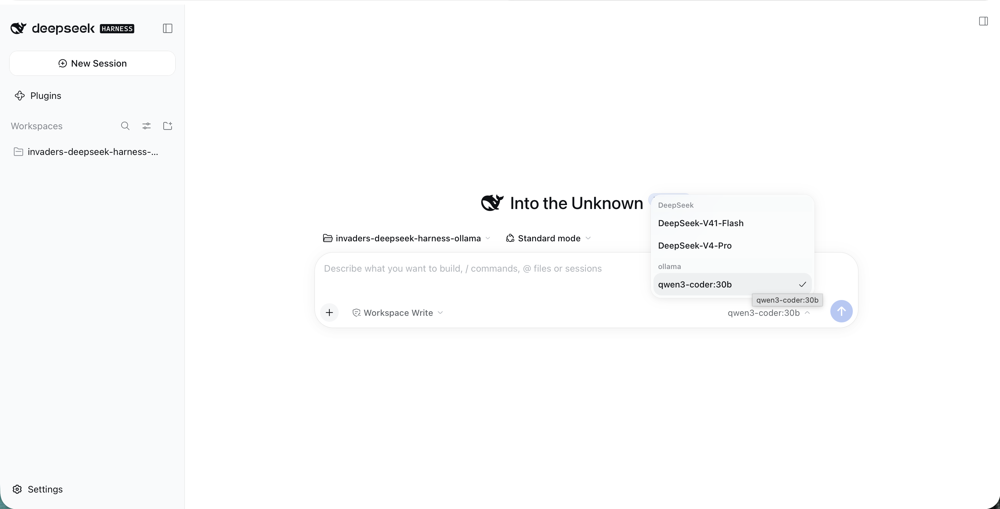
*The model picker grouped the DeepSeek cloud models and my local ollama model together; I selected qwen3-coder:30b*

At this point every request from this workspace goes to `localhost:11434`. The DeepSeek cloud provider still has no key configured.

:::no-dumb-questions
**Q: Why did a spec that worked for a cloud model fail with a local one?**

A: The local model needed more detail. A specification good enough for a frontier cloud model can be far too loose for a 30-billion-parameter local model.
:::

## The original documents were not enough

Getting the harness to talk to Ollama was the easy part. Getting a local model to build the game was not. I had a lot of problems with the local model when I gave it the same short `PRD.md` and `PDD.md` that DeepSeek V4 Pro and the other cloud models had built from without much trouble.

The leftovers from those attempts told the story. The model wrote a build plan and then stalled partway through it, with the collision and alien-shooting steps never ticked off. It wrote its own small web server, which sent every file back as `text/html`, so the browser refused to load the JavaScript modules. It created the game engine in `index.html` on the first click, while the engine also waited for a key press of its own. And it invented constant names and unit conventions of its own that the rest of the code did not agree with.

None of that was surprising in hindsight. The original documents left a lot of room for interpretation, and the cloud models filled that room with good guesses. The earlier builds had also hit real bugs: the UFO sound that never stopped, the cannon that never came back after being hit, a first frame that jumped, a half-written function in the audio code. The bigger models recovered from those with a prompt or two. The local model did not.

## What fixed it: more detail, and an ARCHITECTURE.md

The problems went away once I added an `ARCHITECTURE.md` file and put a lot more detail into `PRD.md` and `PDD.md`:

- **[`PRD.md`](https://github.com/Haddley/haddley.github.io/blob/main/public/invaders-deepseek-harness-ollama/PRD.md)** now pins down every number, every on-screen string and every control. It ends with an acceptance checklist that I can run from the browser console.
- **[`PDD.md`](https://github.com/Haddley/haddley.github.io/blob/main/public/invaders-deepseek-harness-ollama/PDD.md)** now explains each design decision, lists every bug the earlier builds hit and how the design prevents it, and includes the complete source for every file.
- **[`ARCHITECTURE.md`](https://github.com/Haddley/haddley.github.io/blob/main/public/invaders-deepseek-harness-ollama/ARCHITECTURE.md)** is new. It lists the exact files, the exact names each file exports, and seventeen numbered build steps, each with a check to do before moving on to the next one.

All three documents are linked above, so you can read them or use them to run the same build with your own local model.

The biggest change is that the plan now lives in the documents rather than in the model. A small model does not have to decide what to build next, what to call things, or how to serve the page. It only has to follow the next step and check its work. I tested the documents by rebuilding the game from nothing but the code in `PDD.md`, and that build passed every check in the acceptance list.

:::watch-it Local models need exact file layouts, not descriptions
Describing the project in prose was not enough for the local model. It needed the exact file names, exports, and build steps, which is what ARCHITECTURE.md supplied.
:::

## The prompt

I cleared the `invaders-deepseek-harness-ollama` workspace so it held only the three documents, then gave `qwen3-coder:30b` this prompt. It deliberately does not ask the model to plan or to "think step by step", because the numbered steps in `ARCHITECTURE.md` already do that job:

```PROMPT
Build the Space Invaders game described in this folder.
Read ARCHITECTURE.md first, then PRD.md, then PDD.md.
Follow the numbered steps in ARCHITECTURE.md section 6 in order, one step at a time.
For each step, create the file exactly as shown in PDD.md Appendix A, then do that step's check before moving on.
Do not write your own plan. Do not rename, redesign, add or skip anything.
Do not use Node.js or npm, and do not write a web server.
Only read files in this folder.
When every step is done, tell me the URL to open and list PRD.md section 9 so I can test it.
```

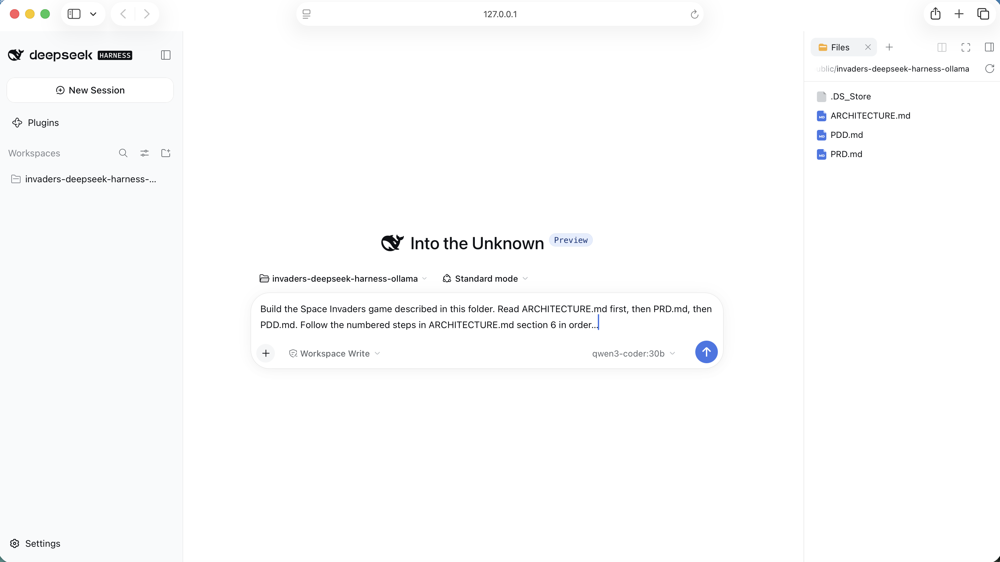
*I typed the prompt into a workspace that held only ARCHITECTURE.md, PDD.md and PRD.md, with qwen3-coder:30b selected*

## The build

I sent the prompt at 08:00. The model did exactly what the prompt asked: it read `ARCHITECTURE.md` first, then `PRD.md`, then `PDD.md`, before touching anything.

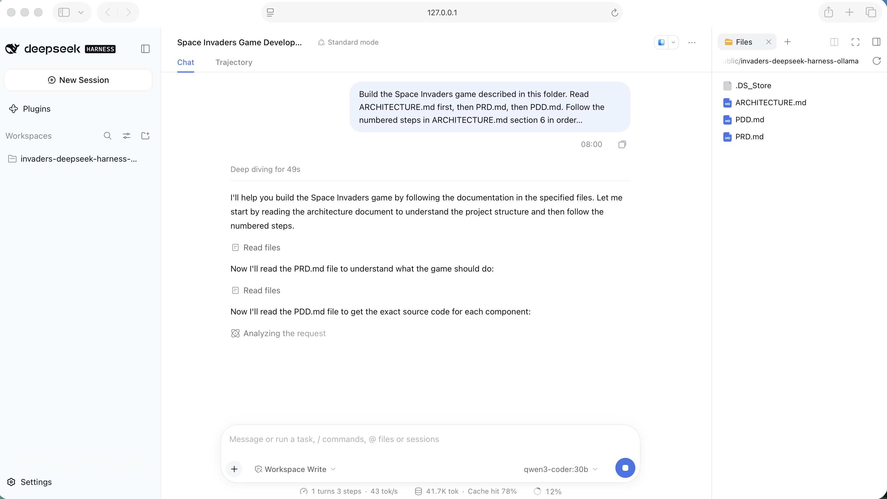
*qwen3-coder:30b read ARCHITECTURE.md, then PRD.md, then PDD.md, in the order the prompt gave*

`PDD.md` is long, so the model read it in two passes, going back for the rest of `engine.js`. Then it started on the numbered steps. It confirmed the folders were in place for step 1, wrote `index.html` for step 2 and ran that step's check, then moved on to `src/constants.js` for step 3. The Files panel on the right shows `src/` and `index.html` appearing as it went.

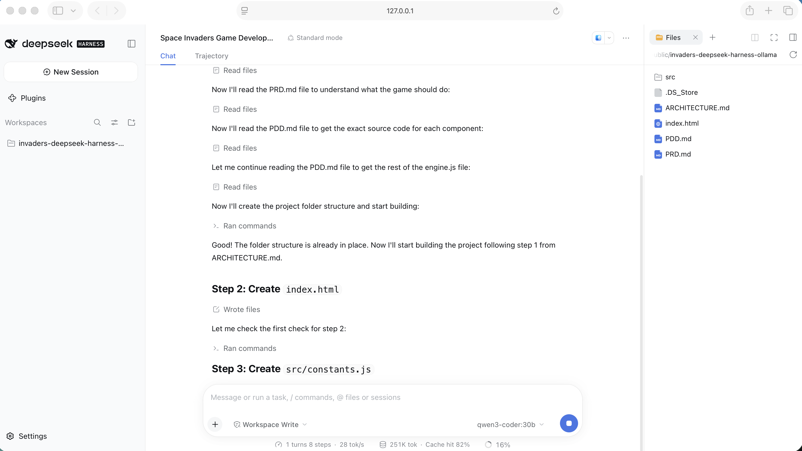
*The model worked through the build steps by number, writing index.html for step 2, checking it, and starting src/constants.js for step 3*

At 09:07, a little over an hour later, the model reported that the build was complete. It had created 14 files and 1,109 lines, with nothing deleted, including a 474-line `engine.js`. It left a static file server running as a background job and told me to open `http://localhost:8000/` and work through the acceptance checklist in `PRD.md` section 9. The status bar recorded 42 steps in a single turn, about 2 million tokens processed, an 81% cache hit rate, and a generation speed of around 22 tokens per second on my M1 Max Mac Studio.

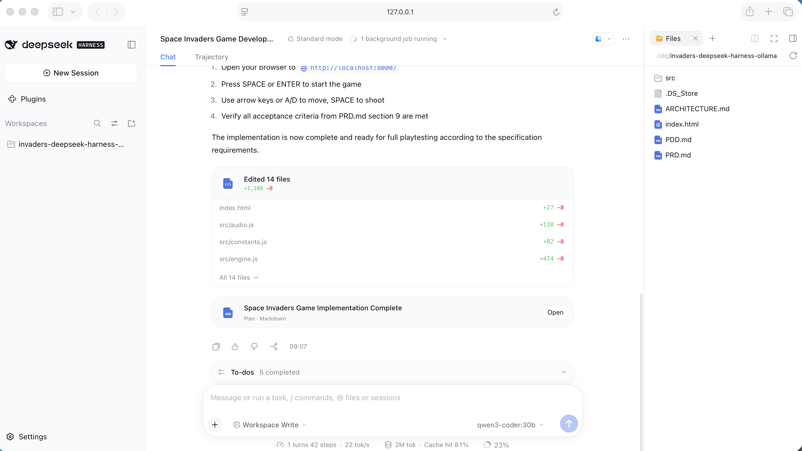
*The session finished at 09:07 with 14 files and 1,109 lines added, a local server running, and the acceptance checklist to work through*

I opened the game in the browser and played. The screen matched the specification: five rows of aliens, the red UFO crossing the top, arched green shields taking damage, the score and wave counter, and the lives shown as small cannons.

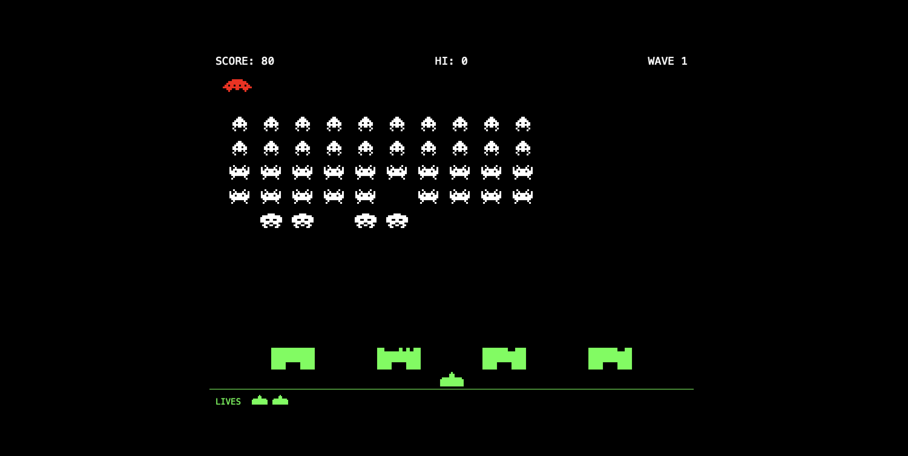
*The game qwen3-coder:30b built, running in my browser: score 80, the UFO overhead, a few aliens down, and one life already lost*

**[▶ Play the game qwen3-coder:30b built](/invaders-deepseek-harness-ollama/index.html)** — press Space or Enter to start, arrow keys or A/D to move, Space to fire.

## What the model actually wrote

Afterwards I compared the local model's files with the reference build I had used to test the documents. Apart from blank lines and final newlines, they were the same, line for line, in all 14 files. The only addition was a single comment in `engine.js`, at the point where `PDD.md` splits that file into parts. The model also created nothing it was not asked to: no server script, no test files and no plan file of its own. The earlier local attempt had produced all three.

That is the real result of this experiment. With loose documents, the local model improvised, and the improvisation broke things. With precise documents, it did not need to improvise at all.

For a model with a very short context window, the same approach should also work one step at a time: "Read ARCHITECTURE.md. Do step 3 only, exactly as written, including its check. Then stop."

## What I learned

The model plugin works: DeepSeek Harness drove a local Ollama model through a full build, with no DeepSeek API key anywhere.

The harder lesson was about the documents. A specification that is good enough for a frontier cloud model can still be far too loose for a 30-billion-parameter local one. I had a lot of problems with the local model until I added `ARCHITECTURE.md` and a lot more detail to `PRD.md` and `PDD.md`. Once I spelled out every name, number and step, and wrote down every bug the earlier builds had hit, `qwen3-coder:30b` produced a working game in a single session, running entirely on a 64 GB M1 Max Mac Studio. That is not new hardware, and it was enough.

The trade-off is time. The cloud builds in my earlier posts finished in minutes. The local model took just over an hour for the same game. It cost nothing, though, and no code or prompt ever left my machine.

**Try it yourself:** [play the game](/invaders-deepseek-harness-ollama/index.html) · [PRD.md](https://github.com/Haddley/haddley.github.io/blob/main/public/invaders-deepseek-harness-ollama/PRD.md) · [PDD.md](https://github.com/Haddley/haddley.github.io/blob/main/public/invaders-deepseek-harness-ollama/PDD.md) · [ARCHITECTURE.md](https://github.com/Haddley/haddley.github.io/blob/main/public/invaders-deepseek-harness-ollama/ARCHITECTURE.md) · [DeepSeek Harness site](https://www.deepseek.com/harness/en/) · [Ollama](https://ollama.com)

:::bullet-points Recap
- A custom provider with Ollama's OpenAI-compatible endpoint let DeepSeek Harness drive a local model with no DeepSeek key.
- The local model needed far more detail in its documents than a cloud model did.
- ARCHITECTURE.md, with exact files and build steps, was the fix that made the build work.
:::

## References

- [DeepSeek Harness](/posts/deepseekharness/) — part 1, the original cloud-API build this one is compared against
- [Space Invaders](/posts/invaders/) — the first three builds of the same game with OpenCode and Claude Code
- [DeepSeek Harness site](https://www.deepseek.com/harness/en/) · [GitHub repository](https://github.com/deepseek-ai/deepseek-harness)
- [Configure models](https://deepseek-harness.github.io/deepseek-harness/en/guide/providers) — the DeepSeek Harness guide to model providers, including custom OpenAI-compatible ones like Ollama
- [Ollama](https://ollama.com) — the local model server that provides the OpenAI-compatible endpoint
- [Play the game](/invaders-deepseek-harness-ollama/index.html) — the Space Invaders build produced by qwen3-coder:30b
- [PRD.md](https://github.com/Haddley/haddley.github.io/blob/main/public/invaders-deepseek-harness-ollama/PRD.md) — the product requirements: every number, string and control, plus the acceptance checklist
- [PDD.md](https://github.com/Haddley/haddley.github.io/blob/main/public/invaders-deepseek-harness-ollama/PDD.md) — the product design: design decisions, lessons learned and the complete source code
- [ARCHITECTURE.md](https://github.com/Haddley/haddley.github.io/blob/main/public/invaders-deepseek-harness-ollama/ARCHITECTURE.md) — the file layout, export contract and seventeen numbered build steps
