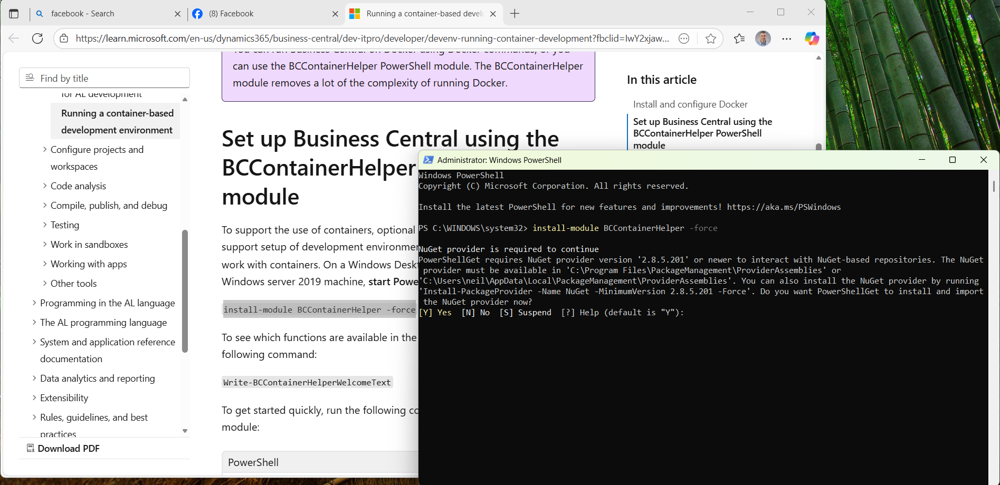
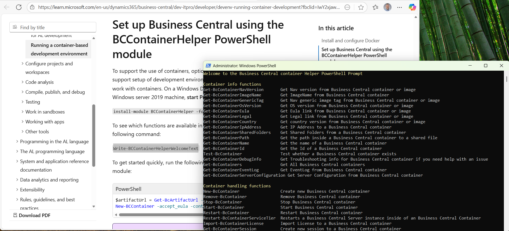
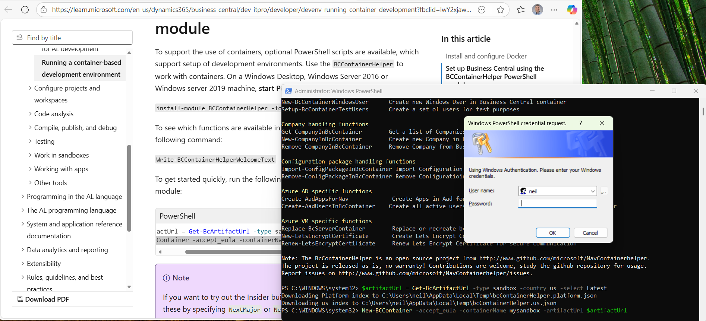
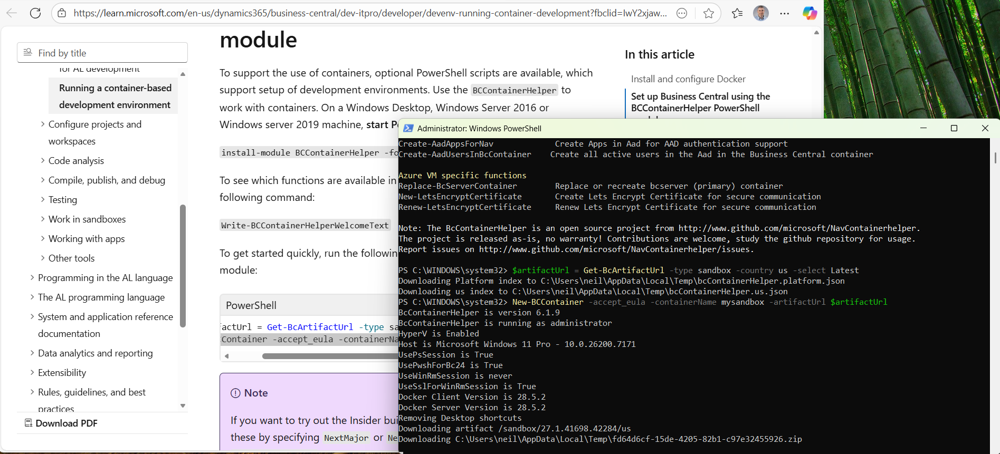
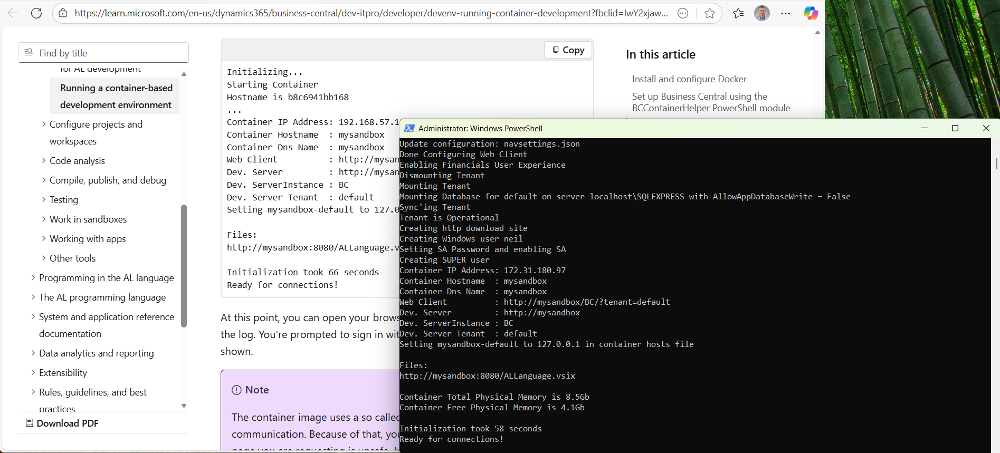
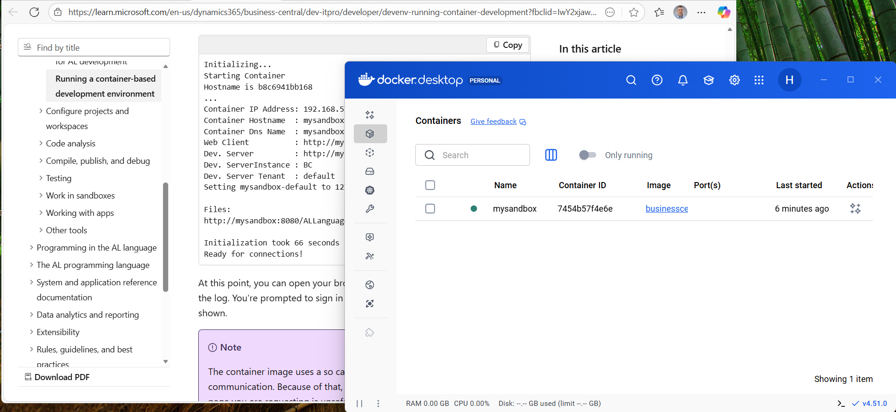
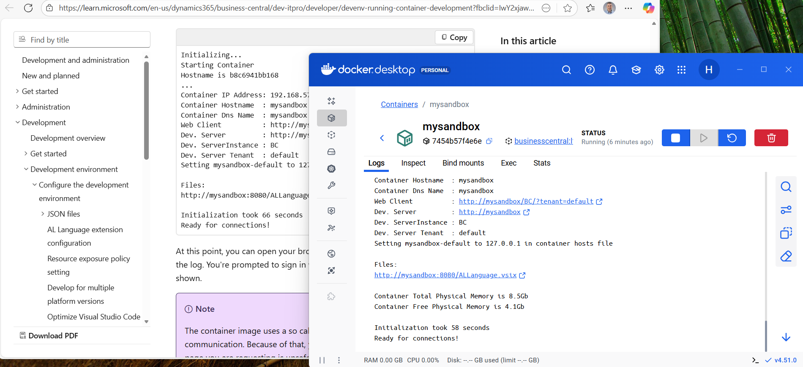
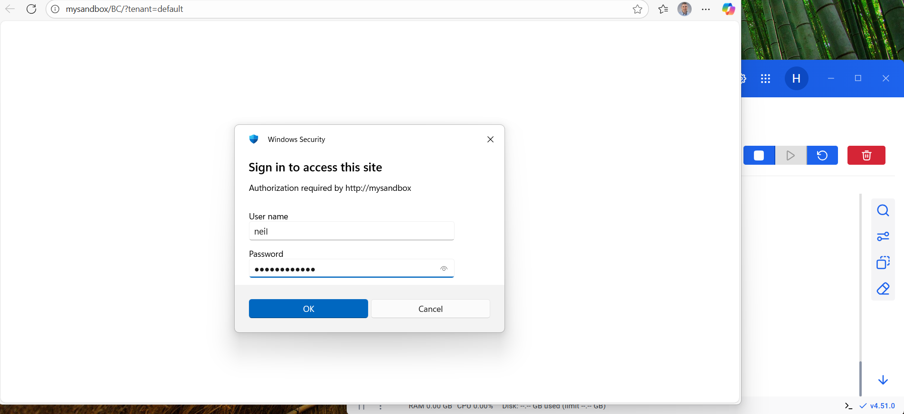
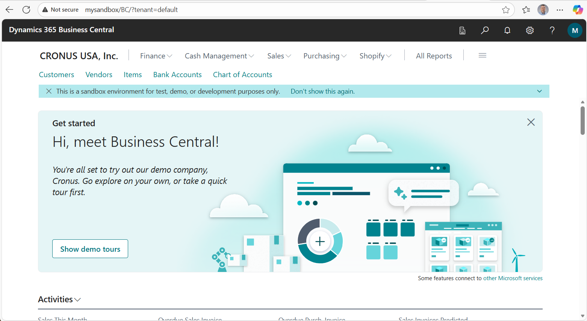
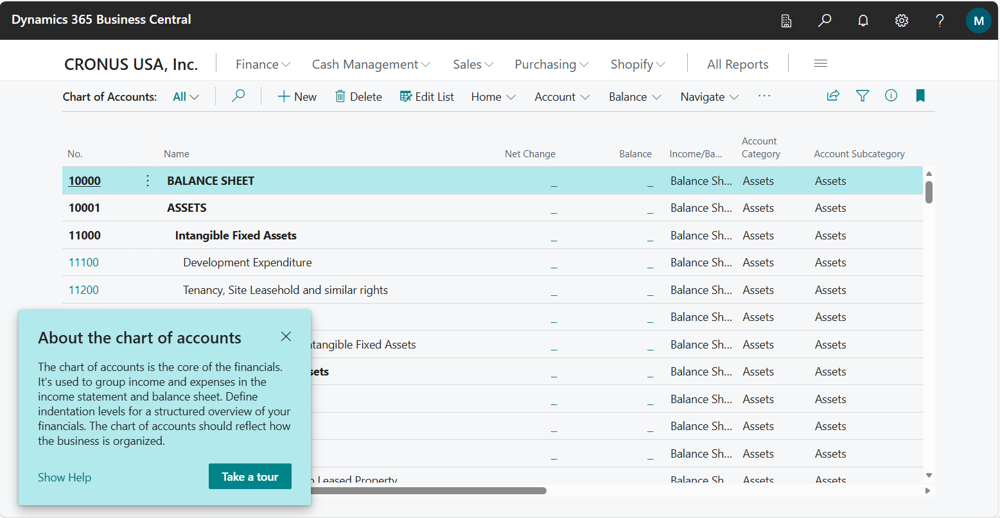

I ran a container-based development environment for Dynamics 365 Business Central using Docker on Windows.

```powershell
Set-ExecutionPolicy -ExecutionPolicy RemoteSigned -Scope CurrentUser
install-module BCContainerHelper -force
Write-BCContainerHelperWelcomeText
$artifactUrl = Get-BcArtifactUrl -type sandbox -country us -select Latest
New-BCContainer -accept_eula -containerName mysandbox -artifactUrl $artifactUrl
```


*I ran install-module BCContainerHelper -force*


*I ran Write-BCContainerHelperWelcomeText*


*I ran $artifactUrl = Get-BcArtifactUrl -type sandbox -country us -select Latest*


*I ran New-BCContainer -accept_eula -containerName mysandbox -artifactUrl $artifactUrl*


*The container was ready for connections*


*I reviewed Docker Desktop*


*I reviewed the logs*


*I navigated to http://mysandbox/BC/?tenant=default*


*I reviewed the CRONUS USA, Inc. company*


*I reviewed the Chart of Accounts*

## References

- [Running a container-based development environment](https://learn.microsoft.com/en-us/dynamics365/business-central/dev-itpro/developer/devenv-running-container-development)
