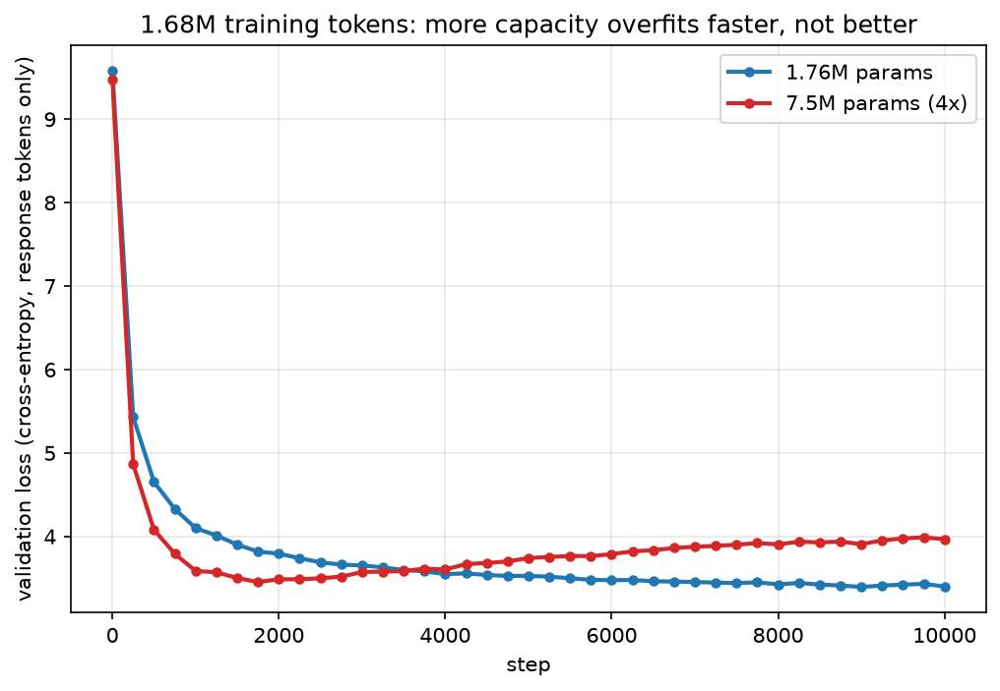

[MiniGPT Part 5](/posts/minigpt5/) built distillation the "textbook" way: cache a teacher's full probability distribution over its vocabulary at every position, and train a student to match that whole distribution with a KL-divergence loss. That technique has a hard requirement most people asking about "distillation" do not realise: it needs the teacher's own weights, running locally, so you can read its logits. It cannot touch GPT-4, Claude, or any other model you only get to call.

Almost every well-known "distilled" model was not built that way. Alpaca, Self-Instruct, WizardLM, Orca, Microsoft's Phi series, and — per a widely reported but never fully confirmed accusation — possibly DeepSeek, all used a technique that needs nothing but a teacher's *output text*. This post builds one from scratch to show exactly how it differs, and what a from-scratch model can and cannot learn from it.

## Hard-label vs. soft-label distillation


*Same idea — a small model learning from a large one — two different training signals, with two different hardware requirements.*

**Soft-label (logit) distillation**, the kind already built on this blog, trains the student to reproduce the teacher's *whole probability distribution* over the next token — not just the token the teacher would pick, but how confident it was in every alternative. The loss is KL divergence, and matching a whole distribution requires having that distribution to match, which means running the teacher yourself.

**Hard-label (response) distillation** — this series — is much cruder and much more widely used in practice. Ask the teacher a question, keep only the one answer it actually wrote, and train the student on that text with ordinary cross-entropy, the same loss every model in every series on this blog has used for plain next-token prediction. The teacher's uncertainty, its second-best guesses, everything except the words it actually output, is thrown away. All you need is the text — which means it works identically whether the teacher is a model you downloaded or an API you called ten thousand times.

The name "distillation" covers both, and the ambiguity is not just pedantic. It is the entire reason the DeepSeek accusation and the Phi series' methodology can both be called "distillation" while being, legally and technically, completely different situations: Microsoft has a direct licence to GPT-4o's outputs for exactly this purpose; the accusation against DeepSeek is that it harvested OpenAI's outputs without one. Response-level distillation is the technique in both cases — what differs is permission, not mechanism.

## Why build one from scratch

Every guide to this technique — including the one that prompted this series — assumes you start with an already-pretrained model and fine-tune it. That skips the most interesting question this blog's whole approach is built around: what does a model with *no* prior training actually learn from nothing but a few thousand of a teacher's answers? No raw-text pretraining stage, no borrowed base model — a random initialisation, trained purely on (prompt, teacher-response) pairs.

This is a real risk, not just a framing device. Learning basic fluency from a random initialisation is normally not cheap: the [TinyStories paper](https://arxiv.org/abs/2305.07759) that inspired the MiniGPT series used a training corpus of several hundred million tokens even for its smallest models, precisely because a model with no prior exposure to language needs a lot of raw text before it reliably strings a sentence together. This experiment's entire training set, as built below, is only 1.68M tokens of nothing but short Q&A pairs — two orders of magnitude short of that, with no broader raw-text exposure to fall back on. Whether that is enough to learn basic English at all, before it even gets to answering questions well, is genuinely open, and the point of writing this as I go.

## Choosing a teacher

Response-level distillation's whole appeal is that it works with any teacher you can call — including closed, paid APIs, which is how Alpaca (text-davinci-003), Orca and WizardLM (GPT-4), and Phi-3/4 (GPT-4o) were actually built. I used a free, local, open-weight teacher instead, [`Qwen2.5-32B-Instruct`](https://huggingface.co/Qwen/Qwen2.5-32B-Instruct) (4-bit, via [mlx-community](https://huggingface.co/mlx-community/Qwen2.5-32B-Instruct-4bit)), to keep this series' pattern of zero-dollar experiments running entirely on this Mac Studio.

Generation throughput matters much more here than it did for logit caching, because every example needs the teacher to actually *write* a full answer, token by token, not just score one. I benchmarked `mlx-lm`'s batched generation at a few batch sizes before committing to a multi-hour run:

| Batch | Aggregate tok/s | Wall-clock per prompt |
|---|---|---|
| 16 | 41.9 | 6.5s |
| **32** | **87.3** | **3.4s** |
| 64 | 74.3 | 4.0s |
| 96 | 64.6 | 4.6s |

Throughput peaks at batch 32 and gets *worse* beyond it — a batch has to wait for its slowest response to finish, and response lengths vary enough that larger batches spend more time idle. Batch 32 generating 8,000 examples comes to roughly 7.6 hours.

## Building the dataset

I needed a diverse set of prompts, not diverse answers — the answers all come fresh from the teacher above. [Alpaca's 52k instructions](https://huggingface.co/datasets/tatsu-lab/alpaca) are free, well-covered across task types, and exactly the kind of ready-made prompt diversity Self-Instruct-style bootstrapping is designed to produce from scratch — so I used Alpaca's instructions and discarded its original answers entirely (those were written by text-davinci-003 in 2023; every answer in this dataset is regenerated by Qwen2.5-32B-Instruct today).

I sampled 8,000 instructions, deduplicated, capped at 400 characters so the teacher's context stays short and generation stays fast, and ran all 8,000 through the teacher at batch 32.

## Sizing the tokenizer to the data

8,000 short answers tokenise to 1.68M tokens. Dividing that by GPT-2's 50,257-token vocabulary — already used elsewhere on this blog, and the obvious default to reach for — means most tokens would appear only a handful of times across the entire training run, nowhere near enough for their embedding rows to learn anything.

Instead I trained a small byte-level BPE — 8,192 tokens, the same size MiniGPT Part 2 used for TinyStories — directly on the generated (prompt, response) text, with three special tokens marking turn structure: `<|user|>`, `<|assistant|>`, and `<|endoftext|>`.

## Masking the loss to the response

Each example is tokenised as:

```
<|user|> {prompt} <|assistant|> {response} <|endoftext|>
```

concatenated back to back into one long stream, the same way GPT-2 itself concatenates documents separated by `<|endoftext|>`. But unlike every previous model on this blog, the loss here is *masked*: cross-entropy is computed only over the response and its closing `<|endoftext|>`, never over the prompt or the turn markers. The model is being trained to answer well, not to get better at predicting questions it did not write.

```python
def masked_loss(model, x, y, m):
    logits = model(x)
    ce = nn.losses.cross_entropy(logits.reshape(-1, logits.shape[-1]), y.reshape(-1), reduction="none")
    m = m.reshape(-1)
    return (ce * m).sum() / mx.maximum(m.sum(), 1.0)
```

This is the technical heart of instruction tuning, response-level distillation, and ordinary supervised fine-tuning alike — they are all this same masked cross-entropy loss, differing only in whose answers the model is being shown.

## Two sizes, same data

I trained two students on the identical 1.68M-token stream to separate two different questions: can this work at all, and does more capacity help.

| | Tiny | Bigger |
|---|---|---|
| Parameters | 1,762,432 | 7,540,992 |
| Embedding share | 59% | 28% |
| Layers / dim | 4 / 128 | 8 / 256 |
| Best validation loss | **3.394** | 3.454 |
| Perplexity at best | 29.8 | 32.7 |


*Tiny took 15 minutes; the 4x-larger model took 50 and finished worse.*


*Tiny's validation loss flattens and holds. Bigger's bottoms out at step 2,000 and climbs steadily for the rest of the run — textbook overfitting, on a model with 4x the parameters and nothing else different.*

The bigger model never beats the tiny one, at any point in training, and its own best checkpoint is worse than tiny's. This is a familiar shape of result across every from-scratch experiment on this blog: when the ceiling is the amount of data, adding parameters does not raise it — it just gives the model more room to memorise the training set instead of generalising from it. At roughly one training token per parameter for the tiny model (Chinchilla-style compute-optimal training targets around twenty), both of these models are wildly past the point where more capacity could possibly help.

## What it says

Perplexity 30 is a real number, but not an especially informative one on its own — the real test, as every post on this blog insists, is what the model actually writes. Both models, tiny and bigger, produce the same *kind* of output for the same prompts:

**"Write an essay introduction explaining how the coronavirus pandemic had impacted education."**

> **Tiny:** *"Radies had a profound impact on technological advancements in education, driven by technological advancements, technology, and technology. Here are some key points that could be discussed in the health of education: 1. **Fast Fasting and Disruptions**: Discuss how technology has in the world, including the rise of education..."*

> **Bigger:** *"Sadies have had profound effects on various aspects of modern life, from healthcare to finance, political, and political factors. These research was crucial for the development of AI... ### The Right Tolk of Health..."*

**"Given a program, edit it to include a loop." `print("Hello World")`**

> **Tiny:** *"Certainly!pyplot as a loop in Python..."* — followed by a fenced code block containing the single malformed line `my_numbers = [num_numbers.se(numbers)`

> **Bigger:** *"In a Programming file, "Hello, World" is a computer program. It is a simple Python program that uses it to do that, write code or modify a code to store the file as input and returns any error or output."*

Neither model answers either question. Both reach for the *shape* of a good answer — an essay opener that gestures at "impact," a numbered list of "key points," a fenced code block for a coding prompt, invented section headers — because that shape is genuinely present, repeatedly, across 7,600 of the teacher's answers, and shape is exactly what a model can learn from a few million tokens. Neither model reaches for the *content* of a good answer, because content requires the kind of broad linguistic and factual grounding that TinyStories' own authors needed several hundred million tokens to establish even for contained children's stories, and this corpus is two orders of magnitude short of that.

The invented words and names are the clearest tell — "Radies," "Sadies," "the Right Tolk of Health," "Fast Fasting and Disruptions" — plausible-sounding English morphology with no referent, exactly what a model producing fluent-shaped text without a fluent model of the language underneath looks like.

## What I took from it

- **Response-level distillation transfers format almost immediately, and content barely at all, when the corpus is this small.** Both models picked up numbered lists, section headers, and code fences from a few thousand examples. Neither picked up enough English to reliably finish a sentence that means something.
- **More capacity did not help, and made the metric worse.** The 4x-larger model's best checkpoint underperforms the smaller model's, and it overfits far more visibly. On a fixed, small dataset, parameters are not the lever.
- **This confirms the risk stated at the top, rather than surprising me.** The TinyStories comparison predicted this outcome before a single training step ran. That is not a failure of the experiment — the whole point of stating the risk in advance was to find out whether the prediction held, and it did.
- **Response distillation is not a replacement for pretraining — it is what you do after it.** Every real system that uses this technique (Alpaca, Phi, DeepSeek's own distilled releases) fine-tunes an *already-pretrained* model. This experiment deliberately skipped that step to see what breaks, and what breaks is exactly the part pretraining is responsible for: basic fluency and world knowledge, prior to being asked to follow instructions well.

## What's next

The obvious next experiment is the one this result points at directly: give the student a raw-text pretraining stage first — even a small one, well short of [MiniGPT](/posts/minigpt/)'s own scale — before response-distilling it on the same (prompt, response) pairs, and see how much raw pretraining it takes before the "shape without content" problem starts closing. That would also make this a fairer test of response-level distillation itself, isolated from the from-scratch confound this post intentionally introduced.

## Try it yourself

The code is in [github.com/Haddley/distillation](https://github.com/Haddley/distillation) under `part1/`:

```bash
python pull_prompts.py --n 8000
python generate_dataset.py --batch 32          # ~7.6h; Qwen2.5-32B-Instruct-4bit, local
python train_tokenizer.py --vocab-size 8192
python tokenize_corpus.py
python train.py --tag tiny   --dim 128 --layers 4 --heads 4 --n-kv-heads 2 --iters 10000
python train.py --tag bigger --dim 256 --layers 8 --heads 8 --n-kv-heads 2 --iters 10000
python generate.py --tag tiny --n 8
```

Requires Apple Silicon for MLX.

## References

- [TinyStories — Eldan & Li, 2023](https://arxiv.org/abs/2305.07759)
- [Self-Instruct — Wang et al., 2022](https://arxiv.org/abs/2212.10560)
- [Alpaca — Taori et al., 2023](https://crfm.stanford.edu/2023/03/13/alpaca.html)
- [InstructGPT — Ouyang et al., 2022](https://arxiv.org/abs/2203.02155)
- [Phi-3 Technical Report — Abdin et al., 2024](https://arxiv.org/abs/2404.14219)
- [Phi-4 Technical Report — Abdin et al., 2024](https://arxiv.org/abs/2412.08905)
- [DeepSeek-R1 — DeepSeek-AI, 2025](https://arxiv.org/abs/2501.12948)
- [Training Compute-Optimal Large Language Models (Chinchilla) — Hoffmann et al., 2022](https://arxiv.org/abs/2203.15556)
- [MiniGPT series](/posts/minigpt/)
