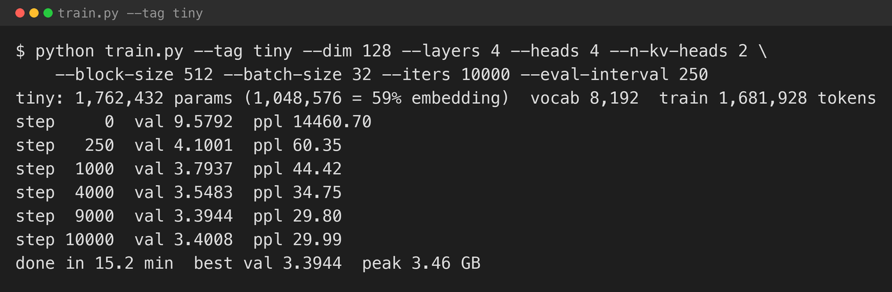
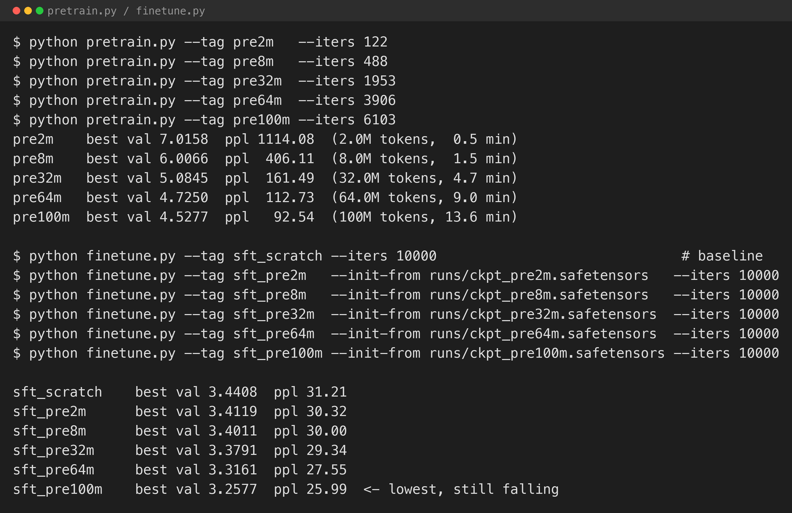
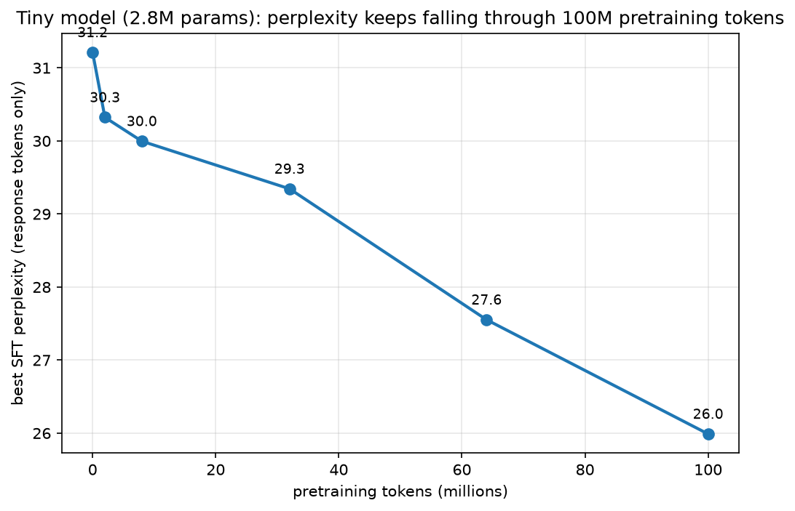

Every distillation experiment so far on this blog — [MiniGPT Part 5](/posts/minigpt5/) — used the same technique: cache a teacher's full probability distribution over its vocabulary at every position, and train a student to match that whole distribution with a KL-divergence loss. That technique has a hard requirement most people asking about "distillation" do not realise: it needs the teacher's own weights, running locally, so you can read its logits. It cannot touch GPT-4, Claude, or any other model you only get to call.

Almost every well-known "distilled" model was not built that way. Alpaca, Self-Instruct, WizardLM, Orca, Microsoft's Phi series, and — per a widely reported but never fully confirmed accusation — possibly DeepSeek, all used a technique that needs nothing but a teacher's *output text*. This post builds one from scratch: what it takes to make it work at all, and a fair test of whether it actually beats the alternative.

## Hard-label vs. soft-label distillation


*Same idea — a small model learning from a large one — two different training signals, with two different hardware requirements.*

**Soft-label (logit) distillation**, the kind already built on this blog, trains the student to reproduce the teacher's *whole probability distribution* over the next token — not just the token the teacher would pick, but how confident it was in every alternative. The loss is KL divergence, and matching a whole distribution requires having that distribution to match, which means running the teacher yourself.

**Hard-label (response) distillation** — this post — is much cruder and much more widely used in practice. Ask the teacher a question, keep only the one answer it actually wrote, and train the student on that text with ordinary cross-entropy, the same loss every model on this blog has used for plain next-token prediction. The teacher's uncertainty, its second-best guesses, everything except the words it actually output, is thrown away. All you need is the text — which means it works identically whether the teacher is a model you downloaded or an API you called ten thousand times.

The name "distillation" covers both, and the ambiguity is not just pedantic. It is the entire reason the DeepSeek accusation and the Phi series' methodology can both be called "distillation" while being, legally and technically, completely different situations: Microsoft has a direct licence to GPT-4o's outputs for exactly this purpose; the accusation against DeepSeek is that it harvested OpenAI's outputs without one. Response-level distillation is the technique in both cases — what differs is permission, not mechanism.

## Choosing a teacher

Response-level distillation's whole appeal is that it works with any teacher you can call — including closed, paid APIs, which is how Alpaca (text-davinci-003), Orca and WizardLM (GPT-4), and Phi-3/4 (GPT-4o) were actually built. I used a free, local, open-weight teacher instead, [`Qwen2.5-32B-Instruct`](https://huggingface.co/Qwen/Qwen2.5-32B-Instruct) (4-bit, via [mlx-community](https://huggingface.co/mlx-community/Qwen2.5-32B-Instruct-4bit)), to keep this series' pattern of zero-dollar experiments running entirely on this Mac Studio.

Generation throughput matters much more here than for logit caching, because every example needs the teacher to actually *write* a full answer, token by token, not just score one. I benchmarked `mlx-lm`'s batched generation at a few batch sizes before committing to a multi-hour run:

| Batch | Aggregate tok/s | Wall-clock per prompt |
|---|---|---|
| 16 | 41.9 | 6.5s |
| **32** | **87.3** | **3.4s** |
| 64 | 74.3 | 4.0s |
| 96 | 64.6 | 4.6s |

Throughput peaks at batch 32 and gets *worse* beyond it — a batch has to wait for its slowest response to finish, and response lengths vary enough that larger batches spend more time idle.

I needed a diverse set of prompts, not diverse answers. [Alpaca's 52k instructions](https://huggingface.co/datasets/tatsu-lab/alpaca) are free, well-covered across task types, and exactly the kind of ready-made prompt diversity Self-Instruct-style bootstrapping is designed to produce from scratch — so I sampled 8,000 of Alpaca's instructions and generated every answer fresh from Qwen2.5-32B-Instruct at batch 32, deliberately discarding Alpaca's own 2023 answers for the moment (they come back later in this post, for a reason).

## Attempt 1: straight to response distillation, no pretraining

Every guide to this technique assumes you start with an already-pretrained model and fine-tune it. I skipped that step on the first attempt, deliberately, to see what a model with *no* prior training learns from nothing but a few thousand of a teacher's answers: a random initialisation, trained purely on (prompt, teacher-response) pairs, masked so the loss only scores the response — never the prompt or the turn markers `<|user|>`/`<|assistant|>`.

This is a real risk, not just a framing device. The [TinyStories paper](https://arxiv.org/abs/2305.07759) that inspired the MiniGPT series used a training corpus of several hundred million tokens even for its smallest models, precisely because a model with no prior exposure to language needs a lot of raw text before it reliably strings a sentence together. 8,000 short Q&A pairs tokenise to only 1.68M tokens — two orders of magnitude short of that, with no broader raw-text exposure to fall back on. I trained a small byte-level BPE (8,192 tokens, sized to this much smaller corpus rather than reusing GPT-2's 50k) and a 1.76M-parameter model for 10,000 steps.


*Loss falls fast and then holds — this is not a training-stability problem.*

Bits fall, and stay down. The model is learning something. What it actually writes tells a different story:

> **"Write an essay introduction explaining how the coronavirus pandemic had impacted education."**
> *"Radies had a profound impact on technological advancements in education, driven by technological advancements, technology, and technology. Here are some key points that could be discussed in the health of education: 1. **Fast Fasting and Disruptions**: Discuss how technology has in the world, including the rise of education..."*

The model reaches for the *shape* of a good answer — numbered lists, section headers, an essay-style opener — because that shape is genuinely present, repeatedly, across the teacher's answers, and shape is exactly what a model can learn from a few million tokens. It does not reach for the *content*, because content requires the kind of broad linguistic and factual grounding TinyStories needed several hundred million tokens to establish even for contained children's stories. "Radies," invented mid-sentence with plausible English morphology and no referent, is the tell: fluent-shaped text without a fluent model of the language underneath.

## Attempt 2: pretrain first

The fix is the one every real instruction-tuning pipeline already uses: pretrain on raw text first, then response-distil on top. I retrained the tokeniser — 16,384 tokens this time, trained on the pretraining corpus and the Q&A corpus combined, since a vocabulary trained on only one compresses the other poorly — and pulled [WikiText-103](https://huggingface.co/datasets/Salesforce/wikitext), general-domain Wikipedia prose, cleaned of the `@-@`/`@,@`/`@.@` artifacts its original tokenise-then-detokenise pipeline leaves behind.

I pretrained the same architecture on five raw-text budgets — 2M, 8M, 32M, 64M, and 100M tokens — then ran the identical response-distillation stage on each, warm-started from the pretrained checkpoint instead of a random initialisation.


*None of these pretraining runs get close to fluent on their own — perplexity 1,114 → 406 → 161 across the first three budgets. Real progress, nowhere near a fluent language model by itself.*


*Every pretraining budget, then the same 10,000-step response-distillation run on top.*

| Pretraining budget | Best SFT validation loss | Perplexity |
|---|---|---|
| 0 (from scratch) | 3.4408 | 31.21 |
| 2M tokens | 3.4119 | 30.32 |
| 8M tokens | 3.4011 | 30.00 |
| 32M tokens | 3.3791 | 29.34 |
| 64M tokens | 3.3161 | 27.55 |
| 100M tokens | **3.2577** | **25.99** |


*Six points, one clean curve, no flattening at the top end I tested. I stopped at 100M tokens because that is most of what WikiText-103 has to offer at this cleaning threshold, not because the trend showed signs of stopping.*

Monotonic, small, and real, across every budget: more raw pretraining before response distillation reliably produces a better-scoring student. And the qualitative change is bigger than the perplexity gap suggests. From-scratch, 2M, and 8M tokens of pretraining all invent morphologically-plausible non-words — "Radies," "Veget," "sispy," "Spirural." At 32M tokens and beyond, that fingerprint fades: "Economic Downturning" is an invented *compound*, not an invented *word* — every syllable in it is real English. The model has stopped hallucinating vocabulary and started, however incoherently, assembling real vocabulary badly. **SFT — supervised fine-tuning** — is the general name for this second stage, of which response-level distillation on a teacher's answers is one specific case; I use the two terms interchangeably from here on, since that is what the field does.

## The missing control

Both attempts above trained on Qwen2.5-32B-Instruct's answers. There was no arm trained on anything else — nothing to show those answers were *better* than an alternative, which means neither attempt actually tested whether distillation helps at all. Fixing that took one more experiment: same pretrained checkpoint (the 100M-token version above), same 8,000 prompts, same masked SFT recipe, and exactly one thing different between two runs — **whose answer to the same prompt the student is trained to imitate.**

- **`distilled`** — Qwen2.5-32B-Instruct's answers, as above.
- **`baseline`** — [Alpaca](https://huggingface.co/datasets/tatsu-lab/alpaca)'s own original answers to the identical prompts, written by text-davinci-003 in 2023 and recovered here, matched by exact prompt text, having been discarded earlier in favour of regenerating everything fresh.

One confound, disclosed rather than hidden: Qwen's answers average roughly **3x longer** than Alpaca's originals (1.70M response tokens across the training set versus 480K) — 2023's terser teacher against today's fuller one. That is a real, uncontrolled difference, and it means this is really "a good modern teacher's fuller answers" versus "a weaker, terser 2023 teacher's answers" — the realistic version of the question, not an artificially isolated one.

I could not just compare perplexity between the two arms, which is what made every number up to this point straightforward. A model trained on Qwen's answers will always score better on *Qwen's own held-out answers* than a model that never saw Qwen's writing style, and the reverse holds for Alpaca — perplexity against a specific source measures "did you learn this source's style," not "is this a better model." A fair comparison needs a judge that has not seen either training set.

My first instinct was to reuse Qwen2.5-32B-Instruct as that judge — already loaded, already proven as a generator. That is a real methodological mistake, not a footnote: the `distilled` arm was trained specifically to imitate Qwen's own answers, and LLM judges have a documented tendency to rate outputs written in a style closer to their own more favourably. Using Qwen to judge a model trained on Qwen's writing would stack the deck in favour of the exact result this experiment exists to test fairly, so I swapped it before running a single verdict: **Llama-3.1-70B-Instruct**, a different lineage entirely, with no stake in either arm's writing style.

A few more mitigations on top of the judge swap: position (which response is "A" vs "B") randomised per prompt, so any residual position bias cancels out; an explicit instruction not to prefer a response for being longer, since a short correct answer should beat a long incoherent one; and, after reconsidering an early draft of the prompt, an instruction to first consider what a genuinely good answer would contain and use *that* as the standard for comparing the two responses — not "relative to each other in a vacuum," which would let the judge pick the less-incoherent of two equally wrong answers without ever asking which is closer to correct.

I also had to be careful about architecture. Part of an earlier version of this comparison used the largest model this project has built (9.6M parameters) rather than the 2.8M-parameter model above — because it scored better in isolation — and it produced a training corpus this size confound with model capacity: the `baseline` arm's Alpaca-original corpus is smaller than the `distilled` arm's Qwen-generated one, and a bigger model overfits a smaller corpus faster purely from having more capacity to memorise it with, regardless of which teacher is actually better. Using the smaller, 2.8M-parameter model for both arms keeps the comparison to the one variable it is meant to isolate.

## The result


*100 held-out prompts, neither model trained on. Zero unclear verdicts — the judge picked a side or called a tie on every single one.*

**`distilled` won 60, `baseline` won 36, 4 ties.** Excluding ties, that is a 62.5% win rate for the model trained on Qwen2.5-32B's answers — a one-sided binomial test against the 50/50 null puts this at **p ≈ 0.009**. Not a marginal result that could plausibly be noise.

Both models are still bad in absolute terms — a 2.8M-parameter model with under two million tokens of fine-tuning data is not a product. But "bad" is not "equally bad":

> **"Describe why someone should use the product. Product: A handcrafted wooden children's toy."**
> **distilled:** *"A handcrafted bowl can be used in a creative garden, such as painting, painting, painting, and painting. Here are some key reasons why you can use this step: 1. **Escape or Lighting**: In a small, picturesque village nestled in a dim light, each child stands at the window..."*
> **baseline:** *"A good deal with a magical dragon and a wreaker muste up to spend an hour of time, and provide an incredibly powerful version of the dragon. The dragon should always include the dragon's courage, courage, and strength in the world, and an adventure."*
> **Judge:** *"A [distilled], Response A is closer to a relevant answer because it at least attempts to describe a creative use for a handcrafted item, even if it's not the correct product."*

Neither response is about the actual product. But one is at least reaching for "handcrafted item, creative use" while the other has drifted into an unrelated dragon story — the pattern across most of the 60 distilled wins: not correct, but recognisably *closer* to on-topic.

`baseline` did not lose everywhere:

> **"Write an essay introduction explaining how the coronavirus pandemic had impacted education."**
> **distilled:** *"Canemic history was driven by the integration of healthcare and its profound impact on healthcare..."*
> **baseline:** *"Evandemic had never seen the coronavirus vaccine and more severe cases. It was also important to prevent prevention and medical care..."*
> **Judge:** *"B [baseline], Response B is closer to addressing the prompt, albeit in a disjointed manner, whereas Response A is completely unrelated to the impact of the coronavirus pandemic on education."*

Both invent words here, and neither mentions education — but `baseline` stayed closer to the pandemic while `distilled` drifted to healthcare policy in general. 36 losses out of 96 non-tied verdicts says the teacher's edge is real but not absolute.

## What I took from it

- **This is the demonstration this blog needed, and it took two failed shortcuts to build properly.** Straight-to-distillation without pretraining fails for reasons that have nothing to do with teacher quality. Comparing perplexity between two different data sources is a rigged test that looks like a real one. A fair answer needed pretraining first, and a neutral judge second — a 62.5% win rate at p ≈ 0.009 is modest, not dramatic, and it is the real number.
- **Catching my own judge bias mid-run mattered more than any other single decision in this post.** Qwen judging a model trained on Qwen's own answers would have produced a number, and it would have been unusable for a reason the number itself could never reveal. A biased instrument does not announce its bias in its output.
- **Model size is part of experimental design, not just a cost trade-off.** Using the bigger architecture here, because it scored better elsewhere, would have confounded model capacity with teacher quality the moment the two arms' datasets turned out to be different sizes. The model has to be sized to what the comparison needs, not to whatever scored best in a different experiment.
- **Vocabulary grounding and compositional coherence are separable, and the cheaper one arrives first.** Real words replacing invented ones showed up well before real coherence did, as pretraining budget increased. Whatever "fluency" is being learned here, it has at least two distinct stages.
- **Response distillation is not a replacement for pretraining — it is what you do after it.** Every real system that uses this technique (Alpaca, Phi, DeepSeek's own distilled releases) fine-tunes an already-pretrained model. Skipping that step to see what breaks showed exactly the part pretraining is responsible for: basic fluency, prior to being asked to follow instructions well.

## What's next

62.5% is a real, replicable, modest edge — not the dramatic gap a much larger teacher-student capability difference might produce. The obvious next step is scale: a much larger pretraining corpus, many more prompts, and a bigger student sized to match, to see whether the same one-variable comparison produces a stronger effect when the model has enough capacity and data to actually learn from a good teacher rather than mostly demonstrating that it has one.

## Try it yourself

The code is in [github.com/Haddley/distillation](https://github.com/Haddley/distillation), across `part1/` (dataset generation, from-scratch attempt), `part2/` (pretraining sweep), and `part3/` (the fair comparison and judge):

```bash
# part1: teacher, dataset, first (failed) attempt
python pull_prompts.py --n 8000
python generate_dataset.py --batch 32
python train.py --tag tiny --dim 128 --layers 4 --heads 4 --n-kv-heads 2 --iters 10000

# part2: pretraining sweep
python pull_pretrain_corpus.py --max-chars 500000000
python pretrain.py --tag pre100m --iters 6103
python finetune.py --tag sft_pre100m --init-from runs/ckpt_pre100m.safetensors --iters 10000

# part3: the fair comparison
python pull_baseline_answers.py
python finetune.py --tag distilled --source distilled --init-from ../part2/runs/ckpt_pre100m.safetensors --iters 10000
python finetune.py --tag baseline  --source baseline  --init-from ../part2/runs/ckpt_pre100m.safetensors --iters 10000
python judge.py --n 100 --batch 16
```

Requires Apple Silicon for MLX. The judge alone needs about 40GB free for Llama-3.1-70B-Instruct-4bit.

## References

- [TinyStories — Eldan & Li, 2023](https://arxiv.org/abs/2305.07759)
- [Self-Instruct — Wang et al., 2022](https://arxiv.org/abs/2212.10560)
- [Alpaca — Taori et al., 2023](https://crfm.stanford.edu/2023/03/13/alpaca.html)
- [InstructGPT — Ouyang et al., 2022](https://arxiv.org/abs/2203.02155)
- [Phi-3 Technical Report — Abdin et al., 2024](https://arxiv.org/abs/2404.14219)
- [Phi-4 Technical Report — Abdin et al., 2024](https://arxiv.org/abs/2412.08905)
- [DeepSeek-R1 — DeepSeek-AI, 2025](https://arxiv.org/abs/2501.12948)
- [WikiText-103 — Merity et al., 2016](https://arxiv.org/abs/1609.07843)
- [Training Compute-Optimal Large Language Models (Chinchilla) — Hoffmann et al., 2022](https://arxiv.org/abs/2203.15556)
- [Judging LLM-as-a-Judge with MT-Bench and Chatbot Arena — Zheng et al., 2023](https://arxiv.org/abs/2306.05685)
- [MiniGPT series](/posts/minigpt/)
