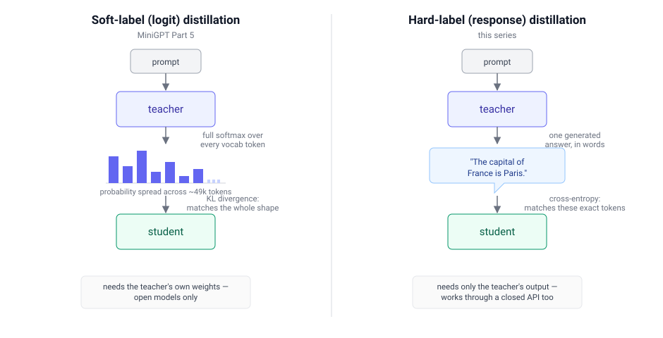
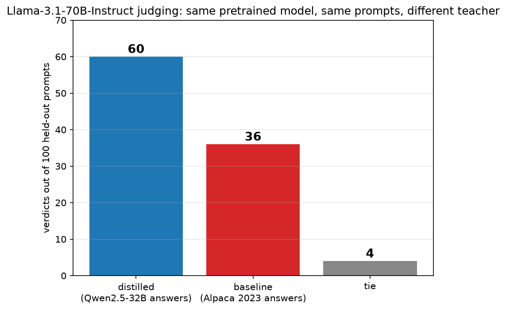

"Distillation" usually means one specific thing in the research literature and a looser, more common thing in practice. This post is about the common thing: training a smaller model on a bigger model's *answers*, not its internal probabilities — because that is what Phi, DeepSeek's distilled releases, and most of what gets called "distillation" in the news actually are.

## Two kinds of distillation

*Same idea — a small model learning from a large one — two different training signals, with two different requirements.*

**Soft-label (logit) distillation** — [already built on this blog](/posts/minigpt5/) — trains a student to match a teacher's *whole probability distribution* over the next token, using a KL-divergence loss. It needs the teacher's own weights running locally, so you can read its logits. It cannot touch GPT-4, Claude, or any model you only get to call through an API.

**Hard-label (response) distillation** is cruder: ask the teacher a question, keep the one answer it wrote, and train the student on that text with ordinary cross-entropy — the same loss every model uses for plain next-token prediction. All you need is the text, which is why it works with a closed API just as well as an open one.

## How Microsoft and DeepSeek actually do this

**Phi (Microsoft).** Starting with [phi-1](https://arxiv.org/abs/2306.11644) in 2023, Microsoft trained small models substantially on *synthetic* data — text generated by GPT-3.5, then GPT-4, then GPT-4o as the series progressed — rather than on web text alone. The pitch was that a small model taught on carefully generated, textbook-quality examples learns faster than one taught on the internet's raw average. Microsoft has direct, licensed access to OpenAI's models, so this is uncontroversial hard-label distillation, done at large scale, disclosed openly in their own technical reports.

**DeepSeek-R1-Distill.** DeepSeek's own [R1 paper](https://arxiv.org/abs/2501.12948) describes taking their large reasoning model, R1, generating reasoning traces with it, and fine-tuning six much smaller open models (1.5B to 70B, built on Qwen and Llama bases) on those traces — released as `DeepSeek-R1-Distill-Qwen-*` and `DeepSeek-R1-Distill-Llama-*`. This is exactly the same technique, openly documented, and not controversial.

**The separate, unproven accusation.** Around the same time, OpenAI and Microsoft reportedly found usage patterns suggesting accounts linked to DeepSeek had queried OpenAI's API at a scale consistent with harvesting outputs to train a competing model — a possible violation of OpenAI's terms of service, never publicly confirmed with hard evidence. This is a different claim from the R1-Distill releases above: same technique either way, but a real difference in whether the answers being trained on were used with permission.

## Trying it myself

I wanted to see the mechanism directly rather than just read about it, using a teacher I could actually run: [Qwen2.5-32B-Instruct](https://huggingface.co/Qwen/Qwen2.5-32B-Instruct) (4-bit, via [mlx-community](https://huggingface.co/mlx-community/Qwen2.5-32B-Instruct-4bit)), local, free, via MLX. I generated fresh answers to 8,000 [Alpaca](https://huggingface.co/datasets/tatsu-lab/alpaca) prompts, then trained a small model (a few million parameters) on them with the same masked cross-entropy loss described above.

One thing became clear immediately: this only works on top of ordinary pretraining. A model with no prior exposure to raw text, trained purely on a few thousand Q&A pairs, learns the *shape* of a good answer — numbered lists, section headers — long before it learns enough English to fill that shape with anything coherent. Every real system that uses this technique, including both examples above, starts from an already-pretrained model. So I did too: pretraining first on [WikiText-103](https://huggingface.co/datasets/Salesforce/wikitext), then response-distilling on top, the same two-stage recipe Phi and DeepSeek-R1-Distill both use.

Pretraining alone only ever teaches next-token prediction, so the plain pretrained checkpoint has no reason to treat a prompt as a question to answer — it was never trained to do that. Prompted with one of the same 8,000 questions before any response-distillation at all, it just continues the text as if it were the opening of a Wikipedia article:

> **"Does the word 'malfunctioning' have any synonyms?"**
> *"...is not a source of the other, a means that a great power might have been used by the GIS's book. The book's name is also believed to have been made by the novel..."*

That is exactly what the response-distillation stage exists to fix: it is the step that teaches the model to answer at all, not just to write fluent text. This checkpoint is the shared starting point both students below are fine-tuned from; everything that follows is about what happens after this point.

## The test that actually mattered

Getting a coherent small model running was the easy part. The real question — does the teacher's quality actually matter, or would any answers do? — needed a proper controlled comparison, which I built once the pretraining stage was in place:

Of the 8,000 Alpaca prompts, I split off 200 for validation and 200 for testing, leaving 7,600 for fine-tuning — the same 7,600 prompts, and the same split boundaries, for both arms:

- **`distilled`**: the pretrained model, fine-tuned on Qwen2.5-32B-Instruct's answers to those 7,600 prompts.
- **`baseline`**: the *same* pretrained model, fine-tuned on Alpaca's own original 2023 answers to the identical 7,600 prompts (written by the much older text-davinci-003, and swapped out for fresh Qwen answers everywhere else in this project).

Neither model ever saw the 200 held-out test prompts during training — that reserved set is what the judge scored below.

Two of the 7,600 training prompts, answered by both:

> **"Answer the given question in yes or no. Question: Does social media have a negative effect?"**
> **Alpaca (2023):** *"Answer: Yes"*
> **Qwen (2025):** *"Yes, social media can have negative effects, though these can vary widely depending on usage and individual circumstances."*

> **"Does the word 'malfunctioning' have any synonyms?"**
> **Alpaca (2023):** *"Yes, the word 'malfunctioning' has synonyms such as failing, faltering, defective, impaired, and deficient."*
> **Qwen (2025):** *"Yes, the word 'malfunctioning' does have several synonyms. Some of these include: Faulty, Defective, Broken, Not working, Out of order, Malfunctioned, Dysfunctional, Inoperative..."*

Alpaca's answers are not wrong — both examples above are perfectly correct. They are just thinner: a bare "Yes," five synonyms instead of eight with more natural phrasing around them. That gap, repeated across all 7,600 training prompts, is the entire independent variable in the comparison below.

Comparing perplexity between the two would be rigged — each model would simply score best on its own training source's writing style. Grading my own two models' answers would be no better. So I built the test to remove every source of bias I could think of:

1. **Held out 100 prompts neither model had trained on** — half of the 200-prompt test split set aside before fine-tuning even started.
2. **Generated a fresh answer from each model** to every one of those 100 prompts.
3. **Randomly swapped which answer was labelled "A" and which was "B"** for each prompt, so consistently favouring "A" or "B" could not manufacture a result.
4. **Sent both answers, unlabelled as to source, to a third model to judge** — [**Llama-3.1-70B-Instruct**](https://huggingface.co/meta-llama/Llama-3.1-70B-Instruct) (4-bit, via [mlx-community](https://huggingface.co/mlx-community/Meta-Llama-3.1-70B-Instruct-4bit)) — deliberately not Qwen, since a judge from the same family as one of the training sources would likely rate that source's style more favourably.
5. **Told the judge to first decide what a genuinely good answer would contain**, then pick whichever of A or B came closer to that standard — not just whichever sounded more confident or longer.
6. **Tallied the picks** across all 100 prompts and checked the result against a one-sided binomial test, to rule out the win margin being noise from a 100-prompt sample.

*100 held-out prompts, neither model trained on.*

**`distilled` won 60, `baseline` won 36, 4 ties** — a 62.5% win rate excluding ties, with a one-sided binomial test putting this at p ≈ 0.009. Modest, not dramatic, but real: on identical prompts, identical architecture, and identical pretraining, the model trained on the better teacher's answers won more often than not, and not by chance.

## What I took from it

- **A smaller model can absorb real value from the work poured into a bigger one, and this experiment shows why that is not just a Phi/DeepSeek-scale phenomenon.** All it takes is the bigger model's *answers* — no logits, no special access, nothing an API-only teacher would not hand over voluntarily. That is exactly what makes the practice usable with a teacher's permission (Phi, licensed OpenAI output) and, allegedly, without it (the accusation against DeepSeek) — the technique itself does not care which.
- **Catching my own judge bias mattered more than any other decision here.** A biased evaluator does not announce its bias in its output; the only way to find it was to notice the conflict of interest before trusting the number.
- **A real effect can be small, and reporting it as small is the honest thing to do.** 62.5% is not a rout. It is a genuine, statistically real edge from using a better teacher, at a scale where "genuine but modest" is exactly what you'd expect.

## What's next

62.5% is the effect size a 2.8M-parameter model, 8,000 prompts, and 100M pretraining tokens can show. I'm now rerunning the same one-variable comparison at a much larger scale — a Wikipedia-based pretraining corpus several times bigger, 2.5x the prompts, and a student sized to match — to see whether a less data-starved setup shows a stronger effect, closer to what Phi and DeepSeek actually demonstrate at production scale.

## Try it yourself

The code is in [github.com/Haddley/distillation](https://github.com/Haddley/distillation), across `part1/` (teacher, dataset, pretraining), `part2/` (the pretraining sweep), and `part3/` (the fair comparison and judge). See the repo's README for the exact commands.

Requires Apple Silicon for MLX. The judge alone needs about 40GB free for Llama-3.1-70B-Instruct-4bit.

## References

- [Phi-3 Technical Report — Abdin et al., 2024](https://arxiv.org/abs/2404.14219)
- [Phi-4 Technical Report — Abdin et al., 2024](https://arxiv.org/abs/2412.08905)
- [DeepSeek-R1 — DeepSeek-AI, 2025](https://arxiv.org/abs/2501.12948)
- [Alpaca — Taori et al., 2023](https://crfm.stanford.edu/2023/03/13/alpaca.html)
- [Judging LLM-as-a-Judge with MT-Bench and Chatbot Arena — Zheng et al., 2023](https://arxiv.org/abs/2306.05685)
- [MiniGPT series](/posts/minigpt/)
