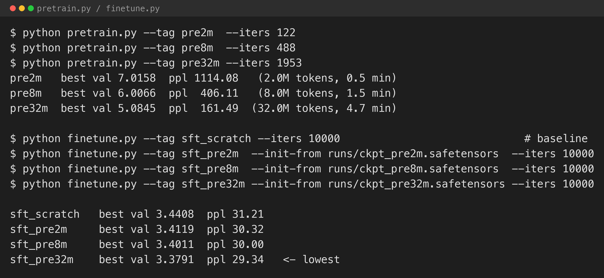
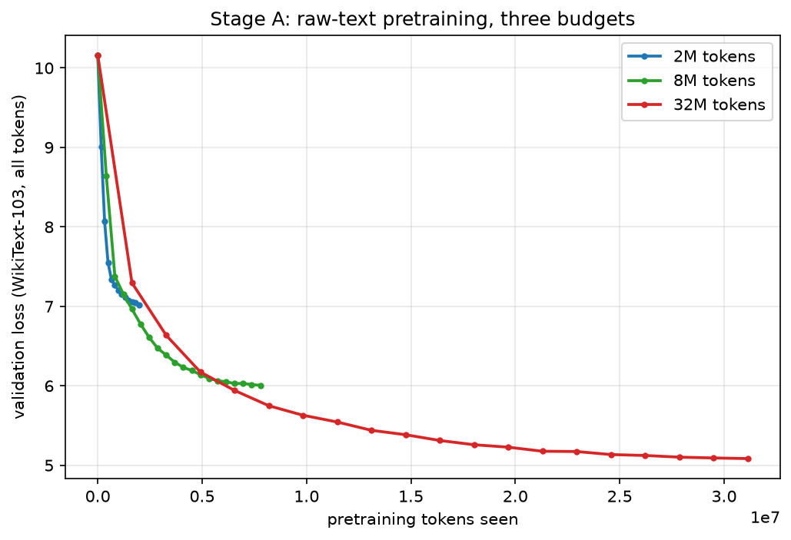
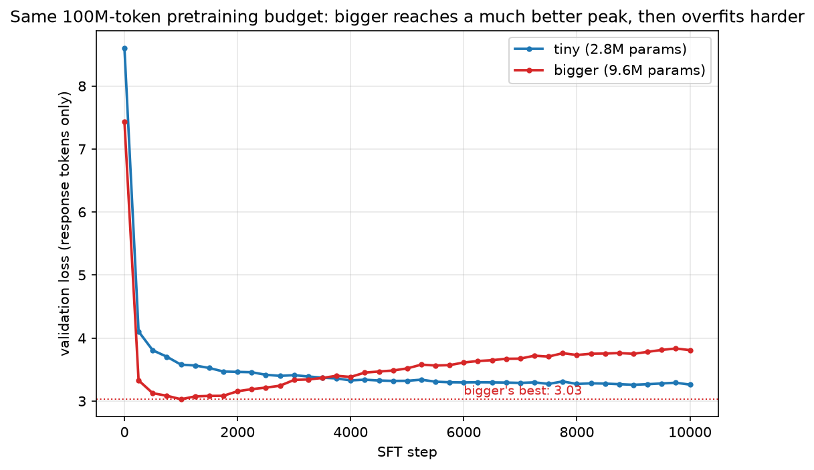
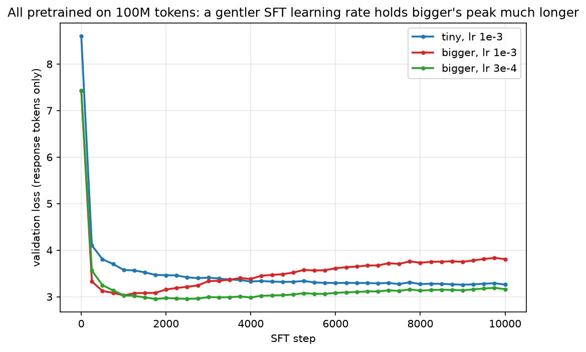

[Part 1](/posts/distillation/) trained a student purely on 1.68M tokens of (prompt, response) pairs, with no raw-text pretraining stage at all, and found the predictable result: both models learned the *shape* of a good answer — numbered lists, code fences, essay openers — almost immediately, and invented plausible-sounding nonsense words ("Radies," "Sadies," "the Right Tolk of Health") in place of real content. The post's own "What's next" named the obvious follow-up: give the student a raw-text pretraining stage first, and see how much it takes before that problem starts closing.

## The setup

Same architecture as Part 1's winning "tiny" config (4 layers, dim 128), same response-distillation recipe, same masked cross-entropy loss on the same teacher-generated Q&A pairs. This is the stage more commonly called **SFT — supervised fine-tuning** — the general name for "train a model on labelled input/output pairs with ordinary cross-entropy," of which response-level distillation on a teacher's answers is one specific case. I use "the SFT stage" throughout this post to mean exactly what Part 1 called response distillation, to keep the two stages (raw-text pretraining, then SFT) clearly labelled. Two things had to change to make the comparison fair.

**One tokenizer for both corpora.** Part 1's 8,192-token BPE was trained only on the narrow Q&A text. Pretraining needs a tokenizer that also compresses ordinary encyclopedic prose well, so I trained one 16,384-token BPE on the pretraining corpus and the Q&A corpus combined, and retokenised everything — including a fresh from-scratch baseline, since Part 1's exact numbers use an incompatible vocabulary.

**A raw-text corpus.** [WikiText-103](https://huggingface.co/datasets/Salesforce/wikitext) — general-domain Wikipedia prose, well short of MiniGPT's own pretraining scale, cleaned of the `@-@`/`@,@`/`@.@` artifacts its original tokenise-then-detokenise pipeline leaves behind (otherwise the model would dutifully learn to write "top @-@ down" instead of "top-down").

I pretrained the same tiny architecture on five raw-text budgets — 2M, 8M, 32M, 64M, and 100M tokens — then ran the identical Part 1 response-distillation stage on each, warm-started from the pretrained checkpoint instead of a random initialisation.


*All fast at this scale: even the largest pretraining run here finished in under 5 minutes, and every SFT run at the tiny architecture is under 23 minutes.*

## Pretraining alone

None of these pretraining runs get close to fluent — even 100M tokens is only about 36 tokens per parameter for this 2.8M-parameter model, past Chinchilla's ~20-token-per-parameter compute-optimal target for pretraining alone, but the SFT stage still adds its own 1.7M tokens of a completely different distribution on top of that.


*Perplexity 1,114 → 406 → 161 across the first three budgets. Real progress, nowhere near a fluent language model.*

## What pretraining did for the SFT stage


*Six points, one clean curve. I stopped at 100M tokens because that is most of what WikiText-103 has to offer at this cleaning threshold, not because the curve showed any sign of flattening.*

| Pretraining budget | Best SFT validation loss | Perplexity |
|---|---|---|
| 0 (from scratch) | 3.4408 | 31.21 |
| 2M tokens | 3.4119 | 30.32 |
| 8M tokens | 3.4011 | 30.00 |
| 32M tokens | 3.3791 | 29.34 |
| 64M tokens | 3.3161 | 27.55 |
| 100M tokens | **3.2577** | **25.99** |

Monotonic, small, and real, across every budget tested from 2M to 100M: more raw pretraining before response distillation reliably produces a better-scoring student, with no sign of the trend reversing. That is a cleaner result than either Part 1 result — no overfitting collapse, no ambiguous crossover, just a straight line pointing the direction you'd hope, and it never bent.

## What actually changed

The perplexity gap is modest. What changed underneath it is not.

**From scratch:** *"Education has had profound impacts on global life and numerous impact on the global economy... **Economic Benefits**: The economic indicators and economic activity. Companies with a high risk of economic activity, including the risk of a population of economic activity..."*

**2M pretrain tokens:** *"...Here's a breakdown of how you can use this information: ### Step 1: Define Your **Veget** Audience... you can take to different tasks or to make tasks more efficient and efficient."* — followed by a fenced code block opening with `import binsic chocolate`

**8M pretrain tokens:** *"...a small, **sispy** bag, like a coffee shop... **Spirural** and Social Impact: The global economy has led to widespread job opportunities..."*

**32M pretrain tokens:** *"...Cultural events, primarily driven by technological advancements and the potential to protect human rights... **Economic Downturning**: The first update of the coronavirus pandemic, including the virus and the spread of malicious deaths..."*

Every condition still fails to answer the question, still drifts topic, still repeats itself. But look at the words themselves. From scratch, 2M, and 8M tokens of pretraining all invent morphologically-plausible non-words — "Veget," "binsic," "sispy," "Spirural" — the exact fingerprint Part 1 flagged as the tell of shape without a real model of the language underneath. At 32M tokens, that fingerprint is almost gone: "Economic Downturning" is an invented *compound*, not an invented *word* — every syllable in it is real English. The model has stopped hallucinating vocabulary and started, however incoherently, assembling real vocabulary badly.

## Does more capacity help once there's enough data?

Part 1's cleanest result was that a 4x-larger model overfit a 1.68M-token corpus faster than a smaller one, and never beat it. That result was specific to a from-scratch model with no pretraining. With a real pretraining stage in the picture, capacity and data stop being the same bottleneck, so I reran the comparison: the same "bigger" architecture from Part 1 (9,638,144 params at this tokeniser's 16k vocabulary), pretrained on the full 100M-token budget, then put through the identical SFT stage.


*Same pretraining budget, same SFT recipe. Bigger drops far lower, then climbs back up past where it started.*

Pretraining alone tells the first half of the story: at the identical 100M-token budget, bigger reaches perplexity 47.8, tiny reaches 92.5 — bigger than half tiny's error, for the same pretraining compute. Capacity that was wasted on a data-starved from-scratch run in Part 1 is not wasted here; a bigger model pretrained on enough raw text learns faster per token, not just per parameter.

The SFT stage confirms it, and complicates it. Bigger's best checkpoint reaches **perplexity 20.66** — the best score anywhere in this series, well past tiny's own best of 25.99 at the same pretraining budget. Pretraining did what Part 1's ablation could not: it made "bigger" actually better than "tiny." But by step 10,000, bigger's validation loss has climbed back past where tiny finished, worse than its own starting point after warm-up — the exact overfitting shape Part 1 saw, just delayed and starting from a much better place. The 1.7M-token SFT corpus is still small enough for a 9.6M-parameter model to memorise, no matter how well-prepared its weights were going in.

At its best checkpoint, bigger's output has a different character from anything tiny produced, invented words included:

> **"Summarize the main arguments of given book." (The War of Art: Break Through the Blocks and Win Your Inner Creative Battles)**
> *"The main arguments in the novel are: 1. **Daily Life**: The protagonist, John, is the protagonist of the story, who is the protagonist of the story. 2. **Echoes of the Role**: John is the protagonist and the protagonist, who is currently a Master of the world after a lifetime..."*

Every word here is real English, correctly inflected, in grammatically valid sentences. It is also confidently wrong — *The War of Art* is a non-fiction book about creative resistance, has no protagonist named John, and is not a novel — and it is stuck in a loop calling John "the protagonist" four times in two sentences. This is a genuinely different failure mode from tiny's invented-word problem: not "shape without vocabulary," but fluent, grammatical, repetitive confabulation — closer to what a much larger hallucinating language model looks like than to a from-scratch model's telltale nonsense words.

I reran bigger's SFT stage a third time, at a lower learning rate (3e-4 instead of 1e-3), to test whether the collapse was an optimisation artefact — training too aggressively on too little data — rather than an inherent ceiling.


*A gentler learning rate does not prevent the climb, but it delays and flattens it substantially.*

It helped, on both counts. Best validation perplexity dropped again, to **19.13** — this series' new best, beating the higher-learning-rate run's 20.66. And the collapse by step 10,000 is far gentler: perplexity 23.6 versus 45.0 at the same step for the higher learning rate, on the identical data and checkpoint. Some of what looked like an inherent ceiling in the first bigger run was actually the optimiser moving too fast for how little data it had to move on — a genuine partial fix, not a full one, since the climb is still there, just slower.

The complication: this new best checkpoint's output is not more reliably real-word than the previous one.

> **"Write an essay introduction explaining how the coronavirus pandemic had impacted education."**
> *"Genusi Pandemic Economic Pandemic, Howocopedia Growths and Discrimination"*

"Genusi" and "Howocopedia" are Part 1-style invented words, from the numerically best checkpoint in the entire two-part series. Perplexity and "does it invent words" are correlated, not identical — this run scores better in aggregate while still occasionally producing exactly the failure mode the aggregate score is supposed to be tracking. Worth stating plainly rather than smoothing over: the metric and the qualitative read mostly agree in this series, not always.

## What I took from it

- **The prediction from Part 1 held, in a more specific way than expected.** I expected pretraining to help fluency generally. I did not specifically predict that the improvement would show up first as *real words replacing invented ones*, before it shows up as coherent sentences. Vocabulary grounding and compositional coherence are apparently separable, and the cheaper one arrives first.
- **A monotonic result is its own finding, and it held all the way to 100M tokens.** Six budgets, six improvements, in order, with no flattening at the top end I tested.
- **Part 1's capacity finding was conditional, not general.** "More parameters overfits a small dataset faster" was true for a from-scratch model with nowhere else to put its capacity. Once pretraining gives a bigger model something real to learn first, the same architecture that lost decisively in Part 1 produces this series' best result. The lesson was never "small beats big" — it was "capacity has to have data to justify it," and pretraining is what supplies that data.
- **Even the winning configuration still overfits during SFT, and the learning rate matters more than I expected.** A 3x lower SFT learning rate produced both a better peak and a slower climb off it, on identical data and an identical starting checkpoint — some of what looked like a hard ceiling in the first bigger run was the optimiser moving too fast for how little data it had, not a property of the model or the data alone.
- **Perplexity and "does it invent words" track each other loosely, not exactly.** This series' single best checkpoint by the numbers still produced two invented words in a three-prompt sample. The qualitative read has been a reliable guide throughout this series, and it still is — but it is a separate measurement from the loss curve, not a restatement of it, and this post's own data is the clearest reminder of that yet.
- **The real lesson is procedural.** Response-level distillation is not a rival to pretraining, and this experiment's own numbers show why: every unit of pretraining compute made the downstream SFT result better, with no cost. There is no version of this pipeline where skipping pretraining is the right call if pretraining compute is available at all. Checkpoint-on-best-validation, built into this project's training loop since the MiniGPT series, is not a formality here either — it is the difference between this experiment's best result and its worst.

## Try it yourself

The code is in [github.com/Haddley/distillation](https://github.com/Haddley/distillation) under `part2/`:

```bash
python pull_pretrain_corpus.py --max-chars 500000000
python train_tokenizer.py --vocab-size 16384
python tokenize_pretrain.py
python tokenize_qa.py
python pretrain.py --tag pre100m --iters 6103
python finetune.py --tag sft_pre100m --init-from runs/ckpt_pre100m.safetensors --iters 10000

# the capacity comparison
python pretrain.py --tag bigger_pre100m --dim 256 --layers 8 --heads 8 --n-kv-heads 2 --iters 6103
python finetune.py --tag sft_bigger_pre100m --dim 256 --layers 8 --heads 8 --n-kv-heads 2 \
    --init-from runs/ckpt_bigger_pre100m.safetensors --iters 10000

python generate.py --tag sft_bigger_pre100m --n 8

# a gentler learning rate holds the peak longer
python finetune.py --tag sft_bigger_pre100m_lowlr --dim 256 --layers 8 --heads 8 --n-kv-heads 2 \
    --init-from runs/ckpt_bigger_pre100m.safetensors --iters 10000 --lr 3e-4
```

Requires Apple Silicon for MLX.

## References

- [WikiText-103 — Merity et al., 2016](https://arxiv.org/abs/1609.07843)
- [TinyStories — Eldan & Li, 2023](https://arxiv.org/abs/2305.07759)
- [Training Compute-Optimal Large Language Models (Chinchilla) — Hoffmann et al., 2022](https://arxiv.org/abs/2203.15556)
- [Distillation Part 1](/posts/distillation/)
- [MiniGPT series](/posts/minigpt/)
