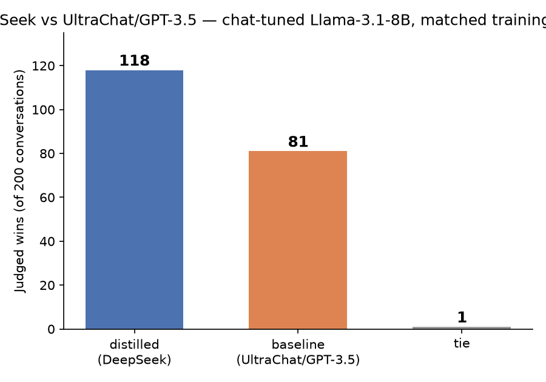

[Part 1](/posts/distillation/) trained a small model from scratch and showed that a better teacher's answers produce a measurably better student, at two different scales. Everything in it was single-turn instruction-following, and the student was a custom architecture trained from random initialisation. This post changes both of those things: a real pretrained base model, [Llama-3.1-8B](https://huggingface.co/meta-llama/Llama-3.1-8B), fine-tuned into a genuine multi-turn chat model with LoRA — and then the same one-variable question Part 1 asked, run again with a second teacher, [DeepSeek](https://api-docs.deepseek.com/), instead of GPT-3.5.

## The base model does not know where its turn ends

Llama-3.1-8B-base has never seen a chat template. Prompted with a real two-turn conversation from [UltraChat-200k](https://huggingface.co/datasets/HuggingFaceH4/ultrachat_200k) — someone asking for a product name, then a tagline — it answers the immediate question reasonably:

> **User:** "I like the name PureSprout Baby Formula, but could you add a tagline that emphasizes the all-natural, non-GMO aspect of the product?"
> **Base model:** *"Sure! How about 'PureSprout Baby Formula: The All-Natural, Non-GMO Choice for Your Little One'?"*

Then it keeps going — inventing a new `User:` turn, describing a logo that does not exist, offering a fake image link, and starting a packaging-design pitch nobody asked for. It was never taught that a reply ends; it was only ever taught to predict the next plausible token, and a plausible continuation of a chat transcript is more chat transcript. This is the same lesson Part 1's plain pretrained checkpoint taught with single-turn prompts, showing up again in a more specific way: fluency is not the same skill as knowing when to stop.

## Why LoRA, not full fine-tuning

This machine is a 64GB M1 Max Mac Studio — not one of the 128/192GB Ultra configurations. Full fine-tuning of an 8B model needs bf16 weights (~16GB) plus fp32 master weights, fp32 gradients, and fp32 Adam momentum/variance on top — roughly 16 bytes/parameter of optimiser state alone, well over 100GB. Not close to fitting.

LoRA freezes the base weights and trains a small set of low-rank adapter matrices instead — 10.5M trainable parameters out of 8.03 billion, 0.131% of the model. Frozen bf16 weights plus adapters plus activations landed around 25–35GB in practice, comfortably inside the budget, and gave a real quality improvement over QLoRA's 4-bit-quantised alternative without the memory pressure that would have forced that trade-off.

## Every turn needs its own training example

UltraChat conversations average 3.2 assistant turns each, and mlx-lm's chat-data format only ever scores the *final* message in a `{"messages": [...]}` example against the loss — pass it a whole multi-turn conversation as one example and every earlier assistant turn is silently masked out along with the prompt. Supervising every turn meant expanding each conversation into one training example per assistant turn: a 3-turn conversation becomes three examples, each ending one turn later than the last. This is why the counts below talk about training *examples* in the tens of thousands, built from a training set of only 7,600 conversations.

That also fixes the context-length question in advance: since the scored answer is always the *last* thing in one of these examples, any example longer than the model's context window has to be filtered out before training, not truncated during it — truncating from the front, which is what happens by default, would cut the answer off and score nothing.

So the real question was how long a context window this hardware could actually support, since UltraChat's conversations run well past the 512-token window Part 1 used throughout. The answer was worth measuring directly rather than assuming: attention memory scales roughly with the *square* of sequence length, not linearly. Testing the actual longest training example at each candidate limit — not a random sample, which can miss the tail entirely — a 2048-token sequence peaked at a stable 31GB; a 3072-token sequence (1.5x the length) peaked at **69GB, already past this machine's 64GB of physical memory**, surviving only by swapping to disk. 4096 tokens crashed outright, and inconsistently — sometimes completing, sometimes not, depending on what else the allocator was doing at that moment. 2048 is not an arbitrary round number here; it is the actual, empirically validated ceiling for an 8B model on this machine.

## Training on UltraChat's own answers

The first arm — `baseline` — fine-tunes Llama-3.1-8B-base on UltraChat-200k's own conversations: 8,000 sampled from its ~208k total (7,600 train, 200 validation, 200 held-out test, matching Part 1's scale). UltraChat itself is worth being precise about: both sides of every conversation, not just the assistant, were generated by GPT-3.5-turbo playing two roles against itself, then cleaned up by Hugging Face's H4 team for SFT training. Training this arm the same way Part 1 taught response-distillation more generally — masked cross-entropy, response tokens only — took the raw completion behaviour shown above and turned it into something that answers once and stops:

> *"PureSprout Baby Formula: All-Natural, Non-GMO Nutrition for Your Little One. The tagline emphasizes the product's natural and organic ingredients, which are free from harmful chemicals and genetically modified organisms..."*

No fabricated follow-up turns, no invented logo. It is also considerably more repetitive than the single crisp sentence UltraChat's own GPT-3.5 answer gave for the same prompt — a real, honest limitation of roughly one epoch of LoRA on 14,000 examples, not something to hide.

## A second teacher: DeepSeek

The interesting question Part 1 already answered once — does the teacher's quality actually matter? — deserved testing again with a genuinely different teacher, not just a bigger training run. [DeepSeek](https://api-docs.deepseek.com/) (`deepseek-flash`, called through its API) regenerated the assistant side of the same conversations: identical user turns throughout, DeepSeek's own answers fed back as its own conversation history rather than mixing in UltraChat's original replies, so each rebuilt conversation is self-consistent — authored by one model start to finish, not a chimera of two.

Two real mechanical problems came up building this arm, both worth recording plainly:

**`deepseek-flash` is a reasoning model.** Its `reasoning_content` field can consume an entire token budget before writing a single word of the actual answer — one real prompt from this dataset produced `finish_reason: "length"` with 100% of a 600-token budget spent "thinking" and zero characters of actual response. This task is straightforward instruction-following, not the kind of problem reasoning models exist for, so the fix was to disable it outright with `reasoning_effort: "none"` — which also cut cost substantially, since reasoning tokens are billed the same as any other output token.

**DeepSeek's answers are considerably longer than GPT-3.5's.** Matching each conversation's turn count to whatever `baseline`'s cutoff already established (so both arms target the same population, not whichever teacher happened to be more concise) is necessary but not sufficient: DeepSeek's own, longer text at those same positions still individually exceeded the 2048-token safety limit for 40% of the candidate turns, even though UltraChat's shorter version of the identical position fit fine. Generation for the full 8,000-conversation set — parallelised across 40 concurrent workers, since this is a remote network call rather than a local GPU job — cost roughly $10–20 in total.

## Making it a fair comparison, properly

Simply training `distilled` on whatever survived that length filter would have left it with fewer training examples than `baseline` purely because DeepSeek writes more — conflating "better teacher" with "teacher happened to cost less context per turn." Fixing this meant computing the true intersection: for every (conversation, turn) position, keeping it only if *both* UltraChat's own text and DeepSeek's own text fit under the limit, and training **both** arms exclusively on that matched set. That meant retraining `baseline` a second time — its first checkpoint, trained on its own full 23,351-example population, was discarded — so that the only variable left between the two arms is whose answer fills an identical set of 14,078 positions.

## The result

Both arms — `baseline` on UltraChat's answers, `distilled` on DeepSeek's, same matched training positions, same LoRA recipe, same base checkpoint — were judged on 200 held-out conversations neither had trained on. The judge is [Llama-3.1-70B-Instruct](https://huggingface.co/meta-llama/Llama-3.1-70B-Instruct) (4-bit, via [mlx-community](https://huggingface.co/mlx-community/Meta-Llama-3.1-70B-Instruct-4bit)) again — a different lineage from both Llama-based students and both teachers, so it has no stake in either answer's style — comparing each arm's own generated reply to the same final turn, position-swapped per conversation exactly as Part 1's judge worked.

*200 held-out conversations, neither arm trained on.*

**`distilled` won 118, `baseline` won 81, 1 tie** — a **59.3% win rate** excluding ties, one-sided binomial p ≈ 0.0053. One matched pair, translated from Spanish, shows the pattern clearly:

> **"¿Podría decirme el tamaño de la casa?"** *("Could you tell me the size of the house?")*
> **`baseline` (UltraChat/GPT-3.5):** *"...Esto significa que la casa tiene un área total de 1,200 pies cuadrados. Esto incluye el espacio de la casa... Esto significa que la casa tiene una sola planta y no tiene escaleras..."* — the same "this means that" construction repeated three times, circling the answer rather than moving past it.
> **`distilled` (DeepSeek):** *"Claro, el tamaño de la casa es de 1,200 pies cuadrados (aproximadamente 111 metros cuadrados). La descripción completa es: 'Starting out or ready to downsize, this cozy ranch style home offers you 1 floor living...'"* — states the number, adds a genuine unit conversion, then moves on to substantive detail instead of restating itself.

## What I took from it

- **The effect replicates with a real teacher swap, not just more scale.** Part 1 varied scale twice (2.8M and 18.9M parameters) with one teacher pair (Qwen vs Alpaca's original answers) and got a consistent, modest edge both times. This post held scale and architecture fixed and swapped the *teacher* entirely — a different technique for reaching the same underlying claim: teacher quality, not just teacher size or student size, is what response distillation is actually transferring.
- **A memory ceiling is worth measuring, not assuming.** The 2048-token limit was not a guess dressed up as an engineering constraint — it came from directly testing the actual longest training examples and finding that 1.5x the context length cost 2.2x the memory, consistent with attention's quadratic scaling, and that the next reasonable-looking value (3072) already exceeded this machine's physical RAM.
- **Matching the training population mattered as much as matching the recipe.** A teacher that happens to write more isn't automatically a better teacher by this test's design — it needed to be, and discovering that the first version of this experiment quietly favoured brevity was worth retraining `baseline` a second time to fix.

## Try it yourself

The code is in [github.com/Haddley/chat-distillation](https://github.com/Haddley/chat-distillation), in `part1/`. Requires Apple Silicon for MLX, a Hugging Face account with no special access needed for the base model (`mlx-community/Meta-Llama-3.1-8B-bf16` is openly available), and a DeepSeek API key for the second teacher arm.

## References

- [UltraChat — Ding et al., 2023](https://arxiv.org/abs/2305.14233)
- [Llama 3 Herd of Models — Meta AI, 2024](https://arxiv.org/abs/2407.21783)
- [LoRA: Low-Rank Adaptation of Large Language Models — Hu et al., 2021](https://arxiv.org/abs/2106.09685)
- [mlx-lm](https://github.com/ml-explore/mlx-lm)
- [Distillation Part 1](/posts/distillation/)
