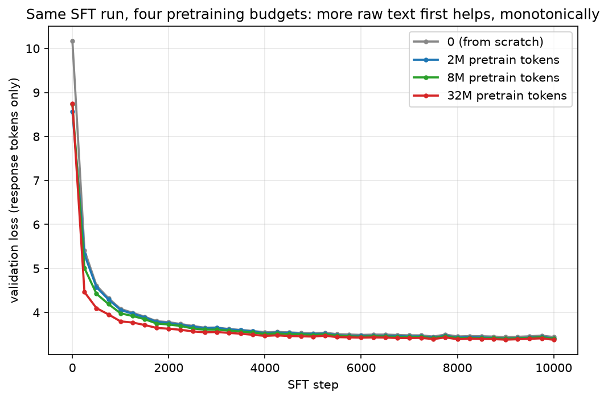

[Part 1](/posts/distillation/) trained a student purely on 1.68M tokens of (prompt, response) pairs, with no raw-text pretraining stage at all, and found the predictable result: both models learned the *shape* of a good answer — numbered lists, code fences, essay openers — almost immediately, and invented plausible-sounding nonsense words ("Radies," "Sadies," "the Right Tolk of Health") in place of real content. The post's own "What's next" named the obvious follow-up: give the student a raw-text pretraining stage first, and see how much it takes before that problem starts closing.

## The setup

Same architecture as Part 1's winning "tiny" config (4 layers, dim 128), same response-distillation recipe, same masked cross-entropy loss on the same teacher-generated Q&A pairs. This is the stage more commonly called **SFT — supervised fine-tuning** — the general name for "train a model on labelled input/output pairs with ordinary cross-entropy," of which response-level distillation on a teacher's answers is one specific case. I use "the SFT stage" throughout this post to mean exactly what Part 1 called response distillation, to keep the two stages (raw-text pretraining, then SFT) clearly labelled. Two things had to change to make the comparison fair.

**One tokenizer for both corpora.** Part 1's 8,192-token BPE was trained only on the narrow Q&A text. Pretraining needs a tokenizer that also compresses ordinary encyclopedic prose well, so I trained one 16,384-token BPE on the pretraining corpus and the Q&A corpus combined, and retokenised everything — including a fresh from-scratch baseline, since Part 1's exact numbers use an incompatible vocabulary.

**A raw-text corpus.** [WikiText-103](https://huggingface.co/datasets/Salesforce/wikitext) — general-domain Wikipedia prose, well short of MiniGPT's own pretraining scale, cleaned of the `@-@`/`@,@`/`@.@` artifacts its original tokenise-then-detokenise pipeline leaves behind (otherwise the model would dutifully learn to write "top @-@ down" instead of "top-down").

I pretrained the same tiny architecture on three raw-text budgets — 2M, 8M, and 32M tokens — then ran the identical Part 1 response-distillation stage on each, warm-started from the pretrained checkpoint instead of a random initialisation.


*Seven runs, all fast: pretraining maxes out at under 5 minutes even at 32M tokens, and every SFT run is under 23 minutes.*

## Pretraining alone

None of these pretraining runs get close to fluent — even 32M tokens is only about 11 tokens per parameter for this 2.8M-parameter model, still short of Chinchilla's ~20-token-per-parameter compute-optimal target, before the SFT stage adds its own 1.7M tokens on top.


*Perplexity 1,114 → 406 → 161 across the three budgets. Real progress, nowhere near a fluent language model.*

## What pretraining did for the SFT stage


*All four runs use the identical SFT recipe on identical data. The only difference is what the weights looked like before SFT started.*

| Pretraining budget | Best SFT validation loss | Perplexity |
|---|---|---|
| 0 (from scratch) | 3.4408 | 31.21 |
| 2M tokens | 3.4119 | 30.32 |
| 8M tokens | 3.4011 | 30.00 |
| 32M tokens | **3.3791** | **29.34** |

Monotonic, small, and real: more raw pretraining before response distillation reliably produces a better-scoring student, at every budget tested, with no sign of the trend reversing. That is a cleaner result than either Part 1 result — no overfitting collapse, no ambiguous crossover, just a straight line pointing the direction you'd hope.

## What actually changed

The perplexity gap is modest. What changed underneath it is not.

**From scratch:** *"Education has had profound impacts on global life and numerous impact on the global economy... **Economic Benefits**: The economic indicators and economic activity. Companies with a high risk of economic activity, including the risk of a population of economic activity..."*

**2M pretrain tokens:** *"...Here's a breakdown of how you can use this information: ### Step 1: Define Your **Veget** Audience... you can take to different tasks or to make tasks more efficient and efficient."* — followed by a fenced code block opening with `import binsic chocolate`

**8M pretrain tokens:** *"...a small, **sispy** bag, like a coffee shop... **Spirural** and Social Impact: The global economy has led to widespread job opportunities..."*

**32M pretrain tokens:** *"...Cultural events, primarily driven by technological advancements and the potential to protect human rights... **Economic Downturning**: The first update of the coronavirus pandemic, including the virus and the spread of malicious deaths..."*

Every condition still fails to answer the question, still drifts topic, still repeats itself. But look at the words themselves. From scratch, 2M, and 8M tokens of pretraining all invent morphologically-plausible non-words — "Veget," "binsic," "sispy," "Spirural" — the exact fingerprint Part 1 flagged as the tell of shape without a real model of the language underneath. At 32M tokens, that fingerprint is almost gone: "Economic Downturning" is an invented *compound*, not an invented *word* — every syllable in it is real English. The model has stopped hallucinating vocabulary and started, however incoherently, assembling real vocabulary badly.

## What I took from it

- **The prediction from Part 1 held, in a more specific way than expected.** I expected pretraining to help fluency generally. I did not specifically predict that the improvement would show up first as *real words replacing invented ones*, before it shows up as coherent sentences. Vocabulary grounding and compositional coherence are apparently separable, and the cheaper one arrives first.
- **A monotonic result is its own finding.** Three budgets, three improvements, in order, with the metric and the qualitative read agreeing. That is worth stating plainly precisely because Part 1's own comparison (bigger vs. tiny) was not monotonic — more capacity made things worse past a point. Pretraining budget, in this experiment, did not.
- **32M tokens is still not enough, and that is consistent, not a failure.** [TinyStories](https://arxiv.org/abs/2305.07759)-scale fluency needed several hundred million tokens for a narrow children's-story register; WikiText's general-domain prose is a harder target, so needing more than 32M tokens to close the gap is exactly what the original risk estimate implied, not a surprise.
- **The real lesson is procedural.** Response-level distillation is not a rival to pretraining, and this experiment's own numbers show why: every unit of pretraining compute made the downstream SFT result better, with no cost. There is no version of this pipeline where skipping pretraining is the right call if pretraining compute is available at all.

## Try it yourself

The code is in [github.com/Haddley/distillation](https://github.com/Haddley/distillation) under `part2/`:

```bash
python pull_pretrain_corpus.py
python train_tokenizer.py --vocab-size 16384
python tokenize_pretrain.py
python tokenize_qa.py
python pretrain.py --tag pre32m --iters 1953
python finetune.py --tag sft_pre32m --init-from runs/ckpt_pre32m.safetensors --iters 10000
python generate.py --tag sft_pre32m --n 8
```

Requires Apple Silicon for MLX.

## References

- [WikiText-103 — Merity et al., 2016](https://arxiv.org/abs/1609.07843)
- [TinyStories — Eldan & Li, 2023](https://arxiv.org/abs/2305.07759)
- [Training Compute-Optimal Large Language Models (Chinchilla) — Hoffmann et al., 2022](https://arxiv.org/abs/2203.15556)
- [Distillation Part 1](/posts/distillation/)
- [MiniGPT series](/posts/minigpt/)
