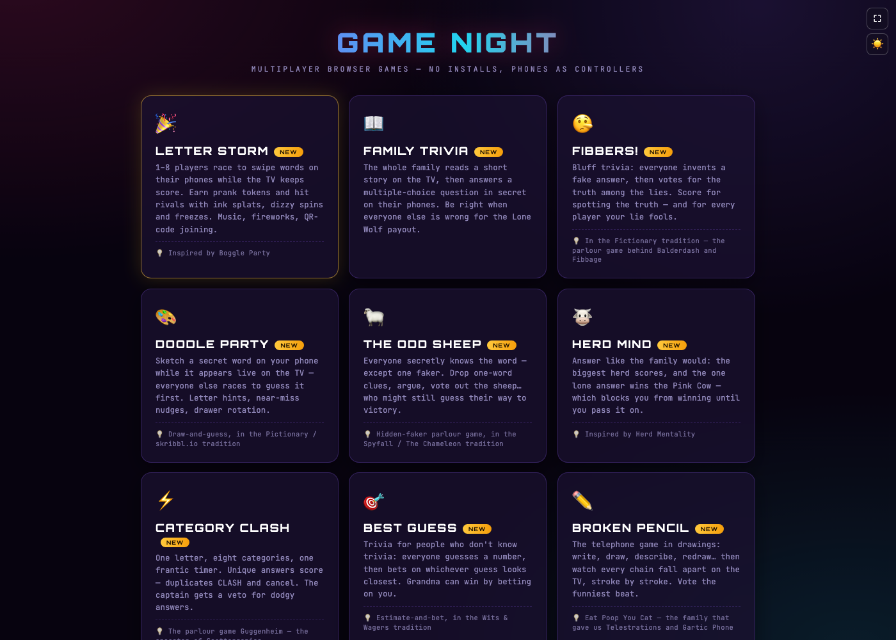
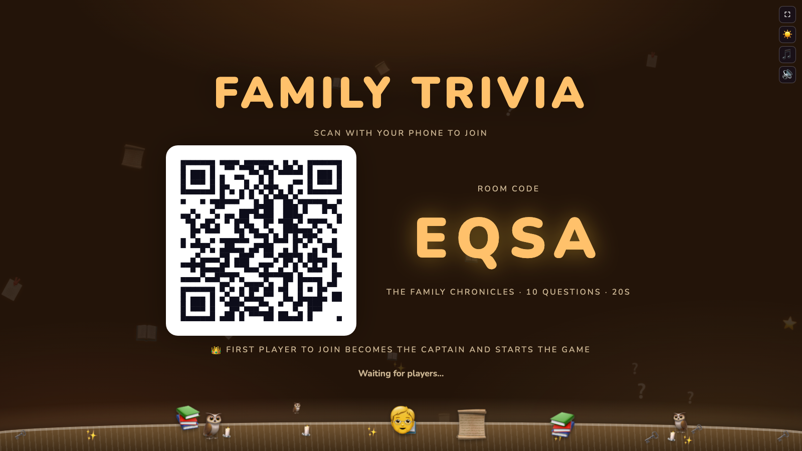
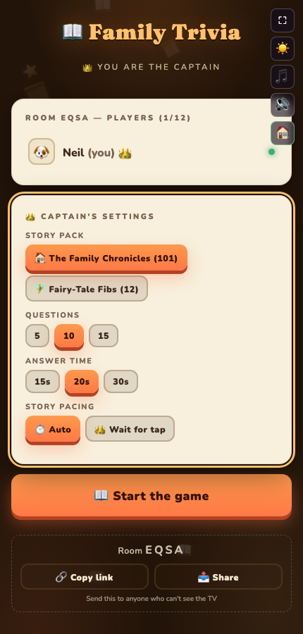

My family is spread across several countries, and the games we grew up playing together — the parlour games, the trivia nights, the card games — don't really have a good home online. Most multiplayer options are either an app everyone has to install, a subscription, or something built for strangers matchmaking rather than a family trying to have the same game night together. And "together" is rarely just one room or one time zone — a real game night is more likely two of us looking at a TV in one house, three more gathered around a laptop in a second house in another country, and — true story — someone else joining solo on his phone while waiting for a bus, all in the same online room at once. I wanted something that worked exactly the same way regardless of how those clusters shake out: open a link, scan a QR code or type a 4-letter code, and play — no accounts, no downloads, nothing to explain to a grandparent over the phone.

That's why I built [haddley.github.io/games](https://haddley.github.io/games/) — a family of multiplayer party games (trivia, bluffing, drawing, an auction, a board game, and more) as pure static HTML with no backend at all. I should be upfront that "I built" is doing some heavy lifting: a large share of the actual code was written with Claude Code, and the project has doubled as deliberate practice for me at the skills that come with that — describing intent clearly enough that an AI agent builds the right thing, reviewing and steering an agentic session rather than typing every line myself, and the more conversational, "vibe coding" style of iterating on a feature by describing what's wrong with it rather than diffing the code by hand. Nineteen games is a lot of surface area to get that practice on. One browser hosts and holds the game; every other browser joins it — but how each of those two things happens turns out to be far more flexible than "scan a QR code" alone. Two people at a cafe can play entirely on their phones with no TV involved at all — one hosts, the other types in the 4-letter code. A living room can do it the more usual way, with a TV creating the room and everyone scanning its QR code off the big screen. Someone who can't see that screen can instead be sent a plain link and open it on their laptop, landing in the exact same room. Someone dictating the room code down an actual phone call is typing the same 4 letters everyone else scanned. And a game doesn't have to start on a TV to end up on one — I can host on my phone with three of us already playing, then bring a TV into the room afterward purely as a scoreboard, joining the room my phone already created rather than creating a second one of its own. The same room can easily mix both: the two phones in front of the TV sharing the same wifi, and the cluster in the second house reaching in over the open internet, all at once — which turns out to matter a lot for how each of those connections actually gets made. That's [Part 2](/posts/gamenight2/). From the state layer's point of view, covered in this post, it makes no difference at all: same code, same rules, same single source of truth, regardless of which players are on the same LAN and which are halfway around the world.


*The launcher grid at haddley.github.io/games — 19 games, each a self-contained HTML file*

I'm writing this series to explain the parts of that project I think are genuinely interesting: how state stays in sync with no server, how two devices actually find each other across the internet, why I added a spoken auctioneer to one game (and why one browser can never hear him), and how I'm measuring and driving traffic to the site. This first post is about state.

## One browser holds the truth, everyone else is a terminal

There's no database and no server process anywhere in this project. Every game follows the same pattern: whichever browser creates the room registers a [PeerJS](https://peerjs.com/) peer ID and holds a single global object — I call it `H` — as the entire authoritative state of the game. Every other device that connects, whether it's a phone or a TV acting as a big-screen viewer, holds **no game logic whatsoever**. It sends inputs (a tap, a vote, an answer) and renders whatever the host's last message told it to render.

That single decision is what makes the rest of the architecture simple. There's no conflict resolution, no "whose update wins," no eventual consistency to reason about — because there's only ever one place state can change.

## Two roles, decided by the first message

When a device connects to the host, the host doesn't know yet whether it's a player's phone or a TV asking to be a spectator. It waits for the first message to say so:

```javascript
function setupGuestConn(conn) {
    conn.on('open', () => { conn._role = null; });

    conn.on('data', msg => {
        if (conn._role === null && msg.type === 'join_viewer') {
            conn._role = 'viewer';
            viewerConns[conn.peer] = conn;
            send(conn, viewerSnapshot());
            return;
        }
        if (conn._role === null) {
            conn._role = 'player';
            guestConns[conn.peer] = conn;
        }
        const player = H.players.find(p => p.id === conn.peer);
        if (typeof notePresence === 'function') notePresence(player);
        switch (msg.type) {
            case 'join': {
                const zombie = typeof claimSeat === 'function'
                    ? claimSeat(H.players, msg, conn.peer, guestConns, H.phase === 'lobby')
                    : H.players.find(p => msg.cid && p.cid === msg.cid && p.id !== conn.peer);
                if (zombie) hostRekeyPlayer(zombie, conn.peer);
                else hostAddPlayer(conn.peer, name, msg.avatar);
                // ...
                break;
            }
            case 'answer': { /* ... */ break; }
            case 'ctl':    { /* ... */ break; }
        }
    });
}
```
*(trimmed from `familytrivia.html` — the pattern is identical across every party game)*

`{type: 'join', name}` from a phone makes it a player, tracked in `guestConns{}`. `{type: 'join_viewer'}` from a TV makes it a spectator, tracked in `viewerConns{}` with its own message shapes. Everything downstream — rendering, scoring, whose turn it is — reads off that one distinction.

This is exactly the distinction the landing screen asks a TV to make, and it's the bit that matters for a game night split across two houses. There are two buttons under "TV / Big Screen," and they do genuinely different things:

```javascript
// 📺 Host the party on this screen — CREATES the room; this browser becomes the host
onclick="hostOnTV()"

// 📺 Open TV screen — JOINS an existing room by code, as a viewer; sends { type: 'join_viewer' }
onclick="joinAsViewer(fVCode)"
```

Only one screen across the whole family can ever be "Host the party on this screen" for a given game — that's the one browser that creates the room and holds `H`, say the TV in the first house. The second house's laptop isn't hosting anything: it types in that same room code and taps "Open TV screen" instead, which joins as a viewer exactly like a TV normally would, just from somewhere else entirely. Both houses get a synced, full-screen scoreboard; only one of them is actually running the game.

On the rendering side, every game is a `render()` function that switches on a single UI-state string and rebuilds the screen from scratch:

```javascript
function render() {
    const app = $id('app');
    let html = '';
    switch (ui) {
        case 'home':       html = renderHome(); break;
        case 'lobby_h':     html = renderLobbyH(); break;
        case 'story':       html = renderStory(); break;
        case 'question':    html = renderQuestion(); break;
        case 'reveal':      html = renderReveal(); break;
        case 'podium':      html = renderPodium(); break;
        case 'viewer':      html = renderViewer(); break;
        default:            html = renderHome();
    }
    if (typeof setHTML === 'function') setHTML(app, html); else app.innerHTML = html;
}
```

Because `render()` only ever reads `H` and never cares where a change came from, several games can drive that same `H`/`render()` pair entirely without a network at all. Going, Going, GONE! has a `?mode=tvsimulation&players=4&rounds=2&lots=2` attract mode that sets `roomCode = 'DEMO'`, clears `guestConns`/`viewerConns`, and drives bots straight into `H` — no `hostPeer`, no PeerJS, nothing WebRTC about it whatsoever. It exists so an idle TV has something worth watching before real players show up, but it's also a nice confirmation that the state and rendering layer genuinely doesn't know or care whether its inputs came over the wire or from a loop of fake bidders — which is exactly how I generated a couple of this series' own screenshots, [in Part 3](/posts/gamenight3/).

No component tree, no diffing library — just string-built `innerHTML` from whatever state last arrived. High-frequency updates like a countdown timer patch a DOM node by id instead of going through this, so an in-progress touch interaction never gets yanked out from under a finger.


*The TV becomes the room's single source of truth the moment it creates a room — a QR code and a 4-letter code are all a phone needs to join*

## Hosting is a role, not a kind of device

I've been saying "the TV" as shorthand for the host, and it's worth checking that shorthand against the actual code, because it isn't quite true. Nothing in the project ever asks what kind of device it's running on. "Host the party on this screen" and "Host on this phone" are just two button handlers, both available on every browser that opens the page — an actual television, a laptop propped on a shelf, or a literal phone can tap either one:

```javascript
function hostGame(name) {
    // ...
    makeRoom(() => {
        hostAddPlayer(myId, myName, myAvatar);   // the host adds ITSELF as a player
        ui = 'lobby_h';
        render();
    });
}

function hostOnTV() {
    // ...
    makeRoom(() => {
        isTvHost = true;                          // the host does NOT add itself as a player
        document.body.classList.add('viewer-mode');
        tvHostSync();
        render();
    });
}
```

Both create exactly the same kind of room over exactly the same PeerJS plumbing. The only difference between them is one boolean, `isTvHost`, set purely by which button a human tapped — not by screen size, not by user agent, not by anything the browser can actually tell about its own hardware. A laptop that taps "Host the party on this screen" becomes `isTvHost` just as completely as a real television would; a television's browser could tap "Host on this phone" instead and nothing would stop it, though it'd be an odd choice, since that mode expects the host to also play, and a TV can't hold itself up to answer a question.

So Part 1's earlier claim about state still holds — whichever browser hosts really does hold `H` for everyone else — but the device it happens to be running on isn't architecturally special. What `isTvHost` actually encodes is narrower than "is this a TV": whether the host expects to be personally operated mid-game (`hostGame` — the host adds itself to `H.players` and plays like anyone else) or whether it's purely a shared display nobody's going to reach out and tap (`hostOnTV` — the host never becomes a player at all). A television on a shelf is the obvious device for the second mode. It just isn't the only one that can run it, and "host on this phone" isn't restricted to phones either.

That distinction — not "it's a TV," but "this host isn't going to be personally operated" — is what actually creates the need for a captain. Something has to be allowed to press Start, change the settings, or advance to the next round on a display nobody's touching, and it can't be "whoever taps first" or two phones would race each other. The first phone to join an `isTvHost` room is handed the crown, and only its `{type: 'ctl', action}` messages are accepted as commands:

```javascript
// common.js — only meaningful when isTvHost; a phone-hosted room
// routes captain-gated actions through its own local shortcut instead
function capPlayer() { return isTvHost ? (connectedPlayers()[0] || H.players[0] || null) : null; }
```

Notice what that deliberately avoids saying: plain `H.players[0]`. It's the first *connected* player, falling back to `H.players[0]` only when nobody's connected at all — and that distinction is the reason the crown has to be reassignable in the first place. A phone locks itself after a few idle seconds. It gets pocketed. A kid wanders off holding it. None of that is unusual for a phone at a family game night, and if the captain rule were a fixed `H.players[0]`, whichever phone happened to be first in the list at that moment would freeze the entire room the instant it went to sleep — nobody else would be allowed to press Start or Next, because nobody else holds the crown.

So the crown moves to the next connected player automatically the moment the captain drops, and comes straight back the instant the original captain reconnects — their seat is preserved by the same zombie-rejoin logic covered above, so they land back at index 0 and reclaim it without anyone doing anything:

```javascript
// familytrivia.html — re-sync just the two phones whose status changed, plus the host display;
// never a full broadcast, which would interrupt everyone else mid-interaction
function capSync(prevId) {
    if (!isTvHost || H.phase === 'lobby') return;
    const nowId = capPlayer()?.id || null;
    if (nowId === prevId) return;
    [prevId, nowId].forEach(id => {
        const p = id && H.players.find(x => x.id === id);
        const c = p && guestConns[p.id];
        if (c) send(c, phaseSnapshotFor(p));
    });
    broadcastLobby0();
}
```

**This is worth being precise about a second time, because it's easy to conflate two different questions: the captain is a *privilege*, not the host.** Reassigning the crown answers "who can drive the room right now" — a completely different question from "can the room survive something happening to the host itself." And that second question has two very different answers depending on what actually happened.

A host that's still running but loses its network for a few seconds — wifi blips, someone trips over a router — is fine. `H` lives in that browser's memory, completely untouched by the network dropping; only the connections layered on top of it are affected. The host's own peer reconnects itself to the signaling broker the moment the network returns:

```javascript
// p2p.js — the PeerJS broker drops a peer's socket now and then; this puts it back
p.on('disconnected', () => { try { if (p && !p.destroyed) p.reconnect(); } catch (_) {} });
```

and every guest whose own connection was actually severed is already retrying on its own schedule — the same auto-rejoin from Part 2 — landing back in their exact seat in `H` the moment both ends are reachable again, because `p.reconnect()` puts the *same* peer id back online rather than minting a new room. Worst case, if the outage outlasts a guest's retry budget and they see an error, they just type the same room code back in by hand; the room's still there, because the browser holding it never actually went anywhere.

What genuinely can't be recovered is the host's browser *process* going away — the tab closing, a reload, a crash, the device losing power. That's not a networking failure at all; it's `H` itself ceasing to exist, because it only ever lived in that one browser's memory with nothing backing it up anywhere else. Deliberately so — the project could have a returning host quietly re-create an empty room on the same code, but that would just be lying to everyone still connected about whether their game survived, so it doesn't try. In practice the risk was never "don't let the host's wifi drop" — that's handled — it's "don't reload or close the tab that's actually hosting." Every phone, captain included, can come and go freely. The one browser genuinely holding the game can't disappear.

## A player IS their peer id — and that's the trap

Here's the thing that actually broke a real game night, mine. A PeerJS connection's `peer` id is a fresh random string every time a browser opens a connection — including after a page refresh. The host has to treat a refreshed phone as "the same player coming back," not a new one, which means matching a rejoining `join` message to an existing seat and rewriting that seat's id everywhere it's stored:

```javascript
function hostRekeyPlayer(player, newId) {
    const old = player.id;
    if (!old || old === newId) return;
    player.id = newId;
    if (typeof rekeyPlayerId === 'function') {
        rekeyPlayerId(H, old, newId, {
            scalars: ['turn'],
            arrays: ['turnOrder', 'order', 'finishOrder'],
            whoObjs: ['card', 'choice', 'finale'],
            idObjs: ['moved'],
        });
    }
    // ...plus every id-keyed field a specific game's mini-games use
}
```

I hit the bug this exists to fix while actually playing Plump Trek, my board game. I was captain, it was my turn, and I refreshed the page. I rejoined fine, the crown even passed to another player and back to me — but my phone never showed the Roll button again. Nothing errored. It took a while to work out why: `me.myTurn` was computed as `H.turn === p.id`, and `H.turn` still held my *old* peer id. My new id was correctly in `H.players`, just nowhere else the game had ever stored a copy of the old one. The host was patiently waiting for a roll from a peer id that no longer existed, forever.

The fix generalises: **rewrite every stored reference in one place**, not just the obvious one (`H.players`). A unit test in the project now greps each game's source for any field that gets assigned a player id and fails the build if `hostRekeyPlayer` doesn't mention it — so the next time I add a field like this, I can't forget the rekey.

That test is one of a handful I think of as *audits* rather than ordinary unit tests: instead of exercising one game's logic with fixed inputs, `unit/presence.test.js` reads the actual source of every single game and fails if any of them drifted from the shared connection rules — hand-rolling their own version of something `common.js` already provides, or storing a player id somewhere the rekey function doesn't know about. Running that one file against the whole project found three separate games with a stranded-id bug like the one above, which six earlier hand-fixes elsewhere had missed. It's a cheap, mechanical way to ask "does every game actually follow the pattern I think they all follow" instead of trusting that they do.

## A closed tab sends no signal at all

The other assumption I had to unlearn: `conn.on('close')` — the event you'd reach for to detect a player leaving — **does not fire when someone just closes the tab.** I measured it directly: a phone closed mid-turn in Plump Trek, watched for 75 seconds, zero close events. A dead battery, a force-quit, or a tab closed by hand all just go quiet; there's no FIN on a WebRTC data channel the way there is on a TCP connection. Anything checking "is this player still here?" by looking at whether their connection object still exists in `guestConns` will confidently answer yes about a phone that's face-down on a table three feet away, powered off.

The fix is a heartbeat plus a pessimistic timeout: every phone says "still here" every 4 seconds (`startHeartbeat`), the host stamps `seen` on *any* inbound message — not just the heartbeat — and after roughly 13 seconds of silence a player is treated as absent, skipped rather than waited on. It costs one timeout the first time it happens per player, rather than every single turn, which is what made a four-player game with one dropped phone unplayable before the fix — the room was paying a 70-second wait every single lap.


*A phone's own view of a room it just joined — rendered entirely from whatever the host's last message contained*

Proving that fix actually works turned out to need a different kind of test than the ones I'd been writing. My first instinct was an end-to-end test that opens a page with Playwright, closes the browser context, and checks the host notices — and it passed even against the *buggy* code, which should have been a red flag rather than a relief. The reason is exactly the gap this section is about: closing a Playwright context tears the connection down gracefully, so `conn.on('close')` genuinely fires — the one signal a real phone dying never sends, and precisely the shortcut the buggy code was quietly relying on. The fix for the test was to stop simulating a closed tab and instead simulate silence: leave the page open, stop its heartbeat by hand, and let the host's own timeout do the work, the same way it would for a phone that's face-down on a table. `tests/connection-battery.e2e.spec.js` now asks every one of the nineteen games the same five questions over real rooms — join, restart, go silent, come back, no ghosts — which is what caught Liar's Dice sending heartbeats it never actually recorded anywhere.

That's the shape of the whole state layer: one object, one place it can change, and a growing pile of hard-won rules — most of them found by an audit test or a deliberately-too-honest end-to-end test rather than by noticing manually — about what "still connected" and "still the same player" actually mean over WebRTC. [Part 2](/posts/gamenight2/) covers the layer underneath it — how two devices on different networks actually find a path to each other, and the little icon that tells you which kind of path they are using.
