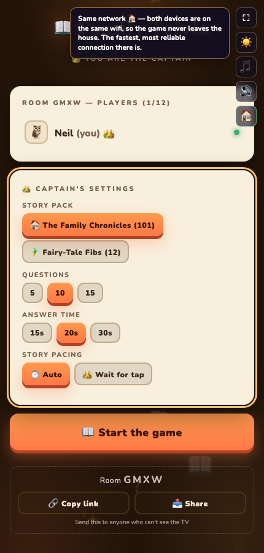

[Part 1](/posts/gamenight1/) covered how the games in [haddley.github.io/games](https://haddley.github.io/games/) keep state in sync once two devices are talking to each other over WebRTC. This post is about the step before that: how a phone on 4G and a TV on home wifi actually find a path to each other at all, with no server of mine ever sitting in the middle of the game data.

## Three kinds of path, in order

WebRTC doesn't pick one connection strategy — it gathers several kinds of candidate address for each device and races them. Whichever pair wins tells you which mechanism actually got the two devices talking:

| Path | What it means | Badge |
|---|---|---|
| **host** | Both devices are on the same wifi/LAN and talk directly — no server involved at all | 🏠 |
| **server-reflexive (STUN)** | A STUN server told each device its public address; the two NATs then hole-punched straight to each other. Traffic is still direct, just over the internet | 🌐 |
| **relay (TURN)** | No direct path existed — usually a symmetric or restrictive NAT (mobile carriers, corporate wifi) — so a TURN server forwards every packet both ways | 📡 |

The important thing I got wrong before I understood this properly: **TURN is the fallback, not the normal path.** Two phones on separate home broadband connections almost always land on 🌐 — STUN alone gets them talking directly. The relay only kicks in for the genuinely awkward cases, and it's the only one of the three that costs anything, because every byte of game data is doubling back through a server instead of going device-to-device.

## The ICE config every `new Peer()` call uses

PeerJS's default configuration is STUN-only, which is exactly the gap that leaves remote players unable to connect at all when they're behind a restrictive NAT. I added a TURN relay from [Metered](https://www.metered.ca/) as a fallback, configured once and shared by every game:

```javascript
const ICE_CFG = { config: { iceServers: [
    { urls: 'stun:stun.relay.metered.ca:80' },
    { urls: 'turn:standard.relay.metered.ca:80',                username: '<username>', credential: '<credential>' },
    { urls: 'turn:standard.relay.metered.ca:80?transport=tcp',  username: '<username>', credential: '<credential>' },
    { urls: 'turn:standard.relay.metered.ca:443',                username: '<username>', credential: '<credential>' },
    { urls: 'turns:standard.relay.metered.ca:443?transport=tcp', username: '<username>', credential: '<credential>' },
] } };
```

Every game passes this to every `new Peer(...)` call — host and guest alike — so a stray game that forgets it silently loses remote players with no error message, just a spinner that never resolves. The `:443` and `turns:` TLS entries matter specifically for devices on HTTPS-only networks (some corporate and hotel wifi block everything except port 443), so at least one of the five candidates gets through whatever firewall is in the way.

The credentials here are genuinely public — visible to anyone who opens dev tools on any game page — which is fine for a free, non-commercial family games site with no backend to hide a secret behind. Rotating them (if the quota's ever abused) means changing them in this one file, since it's the only place they live.

## Reading which path actually won

Knowing which candidate pair WebRTC settled on means polling the live connection's stats, because there's no single event that just tells you:

```javascript
// p2p.js — simplified
function p2pWatchRelay(conn) {
    const check = async () => {
        const pc = conn.peerConnection;
        const stats = await pc.getStats();
        // find the selected candidate pair, then map its local/remote
        // candidate types to 'local' | 'stun' | 'relay'
        // (WebKit spells the relay type 'relayed' — both are accepted)
        setNetState(pathFromStats(stats));
    };
    setInterval(check, 5000);   // ICE can re-nominate onto a different pair later
}
```

Finding "the selected pair" is more browser-dependent than it should be: `p2pWatchRelay` tries `transport.selectedCandidatePairId` first, falls back to a nominated/succeeded pair, then to any succeeded pair, and finally to the raw candidate list for older WebKit builds that don't expose a usable pair at all. A host holds one connection per player, so when there are several, the badge shows the least favourable path across all of them — if one player on a hostile network is relayed, the whole host badge shows 📡, because that's the honest answer to "is TURN quota being spent right now."

## The badge itself

The result gets surfaced directly in each game's control strip, as one of four glyphs:

```javascript
const NET_GLYPH = { relay: '📡', stun: '🌐', local: '🏠', checking: '⏳' };
const NET_TITLE = {
    relay: 'Relay in use (TURN) — no direct path was possible',
    stun: 'Direct connection across networks (STUN) — no relay needed',
    local: 'Same network — no server involved at all',
    checking: 'Racing the possible routes…',
};
function setNetState(state) {
    // ...
    b.textContent = NET_GLYPH[_netState];
    b.title = NET_TITLE[_netState] + ' — tap for details';
}
```

It only appears once you're actually in a room — there's nothing useful to say before that — and tapping it explains itself in plain English rather than leaving anyone to decode an icon:


*Tapping the badge on a phone that just joined a TV on the same test machine — "Same network 🏠"*

`?net=0` on any game's URL hides the badge for good and `?net=1` brings it back, sticky per browser — a couple of playtesters found it distracting once they trusted it, and I wanted that to be a one-tap decision rather than something I had to build a settings screen for.

## What "stuck on 📡" actually means

If a player's badge won't move off relay, it's almost always their network, not the game: a strict corporate firewall or a carrier-grade NAT on mobile data leaves no direct path for WebRTC to find. UPnP or port forwarding on *their* router can sometimes promote them to 🌐, but on mobile data there's no local fix — the relay is doing exactly the job I'm paying for. What I actually watch for is quota: Metered's free tier gives roughly 50GB of relayed traffic a month, shared across every game and every player, and a heavier game like the shared drawing canvas in Doodle Party spends more of it per minute than a text-only trivia round. If that quota is ever exhausted, TURN just stops relaying and remote players on restrictive networks fail again until it resets — the Metered dashboard is where I'd go to check, not the game's own code.

The badge is also how I test the relay path deliberately, since two browser tabs on one laptop always connect 🏠 by construction — there's no NAT between them to punch through. The end-to-end test suite forces `iceTransportPolicy: 'relay'` to throw away every non-relay candidate and confirm both ends actually light up 📡 against the real Metered servers, which doubles as a check that the credentials still work.

Getting two devices talking, and being honest on-screen about *how* they're talking, turned out to matter more for trust than I expected — "why is this laggy" has a real, visible answer now instead of a shrug. [Part 3](/posts/gamenight3/) is about a very different kind of connection: giving one of the games a spoken voice, and the one popular browser that will never hear it no matter what I do.
