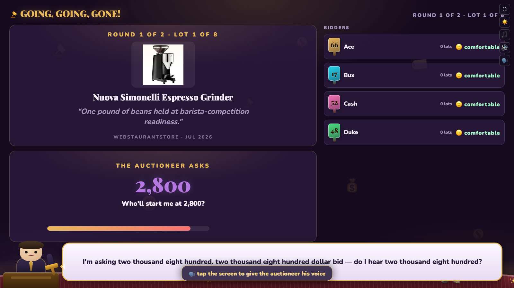
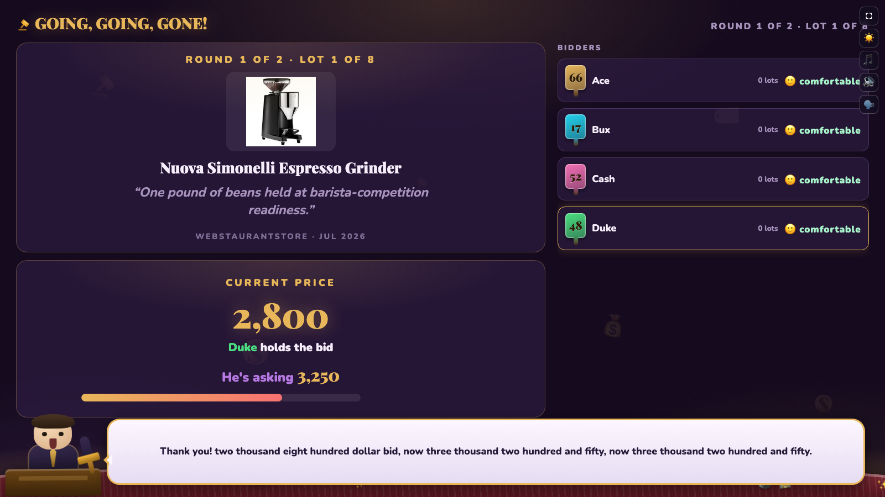

[Part 1](/posts/gamenight1/) and [Part 2](/posts/gamenight2/) covered how the games in [haddley.github.io/games](https://haddley.github.io/games/) stay in sync and stay connected. This post is about something that has nothing to do with networking: giving one game an actual spoken voice, using the browser's built-in Web Speech API — and why that voice goes completely silent on one specific, popular browser no matter what I do.

## Why an auction needed a voice at all

Going, Going, GONE! is a live auction of real, verified-price household items — the game reads out an opening ask, comes down if nobody bites, and sells to whoever holds the bid when the clock runs out. Every one of those numbers used to just sit on the TV as text. It worked, but it didn't *feel* like an auction — a real auctioneer's chant is what makes a room feel the pressure of a closing sale, and a silent countdown timer doesn't do that job.

So the auctioneer is drawn as a small CSS figure at the bottom of the TV screen, and — when a browser allows it — actually speaks his lines with `SpeechSynthesisUtterance`. Milestone commentary in the four card games (Blackjack, Go Fish, Kings Corner, I Doubt It) uses the same underlying pattern, just without the character:

```javascript
// cards.js — shared across the four card games
function canSpeak() { return voiceOn() && typeof speechSynthesis !== 'undefined'; }
function speak(text) {
    if (!canSpeak() || !text) return;
    try {
        speechSynthesis.cancel();   // a fresh line replaces whatever was still being read
        const u = new SpeechSynthesisUtterance(text);
        u.rate = 1.02;
        speechSynthesis.speak(u);
    } catch (e) {}
}
```

## The rule that nearly kept him mute forever

The first real obstacle wasn't a browser gap at all — it was iOS Safari's permission model. iOS grants a page permission to speak **exactly once, and only from inside a user gesture** like a tap. Every line the auctioneer says arrives later, from a network message the host broadcasts — which is *never* a gesture. Without doing something about that, the very first `speak()` call on an iPhone would be silently refused, and every line after it too, because the permission was never granted in the first place.

The fix is to spend a silent, inaudible utterance the moment the voice toggle is tapped — using up that one-gesture allowance immediately, on a piece of speech nobody needs to hear:

```javascript
function toggleVoice() {
    _voicePref = voiceOn() ? '0' : '1';
    localStorage.setItem('gavel-voice', _voicePref);
    syncVoiceBtn();
    if (!voiceOn()) { shutUp(); return; }
    // Speak RIGHT HERE, inside the tap. iOS Safari will only ever start speech from a
    // user gesture, and every real line arrives later from a network message — so without
    // this the toggle silently unlocked nothing and the auctioneer stayed mute for good.
    _speechPrimed = true;
    speakNow('Right then. Lots to get through.', { rate: 1.0 }, true);
}
```

A second, near-identical priming utterance runs on the very first tap anywhere on the page, in case the voice toggle was already on by default:

```javascript
function primeSpeech() {
    if (_speechPrimed || typeof speechSynthesis === 'undefined') return;
    _speechPrimed = true;
    try {
        const u = new SpeechSynthesisUtterance('auction');
        u.volume = 0;   // it must be a real utterance, but nobody need hear it
        speechSynthesis.speak(u);
    } catch (e) {}
}
```

Without either of these, the auctioneer would work perfectly in Chrome on a laptop and stay silently, permanently mute on an iPhone in the same room — with absolutely nothing in the console to explain why.

The auctioneer's lines have to come out of two different code paths — `applyMsg` on a phone and `applyViewerMsg` on the TV, since a phone and a TV render completely different screens off the same broadcast — and both of them are supposed to call `say()` on exactly the same beats. They didn't, for a while: the TV-only version shipped first, and when I later removed the role check so a phone could speak too, the toggle silently did nothing on phones, because nothing in the phone's own code path had ever been wired to call it in the first place. No error, because nothing was actually broken — a feature just wasn't there yet. `unit/goinggone.test.js` now audits the two handlers against each other directly, so the same drift can't happen silently a second time.

## Three causes, and telling them apart on screen

Even once the gesture is handled, there are still three genuinely different reasons a browser might not speak, and they all *look* identical from across the room — he goes quiet, and his mouth stops moving, because his mouth animation is driven by the utterance's own `onstart` event:

```javascript
const VOICE_REASONS = {
    blocked:  '🗣️ tap the screen to give the auctioneer his voice',
    novoices: '🗣️ this browser has no speech voices, so the auctioneer stays quiet',
    failed:   '🗣️ this browser would not play the auctioneer\'s voice',
};
```

`blocked` is the gesture problem above — a real fix is one tap away, so that banner stays up. `novoices` means the browser exposes `speechSynthesis` but has no voices installed at all — nothing a tap can fix, so it clears itself after 12 seconds instead of nagging forever. `failed` covers a voice that was available and simply refused, with a watchdog that falls back to the browser's own default voice before giving up.

The `blocked` case turned out to have a second, unrelated home besides a fresh iPhone: the game's own attract mode. `?mode=tvsimulation&players=4&rounds=2&lots=2` runs the whole auction against bots with nobody in the room, which is exactly a page nobody has ever tapped — the same permission gap a first-time visitor hits, except now it's permanent, because nobody clicks a television that's just sitting there running a demo loop. Measured directly: 14 lines handed to `speak()` during one idle run, 0 actually started, until a single tap anywhere on the screen unlocked it. It's also how I generated the two screenshots below — both are the attract mode running for real, not a staged live game:


*The banner names the actual cause rather than leaving the room to guess — this is the attract mode, gesture-gated exactly like a fresh visitor would be: "tap the screen to give the auctioneer his voice"*

## Where Amazon Silk fits in

Fire OS — the Silk browser that ships on every Fire TV — is where `novoices` actually happens in practice. The music plays perfectly, the sound effects land right on cue, because WebAudio and the Web Speech API are two entirely separate browser subsystems with two entirely separate permission gates. Silk implements one and not the other: `typeof speechSynthesis` is defined, but it reports zero installed voices, so every `speak()` call succeeds as a no-op. One working subsystem tells you nothing about the other — which is exactly the trap, because a Fire TV in the family room is a completely normal way to play these games on the big screen.

The game stays fully playable with the auctioneer mute. Every line he "says" is also shown as on-screen text, and his speech bubble carries the same words a caption would:


*A bid landing — the price, who holds it, and his next ask are all on screen regardless of whether anything was actually spoken*

His mouth still moves even with no voice at all, timed off the same syllable plan a real utterance would have used, so a silent Fire TV doesn't show a character frozen mid-sentence under a caption — `mimeLine()` runs the same animation the real `onstart` handler would have triggered, just on a timer instead of real audio events.

I did try to give Silk a real voice — a bank of pre-recorded word clips stitched together at runtime, since Fire OS obviously *can* play audio. I abandoned it: concatenated single words don't sound like a sentence no matter how good the source voice is, and the better the individual recording, the more obvious the seams between words become. It's parked, not solved.

## The same browser, a second unrelated gap

Fire OS's incomplete emoji font shows up completely separately, in the ambient decorations that drift along the bottom of the TV screen — a glyph the font doesn't have renders as an empty box rather than failing safely. The fix measures each candidate glyph against a codepoint no font can possibly have, and only uses ones that actually draw:

```javascript
const _emojiSeen = {};
function emojiOK(ch) {
    if (ch in _emojiSeen) return _emojiSeen[ch];
    let ok = true;
    try {
        const c = document.createElement('canvas').getContext('2d');
        c.font = '32px sans-serif';
        ok = Math.abs(c.measureText(ch).width - c.measureText('￿').width) > 0.5;
    } catch (e) { /* no canvas: assume the font is fine rather than blank the scene */ }
    _emojiSeen[ch] = ok;
    return ok;
}
const emojiPick = (...opts) => opts.find(emojiOK) || opts[opts.length - 1];
```

Two unrelated gaps in the same browser, and the same underlying lesson both times: detect the actual capability at runtime rather than guessing from a user-agent string, and always leave the experience *legible* rather than broken when the answer is no — captions when there's no voice, an older emoji when the newest one is tofu, never a blank box or a character frozen mid-word.

[Part 4](/posts/gamenight4/) moves from what happens once someone's playing to how people find the site in the first place — the analytics wired into every page, and a small, deliberately capped Google Ads experiment now running to see if it moves the needle at all.
