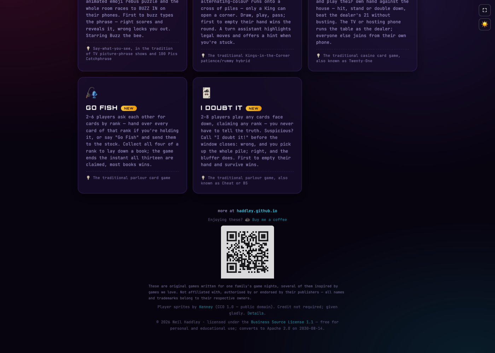

The first three parts of this series covered how [haddley.github.io/games](https://haddley.github.io/games/) keeps state in sync, how devices connect, and how one game learned to speak. This last post is about a completely different question: with no backend and no accounts, how do I know whether anyone's actually playing — and whether it's worth spending anything to get more people to try it?

## Ten lines, one file, every page

The entire GA4 install is about ten lines inside `common.js`, the one script every game and the launcher itself already load. Because it lives in the shared file rather than pasted into 20 separate `<head>` tags, every page reports in automatically the moment it loads `common.js` — there's no per-game step to remember when I add a new one:

```javascript
if (typeof document !== 'undefined' && typeof window !== 'undefined') (function () {
    const GA_ID = 'G-63L52W2YE5';
    window.dataLayer = window.dataLayer || [];
    function gtag() { dataLayer.push(arguments); }
    window.gtag = gtag;
    gtag('js', new Date());
    gtag('config', GA_ID);
    const s = document.createElement('script');
    s.async = true;
    s.src = 'https://www.googletagmanager.com/gtag/js?id=' + GA_ID;
    document.head.appendChild(s);
})();
```

That base install is free: a `page_view` per game and GA4's own `user_engagement` events, which the reporting UI turns into "average engagement time" per page. That alone answers "which games get opened" and "how long do people stay" — but a page view only proves a game was *opened*, not that anyone actually played it.

## Two events, fired from one place, for nineteen games

The honest "was this actually tried" signal comes from two custom events, and the trick was finding the one place in the codebase every game's connection lifecycle already passes through, so I didn't have to wire anything per-game:

```javascript
function trackEvent(name, params) {
    if (typeof gtag !== 'function') return;   // ad blockers strip the script often enough
    gtag('event', name, params || {});         // that every call site would need this guard anyway
}
function gameSlug() {
    if (typeof location === 'undefined') return '';
    return (location.pathname.split('/').pop() || 'index').replace(/\.html$/, '') || 'index';
}
```

`room_created` fires once a host's room genuinely registers with the PeerJS broker:

```javascript
p.on('open', id => {
    if (!tracked && typeof trackEvent === 'function') {
        tracked = true;   // 'open' can refire after a broker reconnect — count the room once
        trackEvent('room_created', { game: typeof gameSlug === 'function' ? gameSlug() : '' });
    }
    if (o.onOpen) o.onOpen(id);
});
```

`room_joined` fires when a guest's connection opens — but **only the first time**:

```javascript
hc.on('open', () => {
    // a mid-game auto-rejoin (everLive already true) is recovering an existing
    // attempt, not a new one — firing here too would inflate the count every
    // time someone's phone hiccups and reconnects itself
    if (!everLive && typeof trackEvent === 'function') {
        trackEvent('room_joined', { game: typeof gameSlug === 'function' ? gameSlug() : '' });
    }
    live = true; everLive = true;
});
```

Both events sit inside `p2p.js`, so all 19 games get them for free just by going through `hostPeer`/`joinPeer` the way [Part 1](/posts/gamenight1/) described. Both carry `{ game: gameSlug() }`, so a shared file can label the event without knowing which game called it — GA4 attaches "Page title"/"Page path" to every event automatically too, so breaking the numbers down by game in Explore needs no custom dimension registration.

## `bmc_click`, and deliberately not `purchase`

There's a Buy Me a Coffee link in the footer of every game, and I track clicks on it as `bmc_click`, labelled by source (`link`, `qr`, or `qr_scan`) so I can see which one people actually use:


*The footer on the launcher page — the Buy Me a Coffee link and its QR code, each tracked separately*

GA4 ships a default suggested `purchase` Key Event on every property, and I deliberately never touched it. `purchase` implies a completed transaction with a currency, a value, a transaction id — and a static site with no callback from Buy Me a Coffee can only ever observe the click, never whether someone actually made a donation. Naming that event `purchase` would make the dashboard show what looks like real revenue data that isn't there. `bmc_click` is the honest version: a measure of intent, not payment. The real number lives on the Buy Me a Coffee dashboard, not in GA4.

The QR scan needed its own tiny redirect page, `bmc.html`, because a phone camera reads a QR code's encoded URL and opens it directly — it never touches the page the image is sitting on, so no `onclick` handler on that page can ever fire for an actual scan, only for someone tapping the rendered image on their own screen. So the QR code's payload isn't the Buy Me a Coffee URL directly; it's `bmc.html`, which fires `trackEvent('bmc_click', {source: 'qr_scan'})` and then does `location.replace(...)` on to Buy Me a Coffee — `.replace`, not `.href`, so the redirect hop never sits in the phone's browser history.

`room_created`, `room_joined` and `bmc_click` are all marked as GA4 Key Events now (Admin → Events → Recent events → star) — the first two answer "was this game actually tried" as opposed to a bounce, and the third is worth tracking as a signal of intent even though it isn't a completed donation.

## A small, capped Google Ads experiment

With those Key Events in place, there was finally something for Google Ads to import a conversion from — so I set up a genuinely live campaign, not just the evaluation I'd originally planned. It's deliberately tiny:

| Setting | Value |
|---|---|
| Campaign | Search - Game Night (Search network only — no Display) |
| Budget | **$1.00/day** |
| Bid strategy | Maximize clicks, max CPC capped at $0.10 |
| Ad group | Free Party Games, max CPC $0.01 |
| Targeting | United Kingdom, Australia, United States, New Zealand |
| Started | 2026-08-13 |

Five keywords, phrase- and broad-matched:

- `free multiplayer party games online`
- `games to play with family over video call`
- `online party games for family game night`
- `no download multiplayer games phone`
- `"game night"` (phrase match)

And a short account-level negative-keyword list, because a search for `download`, `apk`, `jobs`, or `buy` has nothing to do with a free browser game — and `casino real money` specifically exists because the card games (Blackjack, Go Fish, I Doubt It) would otherwise pull in real-money-gambling search intent that bounces the instant it lands on a game with no wagering in it at all.

The ad itself is a responsive search ad with eight headline variants and three descriptions, all leaning on what's actually true and different about the site rather than generic copy — no app, no sign-up, play in-browser via a QR code, works across any network. Callout extensions add "Family-Friendly," "No App Required," "Play In Browser," "No Downloads," "No Sign-Up Needed" and "100% Free" underneath the ad on the search results page.

The plan going in was to hold off on Ads entirely — this is a free, non-commercial site with no purchase funnel beyond a voluntary coffee link, so there's no revenue to recoup spend against, and cheaper levers (direct sharing, posting in family-game communities, basic SEO) don't cost anything at all. A dollar a day with a ten-cent cap per click is about as far from an ongoing ad spend as a live campaign can get — it's closer to a controlled experiment than marketing, and I'm watching GA4's Realtime report for `room_created` events carrying a `google`/`cpc` source before I'd ever consider raising the budget.

That's the whole series: one object holding the truth on a host device, a badge that tells you honestly how two devices found each other, a voice that fails gracefully when a browser can't provide one, and just enough measurement to know whether any of it is reaching someone I haven't personally handed a QR code to. The code for all of it is in the open at [github.com/Haddley](https://github.com/Haddley) — [haddley.github.io/games](https://haddley.github.io/games/) is where it actually runs.
