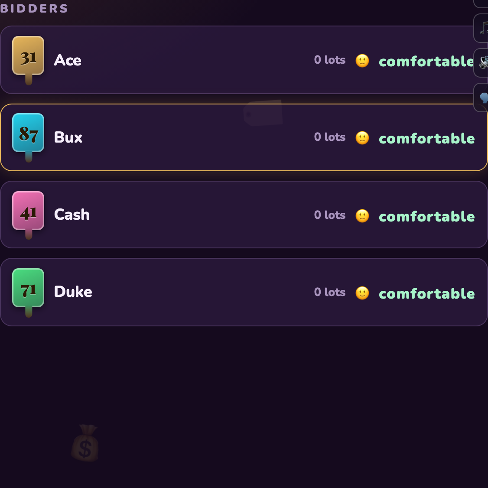

The first four parts of this series covered how [haddley.github.io/games](https://haddley.github.io/games/) keeps state in sync, connects two devices, gives one game a voice, and gets found. This last post is about something underneath all of it: how do you test any of that, when the whole point of the project is that there's no server, no build step, and no modules to import?

Every game is one self-contained HTML file with an inline `<script>`. There's nothing to `require()`. The state, the connection, the UI — it's all just global variables in a page that only makes sense once a real browser has loaded it and a real peer has connected to it. None of the usual advice ("just import the function and test it") applies. 286 tests run in about six seconds with no browser at all, and a separate suite drives real browsers over real PeerJS connections — and getting both of those to work meant a few genuinely unusual techniques.


*Going, Going, GONE!'s bidder rail — the exact live state a 3-minute end-to-end test records a transcript against, further down this post*

## Testing code that was never meant to be imported

With no modules, the only way to unit-test a game's logic is to slice the relevant block straight out of the HTML text and evaluate it, handing in stubs for whatever it expects from the DOM or the network:

```javascript
// unit/gofish.test.js
const HTML = fs.readFileSync(path.join(ROOT, 'gofish.html'), 'utf8');
const SRC = (() => {
    const a = HTML.indexOf("const PFX = 'GOFISH-';");
    const b = HTML.indexOf('// MESSAGES / DISPLAY', a);
    return HTML.slice(a, b);
})();

function makeEngine() {
    const capPlayer = () => H.players[0] || null;   // stand in for the real one
    const broadcast = () => {};                       // no-op — read H directly afterward
    const fn = new Function('capPlayer', 'broadcast',
        CARDS_JS + '\n' + SRC + '\nreturn { H, hostAsk, advanceTurn, layBooks, /* … */ };');
    return fn(capPlayer, broadcast);
}
```

Each test gets a fresh engine, seeds `H.players` by hand, and asserts against the resulting state — genuinely fast, genuinely isolated, with zero browser involved. It's what caught a real regression: a Go Fish hand could reach exactly zero cards as a *side effect* of completing a book mid-turn — not just at a fresh turn — which used to leave `H.turnIdx` pointing at a player with no legal move and every rank chip disabled. Nothing to click, room frozen. The fix (auto-refill from the stock the instant a hand empties mid-turn) has its own test now:

```javascript
test('hostAsk (hit): completing a book down to an empty hand auto-draws so the SAME turn can continue', () => {
    const E = makeEngine();
    E.H.players = [
        { id: 'a', hand: [c(7,'S'), c(7,'C'), c(7,'D')], books: [] },   // all three 7s
        { id: 'b', hand: [c(7,'H'), c(2,'C')], books: [] },
    ];
    E.H.turnIdx = 0; E.H.stock = [c(9, 'D')];
    E.hostAsk('a', 'b', 7);
    assert.equal(E.H.players[0].hand.length, 1, 'her empty hand was auto-refilled from the stock');
});
```

## Audits: tests that read the whole repo, not one game

[Part 1](/posts/gamenight1/) already covered the audit that catches a stranded player id — a test that reads *every game's* source and fails if one stores an id somewhere its rekey function doesn't know about. There's a second kind of audit that's just as sharp, for a completely different failure: **common.js and a game's inline script share one global lexical scope.** A top-level `const`/`let`/`class` name that exists in both is a SyntaxError — not a warning, a SyntaxError — and a SyntaxError takes the *entire* inline script down with it. Blank page, no QR, nothing.

That happened for real: adding an emoji-font helper called `castOf` to common.js instantly blanked Plump Trek, which already had its own `castOf`. `unit/common-names.test.js` statically parses every shared file and every game's inline script for top-level declarations, and cross-checks them — while carefully *not* flagging the legal case, where a shared file's `function` gets deliberately redeclared later (the later one just wins, which is how letterstorm and liarsdice override `common.js`'s `toggleFullscreen` on purpose):

```javascript
// only const/let/class collisions are fatal — function redeclaration is legal (later wins)
const LEXICAL = /^(?:const|let|class)\s+([A-Za-z_$][\w$]*)/gm;
const FUNCTIONS = /^(?:function|var)\s+([A-Za-z_$][\w$]*)/gm;

test('no shared file declares a top-level CONST that a game it loads also declares', () => {
    // … reads every .html file, extracts its inline <script>, and cross-references
    // top-level names against every shared file it actually loads
});
```

The last test in that file doesn't test the games at all — it tests the *audit itself*, feeding it a known collision and a known-safe function-scoped shadow, and asserting it catches one and ignores the other. As the file's own comment puts it: a test that cannot fail is worse than no test.

## Real network vs. driven directly, and knowing which one you need

[Part 2](/posts/gamenight2/) covered the 🏠/🌐/📡 badge and mentioned `relay.e2e.spec.js` forcing a real TURN connection to prove the credentials still work. There's a second test for the same badge that deliberately *doesn't* touch the network, because the condition it's checking — a host juggling several guests on different paths at once — can't be provoked reliably on a laptop:

```javascript
// tests/smoke.e2e.spec.js — can't provoke a real relay on localhost, so drive it directly
await page.evaluate(() => setNetState('relay'));
await expect(page.locator('#btn-relay')).toHaveText('📡');
await page.locator('#btn-relay').click();
await expect(page.locator('#relay-note')).toContainText('Relay in use');
```

`relay.e2e.spec.js` earns its keep on the claim that same badge test can't reach: a real host with *two* real guests, one forced through the TURN relay and one landing direct, proving the badge reports the **worst** path across all its connections rather than just the last one it happened to check:

```javascript
// guest A forced through TURN, guest B lands direct — both real, both over PeerJS
await expect(guestA.locator('#btn-relay')).toHaveText('📡', { timeout: 20_000 });
await expect(guestB.locator('#btn-relay')).toHaveText('🏠', { timeout: 20_000 });
// each guest's own badge reflects only its own connection — proving paths are
// tracked per-connection — while the host, holding both, reports the worse of the two
await expect(host.locator('#btn-relay')).toHaveText('📡', { timeout: 20_000 });
```

Two tools, two different jobs: drive the state directly for anything that's cheap to fake and expensive to provoke for real; reach for the real network when the thing under test is *whether the real network actually does what you think it does*.

## A phone that's actually gone, and a host that's actually gone

Killing a connection the way a sleeping phone or a wifi blip actually does turns out to be a one-liner, once you know what a real drop looks like from the inside:

```javascript
// tests/reconnect.e2e.spec.js
const dropLink = page => page.evaluate(() => hostConn.close());
```

That single line drives three real scenarios: a dropped phone rejoins itself and keeps its seat; a full browser refresh mid-game walks straight back into the room, no re-typing the code; and when the captain's own phone drops, the crown passes to the next connected player and comes back the moment they return — exactly the mechanism [Part 1](/posts/gamenight1/) walks through in code. These are proof the claims there actually hold, not just that the code compiles.

What's *not* recoverable — the one thing Part 1 calls out as the genuine single point of failure — also has its own test, and it asks a sharper question than "does the room survive": does a guest trying to join a room whose host is **truly gone** fail honestly and quickly, or hang on a spinner forever?

```javascript
// tests/relay.e2e.spec.js
await host.close();   // the host device is not silent — it is gone
// … a guest tries to join the same room code …
await expect(guest.locator('#app')).toContainText(`Could not reach room "${code}"`, { timeout: 60_000 });
await expect(guest.locator('#app')).not.toContainText(/connecting/i);
```

It has to be the latter — `joinPeer`'s first-join budget is only 3 attempts at 700ms apart — and the test exists specifically to prove a dead room resolves into an honest error rather than a spinner nobody can tell is futile.

One process discipline worth calling out here: the peer-heavy specs run with `retries: 1`, and the project is explicit that this was earned, not assumed — the failing run was checked in isolation first (3/3 clean on its own) and only ever failed when queued behind two other specs that had just hammered the same public PeerJS broker with fresh rooms. Reaching for a retry to paper over a flaky test hides a real bug just as often as it hides a real fluke; this one only got the retry after ruling out the first possibility.

## Simulating hardware you don't own

[Part 3](/posts/gamenight3/) covers Fire OS's incomplete emoji font — the one that boxes a feather emoji while the music plays fine. Testing that doesn't require owning a Fire TV: it requires convincing a normal Chromium instance that its own font is missing glyphs it actually has, by intercepting the exact browser API the real detector calls:

```javascript
// tests/smoke.e2e.spec.js
const MISSING = ['🪙', '🪶', '🫠', '🫥', '🧐'];
await page.addInitScript(missing => {
    const proto = CanvasRenderingContext2D.prototype, real = proto.measureText;
    proto.measureText = function (t) {
        return real.call(this, missing.includes(t) ? '￿' : t);   // pretend it's tofu
    };
}, MISSING);
await page.goto('/goinggone.html?mode=tvsimulation&players=3&rounds=1&lots=2');

const icons = await page.evaluate(() => ({ ...ICON }));
for (const [name, ch] of Object.entries(icons)) {
    expect(MISSING).not.toContain(ch);   // every risky glyph got swapped for one the font has
}
```

It checks the substitution happened *and* that none of the five glyphs ever reach the actual page text — then loads the same page with the font intact and confirms nothing gets substituted when there's nothing to work around. One test, no Fire TV required, and it exercises the detector from [Part 3](/posts/gamenight3/) exactly the way a real incomplete font would.

## Testing whether it's actually fun

Every test so far asks "is this correct." `goinggone-auction.e2e.spec.js` asks a much harder question of Going, Going, GONE!'s auctioneer: is he any *fun* — which for an auction means one thing, timing. It plays three players through three real rounds over real PeerJS, and instead of asserting against the constants that are supposed to govern his pacing, it wraps the two functions that actually drive it and records a transcript of what the room genuinely experienced:

```javascript
// openWindow() is the single place a decision window ever starts — a unit test
// enforces that — so wrapping it captures the whole schedule, beat by beat
const realOpen = openWindow;
window.openWindow = ms => {
    window.__beats.push({ t: Date.now(), ms, kind: /* open | drop | bid | soften | close */ });
    return realOpen(ms);
};
const realSay = say;
window.say = (text, opts) => { window.__said.push({ t: Date.now(), text }); return realSay(text, opts); };
```

Everything downstream is judged against that transcript, not against a hardcoded number. A lot nobody bids on has to be the **fastest** thing in the whole game, not the slowest — it used to take 38 seconds and the test now fails above 32. Every unanswered ask has to come down *quicker* than the one before it, never slower — that impatience is the entire feeling the fishing phase is built from. A bid has to buy back the *longest* window on the board, every single time. And my favourite assertion in the whole project: he is never allowed to say "going once" and then keep dropping his price — a fair-warning line is a promise, and every one of them has to land strictly after the last time he actually came down, or the room learns the word means nothing.

```javascript
// He said "going once" — this must never be followed by another price drop on this lot
for (const w of warnings) {
    expect(w.t).toBeGreaterThanOrEqual(lastSoften);
}
```

The whole transcript gets written out to a JSON file afterward, deliberately, "so a human can read what the room actually heard" — the same instinct behind `bingo.e2e.spec.js`'s numbered screenshot tour (`bingo-01-home.png` through `bingo-10-phone-results.png`), which exists as much for a person to eyeball as for an assertion to check. And the test is honest about its own cost: it takes about three minutes, and the comment says plainly why it isn't shortened — the windows *are* the subject, so speeding it up would test a different, faster, less honest version of the auction than the one anybody actually plays.

That's the whole series: a host holding the only copy of the truth, a badge that's honest about how two devices found each other, a voice that degrades gracefully when a browser can't provide one, just enough measurement to know if any of it reached someone I didn't hand a QR code to myself — and, underneath all four, a test suite that had to invent its own techniques for a project that never gave it a module system, a server, or a second device to fall back on. The code for all of it is in the open at [github.com/Haddley](https://github.com/Haddley) — [haddley.github.io/games](https://haddley.github.io/games/) is where it actually runs.
