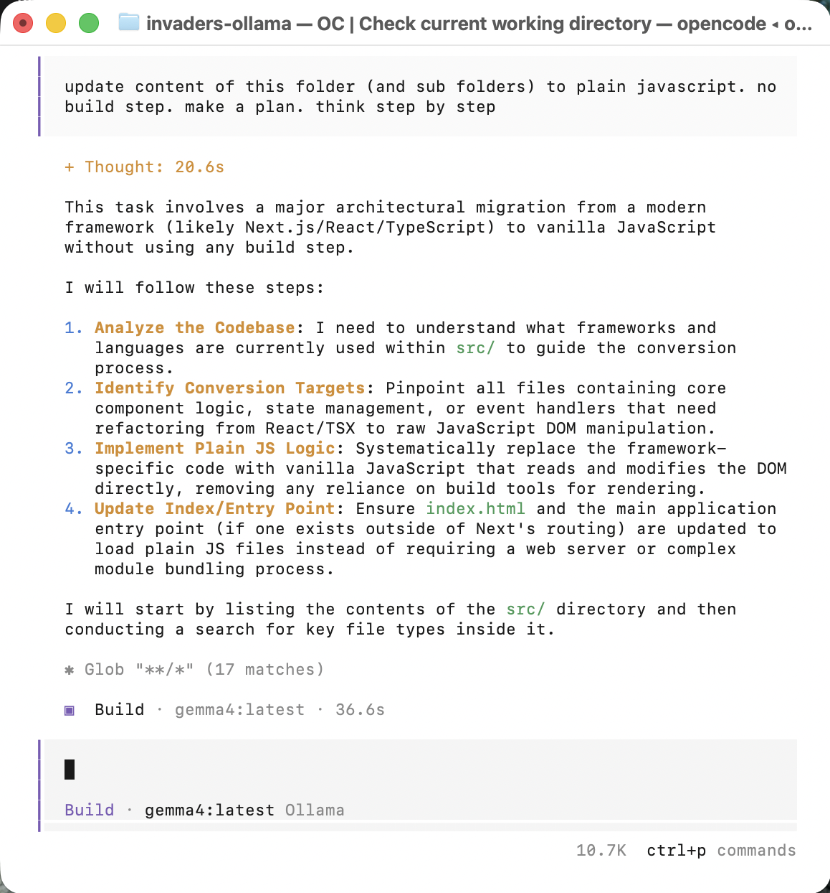

I wanted to investigate OpenCode — an open source AI coding agent that works with any model. To give it a real test I decided to build a Space Invaders clone, and then run the same prompt three time: once with OpenCode Big Pickle, once with OpenCode and a Local model via Ollama and once with Claude Code Sonnet 4.6 

OpenCode is open source and installs with a single command:

```bash
curl -fsSL https://opencode.ai/install | bash
```


*I installed OpenCode, upgrading from 1.3.0 to 1.17.8*

## Run 1 — OpenCode Big Pickle

I navigated to the invaders project directory and launched OpenCode.

In the context of the OpenCode AI terminal tool, "Big Pickle" (specifically opencode/big-pickle) is a free, experimental coding model. It is typically a GLM-4.6 or DeepSeek-based variant offered directly by OpenCode with an impressive 200,000-token context window and zero usage costs.


*I ran `opencode` in the invaders project folder*

I had already written a PRD and PDD for the game, so I gave OpenCode a single prompt pointing at those documents.

```PROMPT
Build invaders game see PRD.md and PDD.md
```


*OpenCode read both documents and started the Build task using the Big Pickle model*


*OpenCode created all the source files — constants, sprites, audio, input, entities, and the engine*

After the files were created, I opened the game in a browser and nothing appeared. I told OpenCode the game wasn't working.


*OpenCode spun up a local HTTP server to serve the ES modules and immediately spotted a 404 — the game loop was never reaching the START state*


*OpenCode diagnosed the issue: `this.lastTime` was initialised to `0`, causing a huge delta on the first frame that broke the game loop. It changed it to `performance.now()`*


*The game was running — all three alien types, four shields, the player cannon, score and lives tracking*

The game worked end-to-end, but I noticed the UFO sound kept playing after the saucer flew off screen. I reported the bug.


*OpenCode added a check to call `audio.stopUFO()` before dead UFO entities were filtered from the array*


*OpenCode confirmed the fix: "Now when a UFO exits the screen, `audio.stopUFO()` is called before it's filtered out from entities"*

The game is playable at [/invaders-bigpickle/index.html](/invaders-bigpickle/index.html).

## Run 2 — OpenCode Local model via Ollama

I pulled a local coding model to try the same prompt without a cloud API.

```bash
ollama launch opencode
```


*The Ollama model (gemma:latest) responded to the prompt with a multi-step migration plan — it never wrote a single file*


The game is playable at [/invaders-ollama/index.html](/invaders-ollama/index.html).


## Run 3 — Claude Code Sonnet 4.6


*I launched Claude Code v2.1.183 (Sonnet 4.6) in the invaders-claude folder — it read the PRD and PDD and immediately started planning the build*

*I restarted with a clean prompt: "build invaders game see PRD.md and PDD.md. fresh start."*

*Claude Code announced the plan — constants, entities, then engine — and asked permission to create the directory structure*

*Claude Code wrote sprites.js, defining all the pixel-art alien and player sprites as ASCII string arrays*

*Claude Code wrote engine.js — the game loop, state machine, collision detection, score and wave management*

*Claude Code asked permission to create index.html, showing the canvas element and the script tag loading engine.js*

*Claude Code refined the march tempo in audio.js — the interval now scales dynamically with the number of remaining aliens*


*I played a round — the formation thinned to about 34 aliens, the shields took damage, and the score reached 260*


*Claude Code listed everything it had built, then spotted the UFO audio bug: the saucer sound didn't stop when it left the screen*

*Claude Code fixed it: `audio.stopUFO()` now fires as soon as the UFO exits the screen, before the dead-entity filter removes it from the array*


The game is playable at [/invaders-claude/index.html](/invaders-claude/index.html).


## What I learned


## References

- [OpenCode](https://opencode.ai) — open source AI coding agent
- [OpenCode GitHub](https://github.com/sst/opencode) — source and documentation
- [Ollama](https://ollama.com) — run large language models locally
- [qwen2.5-coder:7b](https://ollama.com/library/qwen2.5-coder) — the local model used in Run 2
- [Web Audio API — MDN](https://developer.mozilla.org/en-US/docs/Web/API/Web_Audio_API) — used for all synthesized audio
- [Space Invaders — Wikipedia](https://en.wikipedia.org/wiki/Space_Invaders) — the 1978 Taito original
