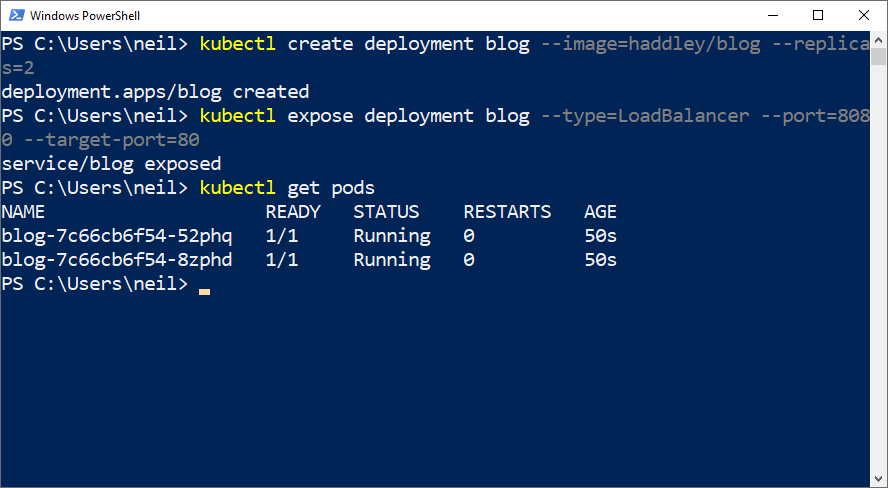
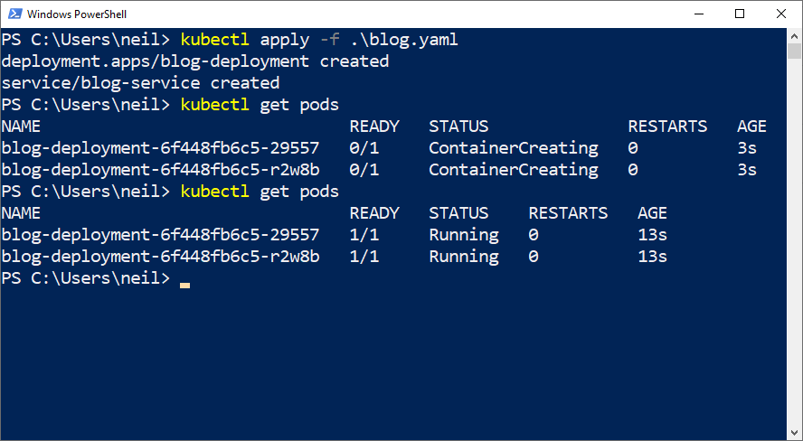
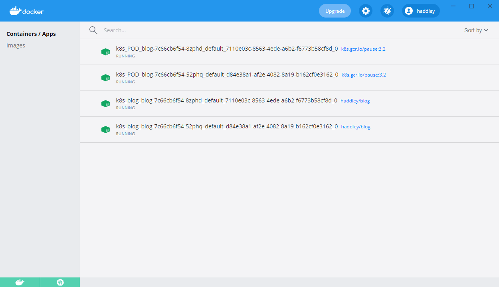
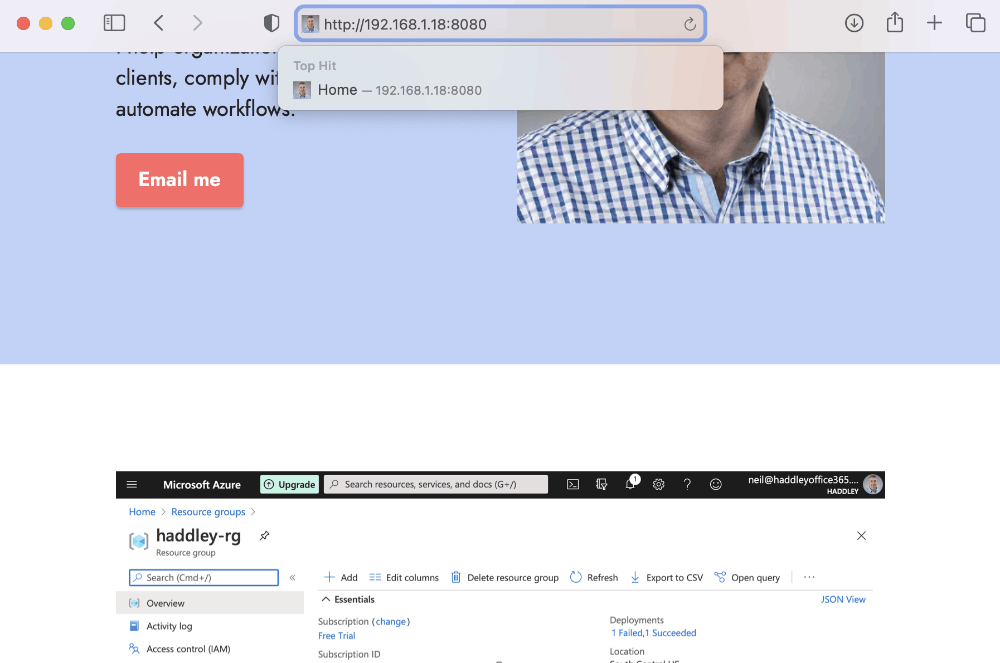

Docker Desktop includes Kubernetes.

I deployed the haddley/blog container image using these commands:

```bash
$ kubectl create deployment blog --image=haddley/blog --replicas=2

$ kubectl expose deployment blog --type=LoadBalancer --port=8080 --target-port=80
```

Or I created a file called blog.yaml and used this command:

```bash
$ kubectl apply -f .\blog.yaml
```

I adjusted the Kubernetes cluster by editing the yaml file below and "applying" the yaml file again.

I accessed one of the blog web servers by navigating to:

http://<ip address of the computer running Docker Desktop>:8080


*I used the "kubectl create deployment" and "kubectl expose deployment" commands*


*I used the "kubectl apply" command to apply a yaml file*


*I ran the Docker image in two Kubernetes pods.*


*I accessed the cluster using port 8080*


## blog.yaml

```yaml
apiVersion: apps/v1
kind: Deployment
metadata:
  name: blog-deployment
  labels:
    app: blog
spec:
  replicas: 2
  selector:
    matchLabels:
      app: blog
  template:
    metadata:
      labels:
        app: blog
    spec:
      containers:
      - name: blog
        image: haddley/blog
        resources:
          limits:
            memory: 512Mi
            cpu: "1"
          requests:
            memory: 256Mi
            cpu: "0.2"
        ports:
        - containerPort: 80
---
apiVersion: v1
kind: Service
metadata:
  name: blog-service
spec:
  selector:
    app: blog
  ports:
    - protocol: TCP
      port: 8080
      targetPort: 80
  type: LoadBalancer
```
## References

- [Kubernetes Tutorial](https://www.youtube.com/watch?v=X48VuDVv0do)
