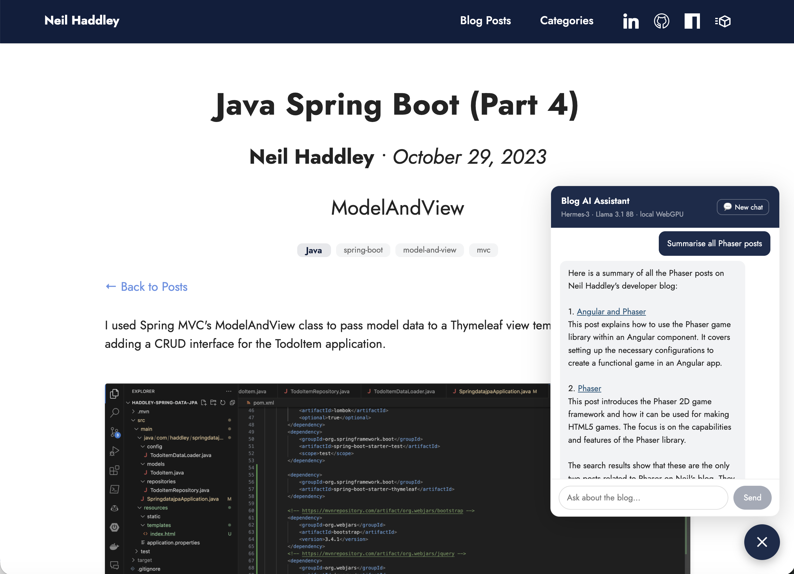

# Adding a Local AI Agent to This Blog

I’ve added a conversational AI assistant to this blog — you’ll see the chat bubble in the bottom-right corner of every page.


*The 💬 button in the bottom-right opens the assistant panel* It supports two local backends: **[WebLLM](https://github.com/mlc-ai/web-llm)**, which runs a quantized Qwen2.5 model directly in the browser via WebGPU with no installation required, and **[Ollama](https://ollama.com)**, which connects to a local Ollama server for larger, faster Qwen3.5 models. The Ollama option only appears when running the site locally — browsers block requests from public HTTPS pages to localhost for security reasons. Either way, there is no backend and no API fees.


## Model

The agent supports two backends: **WebLLM** (runs entirely in the browser via WebGPU) and **Ollama** (a local server running on native hardware). The WebLLM models are quantised to 4-bit weights and cached in the browser after the first download. WebGPU is required for WebLLM, so it works in Chrome and Edge on GPU-enabled devices.

**WebLLM models**

| Model | Download | Note |
|-------|----------|------|
| Qwen2.5-7B-Instruct-q4f16_1-MLC | ~4 GB | Best quality |
| Qwen2.5-3B-Instruct-q4f16_1-MLC | ~2 GB | Balanced |
| Qwen2.5-1.5B-Instruct-q4f16_1-MLC | ~1 GB | Fast |

**Ollama models**

| Model | Note |
|-------|------|
| qwen3.5:27b | Best quality · Ollama |
| qwen3.5:9b | Good quality · Ollama |
| qwen3.5:4b | Balanced · Ollama |
| qwen3.5:2b | Fast · Ollama |
| qwen3.5:0.8b | Fastest · Ollama |

The WebLLM 1.5B is the default — a fast browser download and a reasonable starting point. Larger models give better reasoning quality and more reliable multi-step tool use.


*The model selector when running locally — all eight models visible, WebLLM and Ollama groups, with Qwen2.5 1.5B selected as default*

## Ollama Option

As an alternative to WebLLM, the agent also supports [Ollama](https://ollama.com) — a local model server that runs on native hardware rather than in the browser. Instead of downloading a model into the browser's GPU memory, Ollama runs as a background process and exposes an OpenAI-compatible API at `http://localhost:11434`.

### Installing Ollama

I installed Ollama with Homebrew:

```bash
brew install ollama
```

Then I started the server:

```bash
ollama serve
```

And pulled a model to use with the agent:

```bash
ollama pull qwen3.5:4b
```

I started with 4B as a reasonable balance of quality and speed. All five Qwen3.5 sizes are listed in the model table above.


*Qwen3.5 4B connected — the header shows "local Ollama" and the chat input is ready*


*I asked "What AI posts are on the blog?" — Qwen3.5 4B called get_posts_by_category and returned a full list with links*

### Running locally

The Ollama option only works when the site is running locally. Chrome and Edge enforce a **Private Network Access** policy that blocks requests from public HTTPS pages (like `haddley.github.io`) to `localhost`, regardless of any CORS configuration. This is a browser security restriction with no workaround on the public URL.

To use Ollama models, run the site locally:

```bash
npm run dev
```

Then visit `http://localhost:3000`. Ollama's default origins allow `localhost`, so no extra configuration is needed.

### WebLLM vs Ollama

| | WebLLM | Ollama |
|---|---|---|
| **Setup** | None — loads in the browser | Install Ollama, pull a model, run site locally |
| **Browser support** | Chrome / Edge with WebGPU | Any browser |
| **Model sizes** | Up to 7B (browser VRAM limits) | Up to 27B (Qwen3.5) |
| **Inference speed** | Depends on GPU via WebGPU | Native — generally faster |
| **Works for visitors** | Yes | No — only visible when running the site locally |
| **Model storage** | Browser cache (per device) | Local disk, shared across apps |

WebLLM is better for visitors to the public site — it just works with no software to install. Ollama is better when running the site locally or if you already have it set up, giving access to larger, faster models without the browser download.

## Why Quantization?

Running a language model in the browser means working within tight constraints: limited GPU VRAM, no server to offload to, and a download that has to complete before the first response. Quantization is what makes this feasible.

A standard Qwen2.5-7B model in 16-bit precision weighs around 14 GB. Most consumer GPUs don't have that much VRAM, and browsers impose their own caps on top of that. The quantized version — 4-bit weights — brings it down to ~4 GB, small enough to fit in GPU memory on a mid-range device and cacheable in the browser after the first load.

| Model | FP16 (full) | q4f16_1 (quantized) |
|-------|-------------|---------------------|
| 7B | ~14 GB | ~4 GB |
| 3B | ~6 GB | ~2 GB |
| 1.5B | ~3 GB | ~1 GB |

WebLLM only supports its own pre-compiled MLC model variants — you can't load an arbitrary Hugging Face checkpoint directly. The MLC compilation step converts the model to run on WebGPU and bakes in the quantization, so the quantized format isn't optional; it's a requirement of the platform.

The quality tradeoff is minimal. At q4f16_1, benchmark scores typically drop by around 1–2% compared to full precision. For a blog assistant doing search and summarisation, the difference is unnoticeable in practice.

## Architecture

The agent is a React component (`BlogAgent.tsx`) in the Next.js layout, so it appears on every page. Tool definitions and helper functions live in `agent-tools.ts`. Post metadata is pre-built at deploy time into `agent-data.json`, which the component fetches when the panel opens.

For WebLLM, the engine is loaded from the browser using MLC:

```typescript
const { CreateMLCEngine } = await import('@mlc-ai/web-llm');
const engine = await CreateMLCEngine(
  selectedModel, // Qwen2.5 7B / 3B / 1.5B
  { initProgressCallback: ({ progress, text }) => setLoadState(...) },
);
```

For Ollama, a thin fetch wrapper is created that implements the same interface:

```typescript
const engine = {
  chat: {
    completions: {
      create: async ({ messages }) => {
        const r = await fetch('http://localhost:11434/v1/chat/completions', {
          method: 'POST',
          headers: { 'Content-Type': 'application/json' },
          body: JSON.stringify({ model: 'qwen3.5:4b', messages, stream: false }),
        });
        return r.json();
      },
    },
  },
  interruptGenerate: () => { controller?.abort(); },
};
```

Both engines expose the same `engine.chat.completions.create()` interface, so the agent loop works identically regardless of backend.


*The Blog AI Assistant panel opened for the first time, loading the model from the browser cache*

The agent has six tools:

| Tool | What it does |
|------|-------------|
| `search_posts` | Keyword search across titles, descriptions, and tags |
| `get_posts_by_category` | All posts in a named category (up to 10) |
| `list_categories` | All categories ranked by post count |
| `get_post_content` | Full content of a specific post — only when the user asks for a summary or details |
| `navigate_to_post` | Push the browser to a post via the Next.js router |
| `web_search` | Live web search via Jina AI — last resort for topics not covered by the blog |


*I asked "Any Java related posts?" and the agent called get_posts_by_category*


*The agent returned links to all six Java Spring Boot posts*


*I followed up asking the difference between Java and JavaScript — the agent used web_search*


*The agent answered using the web search results*

## The Agent Loop

Each conversation turn is a list of messages. The user sends a message; the model replies either with text (finished) or with a `tool_calls` response naming a function to run. The tool result is appended as a `role: 'tool'` message, and the model is called again. This repeats until the model stops calling tools and produces a text answer.

Because WebLLM's native tools API only supports a fixed set of Hermes models, I implemented function calling via prompt engineering. Tool definitions are injected into a system message as JSON inside `<tools>` tags. When the model needs to call a tool it outputs a `<tool_call>` block; the component parses that, executes the tool, and feeds the result back as a `<tool_response>` user message. The loop repeats until the model produces a plain-text answer with no tool calls.


*On a post page I asked the agent to summarise — it called get_post_content with the current slug*


*The agent summarised the post content*


*I clicked "Summarise all Phaser posts" from a Java post page and the agent searched and returned summaries of each one*

## Model Quality

Smaller models trade reasoning quality for speed. I ran the same query — "Any Java related posts?" — against the 1.5B and 3B models to see the difference.

The **1.5B** called two tools back-to-back (`search_posts` then `get_posts_by_category`), then called `get_posts_by_category` twice more on the same arguments. The duplicate-call guard skipped those, the loop exhausted its round limit, and the nudge response came back empty — the agent failed to answer.

```
round 0 — search_posts {"query": "Java"}           ✓
round 1 — get_posts_by_category {"category": "Java"} (already had the data)
round 2 — get_posts_by_category {"category": "Java"} → skipping duplicate
round 3 — get_posts_by_category {"category": "Java"} → skipping duplicate
loop exhausted — final nudge → (empty)
```

The **3B** called `search_posts` once and produced a formatted answer on the very next round:

```
round 0 — search_posts {"query": "Java related"}   ✓
round 1 — text: "Here are the Java related posts: …"
```

The 3B handles multi-step tool use reliably. The 1.5B is the default — smaller and faster to load — but may struggle on follow-up questions.

## References

- [WebLLM — In-browser LLM inference with WebGPU](https://github.com/mlc-ai/web-llm)
- [MLC AI — Machine Learning Compilation](https://mlc.ai)
- [Ollama](https://ollama.com)
- [Qwen3.5 on Ollama](https://ollama.com/library/qwen3.5)
- [Qwen2.5-7B-Instruct on Hugging Face](https://huggingface.co/Qwen/Qwen2.5-7B-Instruct)
- [Qwen2.5-3B-Instruct on Hugging Face](https://huggingface.co/Qwen/Qwen2.5-3B-Instruct)
- [Qwen2.5-1.5B-Instruct on Hugging Face](https://huggingface.co/Qwen/Qwen2.5-1.5B-Instruct)
- [WebGPU API — MDN Web Docs](https://developer.mozilla.org/en-US/docs/Web/API/WebGPU_API)
- [Private Network Access — Chrome for Developers](https://developer.chrome.com/blog/private-network-access-update)
