# Adding a Local AI Agent to This Blog

I've added a conversational AI assistant to this blog — the 💬 button in the bottom-right corner of every page. It runs entirely locally with no backend and no API fees, using one of two model backends: **WebLLM** (in-browser, no setup) or **Ollama** (local server, larger models).

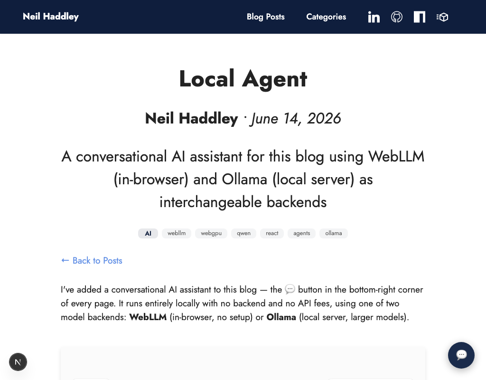
*The chat button appears on every page — click it to open the assistant panel*

## Choosing a Backend

| | WebLLM | Ollama |
|---|---|---|
| **Setup** | None — loads in the browser | Install Ollama, pull a model, run the site locally |
| **Browser support** | Chrome / Edge with WebGPU | Any browser |
| **Model sizes** | Up to 7B (browser VRAM limits) | Up to 27B (Qwen3.5) |
| **Inference speed** | Depends on GPU via WebGPU | Native — generally faster |
| **Works for visitors** | Yes | No — only visible when running the site locally |
| **Model storage** | Browser cache (per device) | Local disk, shared across apps |

WebLLM is the right choice for anyone visiting the public site — it just works. Ollama is better for local development, giving access to larger, faster models without the browser download.

## WebLLM

WebLLM runs a quantized Qwen2.5 model directly in the browser using WebGPU. The model is downloaded once and cached — subsequent loads are instant. WebGPU is required, so it works in Chrome and Edge on GPU-enabled devices.

Three model sizes are available, all quantized to 4-bit weights:

| Model | Download | Note |
|-------|----------|------|
| Qwen2.5-7B-Instruct-q4f16_1-MLC | ~4 GB | Best quality · WebLLM |
| Qwen2.5-3B-Instruct-q4f16_1-MLC | ~2 GB | Balanced · WebLLM |
| Qwen2.5-1.5B-Instruct-q4f16_1-MLC | ~1 GB | Fast · WebLLM |

The 1.5B is the default — a fast first download and a reasonable starting point. Larger models give better reasoning and more reliable multi-step tool use.

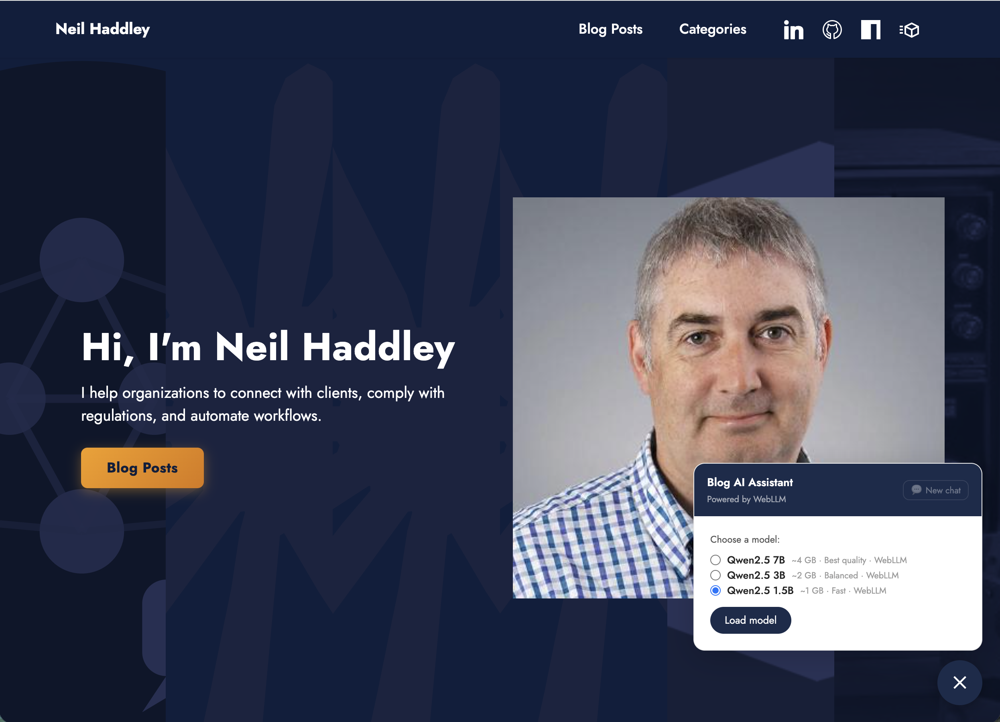
*The model selector on the public site — only the three WebLLM options appear, since using Ollama requires the site to be hosted on localhost*

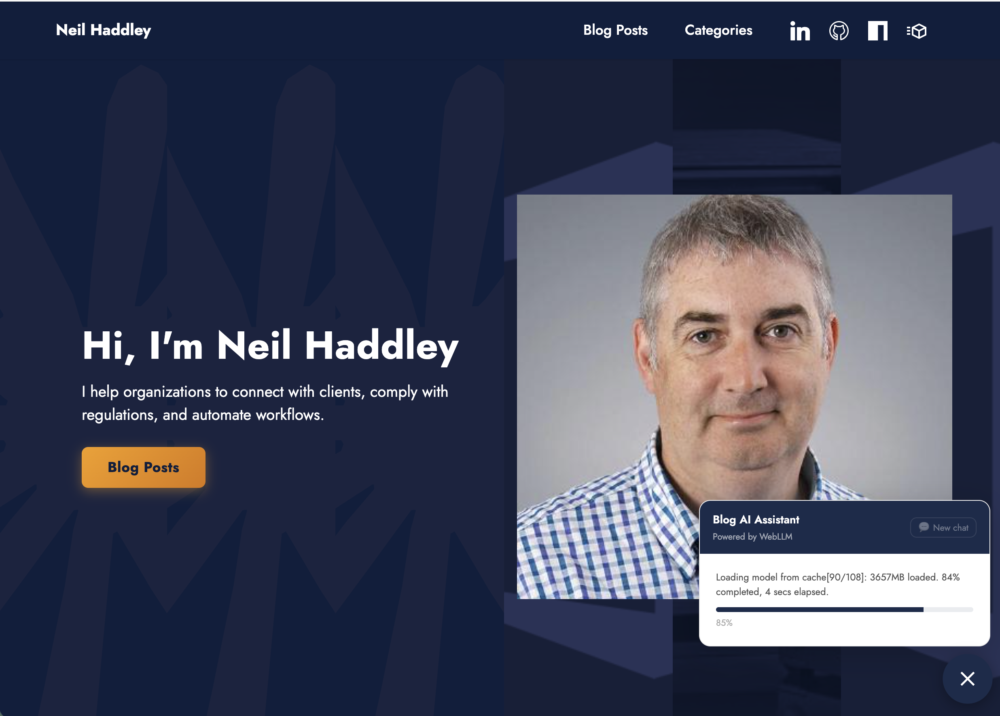
*Loading the model for the first time — progress bar fills as the weights download to the browser cache*

### Why Quantization?

A standard Qwen2.5-7B model in 16-bit precision weighs around 14 GB. Most consumer GPUs don't have that much VRAM, and browsers impose their own caps on top of that. 4-bit quantization brings it down to a manageable size:

| Model | FP16 | q4f16_1 |
|-------|------|---------|
| 7B | ~14 GB | ~4 GB |
| 3B | ~6 GB | ~2 GB |
| 1.5B | ~3 GB | ~1 GB |

WebLLM only supports its own pre-compiled MLC model variants — the MLC compilation step converts the model to run on WebGPU and bakes in the quantization. The quality tradeoff is minimal: benchmark scores drop by around 1–2% at q4f16_1, which is unnoticeable for a blog assistant.

### Model Quality

Smaller models trade reasoning quality for speed. I ran the same query — "Any Java related posts?" — against the 1.5B and 3B to see the difference.

The **1.5B** called tools redundantly, hit the round limit, and returned an empty response:

```
round 0 — search_posts {"query": "Java"}
round 1 — get_posts_by_category {"category": "Java"}  (already had the data)
round 2 — get_posts_by_category {"category": "Java"}  → skipping duplicate
round 3 — get_posts_by_category {"category": "Java"}  → skipping duplicate
loop exhausted — final nudge → (empty)
```

The **3B** called one tool and answered cleanly on the next round:

```
round 0 — search_posts {"query": "Java related"}
round 1 — text: "Here are the Java related posts: …"
```

The 3B handles multi-step tool use reliably. The 1.5B is faster to load but may struggle on follow-up questions.

### When WebLLM Doesn't Work

On some hardware — particularly Windows machines with Intel Arc integrated graphics — WebGPU can lose its GPU context mid-inference. The error surfaces as `Object has already been disposed` or `Device was lost`, and the agent panel shows a plain-English message:

> GPU context lost — your device may have insufficient GPU memory for WebLLM. Try an Ollama model instead.

I tested this on a Windows 11 machine with an Intel Core Ultra 7 (32 GB RAM, Intel Arc iGPU). Both the fp16 and fp32 variants crashed with the same error — the GPU context loss happens at the WebGPU driver level regardless of weight precision. The only reliable fix on that hardware is Ollama: run the site locally with `npm run dev` and select any of the Ollama models, which bypass WebGPU entirely and run natively on the machine.

## Ollama

[Ollama](https://ollama.com) runs as a local background process and exposes an OpenAI-compatible API at `http://localhost:11434`. Instead of downloading weights into the browser, the model runs natively on the machine — generally faster, and with larger model options.

### Installing Ollama

```bash
brew install ollama
ollama serve
ollama pull qwen3.5:4b
```

Five Qwen3.5 sizes are available in the agent:

| Model | Note |
|-------|------|
| qwen3.5:27b | Best quality · Ollama |
| qwen3.5:9b | Good quality · Ollama |
| qwen3.5:4b | Balanced · Ollama |
| qwen3.5:2b | Fast · Ollama |
| qwen3.5:0.8b | Fastest · Ollama |

### Local Dev Only

The Ollama option only appears when the site is running locally. Chrome and Edge enforce a **Private Network Access** policy that blocks requests from public HTTPS pages to `localhost` — there is no workaround for the public URL.

To use Ollama models, run the site locally:

```bash
npm run dev
# then open http://localhost:3000
```

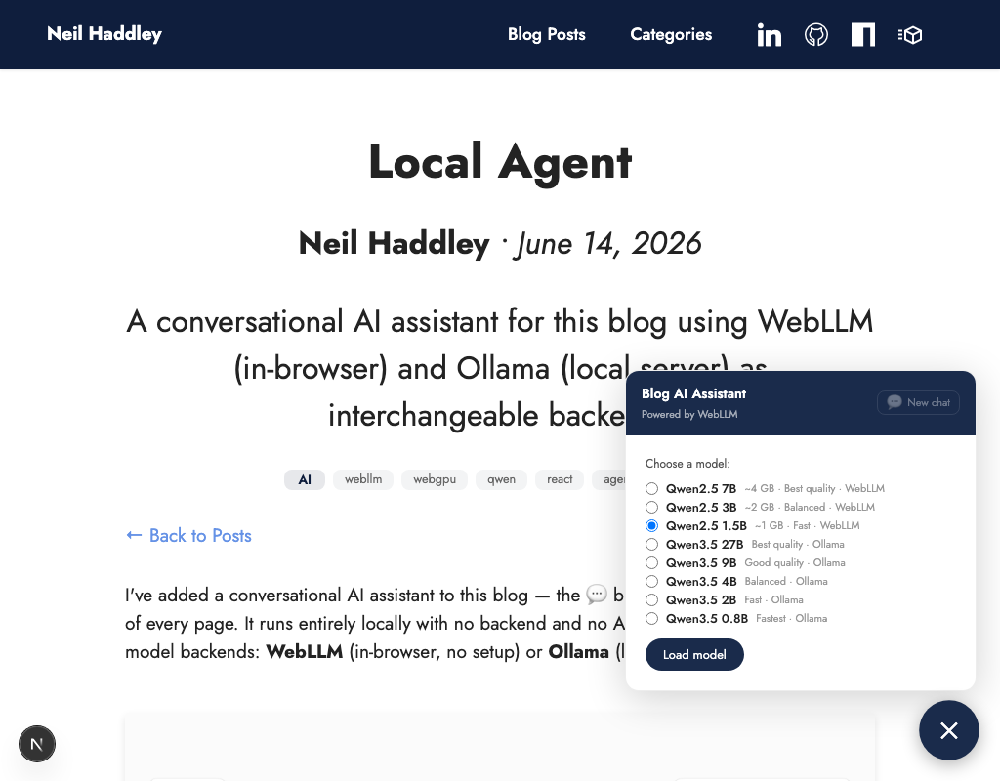
*On localhost, the model selector shows all eight options — three WebLLM and five Ollama*

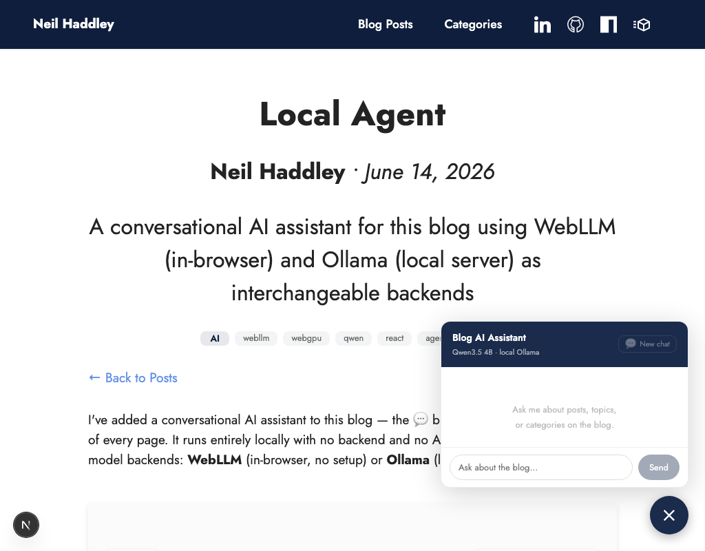
*Qwen3.5 4B selected and connected — the header shows "local Ollama"*

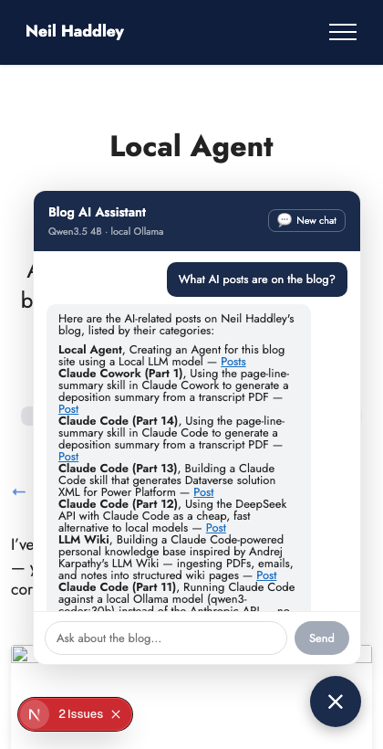
*I asked "What AI posts are on the blog?" — Qwen3.5 4B called get_posts_by_category and returned a full list with links*

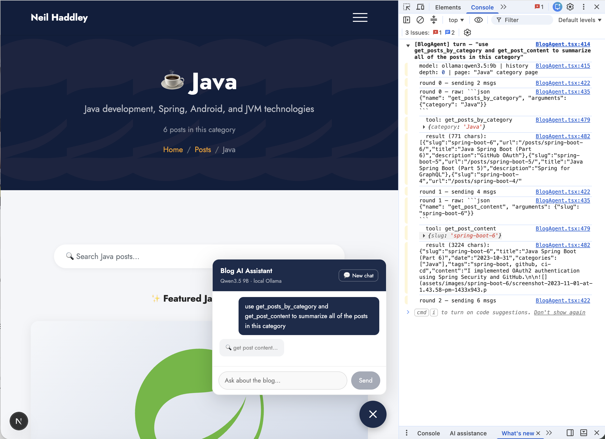
*On the Java category page I prompted "summarize all posts in this category" — DevTools shows Qwen3.5 9B calling get_posts_by_category then get_post_content for each of the six posts*

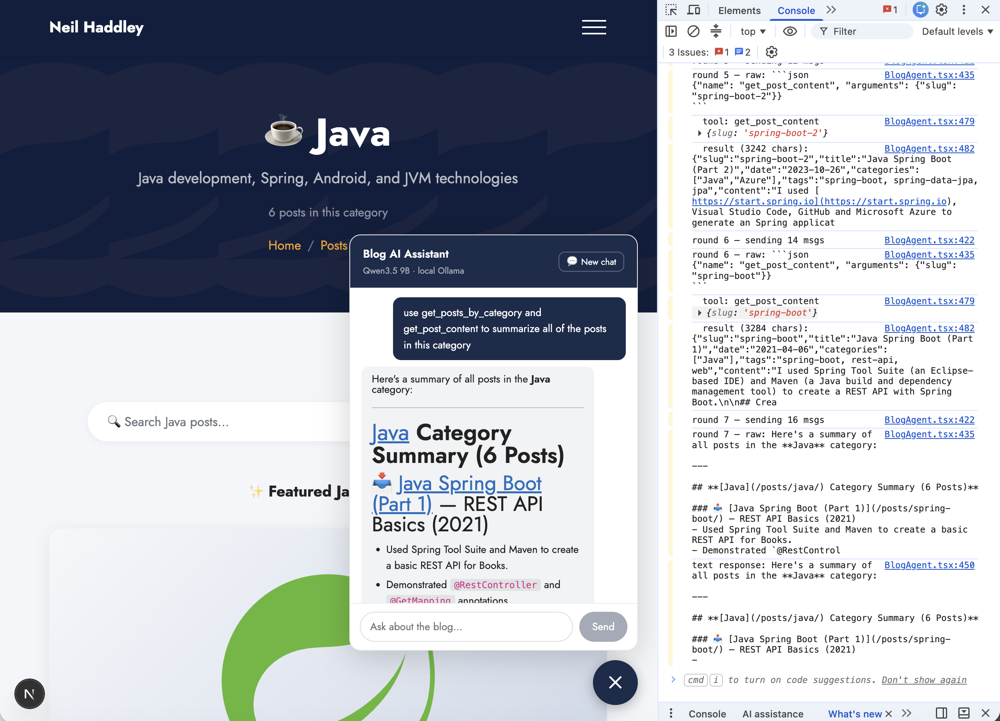
*After seven rounds of tool use the agent produced a formatted Java Category Summary with links to all six Spring Boot posts*

## How It Works

The agent is a React component (`BlogAgent.tsx`) mounted in the Next.js layout, so it appears on every page. Post metadata is pre-built at deploy time into `agent-data.json`, which the component fetches when the panel first opens.

Both backends implement the same interface so the agent loop runs identically regardless of which is active. For WebLLM:

```typescript
const { CreateMLCEngine } = await import('@mlc-ai/web-llm');
const engine = await CreateMLCEngine(
  selectedModel,
  { initProgressCallback: ({ progress, text }) => setLoadState(...) },
);
```

For Ollama, a thin fetch wrapper is created at load time:

```typescript
let controller: AbortController | null = null;
const engine = {
  chat: {
    completions: {
      create: async ({ messages }) => {
        controller = new AbortController();
        const r = await fetch('http://localhost:11434/v1/chat/completions', {
          method: 'POST',
          headers: { 'Content-Type': 'application/json' },
          body: JSON.stringify({ model: modelName, messages, stream: false }),
          signal: controller.signal,
        });
        return r.json();
      },
    },
  },
  interruptGenerate: () => controller?.abort(),
};
```

### Tools

The agent has six tools:

| Tool | What it does |
|------|-------------|
| `search_posts` | Keyword search across titles, descriptions, and tags |
| `get_posts_by_category` | All posts in a named category |
| `list_categories` | All categories ranked by post count |
| `get_post_content` | Full content of a specific post |
| `navigate_to_post` | Push the browser to a post via the Next.js router |
| `web_search` | Live web search via Jina AI — for topics not covered by the blog |

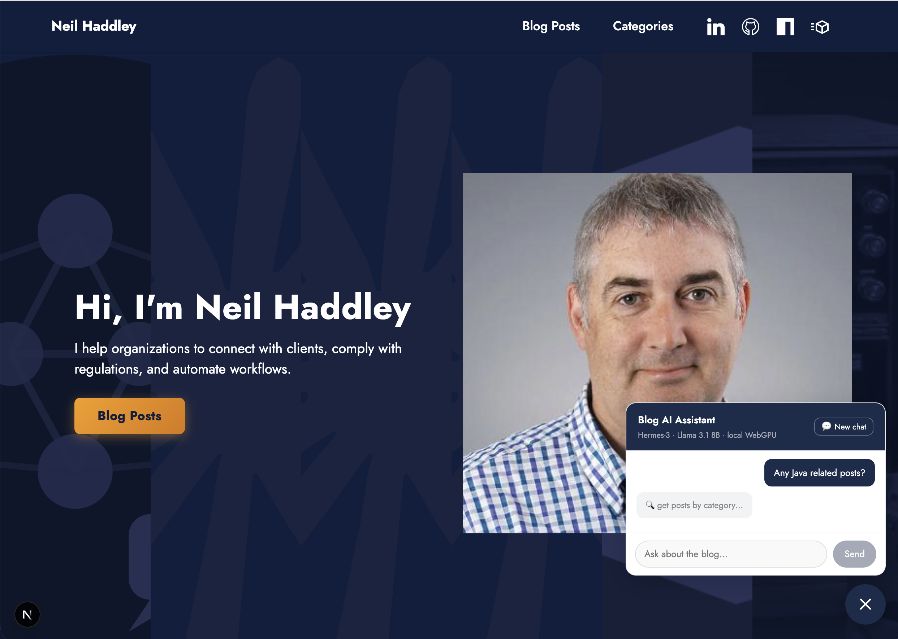
*I asked "Any Java related posts?" and the agent called get_posts_by_category*

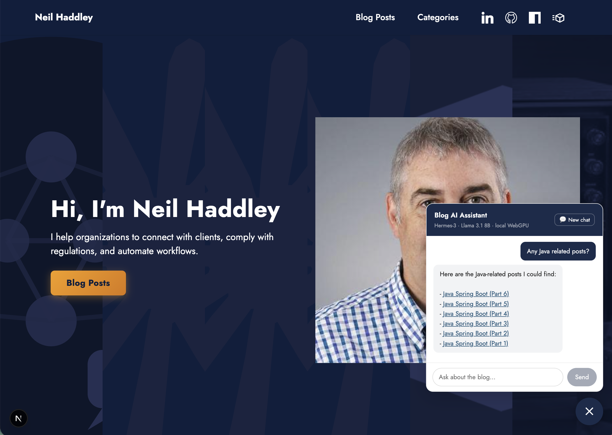
*The agent returned links to all six Java Spring Boot posts*

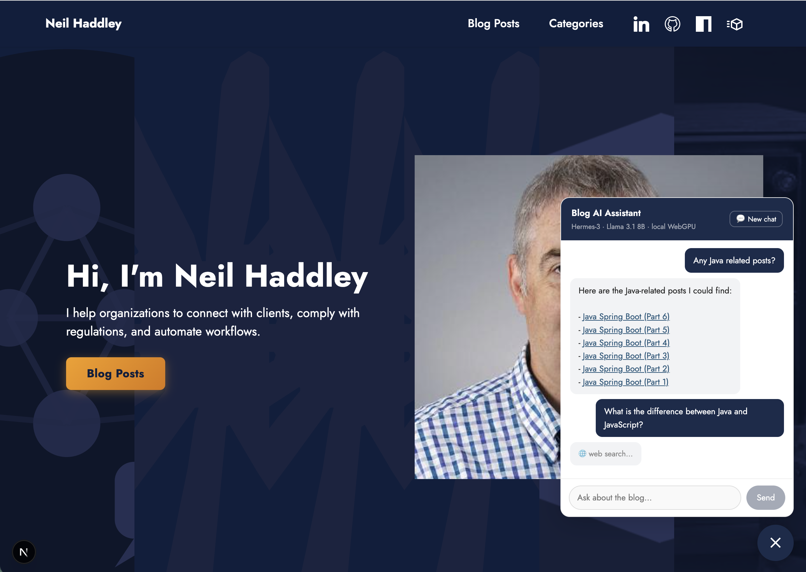
*I followed up asking the difference between Java and JavaScript — the agent used web_search*

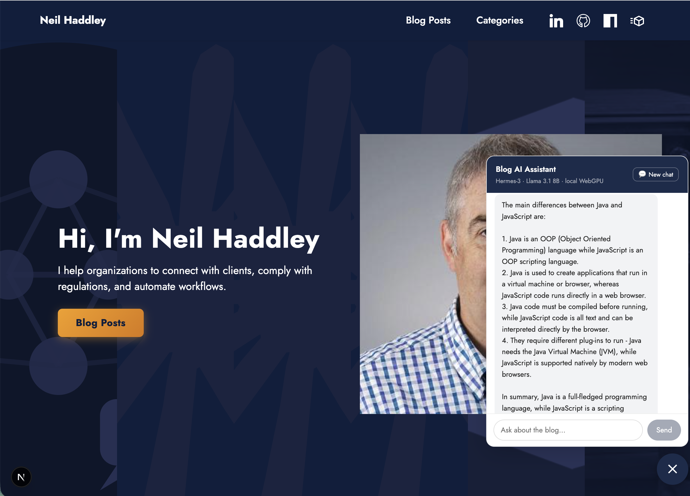
*The agent answered using the web search results*

### The Agent Loop

Each turn, the model replies either with a plain-text answer (done) or a `<tool_call>` block naming a function to run. The component parses the block, executes the tool, and feeds the result back as a `<tool_response>` user message. This repeats until the model produces a text answer with no tool calls.

Because WebLLM's native tools API only supports a fixed set of Hermes models, I implemented function calling via prompt engineering — tool definitions are injected as JSON in the system message, and the model outputs structured `<tool_call>` blocks rather than using a native API.

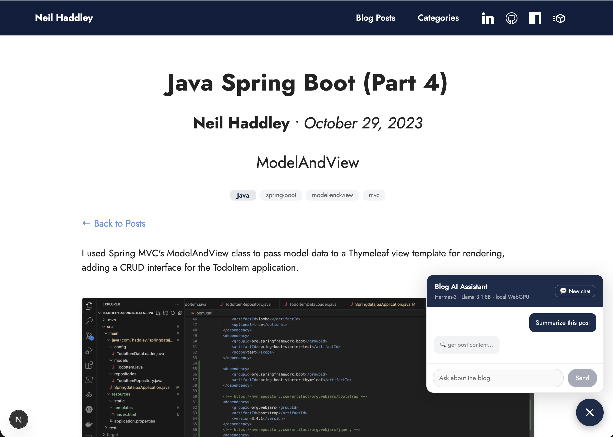
*On a post page I asked the agent to summarise — it called get_post_content with the current slug*

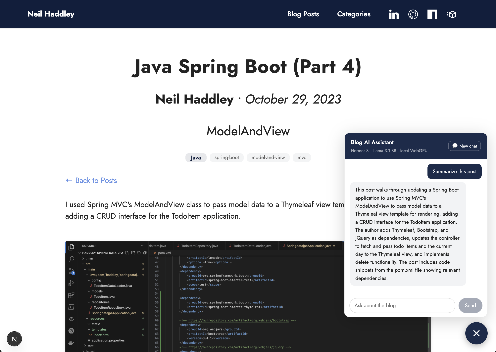
*The agent summarised the post content*

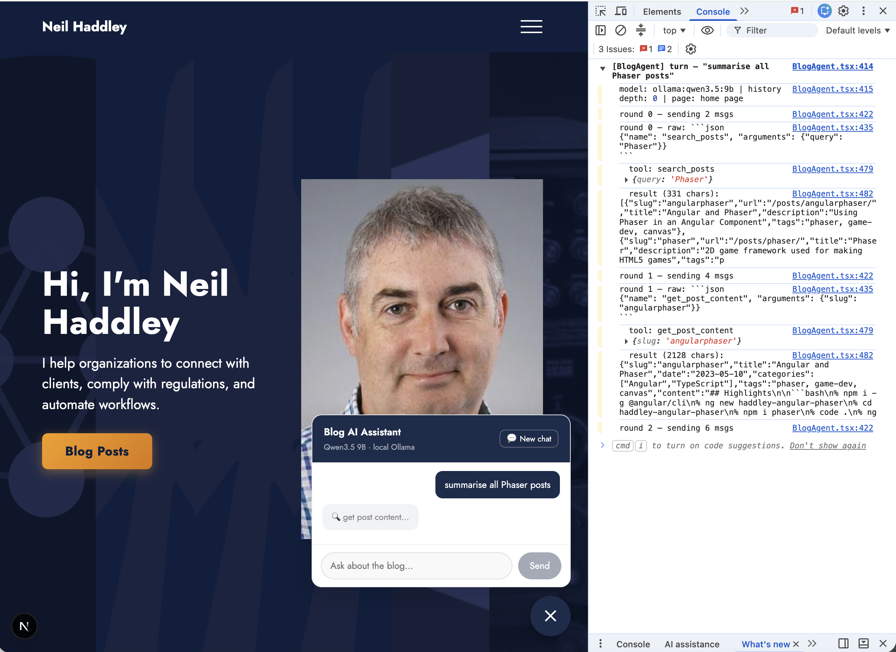
*I asked "summarise all Phaser posts" from the home page — DevTools shows Qwen3.5 9B calling search_posts then get_post_content for each result*

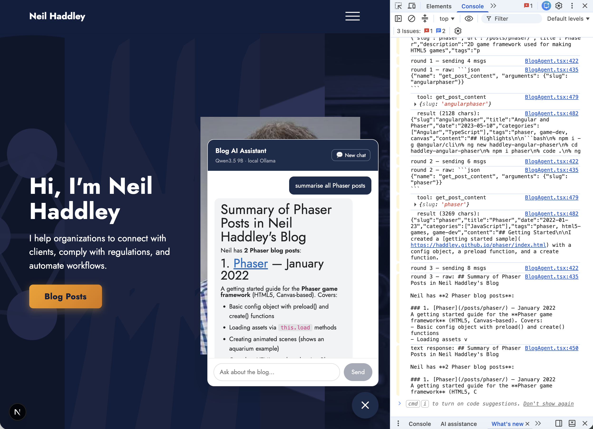
*The agent produced a formatted summary of all Phaser posts with links*

## References

- [WebLLM — In-browser LLM inference with WebGPU](https://github.com/mlc-ai/web-llm)
- [MLC AI — Machine Learning Compilation](https://mlc.ai)
- [Ollama](https://ollama.com)
- [Qwen2.5-7B-Instruct-q4f16_1-MLC on Hugging Face](https://huggingface.co/mlc-ai/Qwen2.5-7B-Instruct-q4f16_1-MLC)
- [Jina AI — web search API](https://jina.ai)
- [WebGPU API — MDN Web Docs](https://developer.mozilla.org/en-US/docs/Web/API/WebGPU_API)
- [Private Network Access — Chrome for Developers](https://developer.chrome.com/blog/private-network-access-update)
