# Adding a Local AI Agent to This Blog

I've added a conversational AI assistant to this blog — the 💬 button in the bottom-right corner of every page. It runs with no cloud API fees, using one of three model backends: **WebLLM** (in-browser, no setup), **Ollama** (local server, larger models, dev-only), or **Hosted** (a real Ollama server I run and manage, reachable by any visitor over HTTPS).

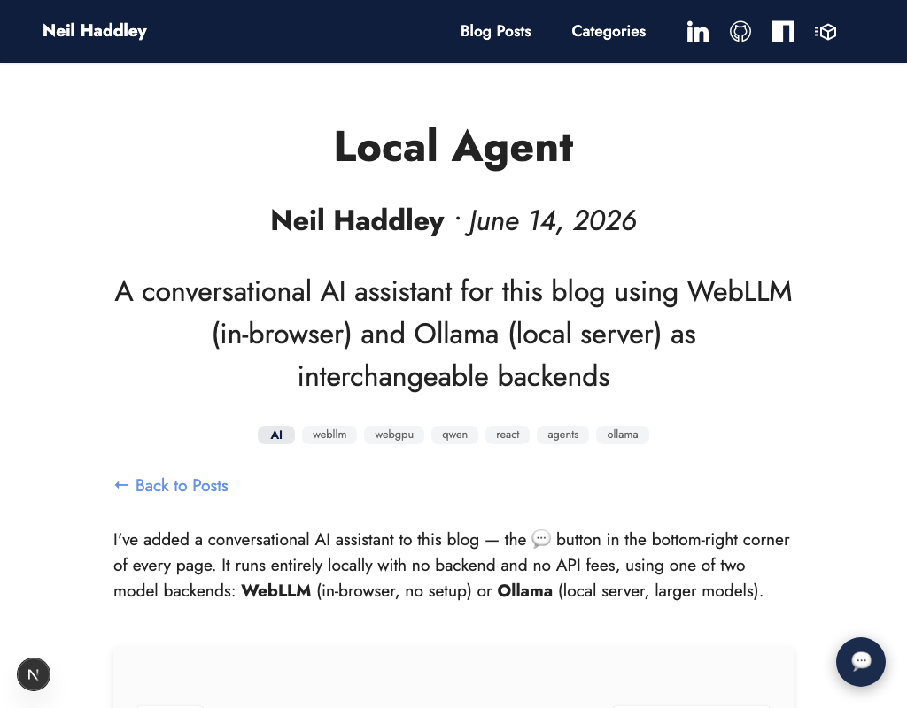
*The chat button appears on every page — click it to open the assistant panel. The "Blog AI Assistant" title in the panel header links back to this post.*

## Choosing a Backend

| | WebLLM | Ollama | Hosted |
|---|---|---|---|
| **Setup** | None — loads in the browser | Install Ollama, pull a model, run the site locally | None — always on, I run the server |
| **Browser support** | Chrome / Edge with WebGPU | Any browser | Any browser |
| **Model sizes** | Up to 7B (browser VRAM limits) | Up to 27B (Qwen3.5) | Qwen3.5, 0.8B–9B |
| **Inference speed** | Depends on GPU via WebGPU | Native — generally faster | Native, on my server — shared across all visitors |
| **Works for visitors** | Yes | No — only visible when running the site locally | Yes |
| **Model storage** | Browser cache (per device) | Local disk, shared across apps | My server's disk — nothing downloaded to your device |

WebLLM is the right choice for anyone visiting the public site who wants the request handled entirely on their own device — it just works, and nothing leaves the browser except the blog's own post data. Hosted is the other option that works for visitors — no download at all, native inference speed, at the cost of every request going to my server instead of staying on-device. Ollama is for local development, giving access to the largest model (27B) without the browser download.

## WebLLM

WebLLM runs a quantized Qwen2.5 model directly in the browser using WebGPU. The model is downloaded once and cached — subsequent loads are instant. WebGPU is required, so it works in Chrome and Edge on GPU-enabled devices.

Three model sizes are available, all quantized to 4-bit weights:

| Model | Download | Note |
|-------|----------|------|
| Qwen2.5-7B-Instruct-q4f16_1-MLC | ~4 GB | Best quality · WebLLM |
| Qwen2.5-3B-Instruct-q4f16_1-MLC | ~2 GB | Balanced · WebLLM |
| Qwen2.5-1.5B-Instruct-q4f16_1-MLC | ~1 GB | Fast · WebLLM |

The 1.5B is the default — a fast first download and a reasonable starting point. Larger models give better reasoning and more reliable multi-step tool use.

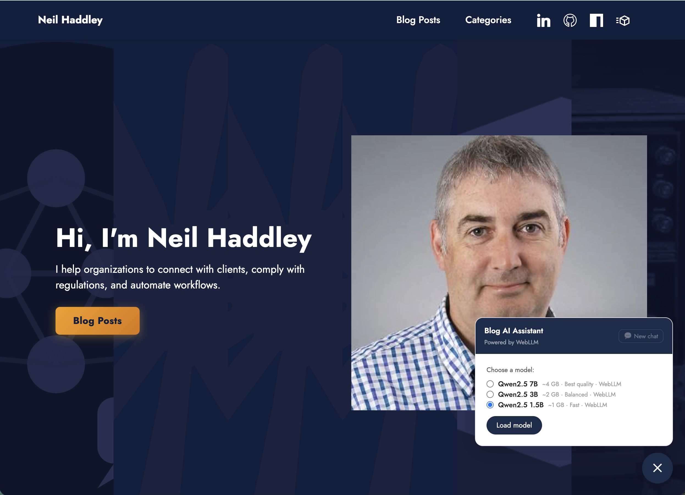
*The model selector on the public site — only the three WebLLM options appear, since using Ollama requires the site to be hosted on localhost*

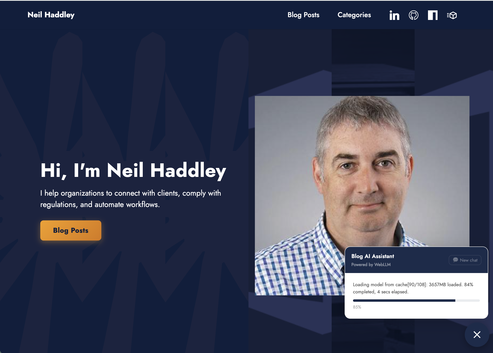
*Loading the model for the first time — progress bar fills as the weights download to the browser cache*

### Why Quantization?

A standard Qwen2.5-7B model in 16-bit precision weighs around 14 GB. Most consumer GPUs don't have that much VRAM, and browsers impose their own caps on top of that. 4-bit quantization brings it down to a manageable size:

| Model | FP16 | q4f16_1 |
|-------|------|---------|
| 7B | ~14 GB | ~4 GB |
| 3B | ~6 GB | ~2 GB |
| 1.5B | ~3 GB | ~1 GB |

WebLLM only supports its own pre-compiled MLC model variants — the MLC compilation step converts the model to run on WebGPU and bakes in the quantization. The quality tradeoff is minimal: benchmark scores drop by around 1–2% at q4f16_1, which is unnoticeable for a blog assistant.

### Model Quality

Smaller models trade reasoning quality for speed. I ran the same query — "Any Java related posts?" — against the 1.5B and 3B to see the difference.

The **1.5B** called tools redundantly, hit the round limit, and returned an empty response:

```
round 0 — search_posts {"query": "Java"}
round 1 — get_posts_by_category {"category": "Java"}  (already had the data)
round 2 — get_posts_by_category {"category": "Java"}  → skipping duplicate
round 3 — get_posts_by_category {"category": "Java"}  → skipping duplicate
loop exhausted — final nudge → (empty)
```

The **3B** called one tool and answered cleanly on the next round:

```
round 0 — search_posts {"query": "Java related"}
round 1 — text: "Here are the Java related posts: …"
```

The 3B handles multi-step tool use reliably. The 1.5B is faster to load but may struggle on follow-up questions.

### When WebLLM Doesn't Work

On some hardware — particularly Windows machines with Intel Arc integrated graphics — WebGPU can lose its GPU context mid-inference. The error surfaces as `Object has already been disposed` or `Device was lost`, and the agent panel shows a plain-English message:

> GPU context lost — your device may have insufficient GPU memory for WebLLM. Try an Ollama model instead.

I tested this on a Windows 11 machine with an Intel Core Ultra 7 (32 GB RAM, Intel Arc iGPU). Both the fp16 and fp32 variants crashed with the same error — the GPU context loss happens at the WebGPU driver level regardless of weight precision. The only reliable fix on that hardware is Ollama: run the site locally with `npm run dev` and select any of the Ollama models, which bypass WebGPU entirely and run natively on the machine.

## Ollama

[Ollama](https://ollama.com) runs as a local background process and exposes an OpenAI-compatible API at `http://localhost:11434`. Instead of downloading weights into the browser, the model runs natively on the machine — generally faster, and with larger model options.

### Installing Ollama

```bash
brew install ollama
ollama serve
ollama pull qwen3.5:4b
```

Five Qwen3.5 sizes are available in the agent:

| Model | Note |
|-------|------|
| qwen3.5:27b | Best quality · Ollama |
| qwen3.5:9b | Good quality · Ollama |
| qwen3.5:4b | Balanced · Ollama |
| qwen3.5:2b | Fast · Ollama |
| qwen3.5:0.8b | Fastest · Ollama |

### Local Dev Only

The Ollama option only appears when the site is running locally. Chrome and Edge enforce a **Private Network Access** policy that blocks requests from public HTTPS pages to `localhost` specifically — there is no workaround for reaching an actual `localhost` address from the deployed site. The Hosted backend below solves the same underlying problem a different way: instead of trying to reach a private address, it points at a real public hostname with its own HTTPS certificate, which was never a private-network request in the first place.

To use Ollama models, run the site locally:

```bash
npm run dev
# then open http://localhost:3000
```

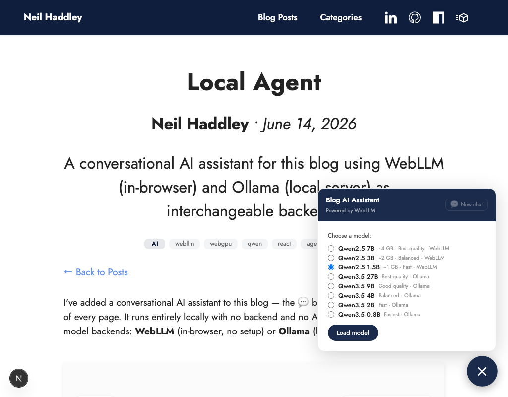
*On localhost, the model selector shows all eight options — three WebLLM and five Ollama*

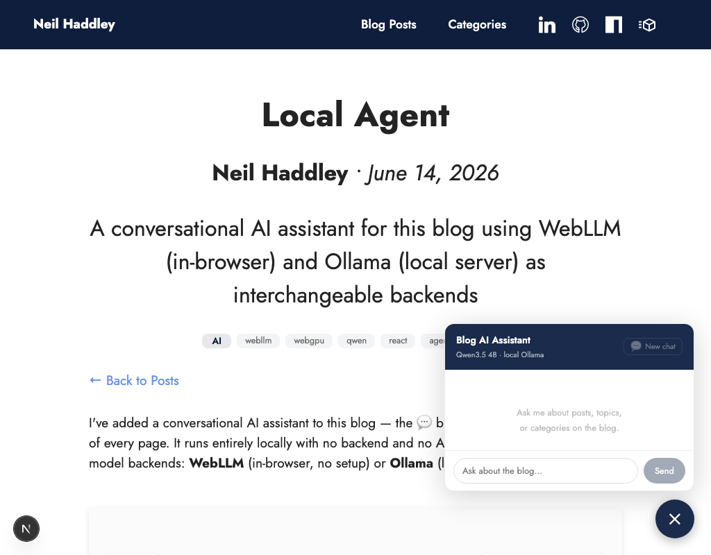
*Qwen3.5 4B selected and connected — the header shows "local Ollama"*

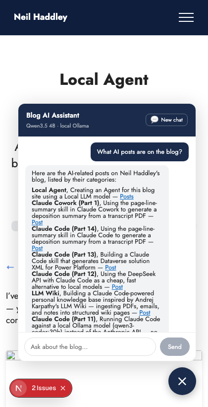
*I asked "What AI posts are on the blog?" — Qwen3.5 4B called get_posts_by_category and returned a full list with links*

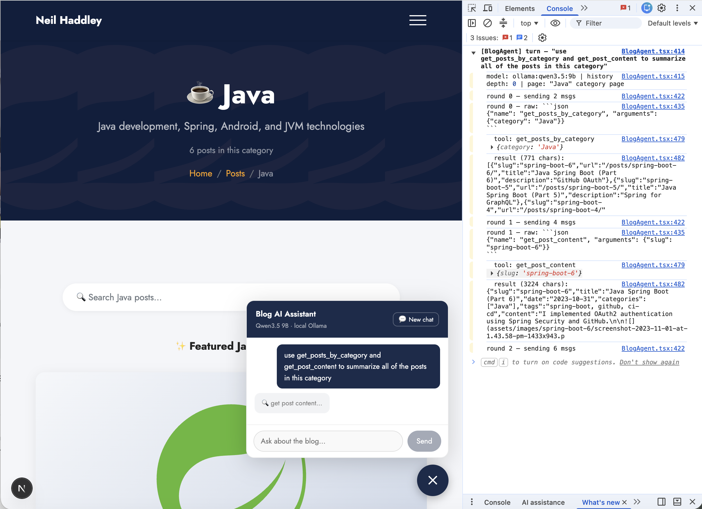
*On the Java category page I prompted "summarize all posts in this category" — DevTools shows Qwen3.5 9B calling get_posts_by_category then get_post_content for each of the six posts*

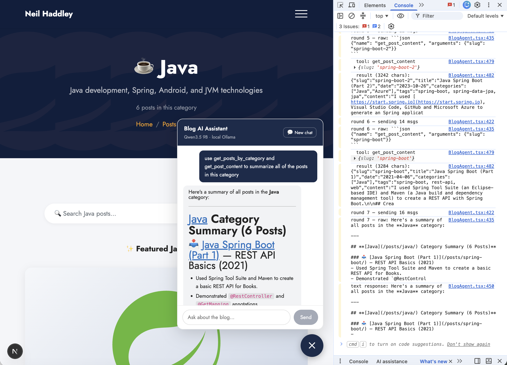
*After seven rounds of tool use the agent produced a formatted Java Category Summary with links to all six Spring Boot posts*

## Hosted

The third backend is Ollama again, but not on the visitor's own machine — it runs on a server I manage, and any visitor to the public site can use it. No install, no `npm run dev`, no browser download. This is the option Private Network Access can't block, because it was never a request to a private address: it goes to a real public hostname with its own domain and a genuine HTTPS certificate, exactly like any other API this site might call.

### Why This Needed More Than Just Ollama

Getting from "Ollama running on a server" to "a public website can call it" took several real infrastructure steps, each one solving a problem the previous step exposed:

**Plain HTTP isn't enough.** Ollama serves plain HTTP. Browsers block "mixed content" — an HTTPS page (this site, always, on GitHub Pages) cannot call a plain `http://` address at all, regardless of CORS. The fix is a reverse proxy that terminates real HTTPS in front of Ollama. I used [Caddy](https://caddyserver.com), which gets and renews a [Let's Encrypt](https://letsencrypt.org) certificate automatically once it has a real domain to issue one for.

**CORS is separate from HTTPS.** Ollama checks the request's `Origin` header itself and rejects anything not explicitly allowed via its `OLLAMA_ORIGINS` environment variable — this has nothing to do with the HTTPS certificate, and getting HTTPS working did not automatically fix it. Setting `OLLAMA_ORIGINS` to this site's origin was a separate, required step.

### Locking It Down

An Ollama server reachable from the entire internet is also reachable by anyone else's scanner or script, not just this blog's own JavaScript. Two things reduce that surface, without requiring visitors to log in or authenticate:

- **Caddy only proxies the three routes the agent actually needs** — `/v1/chat/completions`, `/api/version`, `/api/tags`. Ollama's more dangerous endpoints, like `/api/pull` (download an arbitrary model) or `/api/delete` (remove one), simply aren't reachable through the proxy at all, regardless of what a request contains.
- **Every request carries a custom header** the site's JavaScript sends, which Caddy requires before proxying anything. This is not real secrecy — the value sits in this page's own public JS bundle, readable by anyone who opens their browser's dev tools. What it does stop is the automated background scanners that constantly probe the internet for open Ollama instances, since they have no reason to send a header specific to this site.

The whole thing is a single site block. `X-Site-Key` is a non-simple header, so the browser sends a preflight `OPTIONS` request before the real one — that preflight never carries the site key itself, only an announcement of which header the real request intends to send, so it has to be matched and answered separately from the actual proxied request:

```
ollama.haddley.net {
    @preflight {
        method OPTIONS
        path /v1/chat/completions /api/version /api/tags
    }
    @allowed {
        path /v1/chat/completions /api/version /api/tags
        header X-Site-Key "<redacted>"
    }
    route {
        header @preflight Access-Control-Allow-Origin "https://haddley.github.io"
        header @preflight Access-Control-Allow-Methods "GET, POST, OPTIONS"
        header @preflight Access-Control-Allow-Headers "Content-Type, X-Site-Key"
        respond @preflight 204

        reverse_proxy @allowed 127.0.0.1:11434 {
            header_up Host localhost:11434
            header_down Access-Control-Allow-Origin "https://haddley.github.io"
        }
        respond 403
    }
}
```

The `route` block runs its directives in the order written, instead of Caddy's usual fixed directive order — the preflight has to be answered before the request ever reaches the `@allowed` check. `respond @preflight 204` handles the `OPTIONS` request directly in Caddy, with the CORS headers a browser needs to proceed, and never touches Ollama at all. The real `GET` or `POST` that follows still has to match `@allowed` and carry the site key, so the scanner protection is unchanged. `header_up Host localhost:11434` rewrites the Host header Ollama sees on the proxied request, and `header_down` pins `Access-Control-Allow-Origin` on that response too, so both the preflight and the real request agree on the same origin. Caddy handles obtaining and renewing the Let's Encrypt certificate for `ollama.haddley.net` automatically in the background; there's no separate certbot step or renewal cron job to maintain.

### Model Sizes

The same four Qwen3.5 sizes as the local Ollama option, minus the 27B:

| Model | Note |
|-------|------|
| qwen3.5:9b | Hosted · default |
| qwen3.5:4b | Balanced · Hosted |
| qwen3.5:2b | Fast · Hosted |
| qwen3.5:0.8b | Fastest · Hosted |

27B was the original plan, and it downloads and runs fine directly on the server — but through this chat widget, a one-word reply took over three minutes and I gave up waiting. A 27-billion-parameter model needs real GPU throughput to feel responsive in a live chat interface; asking visitors to wait minutes per reply isn't a reasonable trade for the quality gain, so 9B is the ceiling here.

## How It Works

The agent is a React component (`BlogAgent.tsx`) mounted in the Next.js layout, so it appears on every page. Post metadata is pre-built at deploy time into `agent-data.json`, which the component fetches when the panel first opens.

All three backends implement the same interface so the agent loop runs identically regardless of which is active. For WebLLM:

```typescript
const { CreateMLCEngine } = await import('@mlc-ai/web-llm');
const engine = await CreateMLCEngine(
  selectedModel,
  { initProgressCallback: ({ progress, text }) => setLoadState(...) },
);
```

For Ollama, a thin fetch wrapper is created at load time:

```typescript
let controller: AbortController | null = null;
const engine = {
  chat: {
    completions: {
      create: async ({ messages }) => {
        controller = new AbortController();
        const r = await fetch('http://localhost:11434/v1/chat/completions', {
          method: 'POST',
          headers: { 'Content-Type': 'application/json' },
          body: JSON.stringify({ model: modelName, messages, stream: false }),
          signal: controller.signal,
        });
        return r.json();
      },
    },
  },
  interruptGenerate: () => controller?.abort(),
};
```

The Hosted backend uses the identical wrapper, pointed at the public HTTPS host instead, with the site-key header Caddy requires:

```typescript
const r = await fetch('https://ollama.haddley.net:8443/v1/chat/completions', {
  method: 'POST',
  headers: { 'Content-Type': 'application/json', 'X-Site-Key': REMOTE_SITE_KEY },
  body: JSON.stringify({ model: modelName, messages, stream: false }),
  signal: controller.signal,
});
```

### Tools

The agent has six tools:

| Tool | What it does |
|------|-------------|
| `search_posts` | Keyword search across titles, descriptions, and tags |
| `get_posts_by_category` | All posts in a named category |
| `list_categories` | All categories ranked by post count |
| `get_post_content` | Full content of a specific post |
| `navigate_to_post` | Push the browser to a post via the Next.js router |
| `web_search` | Live web search via Jina AI — for topics not covered by the blog |

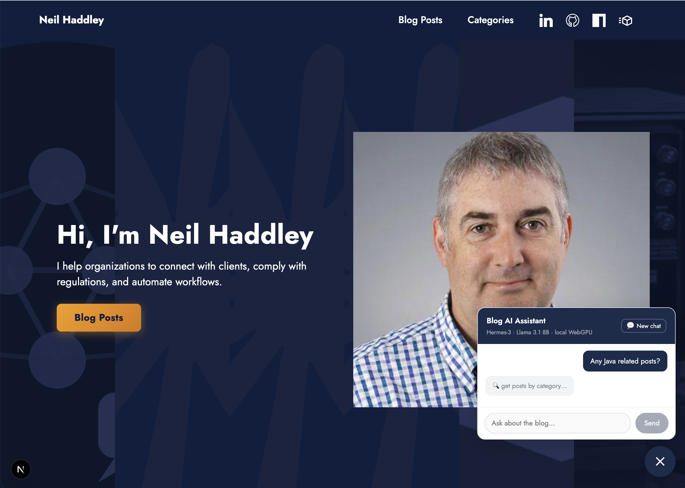
*I asked "Any Java related posts?" and the agent called get_posts_by_category*

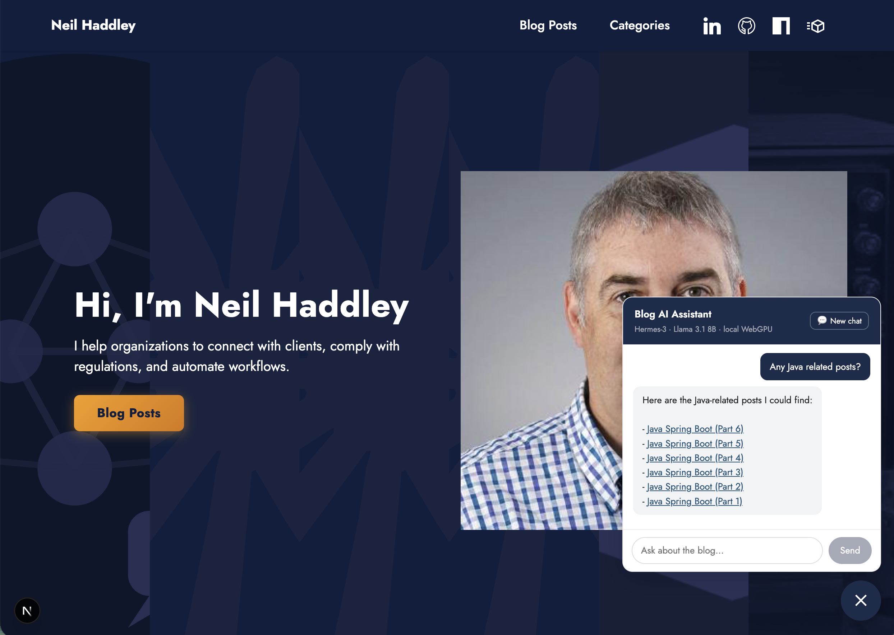
*The agent returned links to all six Java Spring Boot posts*

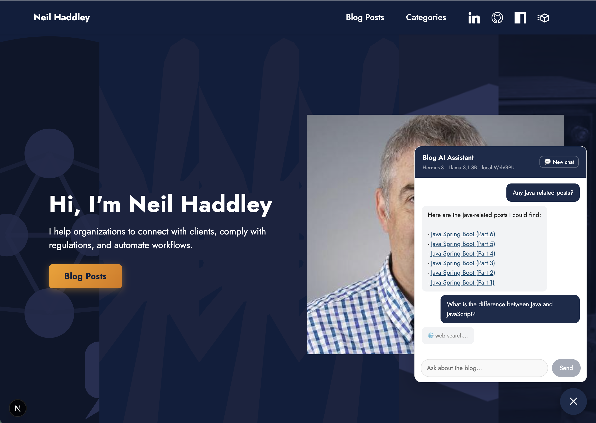
*I followed up asking the difference between Java and JavaScript — the agent used web_search*

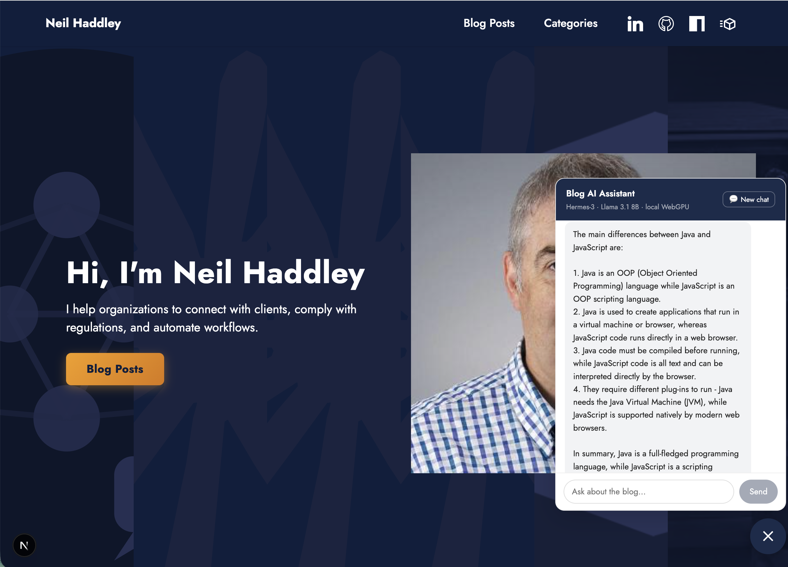
*The agent answered using the web search results*

### The Agent Loop

Each turn, the model replies either with a plain-text answer (done) or a `<tool_call>` block naming a function to run. The component parses the block, executes the tool, and feeds the result back as a `<tool_response>` user message. This repeats until the model produces a text answer with no tool calls.

Because WebLLM's native tools API only supports a fixed set of Hermes models, I implemented function calling via prompt engineering — tool definitions are injected as JSON in the system message, and the model outputs structured `<tool_call>` blocks rather than using a native API.

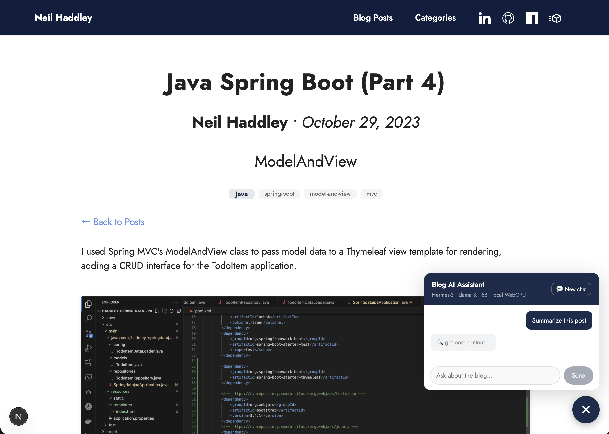
*On a post page I asked the agent to summarise — it called get_post_content with the current slug*

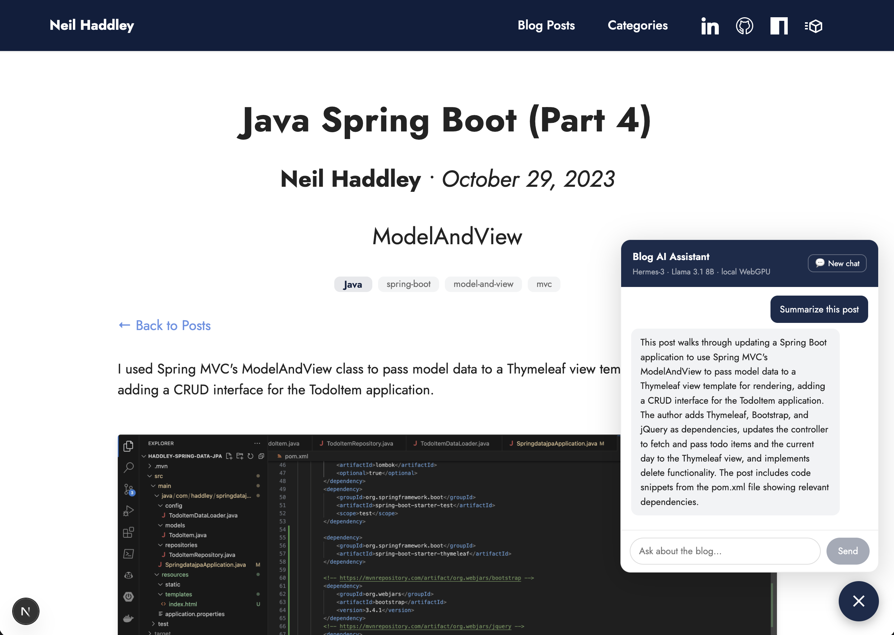
*The agent summarised the post content*

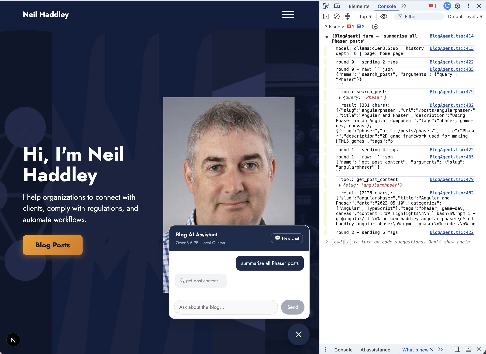
*I asked "summarise all Phaser posts" from the home page — DevTools shows Qwen3.5 9B calling search_posts then get_post_content for each result*

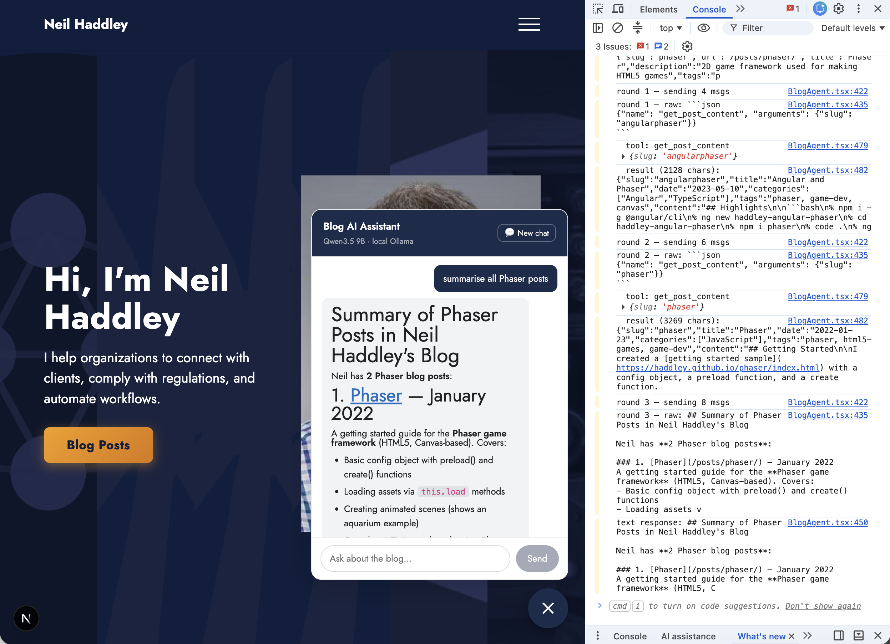
*The agent produced a formatted summary of all Phaser posts with links*

## References

- [WebLLM — In-browser LLM inference with WebGPU](https://github.com/mlc-ai/web-llm)
- [MLC AI — Machine Learning Compilation](https://mlc.ai)
- [Ollama](https://ollama.com)
- [Qwen2.5-7B-Instruct-q4f16_1-MLC on Hugging Face](https://huggingface.co/mlc-ai/Qwen2.5-7B-Instruct-q4f16_1-MLC)
- [Jina AI — web search API](https://jina.ai)
- [WebGPU API — MDN Web Docs](https://developer.mozilla.org/en-US/docs/Web/API/WebGPU_API)
- [Private Network Access — Chrome for Developers](https://developer.chrome.com/blog/private-network-access-update)
- [Caddy — automatic HTTPS reverse proxy](https://caddyserver.com)
- [Let's Encrypt](https://letsencrypt.org)
