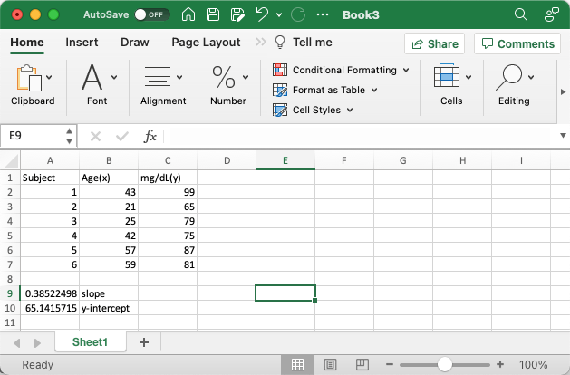
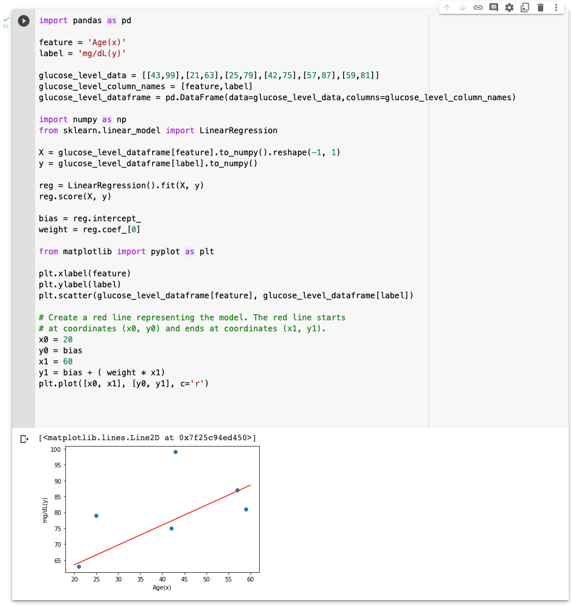
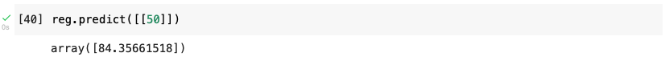
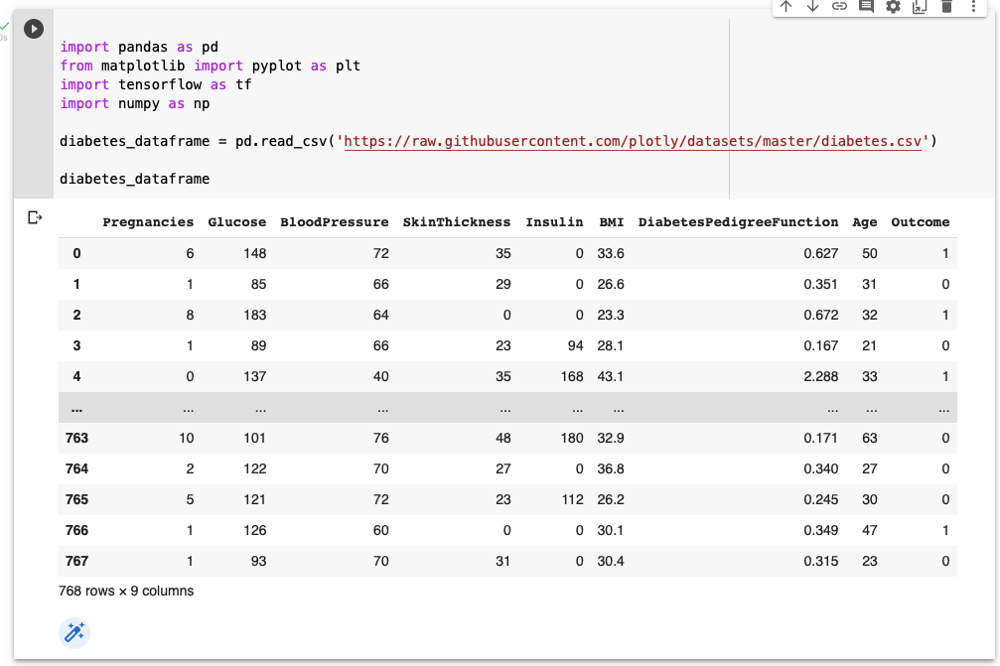
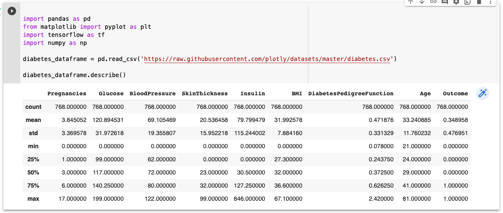
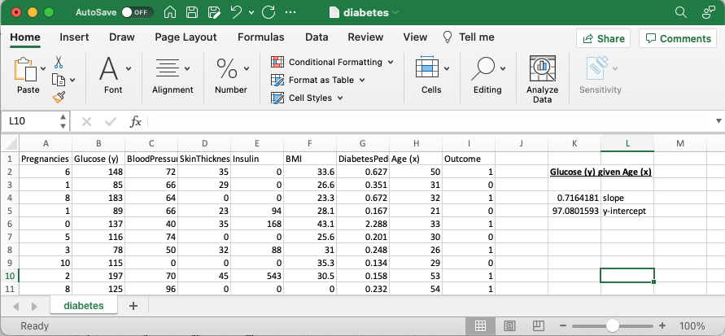
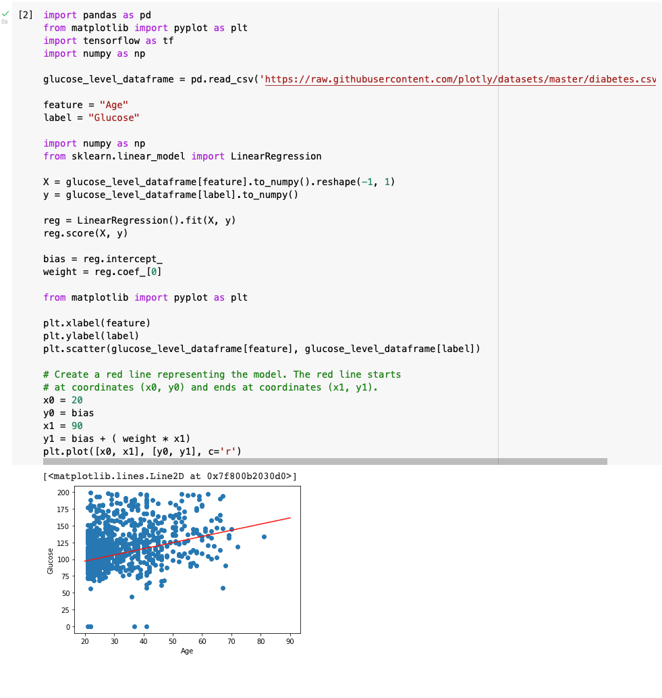
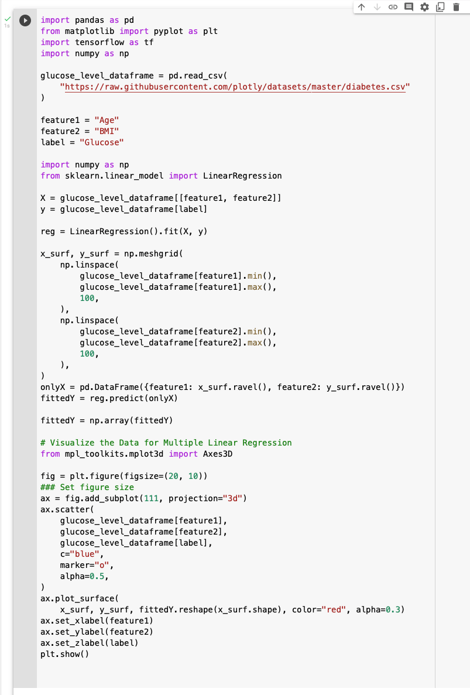
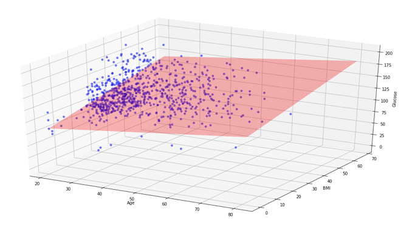
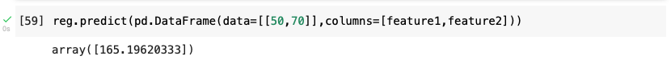

I explored whether it is possible to predict a person's glucose levels based on their age.

If one thing depends on another thing in a linear way the least squares method can be used to predict the dependent thing (y) given the independent thing (x).

If there is a linear relationship between glucose levels and age it is possible to summarize that relationship using an equation of the form **y = mx + b**.

In this formula **y** would be the (predicted) thing (glucose level) and **x** would be the given thing (the person's age).

In this formula **m** is the slope of the linear relationship (weight) and **b** is the y-intercept constant (bias).

If a linear relationship exists and enough data can be collected, it is possible to calculate the value of m and b and to predict the value of a person's glucose levels based on their age.

This [youtube video](https://www.youtube.com/watch?v=p_fu7gIikxY) explains how to calculate the slope and y-intercept values by hand using the least squares method.

As an exercise I wanted to use Excel and machine learning to calculate the line of best fit.

Excel has built in "slope()" and "intercept()" functions that can be used to calculate the slope (m) and y-intercept (b) for a set of dependent and independent data points.

The youtube video referenced [above](https://www.youtube.com/watch?v=p_fu7gIikxY) explains how these functions work.

*I calculated the slope and y-intercept using Excel*

## Calculating the line of best fit using the sklearn LinearRegression model

I used a Colab Notepad to show data points and the line of best fit.

I predicted a person's glucose levels based on their age.

*I created a scatter plot of the glucose level data with a line of best fit added in red ('r')*

## Making a prediction

Once a model has been trained it can be used to make predictions.

In the example above I could provide a person's age and predict what their glucose level might be (based on the data used to train the model).

*I predicted a person's glucose level if they were aged 50*

## A larger data set

[Plotly Sample Datasets](https://github.com/plotly/datasets) includes a larger diabetes dataset.

I used a Colab Notepad to show data points from the dataset and a description of the dataset.

*I reviewed the Diabetes Dataset*

*I reviewed the Description of Diabetes Dataset*

## Excel

I used Excel again to calculate a line of best fit.

*I used Excel to calculate the line of best fit for Glucose (y) given Age (x)*

## Calculating the line of best fit using the sklearn LinearRegression model

I used a Colab Notepad to show data points and the line of best fit.

I predicted a person's glucose levels based on their age.

*I created a scatter plot of the glucose level and age data with a line of best fit added in red ('r')*

## Implementing Linear Regression with two input variables using the sklearn LinearRegression model

I predicted a person's glucose levels based on their age and BMI.

*I predicted a person's glucose levels based on their age and BMI*

*I created a 3D scatter plot of the glucose level, age and BMI data with the line of best fit (surface) added in red ('red')*

## Making a prediction

Once a model has been trained it can be used to make predictions.

In the example above I could provide a person's age and BMI and predict what their glucose level might be (based on the data used to train the model).

*I predicted a person's glucose level if they were aged 50 with a BMI of 70*
